# Modeling Taxonomy

**Status:** Draft
**Purpose:** Define the classification rules for Design Hub's graph model so every artifact has a clear tier, identity pattern, lifecycle semantics, and benchmark treatment.

**Related documents:**

- `graph-object-catalog.md` (uses this taxonomy to classify all 75 model elements)
- `implementation-readiness-graph-model.md` (uses tier rules to scope readiness and completenessScore)
- `vision-benchmark.md` (uses tier rules to scope what is benchmarkable)
- `product-vision.md`
- `alfabet-alignment-matrix.md` (enterprise architecture alignment, absorb-now set)

---

## 1. Why This Document Exists

Without explicit rules for what qualifies as a first-class node versus a registry node versus a value object, the artifact list grows unpredictably as string-encoded relationships are discovered. This document establishes classification rules so the graph object catalog can produce a definitive, stable artifact list.

---

## 2. Three Modeling Tiers

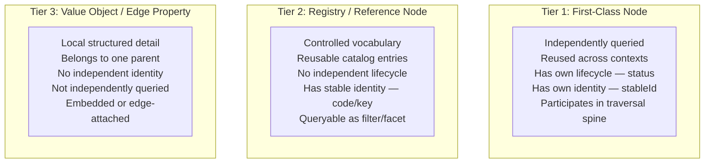

### 2.1 Classification Criteria

| Criterion | Tier 1 (First-Class Node) | Tier 2 (Registry) | Tier 3 (Value Object) |
|-----------|--------------------------|--------------------|-----------------------|
| Independently queried? | Yes | As filter or facet | No |
| Reused across more than one parent? | Yes | Yes | No |
| Has own lifecycle (status)? | Yes | No (active/deprecated at most) | No |
| Has stable identity? | Yes (pattern ID) | Yes (code or key) | No |
| Participates in traversal spine? | Yes | As filter dimension | No |
| Needs its own outbound relationships? | Yes | Rarely | No |

### 2.2 Identity Patterns

| Tier | Identity Rule | Example |
|------|--------------|---------|
| Tier 1 | Pattern-based stable ID as primary key | `surfaceId: "SURF-R04-001"`, `journeyId: "JRN-R04-001"` |
| Tier 2 | Code or key as primary identifier | `channelCode: "CH-WEB-DSK"`, `permissionKey: "ADMIN"` |
| Tier 3 | No independent identity; belongs to parent | Identified by parent reference + index or embedded position |

### 2.3 Lifecycle Semantics

| Tier | Status Model | Readiness |
|------|-------------|-----------|
| Tier 1 | Universal 10-value `status` enum (IDENTIFIED through RETIRED) | Selective readiness flags for implementation-driving objects only |
| Tier 2 | Binary: active or deprecated | No readiness |
| Tier 3 | Inherits parent status | No status, no readiness |

### 2.4 Benchmark Treatment

| Tier | Benchmarkable? | Attribute Scoring | Relationship Scoring |
|------|---------------|-------------------|---------------------|
| Tier 1 | Yes | Own attribute depth scored independently | Own relationships scored as [EDGE], [STRING_REF], or [PLANNED] |
| Tier 2 | Yes | Own attribute depth scored independently | Relationships scored where applicable |
| Tier 3 | No | Attributes scored as part of parent object's depth | No independent relationship scoring |

**Benchmarkable total: 71 (58 Tier 1 + 13 Tier 2)**

---

## 3. Tier Assignments

### 3.1 Tier 1 — First-Class Nodes (58)

#### Strategic & Governance (9)

| Object | Purpose |
|--------|---------|
| `BusinessObjective` | Business intent and outcome target |
| `Decision` | Recorded decision with rationale and status |
| `Assumption` | Stated assumption underlying design or scope |
| `Constraint` | Technical, business, or regulatory constraint |
| `SourceReference` | Traceable provenance link to external artifact |
| `Assessment` | Polymorphic evaluation of an assessable T1 target. Uses `assessmentType` as the lens and `targetKind` as the assessed node discriminator. |
| `Finding` | Review observation, issue, or concern from analysis |
| `Bug` | Delivery defect linked to graph artifacts |
| `Risk` | Identified risk with probability and impact |

#### Business & Experience (7)

| Object | Purpose |
|--------|---------|
| `Persona` | User archetype and operational context (19 unique in EMSIST source) |
| `BusinessRole` | Domain or business responsibility (split from current `Role.java`) |
| `ValidationRole` | Role responsible for approval or governance checks (split from current `Role.java`) |
| `Journey` | End-to-end user goal path |
| `JourneyStep` | Ordered step inside a journey |
| `Topic` | Thematic grouping for journeys and features |
| `Touchpoint` | Entry point into a journey or screen |

#### Delivery & Execution (7)

| Object | Purpose |
|--------|---------|
| `RequirementPortfolio` | Backlog container that owns the Epic → Feature → UserStory hierarchy for a single ProjectInstance. |
| `Epic` | Key hierarchy level between BusinessObjective/StrategicTheme and Feature |
| `Feature` | Cohesive delivery capability grouping |
| `UserStory` | Deliverable requirement unit with four-verb edge model (REALIZES, DELIVERS, HAS_TASK, VERIFIED_BY) |
| `Milestone` | Project timebox or checkpoint. `milestoneType` covers SPRINT, PHASE, RELEASE_CUT, and CHECKPOINT. |
| `Task` | Standalone execution unit. Carries taskType (FRONTEND, BACKEND, API, DATA, TEST, DEVOPS, UX, DOCUMENTATION), priority, estimate. Links to UserStory via HAS_TASK, to artifacts via IMPLEMENTS. |
| `ProjectInstance` | Temporary delivery container that addresses a Gap, targets a BusinessCapability, owns a RequirementPortfolio, and scopes create/enhance/integrate work across Applications and ApplicationComponents. |

#### Requirement & Design (10)

| Object | Purpose |
|--------|---------|
| `AcceptanceCriterion` | Verifiable story condition |
| `Rule` | Business rule or domain rule |
| `ValidationRule` | Explicit validation behavior |
| `QualityConstraint` | Artifact-bound non-functional requirement with measurable threshold (e.g., "page load < 2s", "WCAG AAA"). Bound to Screen, ApiContract, DataEntity, or ApplicationComponent. Verified via SATISFIED_BY → TestCase. |
| `EdgeCase` | Non-happy-path scenario |
| `ExceptionCase` | Failure or exceptional path |
| `Screen` | Navigable UI surface or always-present surface |
| `ScreenState` | Distinct state of a screen |
| `Interaction` | User or system action on a surface |
| `Transition` | Screen-to-screen or state transition |

#### Engineering (9)

| Object | Purpose |
|--------|---------|
| `ApiContract` | Backend contract needed by a story or interaction |
| `RequestSchema` | Input schema for an API contract |
| `ResponseSchema` | Output schema for an API contract |
| `ErrorContract` | Error response structure for an API contract |
| `DataEntity` | Domain data object |
| `DataField` | Field inside a data entity |
| `Integration` | Cross-system or cross-service integration point |
| `TestCase` | Verifiable test scenario linked to acceptance criteria |
| `CodeAsset` | File-level code targeting for agent-safe implementation. Curated subset of repo files that are explicit targets of stories, tasks, or tests. |

#### Architecture & EA (12)

| Object | Purpose |
|--------|---------|
| `BusinessCapability` | Stable functional classification ("Onboarding", "KYC"). Not time-bound like BusinessObjective. |
| `BusinessProcess` | Formal process model (BPMN 2.0.2 aligned). NOT the same as Journey — Journey is UX-focused, BusinessProcess is operations-focused. Carries optional diagram attributes (diagramFormat, diagramPath, diagramVersion, diagramSource, isExecutableModel). |
| `ProcessActivity` | BPMN-aligned operational step within a process. Renamed from ProcessStep for BPMN fidelity. Carries activityType (TASK, SUBPROCESS, CALL_ACTIVITY) and actionType (CREATE, READ, UPDATE, DELETE, APPROVE, REJECT, ARCHIVE, SUBMIT, REVIEW, NOTIFY). |
| `ProcessGateway` | BPMN routing/branching node within a process. Carries gatewayType (EXCLUSIVE, PARALLEL, INCLUSIVE, EVENT_BASED, COMPLEX). Not an operational action — it is control flow. |
| `ProcessEvent` | BPMN trigger/signal/timer node within a process. Carries eventPosition (START, END, INTERMEDIATE_CATCH, INTERMEDIATE_THROW, BOUNDARY) and eventTrigger. Not an operational action — it is lifecycle. |
| `Organization` | Business units, CoEs, departments, vendors, partners. Carries `organizationType` enum. |
| `Application` | Central node in EA model. Represents a deployable software system. |
| `ApplicationComponent` | Technical component within an application. Links to Screen and ApiContract. |
| `BusinessObject` | Business-level data concept ("Customer", "Contract"). NOT the same as DataEntity — BusinessObject is business semantics, DataEntity is engineering schema. |
| `InformationFlow` | Data movement between applications. Links source and target applications via carried BusinessObjects. |
| `Deployment` | Deployment configuration — which components are deployed where. |
| `InfrastructureNode` | Server, VM, container host, or cloud instance. |

**BPMN alignment note:** ProcessActivity, ProcessGateway, and ProcessEvent are separate T1 nodes following OMG BPMN 2.0.2 specification. ProcessStep (the predecessor name) was overloaded with action, routing, and lifecycle semantics — this split corrects that. The canonical BPMN source is OMG BPMN 2.0.2; bpmn.io/bpmn-moddle is the practical machine-readable source.

#### Cross-cutting (4)

| Object | Purpose |
|--------|---------|
| `ExternalArtifact` | Synced or linked record from Azure DevOps, Jira, or other tools |
| `OpenQuestion` | Unresolved question blocking design or implementation |
| `Gap` | Structural incompleteness detectable by benchmark engine |
| `Message` | User-visible confirmation, warning, info, or error text |

**Category verification:** 9 + 7 + 7 + 10 + 9 + 12 + 4 = 58

### 3.2 Tier 2 — Registry Nodes (13)

| Object | Family | Rationale |
|--------|--------|-----------|
| `BusinessDomain` | Architecture & EA | Top-level domain grouping for capabilities (e.g., "Onboarding", "Compliance"). Pattern: `DOM-{code}`. Facet, not lifecycle — domains exist or are deprecated. Queryable: "Which capabilities belong to domain X?" Relationship: `HAS_CAPABILITY` -> BusinessCapability. |
| `Channel` | Business & Experience | Controlled vocabulary of 9 delivery channels (CH-WEB-DSK, CH-WEB-TAB, CH-WEB-MOB, CH-API, CH-WEBHOOK, CH-AI-CHAT, CH-AI-BG, CH-EMAIL, CH-INAPP). No independent lifecycle. Queryable as facet: "Which journeys are accessible via mobile?" |
| `Permission` | Requirement & Governance | Closed registry of 8 permission levels (SUPER_ADMIN, ADMIN, ARCHITECT, AGENT_DESIGNER, USER, VIEWER, HITL_REVIEWER, AUDITOR). Not free-form. Queryable: "Which interactions require ADMIN?" |
| `ErrorCode` | Requirement & Governance | Registry of 80+ error, warning, and success codes from EMSIST story inventory (DEF-E-xxx, AI-E-xxx, LOC-E-xxx). Reusable across screens. No lifecycle beyond active/deprecated. |
| `ConfirmationDialog` | Requirement & Governance | Registry of 25+ confirmation dialogs from EMSIST story inventory (DEF-C-xxx, AI-C-xxx, LOC-C-xxx). Reusable coded entries. |
| `Enum` | Engineering | Controlled value sets for dropdown and select fields. Referenced by DataField. |
| `Event` | Engineering | Named domain events. Referenced by Integration. No independent lifecycle. |
| `Locale` | Cross-cutting / Localization | Controlled language codes (en, ar). Required for i18n graph model. |
| `TranslationKey` | Cross-cutting / Localization | Registry of translatable strings linking Locale to UI elements. |
| `ImportSnapshot` | Cross-cutting | Append-only audit record for batch imports into the graph. Captures sourceType (GIT_DOC, JIRA_SYNC, MANUAL_ENTRY), result, contentHash. Linked via IMPORTED_BY from importable T1 nodes. |
| `CodingConvention` | Cross-cutting | Queryable metadata for coding conventions. Structured categories in graph (conventionCode, category, enforcement, scope); detailed rules via docRef pointing to Markdown files in Git. Linked via GOVERNED_BY_CONVENTION from Application, ApplicationComponent, CodeAsset. |
| `AgentPolicy` | Cross-cutting | Allowlist/guardrail registry for agent execution. Captures allowed repos, commands, environments, secret scopes, touch limits, and approval thresholds. Linked via GOVERNED_BY_POLICY from Application and ApplicationComponent. |
| `EvidenceRecord` | Cross-cutting | Durable proof artifact registry for tests, screenshots, contract snapshots, and visual baselines. Used by BASELINED_BY and verification write-back flows. |

### 3.3 Tier 3 — Value Objects (4)

| Object | Rationale |
|--------|-----------|
| `InteractionOutcome` | Embedded in Interaction as structured outcomes (success, error, loading). Not independently queried. Contains `errorCodeRef` linking to ErrorCode (T2). |
| `Effect` | Embedded in Interaction. Navigate, filter, mutation, toast outcomes. 22 effect types defined in EMSIST spec. Not independently queried. |
| `EntryMode` | Embedded in Touchpoint. Channel + mechanism pair. The `channelId` reference resolves via parent Touchpoint's edge to Channel (T2). |
| `ContentElement` | Embedded in Screen. Ordered content inventory. Not independently queried. |

**Totals: 58 + 13 + 4 = 75 model elements**

**Model growth note:** Counts above reflect the full approved taxonomy after the delivered increments to date:
- agent-ready information model
- operational near-zero-drift additions (`AgentPolicy`, `EvidenceRecord`)
- capability/project meta-model (`Assessment`, `RequirementPortfolio`, `Milestone`, `ProjectInstance`)
 - D4 engineering entity completion (`AcceptanceCriterion`, `ValidationRule`, `Message`, `DataField`, `RequestSchema`, `ResponseSchema`, `ErrorContract`)
 - D5a BPMN-aligned process spine (`BusinessDomain`, `BusinessProcess`, `ProcessActivity`, `ProcessGateway`, `ProcessEvent`)

Current approved taxonomy: **75 total nodes, 106 edge types, 71 benchmarkable**.

---

## 4. Tier 3 Benchmark Semantics

Tier 3 value objects are embedded in their parent and do NOT participate in edge-walk traversal. The benchmark handles them as follows:

### 4.1 InteractionOutcome

Queryability test "What happens if interaction I fails?" traverses the embedded `outcomes` structure on Interaction, then follows a reference (`errorCodeRef`) to ErrorCode (T2). The benchmark scores the embedded-to-registry hop as **AMBER** (partial), not GREEN (full edge walk).

If future usage demands direct queryability (e.g., "Which interactions have error outcomes?"), InteractionOutcome would be promoted to Tier 1.

### 4.2 EntryMode

Channel traversal is modeled as `Touchpoint -[DELIVERED_VIA_CHANNEL]-> Channel`. EntryMode remains embedded in Touchpoint as the structured detail carrying `mechanism` + `channelId`. The edge belongs to Touchpoint, not EntryMode. The benchmark scores the channel query as **GREEN** because the graph edge exists on the parent.

### 4.3 General Rule

Tier 3 objects are NOT counted in the 71 benchmarkable nodes. Their attributes are scored as part of the parent object's attribute depth. If a Tier 3 object's embedded structure blocks a queryability test from scoring GREEN, that test scores AMBER and the promotion question is flagged in gap recommendations.

---

## 5. Implementation Baseline Snapshot

The implemented graph no longer resembles the original 11-entity seed. The current code baseline is:

- **74 `@Node` entities**
- **111 SDN `@Relationship` declarations**
- **1 Cypher-only polymorphic edge** (`ASSESSES`)
- **489 passing tests**

This section highlights the remaining shape mismatches that still matter for benchmark scoring.

| Current Code Entity | File | Target Model Object(s) | Mapping Type | Benchmark Treatment |
|--------------------|------|------------------------|-------------|-------------------|
| `Persona.java` | `domain/Persona.java` | Persona (T1) | **Direct** | First-class persona node now exists; journey/screen/touchpoint persona edges are wired |
| `BusinessRole.java` | `domain/BusinessRole.java` | BusinessRole (T1) | **Direct** | Role split landed; screen access now targets BusinessRole |
| `ValidationRole.java` | `domain/ValidationRole.java` | ValidationRole (T1) | **Direct** | Role split landed; validation roles now resolve through RoleService |
| `Channel.java` | `domain/Channel.java` | Channel (T2) | **Direct** | Registry seeded with frozen 9-code vocabulary and Touchpoint edges |
| `Permission.java` | `domain/Permission.java` | Permission (T2) | **Direct** | Registry seeded with bare permission keys and Interaction edges |
| `Gap.java` | `domain/Gap.java` | Gap (T1) | **Reshape still pending** | Current `type`/`severity`/`description` still needs full target schema and gap-edge semantics |
| `Assessment.java` | `domain/Assessment.java` | Assessment (T1) | **Direct + Cypher edge** | `IDENTIFIES_GAP` is SDN; polymorphic `ASSESSES` is Neo4jClient-executed |
| `RequirementPortfolio.java` | `domain/RequirementPortfolio.java` | RequirementPortfolio (T1) | **Direct** | Anchors Epic → Feature → UserStory ownership for ProjectInstance |
| `ProjectInstance.java` | `domain/ProjectInstance.java` | ProjectInstance (T1) | **Direct** | Encodes project-to-gap, project-to-capability, portfolio, milestone, task, and application/component change scope |
| `Milestone.java` | `domain/Milestone.java` | Milestone (T1) | **Direct** | Sprint is modeled as `milestoneType = SPRINT`, not as a separate node |
| `AgentPolicy.java` | `domain/AgentPolicy.java` | AgentPolicy (T2) | **Direct** | Safety/permission registry is implemented; policy-binding edges continue to mature |
| `EvidenceRecord.java` | `domain/EvidenceRecord.java` | EvidenceRecord (T2) | **Direct** | Baseline and proof registry is implemented |

### 5.1 Remaining Benchmark Gaps

The current implementation baseline is materially ahead of the original seed model, but benchmark gaps still cluster in four areas:

- **Legacy compatibility fields**: `storyRefs` and `interactionRef` remain on the model for compatibility, but the canonical traversals now run through `DELIVERS` and `EXECUTES_INTERACTION`. `journeyStepRefs` remains a frontend-side compatibility field.
- **Registry completion**: `Enum`, `Event`, `Locale`, and `TranslationKey` are now implemented, closing the full 13-of-13 T2 registry set.
- **Benchmark breadth closure**: the live aggregation now covers the full 71 benchmarked node types at `100.0`.
- **Tier 3 completion**: `InteractionOutcome` (T3) remains unimplemented.

---

## 6. Gap versus Finding Resolution

Gap and Finding are **separate Tier 1 nodes** with distinct purposes:

- **Finding** (`findingId`): A review observation, issue, or concern discovered during human analysis. Broad scope — can affect any artifact. Has `findingType` (gap, issue, observation, concern), `severity`, `summary`, `status`, `sourceRefs`. Relationships: `AFFECTS_SCREEN`, `AFFECTS_STORY`, `AFFECTS_API`.

- **Gap** (`gapId`): A structural incompleteness — a missing artifact, missing relationship, or missing attribute that blocks implementation readiness. Detectable by the benchmark engine. Has `gapType` (missing_artifact, missing_relationship, missing_attribute, missing_rule), `severity`, `description`, `status`, `sourceRefs`, `detectedBy` (enum: BENCHMARK_ENGINE, HUMAN_REVIEW, CI_GATE). Relationships: `BLOCKS_ARTIFACT`.

Gap is NOT a subtype of Finding. A Finding is an observation from human review; a Gap is a structural incompleteness detectable by automation. They can co-exist on the same artifact (e.g., a Screen can have a Finding from UX review AND a Gap from missing story edge).

---

## 7. String-to-Edge Migration Map

These string fields in current code encode relationships that should become Neo4j graph edges.

| Current String Field | Entity | Target Node (Tier) | New Relationship Edge | Canonical Direction |
|---------------------|--------|-------------------|----------------------|-------------------|
| `storyRefs: List<String>` | Screen.java (line 42) | UserStory (T1) | `DELIVERS` | UserStory -> Screen |
| `roleKeys: List<String>` | Screen.java, Interaction.java | BusinessRole (T1) | `ACCESSIBLE_BY_ROLE` | Screen -> BusinessRole |
| `personaIds: List<String>` | Screen.java, Interaction.java, Touchpoint.java | Persona (T1) | `USED_BY_PERSONA` | Screen -> Persona |
| `permission: String` | Interaction.java (line 25) | Permission (T2) | `REQUIRES_PERMISSION` | Interaction -> Permission |
| `channelId: String` | EntryMode (embedded in Touchpoint) | Channel (T2) | `DELIVERED_VIA_CHANNEL` | Touchpoint -> Channel |
| `apiCalls: List<String>` | Interaction.java (line 25) | ApiContract (T1) | `CALLS_API` | Interaction -> ApiContract |
| `journeyStepRefs: List<String>` | Touchpoint model (frontend) | JourneyStep (T1) | `STARTS_AT_TOUCHPOINT` | JourneyStep -> Touchpoint |
| `personaId: String` | Journey.java (line 24) | Persona (T1) | `PERFORMED_BY_PERSONA` | Journey -> Persona |
| `confirmationCode: String` | Interaction.java | ConfirmationDialog (T2) | `TRIGGERS_CONFIRMATION` | Interaction -> ConfirmationDialog |
| `interactionRef: String` | JourneyStep.java | Interaction (T1) | `EXECUTES_INTERACTION` | JourneyStep -> Interaction |

### 7.1 Existing Graph Edges (Already Implemented)

These relationships are already Neo4j `@Relationship` edges in current code:

| Relationship | Source | Target | Direction | Status |
|-------------|--------|--------|-----------|--------|
| `TARGETS` | Touchpoint | Screen | OUTGOING | `[EDGE]` |
| `HAS_ENTRY_MODE` | Touchpoint | EntryMode | OUTGOING | `[EDGE]` |
| `ON_SCREEN` | Interaction | Screen | OUTGOING | `[EDGE]` — **deprecated**, replaced by `HAS_INTERACTION` (Screen -> Interaction) |
| `HAS_EFFECT` | Interaction | Effect | OUTGOING | `[EDGE]` |
| `HAS_STEP` | Journey | JourneyStep | OUTGOING | `[EDGE]` |
| `NAVIGATES_TO` | Effect | Screen | OUTGOING | `[EDGE]` |
| `HAS_GAP` | Screen | Gap | OUTGOING | `[EDGE]` |
| `HAS_CONTENT` | Screen | ContentElement | OUTGOING | `[EDGE]` |
| `TRANSITIONS_TO` | Screen | Screen | OUTGOING | `[EDGE]` |

### 7.2 Benchmark Scoring Rules

- `[EDGE]` = Neo4j `@Relationship` annotation exists in code
- `[STRING_REF]` = String or List<String> field exists but no graph edge
- `[PLANNED]` = Neither string field nor graph edge exists

---

## 8. Touchpoint-JourneyStep Edge Direction

**Canonical direction**: `JourneyStep -[STARTS_AT_TOUCHPOINT]-> Touchpoint`

Rationale: A journey step defines the entry context; a touchpoint is a reusable entry mechanism. The step "uses" the touchpoint, not the other way around.

Reverse traversal (`Touchpoint -> JourneyStep`) is handled by bidirectional Cypher query, not a separate named edge.

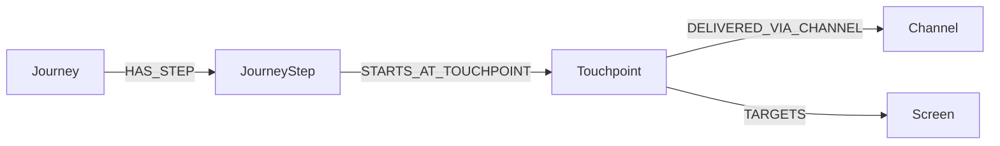

---

## 9. Message Decomposition

`Message` (Tier 1) is the general type for info, warning, success, and validation messages displayed to users.

Specialized registries are Tier 2:

- **ErrorCode** (T2): 80+ codes with `code`, `severity`, `messageText`, `triggerCondition`, `resolutionHint`
- **ConfirmationDialog** (T2): 25+ dialogs with `dialogId`, `triggerAction`, `confirmLabel`, `cancelLabel`, `consequenceText`

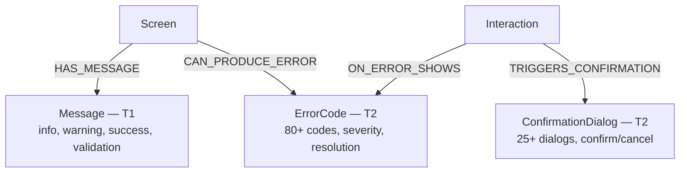

---

## 10. Cross-Family Edges

The object families (Product/UX, Architecture/EA, Delivery/Execution) are connected by cross-family edges that enable traversal across families.

### 10.1 Architecture Cross-Family Edges

| Edge | Source | Target | Family Crossing | Implementation |
|------|--------|--------|----------------|----------------|
| `REQUIRES_CAPABILITY` | BusinessObjective | BusinessCapability | Strategic → Architecture | `[PLANNED]` |
| `ENABLED_BY` | BusinessCapability | Application | Architecture internal | `[PLANNED]` |
| `SUPPORTS_SCREEN` | ApplicationComponent | Screen | Architecture → Product | `[EDGE]` |
| `EXPOSED_VIA` | InformationFlow | ApiContract | Architecture → Product | `[PLANNED]` |
| `HOSTS` | Deployment | ApplicationComponent | Architecture internal | `[PLANNED]` |
| `MAPPED_TO` | BusinessObject | DataEntity | Architecture → Product | `[PLANNED]` |
| `OWNS` | Organization | Application | Architecture internal | `[PLANNED]` |
| `DEPLOYED_ON` | Deployment | InfrastructureNode | Architecture internal | `[PLANNED]` |
| `HAS_CAPABILITY` | BusinessDomain (T1) | BusinessCapability | Architecture internal | `[EDGE]` |
| `REALIZED_BY_PROCESS` | BusinessCapability | BusinessProcess | Architecture internal | `[EDGE]` |

### 10.2 Delivery Hierarchy Edges

| Edge | Source | Target | Family | Implementation |
|------|--------|--------|--------|----------------|
| `HAS_FEATURE` | Epic | Feature | Delivery internal | `[EDGE]` |
| `HAS_STORY` | Feature | UserStory | Delivery internal | `[EDGE]` |
| `HAS_TASK` | UserStory | Task | Delivery internal | `[EDGE]` |
| `DEPENDS_ON` | Task | Task | Delivery internal | `[PLANNED]` |
| `ASSIGNED_TO` | Task | Organization | Delivery → Architecture | `[PLANNED]` |

### 10.3 Four-Verb Traceability Edges

| Edge | Source | Target(s) | Purpose | Implementation |
|------|--------|-----------|---------|----------------|
| `REALIZES` | Epic, Feature, UserStory | BusinessCapability, BusinessProcess, Journey, ProcessActivity, JourneyStep | Why a backlog item exists (origin traceability) | `[PLANNED]` |
| `DELIVERS` | UserStory | Screen, ApiContract, DataEntity, Rule, Message | What testable artifact a story must produce | `[EDGE]` for Screen targets; additional deliverable target types continue to mature |
| `IMPLEMENTS` | Task | Screen, ApiContract, DataEntity, Rule, Message, TestCase, ApplicationComponent | What a task builds or creates | `[EDGE]` |
| `VERIFIED_BY` | UserStory | TestCase | How a story is proven | `[EDGE]` |
| `VERIFIES` | TestCase | Screen, ApiContract | What a test case validates | `[EDGE]` |

### 10.4 Process Spine Edges (BPMN-Aligned)

| Edge | Source | Target | Purpose | Implementation |
|------|--------|--------|---------|----------------|
| `HAS_FLOW_NODE` | BusinessProcess | ProcessActivity, ProcessGateway, ProcessEvent | Process containment (replaces HAS_STEP on process spine) | `[EDGE]` |
| `FLOWS_TO` | Any flow node | Any flow node | Sequence flow with properties (conditionExpression, isDefault, name) | `[EDGE]` |
| `EXPANDS_TO` | ProcessActivity (SUBPROCESS) | BusinessProcess | Subprocess expansion | `[EDGE]` |
| `CALLS_PROCESS` | ProcessActivity (CALL_ACTIVITY) | BusinessProcess | Call activity invocation | `[EDGE]` |
| `ATTACHED_TO` | ProcessEvent (BOUNDARY) | ProcessActivity | Boundary event attachment | `[EDGE]` |

### 10.5 Technical Execution Context Edges

| Edge | Source | Target | Purpose | Implementation |
|------|--------|--------|---------|----------------|
| `DEPENDS_ON_COMPONENT` | ApplicationComponent | ApplicationComponent | Inter-component dependency with type and protocol | `[EDGE]` |
| `OWNS_DATA_ENTITY` | ApplicationComponent | DataEntity | Component ownership of data entities (closes DELIVERS→DataEntity resolution) | `[EDGE]` |
| `ENFORCES_RULE` | ApplicationComponent | Rule | Component enforcement of business rules (closes DELIVERS→Rule resolution) | `[EDGE]` |

### 10.6 Deprecated Edges

| Edge | Replacement | Reason |
|------|-------------|--------|
| `ON_SCREEN` (Interaction→Screen) | `HAS_INTERACTION` (Screen→Interaction) | Duplicate inverse |
| `IMPLEMENTS_STORY` (Screen→UserStory) | `DELIVERS` (UserStory→Screen) | Direction reversal + new verb |
| `DEPLOYS` (Application→Deployment) | `HOSTS` + `DEPLOYED_ON` | Directional fix |
| `DETECTED_BY_BENCHMARK` (Gap→computed) | `detectedBy` property on Gap | Not a real edge |
| `HAS_STEP` (BusinessProcess→ProcessActivity) | `HAS_FLOW_NODE` | Semantic correction for BPMN alignment (Journey `HAS_STEP` is unchanged) |
| `USES_SCREEN` (UserStory→Screen) | `DELIVERS` (UserStory→Screen) | Verb normalization to four-verb model |
| `REQUIRES_API` (UserStory→ApiContract) | `DELIVERS` (UserStory→ApiContract) | Verb normalization to four-verb model |

**Agent-ready extension note:** The 7 deprecated edges above were identified across the meta-model revision and agent-ready spec. See `docs/superpowers/specs/2026-03-14-agent-ready-information-model.md` section 10 for the full deprecation list.

---

## 11. Tier Classification Diagram

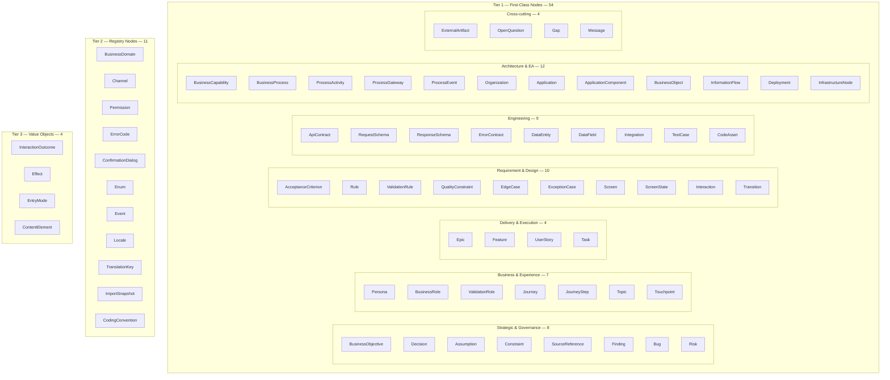

---

## 12. Primary Traversal Spines

### 12.1 Product / UX Spine

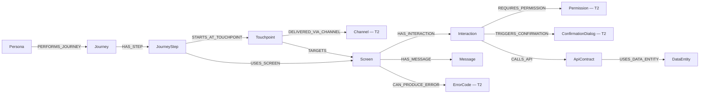

### 12.2 Process Spine (BPMN-Aligned)

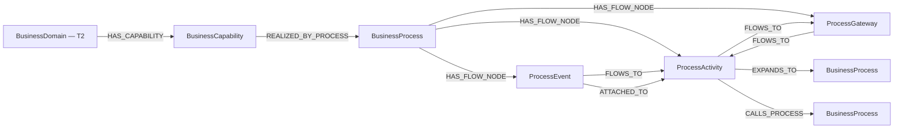

Note: `HAS_STEP` on the process spine is replaced by `HAS_FLOW_NODE`. Journey `HAS_STEP` is unchanged.

### 12.3 Delivery & Execution Spine

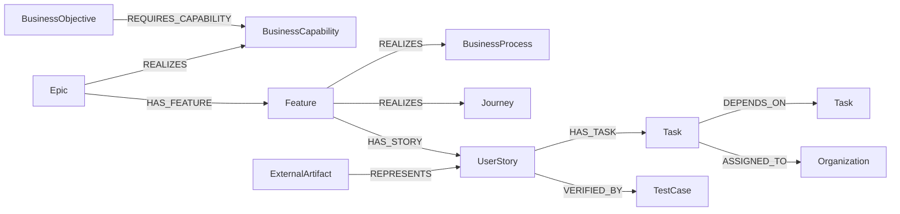

### 12.4 Four-Verb Traceability Spine

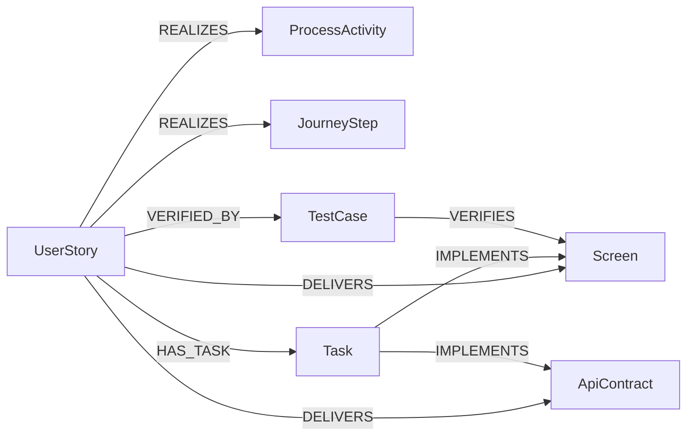

### 12.5 Architecture / EA Spine

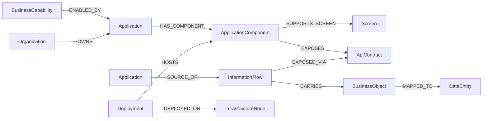

### 12.6 Agent-Ready Traversal Spine (Code Targeting)

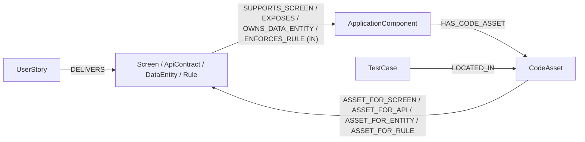

This spine enables: "Given a UserStory, which code files need to change, and which test files verify them?"

### 12.7 Reverse Traversal

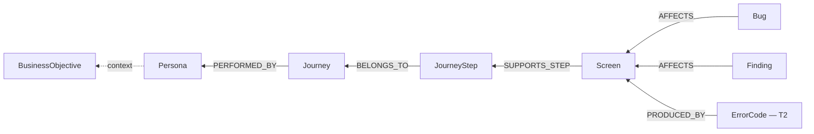

---

## 13. Promotion and Demotion Rules

### 13.1 Promotion (Tier 3 to Tier 1)

A Tier 3 value object should be promoted to Tier 1 when:

- It needs to be independently queried across multiple parents
- It needs its own outbound relationships to other nodes
- A queryability test scores AMBER because of embedded traversal, and the query is high-priority
- It develops its own lifecycle distinct from its parent

### 13.2 Demotion (Tier 1 to Tier 2)

A Tier 1 node should be demoted to Tier 2 when:

- It loses its independent lifecycle
- It becomes a closed, stable vocabulary with no governance transitions
- It is never the starting point for a graph traversal

### 13.3 Change Protocol

Any tier change must:

1. Update this taxonomy document
2. Update the graph object catalog
3. Re-score the vision benchmark
4. Update affected completeness rules
5. Reconcile affected queryability tests
