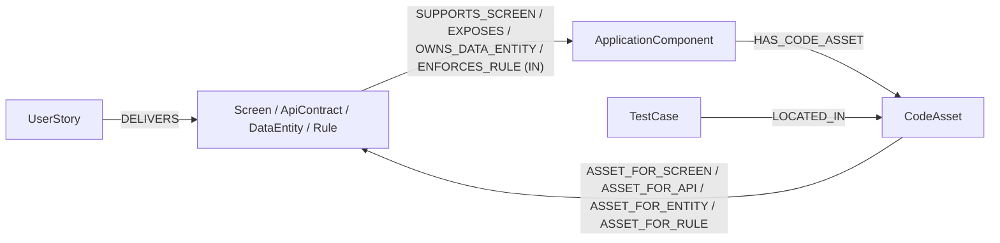
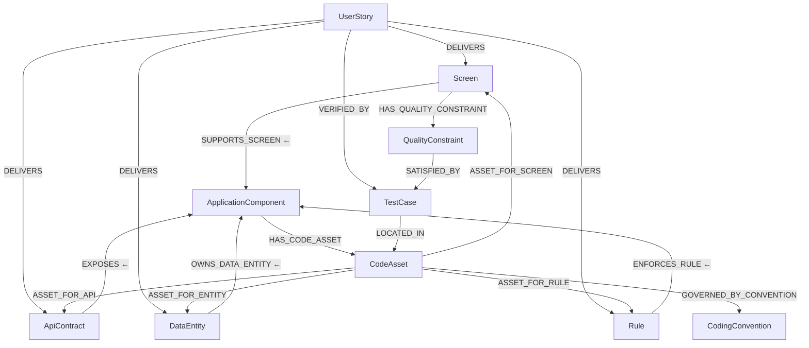
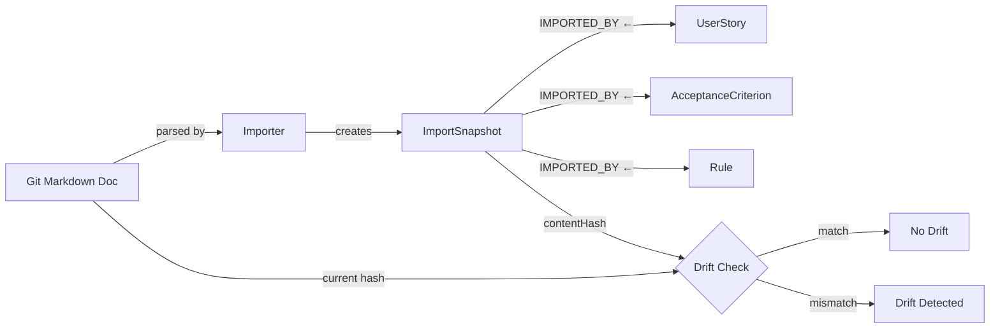

# Agent-Ready Information Model Implementation Plan

> **For agentic workers:** Use superpowers:subagent-driven-development or superpowers:executing-plans if available, otherwise execute tasks sequentially in the current session. Steps use checkbox (`- [ ]`) syntax for tracking.

**Goal:** Extend the Design Hub graph model with code-targeting, import tracking, quality constraints, and coding conventions to enable agent-safe implementation — then propagate those extensions into all downstream documentation.

**Architecture:** Two-phase model extension (Phase 1: CodeAsset + ImportSnapshot + TestCase enrichment + MCR tightening; Phase 2: QualityConstraint + CodingConvention) with documentation propagation across 8 downstream files. Code entities depend on Track D prerequisites (ApplicationComponent, TestCase, etc.) — documentation propagation is independent and can execute immediately.

**Tech Stack:** Spring Data Neo4j 7.x, Java 21, JUnit 5, Markdown documentation

**Scope:** This plan implements the **agent-ready information model** spec only. The second approved spec (operational near-zero-drift) — covering AgentPolicy, EvidenceRecord, DEPENDS_ON_ASSET, GOVERNED_BY_POLICY, BASELINED_BY, and the importer/scanner/pack/reconciliation capabilities — requires a separate implementation plan (Plan 2) to be written after this plan executes.

**Spec:** `docs/superpowers/specs/2026-03-14-agent-ready-information-model.md`

**Dependencies:**
- Track D (master plan) entities: Application, ApplicationComponent, TestCase, ApiContract, DataEntity, Rule, Task must exist before code tasks execute
- Track A documentation (modeling-taxonomy.md, graph-object-catalog.md, etc.) must be at the 65-node/79-edge baseline before propagation tasks execute

**Plan structure:**
- Chunk 1 (Tasks 1-7): Documentation propagation — P0 files (modeling-taxonomy.md, graph-object-catalog.md)
- Chunk 2 (Tasks 8-11): Documentation propagation — P1/P2 files (vision-benchmark.md, implementation-readiness, product-vision.md, supporting docs)
- Chunk 3 (Tasks 12-22): Code implementation — prerequisite stubs, domain entities, edge wiring, MCR service, RequirementSyncContract, legacy edge cleanup, verification

---

## Chunk 1: Documentation Propagation — P0 Files

### Task 1: Update modeling-taxonomy.md with Agent-Ready Extensions

**Files:**
- Modify: `documentation/modeling-taxonomy.md`

**Context:** This file defines the 3-tier taxonomy with 52 T1 / 9 T2 / 4 T3 = 65 elements. The agent-ready spec adds 2 new T1 nodes (CodeAsset, QualityConstraint) and 2 new T2 nodes (ImportSnapshot, CodingConvention), bringing totals to 54 T1 / 11 T2 / 4 T3 = 69 elements (full extension). Phase 1 adds CodeAsset (T1) + ImportSnapshot (T2) = 53 T1 / 10 T2 = 67. The spec is at `docs/superpowers/specs/2026-03-14-agent-ready-information-model.md`.

- [ ] **Step 1: Update the Tier 1 category table**

In Section 3 "Tier Assignments", find the T1 category table. Add CodeAsset and QualityConstraint:

| Category | Old Count | New Count | Objects to Add |
|----------|-----------|-----------|----------------|
| Engineering | 8 | 9 | Add `CodeAsset` after `TestCase` |
| Requirement & Design | 9 | 10 | Add `QualityConstraint` after `ValidationRule` |

The Engineering row should read:
```
| 5 | Engineering | 9 | ApiContract, RequestSchema, ResponseSchema, ErrorContract, DataEntity, DataField, Integration, TestCase, CodeAsset |
```

The Requirement & Design row should read:
```
| 4 | Requirement & Design | 10 | AcceptanceCriterion, Rule, ValidationRule, QualityConstraint, EdgeCase, ExceptionCase, Screen, ScreenState, Interaction, Transition |
```

- [ ] **Step 2: Update the Tier 2 registry table**

In the same section, find the T2 registry table. Add ImportSnapshot and CodingConvention:

| Family | Objects to Add |
|--------|----------------|
| Cross-cutting | Add `ImportSnapshot` (new row — spec section 5.2 categorizes it as Cross-cutting) |
| Cross-cutting | Add `CodingConvention` (same row or separate row) |

Add these rows:
```
| Cross-cutting | ImportSnapshot, CodingConvention |
```

- [ ] **Step 3: Update the Tier counts summary**

Find the "Revised Tier Counts" or equivalent summary table. Update:

```markdown
| Tier | Count | Benchmarkable |
|------|-------|---------------|
| T1 (First-Class) | 54 | Yes |
| T2 (Registry) | 11 | Yes |
| T3 (Value Object) | 4 | No |
| **Total** | **69** | **65** |
```

Add a note below the table:
```markdown
**Agent-ready extension note:** Counts above reflect the full agent-ready extension (Phase 1 + Phase 2). Phase 1 intermediate: 53 T1 / 10 T2 = 67 total / 63 benchmarkable. See `docs/superpowers/specs/2026-03-14-agent-ready-information-model.md` for phased breakdown.
```

- [ ] **Step 4: Add agent-ready traversal spine**

In the traversal spines section, add a new subsection:

````markdown
### Agent-Ready Traversal Spine (Code Targeting)



This spine enables: "Given a UserStory, which code files need to change, and which test files verify them?"
````

- [ ] **Step 5: Verify counts are internally consistent**

Search the file for any remaining references to "52 T1", "9 T2", "65 total", "61 benchmarkable" that should now read "54 T1", "11 T2", "69 total", "65 benchmarkable". Update all occurrences. Use grep:

Run: `grep -n "52 T1\|9 T2\|65 total\|61 benchmarkable" documentation/modeling-taxonomy.md`

Update any matches to the new values. Add "(agent-ready full)" qualifier where context requires distinguishing from the base model.

- [ ] **Step 6: Commit**

```bash
git add documentation/modeling-taxonomy.md
git commit -m "docs: propagate agent-ready extensions to modeling-taxonomy.md

Add CodeAsset (T1), QualityConstraint (T1), ImportSnapshot (T2),
CodingConvention (T2) to tier assignments. Update counts:
52→54 T1, 9→11 T2, 65→69 total, 61→65 benchmarkable.
Add agent-ready traversal spine for code targeting."
```

---

### Task 2: Add CodeAsset Full Spec to graph-object-catalog.md

**Files:**
- Modify: `documentation/graph-object-catalog.md`

**Context:** This file contains the full per-object specifications for all 65 model elements. The agent-ready spec adds 4 new objects that each need a full spec section following the established format. The catalog also has a relationship registry that needs 11 new edges (8 Phase 1 + 3 Phase 2) and 7 deprecated edges removed. Current edge count: 79 (line 2222). Target: 90 (79 + 8 Phase 1 + 3 Phase 2). The spec is at `docs/superpowers/specs/2026-03-14-agent-ready-information-model.md`.

- [ ] **Step 1: Add CodeAsset (T1) specification section**

Find the Engineering category section (after TestCase, Integration). Add the following spec section. Use the format matching existing specs in the file:

```markdown
### CodeAsset

**Tier**: 1 (First-Class Node)
**Category**: Engineering
**Purpose**: File-level code targeting for agent-safe implementation. Curated subset of repo files that are explicit targets of stories, tasks, or tests.
**Implementation Status**: [PLANNED]

**Scope rule:** Only files that are explicit targets of stories/tasks/tests are modeled as CodeAsset nodes. Do not model every file in the repo.

#### Attributes

| Attribute | Type | Required | Description | Constraints |
|-----------|------|----------|-------------|-------------|
| codeAssetId | String | Yes | Stable identifier | Pattern: `CA-{componentId}-{seq}` |
| filePath | String | Yes | Path relative to ApplicationComponent.modulePath | Must not start with `/` |
| assetType | Enum | Yes | Role of the file | SOURCE, TEST, CONFIG, MIGRATION, SPEC, TEMPLATE, STYLE |
| language | Enum | No | Programming language (for logic files) | JAVA, TYPESCRIPT, PYTHON, KOTLIN, GO, RUST, SQL, CYPHER |
| fileFormat | Enum | No | File format (for non-logic files) | JSON, YAML, XML, HTML, CSS, SCSS, MARKDOWN, PROPERTIES, DOCKERFILE |
| layerType | Enum | No | Architectural layer | CONTROLLER, SERVICE, REPOSITORY, DOMAIN, DTO, CONFIG, MIGRATION, TEST, COMPONENT, MODULE, PIPE, GUARD, DIRECTIVE |
| packageName | String | No | Fully qualified package/module | e.g., `com.emsist.designhub.domain` |
| className | String | No | Primary class/component name | e.g., `ScreenController` |
| description | String | No | Brief description of the file's purpose | |
| status | Status | Yes | Universal 10-value enum | |

#### Relationships (Graph Edges)

| Relationship | Target | Cardinality | Required | Severity | Implementation |
|-------------|--------|-------------|----------|----------|----------------|
| HAS_CODE_ASSET (IN, ApplicationComponent) | ApplicationComponent | N:1 | Yes | BLOCKING | [PLANNED] |
| LOCATED_IN (IN, TestCase) | TestCase | N:1 | No | OPTIONAL | [PLANNED] |
| IMPLEMENTS (IN, Task) | Task | N:M | No | OPTIONAL | [PLANNED] |
| ASSET_FOR_SCREEN (OUT) | Screen | N:M | No | OPTIONAL | [PLANNED] |
| ASSET_FOR_API (OUT) | ApiContract | N:M | No | OPTIONAL | [PLANNED] |
| ASSET_FOR_ENTITY (OUT) | DataEntity | N:M | No | OPTIONAL | [PLANNED] |
| ASSET_FOR_RULE (OUT) | Rule | N:M | No | OPTIONAL | [PLANNED] |

#### Path Resolution Rule

Full filesystem path = `Application.repoPath` + `ApplicationComponent.modulePath` + `CodeAsset.filePath`

Example: `/home/repo` + `backend/` + `src/main/java/com/emsist/designhub/domain/Screen.java`
```

- [ ] **Step 2: Verify the section renders correctly**

Open the file in a Markdown viewer or run a quick check that the table formatting is correct:

Run: `head -20 documentation/graph-object-catalog.md | grep -c '|'`
Expected: Non-zero (confirms table syntax exists in the file)

- [ ] **Step 3: Commit**

```bash
git add documentation/graph-object-catalog.md
git commit -m "docs: add CodeAsset (T1) full spec to graph-object-catalog

Engineering category. 10 attributes, 7 relationships.
Phase 1 of agent-ready information model extension."
```

---

### Task 3: Add ImportSnapshot Full Spec to graph-object-catalog.md

**Files:**
- Modify: `documentation/graph-object-catalog.md`

- [ ] **Step 1: Add ImportSnapshot (T2) specification section**

Find the T2 Registry section. Add after the Event entry:

```markdown
### ImportSnapshot

**Tier**: 2 (Registry)
**Category**: Cross-cutting
**Purpose**: Operational audit record tracking each requirement-to-graph import run. Enables drift detection and sync accountability.
**Implementation Status**: [PLANNED]

**Operational exception:** ImportSnapshot is T2 by lifecycle semantics (append-only audit data) but has a pattern ID for traceability. It is benchmarkable because agents query import history to assess graph freshness.

#### Attributes

| Attribute | Type | Required | Description | Constraints |
|-----------|------|----------|-------------|-------------|
| snapshotId | String | Yes | Stable identifier | Pattern: `IMP-{YYYYMMDD}-{seq}` |
| sourceType | Enum | Yes | What was imported | GIT_DOC, JIRA_SYNC, MANUAL_ENTRY |
| sourcePath | String | No | Git path or external URL | Relative to repo root for GIT_DOC |
| importedAt | DateTime | Yes | Timestamp of import | ISO 8601 |
| importedBy | String | Yes | Agent or user who triggered import | |
| result | Enum | Yes | Outcome of the import | SUCCESS, PARTIAL, FAILED, CONFLICTED |
| itemCount | Integer | No | Number of items processed | |
| errorSummary | String | No | Error details for PARTIAL/FAILED/CONFLICTED | |
| contentHash | String | No | Hash of doc-authored fields at import time | For drift detection |

#### Relationships (Graph Edges)

| Relationship | Target | Cardinality | Required | Severity | Implementation |
|-------------|--------|-------------|----------|----------|----------------|
| IMPORTED_BY (IN, Importable T1) | UserStory, AcceptanceCriterion, Rule, Epic, Feature, BusinessObjective, BusinessProcess, ProcessActivity | N:M | No | OPTIONAL | [PLANNED] |

**Importable T1 definition:** T1 nodes whose content originates from Git docs or external sources — specifically nodes whose requirement text or business rules are authored in documentation rather than graph-native.

#### Content Hash and Drift Detection

The `contentHash` field stores a hash of doc-authored fields at import time. Drift detection compares the current Git doc content hash against the stored `contentHash`:

- **Doc-authored fields** (included in hash): requirement text, acceptance criteria text, business rules, description fields sourced from documentation
- **Graph-computed fields** (excluded from hash): status, readiness, completenessScore, relationship counts
- **Runtime fields** (excluded from hash): timestamps, computed metrics, cache values
```

- [ ] **Step 2: Commit**

```bash
git add documentation/graph-object-catalog.md
git commit -m "docs: add ImportSnapshot (T2) full spec to graph-object-catalog

Cross-cutting registry. 9 attributes, 1 relationship (IMPORTED_BY).
Drift detection via contentHash on doc-authored fields.
Phase 1 of agent-ready information model extension."
```

---

### Task 4: Add TestCase Enrichment to graph-object-catalog.md

**Files:**
- Modify: `documentation/graph-object-catalog.md`

**Context:** TestCase already has a spec section in the catalog (from Track D plan, Step D4). It currently has 8 attributes and 3 relationships. The agent-ready spec adds 7 new attributes and 1 new relationship (LOCATED_IN). If TestCase doesn't have a spec section yet (Track D not propagated), create one with the full set.

- [ ] **Step 1: Find or create the TestCase section**

Search for `### TestCase` in the file:
Run: `grep -n "### TestCase" documentation/graph-object-catalog.md`

If found: modify the existing section (Steps 2-3).
If not found: create the full TestCase section in the Engineering category with all 15 attributes and 4 relationships from both the Track D plan and the agent-ready spec.

- [ ] **Step 2: Add 7 new attributes to TestCase**

Add these rows to the TestCase attributes table, after the existing attributes:

```markdown
| testFilePath | String | No | Denormalized convenience path to test file | Canonical source is LOCATED_IN edge to CodeAsset |
| testClassName | String | No | Fully qualified test class | e.g., `com.emsist.designhub.domain.ScreenTest` |
| testMethodName | String | No | Specific test method | e.g., `shouldHoldBothLegacyAndUniversalStatus` |
| testFramework | Enum | No | Test framework | JUNIT5, VITEST, PLAYWRIGHT, JEST, TESTCONTAINERS, CYPRESS |
| suiteName | String | No | Logical test suite grouping | e.g., `smoke`, `regression`, `e2e` |
| tags | List\<String\> | No | Classification tags | e.g., `["unit", "domain", "status"]` |
| testCommand | String | No | Exact command to run this test | e.g., `mvn test -pl backend -Dtest=ScreenTest#shouldHoldBothLegacyAndUniversalStatus` |
```

- [ ] **Step 3: Add LOCATED_IN relationship to TestCase**

Add this row to the TestCase relationships table:

```markdown
| LOCATED_IN (OUT) | CodeAsset | N:1 | No | OPTIONAL | [PLANNED] |
```

Add a note after the table:
```markdown
**Canonical source rule:** When both `testFilePath` and a LOCATED_IN edge to CodeAsset exist, the LOCATED_IN edge is authoritative. `testFilePath` is a denormalized convenience field.

**Total after enrichment:** TestCase has 15 attributes and 4 relationships.
```

- [ ] **Step 4: Commit**

```bash
git add documentation/graph-object-catalog.md
git commit -m "docs: enrich TestCase spec with execution metadata

Add 7 new attributes (testFilePath, testClassName, testMethodName,
testFramework, suiteName, tags, testCommand) and LOCATED_IN edge
to CodeAsset. Total: 15 attributes, 4 relationships.
Phase 1 of agent-ready information model extension."
```

---

### Task 5: Add Phase 2 Object Specs to graph-object-catalog.md

**Files:**
- Modify: `documentation/graph-object-catalog.md`

- [ ] **Step 1: Add QualityConstraint (T1) specification section**

Find the Requirement & Design category section. Add after ValidationRule:

```markdown
### QualityConstraint

**Tier**: 1 (First-Class Node)
**Category**: Requirement & Design
**Purpose**: Instance-specific, verifiable non-functional requirement with measurable thresholds. Each QualityConstraint is bound to a specific artifact and has a concrete pass/fail threshold.
**Implementation Status**: [PLANNED]

#### Attributes

| Attribute | Type | Required | Description | Constraints |
|-----------|------|----------|-------------|-------------|
| constraintId | String | Yes | Stable identifier | Pattern: `QC-{domain}-{seq}` |
| name | String | Yes | Short descriptive name | e.g., "Screen load time < 2s" |
| description | String | No | Detailed description | |
| constraintType | Enum | Yes | Category of quality | PERFORMANCE, ACCESSIBILITY, SECURITY, RELIABILITY, SCALABILITY, USABILITY |
| threshold | String | Yes | Measurable pass/fail boundary | e.g., "< 2000ms", ">= 95%", "WCAG AAA" |
| measurementMethod | String | No | How to measure this constraint | e.g., "Lighthouse performance score" |
| priority | Enum | No | Importance level | CRITICAL, HIGH, MEDIUM, LOW |
| status | Status | Yes | Universal 10-value enum | |

#### Relationships (Graph Edges)

| Relationship | Target | Cardinality | Required | Severity | Implementation |
|-------------|--------|-------------|----------|----------|----------------|
| HAS_QUALITY_CONSTRAINT (IN, Screen/ApiContract/DataEntity/ApplicationComponent) | Screen, ApiContract, DataEntity, ApplicationComponent | N:M | No | OPTIONAL | [PLANNED] |
| SATISFIED_BY (OUT) | TestCase | N:M | No | OPTIONAL | [PLANNED] |

**SATISFIED_BY vs VERIFIED_BY semantics:**

| Verb | Source | Target | Meaning |
|------|--------|--------|---------|
| VERIFIED_BY | UserStory | TestCase | "This test proves the story is functionally correct" |
| SATISFIED_BY | QualityConstraint | TestCase | "This test proves the quality threshold is met" |

A single TestCase can be both a VERIFIED_BY target (for a story) and a SATISFIED_BY target (for a quality constraint).
```

- [ ] **Step 2: Add CodingConvention (T2 Hybrid) specification section**

Find the T2 Registry section (or Cross-cutting section). Add:

```markdown
### CodingConvention

**Tier**: 2 (Registry — Hybrid with docRef)
**Category**: Cross-cutting
**Purpose**: Queryable coding standards with structured categories in the graph and detailed rule content in Markdown files referenced by docRef.
**Implementation Status**: [PLANNED]

**Hybrid rationale:** Pure graph nodes are too shallow for real coding conventions. Pure external docs are too loose for queryable agent readiness. The hybrid stores queryable metadata in the graph and detailed content in Git-tracked Markdown.

#### Attributes

| Attribute | Type | Required | Description | Constraints |
|-----------|------|----------|-------------|-------------|
| conventionCode | String | Yes | Stable identifier | Pattern: `CONV-{category}-{seq}` |
| name | String | Yes | Short descriptive name | e.g., "Spring DI Pattern" |
| category | Enum | Yes | Convention category | NAMING, STRUCTURE, DEPENDENCY_INJECTION, ERROR_HANDLING, TESTING, LOGGING, SECURITY, API_DESIGN, DATABASE, DOCUMENTATION |
| enforcement | Enum | Yes | How strictly enforced | MANDATORY, RECOMMENDED, ADVISORY |
| scope | Enum | Yes | Applicability scope | GLOBAL, BACKEND, FRONTEND, SERVICE, COMPONENT |
| docRef | String | Yes | Path to detailed convention document | Relative to repo root |
| summary | String | No | One-line summary for quick agent reference | |
| activeStatus | Enum | No | Registry lifecycle | ACTIVE, DEPRECATED |

#### Relationships (Graph Edges)

| Relationship | Target | Cardinality | Required | Severity | Implementation |
|-------------|--------|-------------|----------|----------|----------------|
| GOVERNED_BY_CONVENTION (IN, Application/ApplicationComponent/CodeAsset) | Application, ApplicationComponent, CodeAsset | N:M | No | OPTIONAL | [PLANNED] |

#### Convention Resolution Rule

Convention applicability is determined exclusively by materialized GOVERNED_BY_CONVENTION edges. No implicit resolution based on scope or category attributes. When multiple conventions apply, narrower scope overrides broader: `COMPONENT > SERVICE > FRONTEND/BACKEND > GLOBAL`.
```

- [ ] **Step 3: Commit**

```bash
git add documentation/graph-object-catalog.md
git commit -m "docs: add QualityConstraint (T1) and CodingConvention (T2) specs

QualityConstraint: 8 attributes, 2 relationships (HAS_QUALITY_CONSTRAINT,
SATISFIED_BY). Bound to artifacts with measurable thresholds.
CodingConvention: 8 attributes, 1 relationship (GOVERNED_BY_CONVENTION).
Hybrid T2 with docRef for detailed rules.
Phase 2 of agent-ready information model extension."
```

---

### Task 6: Update Relationship Registry in graph-object-catalog.md

**Files:**
- Modify: `documentation/graph-object-catalog.md`

**Context:** The relationship registry is a master table of all edges. Current count: 79. The 7 deprecated edges (ON_SCREEN, IMPLEMENTS_STORY, DEPLOYS, DETECTED_BY_BENCHMARK, HAS_STEP(process), REQUIRES_API, HAS_CONVENTION) were deprecated in the meta-model revision and should NOT be counted in the 79 — they were replaced by their successors which ARE in the 79. If stale entries remain in the registry, remove them but do NOT subtract from 79. The agent-ready spec adds 8 Phase 1 edges + 3 Phase 2 edges = 11 new edges on top of the 79 base: 79 + 8 = 87 (Phase 1), 87 + 3 = 90 (Full).

**Verification before editing:** Locate the relationship registry section in the file (look for the heading containing "Relationship Registry" or "Relationship" table). Then count only the data rows in that specific table — not all `|`-prefixed lines in the file. One approach:

```bash
# Find the registry section and count its data rows (exclude header/separator rows)
sed -n '/Relationship Registry/,/^##/p' documentation/graph-object-catalog.md | grep "^|" | grep -v "^| Relationship\|^|---\|^| Total" | wc -l
```

Confirm the count matches the expected 79 baseline. If the count includes deprecated stale entries, remove them first to establish the clean 79 baseline before adding new edges. If the file structure differs from this assumption, manually inspect the registry section and count edges.

- [ ] **Step 1: Add Phase 1 edges to the relationship registry**

Find the relationship registry table (near line 2222). Add 8 new rows:

```markdown
| HAS_CODE_ASSET | ApplicationComponent | CodeAsset | 1:N | Yes | BLOCKING | [PLANNED] |
| LOCATED_IN | TestCase | CodeAsset | N:1 | No | OPTIONAL | [PLANNED] |
| ASSET_FOR_SCREEN | CodeAsset | Screen | N:M | No | OPTIONAL | [PLANNED] |
| ASSET_FOR_API | CodeAsset | ApiContract | N:M | No | OPTIONAL | [PLANNED] |
| ASSET_FOR_ENTITY | CodeAsset | DataEntity | N:M | No | OPTIONAL | [PLANNED] |
| ASSET_FOR_RULE | CodeAsset | Rule | N:M | No | OPTIONAL | [PLANNED] |
| IMPORTED_BY | Importable T1 | ImportSnapshot | N:M | No | OPTIONAL | [PLANNED] |
| IMPLEMENTS (Task → CodeAsset) | Task | CodeAsset | N:M | No | OPTIONAL | [PLANNED] |
```

- [ ] **Step 2: Add Phase 2 edges to the relationship registry**

```markdown
| HAS_QUALITY_CONSTRAINT | Screen, ApiContract, DataEntity, ApplicationComponent | QualityConstraint | N:M | No | OPTIONAL | [PLANNED] |
| SATISFIED_BY | QualityConstraint | TestCase | N:M | No | OPTIONAL | [PLANNED] |
| GOVERNED_BY_CONVENTION | Application, ApplicationComponent, CodeAsset | CodingConvention | N:M | No | OPTIONAL | [PLANNED] |
```

- [ ] **Step 3: Remove deprecated edges from registry**

Search for and remove these edges from the registry if they still appear:

1. `USES_SCREEN` (UserStory → Screen) — replaced by DELIVERS (Note: JourneyStep USES_SCREEN is **NOT** deprecated)
2. `REQUIRES_API` (UserStory → ApiContract) — replaced by DELIVERS
3. `ON_SCREEN` (Interaction → Screen) — replaced by HAS_INTERACTION
4. `IMPLEMENTS_STORY` (Screen → UserStory) — replaced by DELIVERS
5. `DEPLOYS` (Application → Deployment) — replaced by HOSTS + DEPLOYED_ON
6. `DETECTED_BY_BENCHMARK` (Gap → computed) — replaced by `detectedBy` property
7. `HAS_STEP` (BusinessProcess → ProcessActivity) — replaced by HAS_FLOW_NODE (Journey HAS_STEP unchanged)

Run: `grep -n "ON_SCREEN\|IMPLEMENTS_STORY\|DETECTED_BY_BENCHMARK\|REQUIRES_API\|USES_SCREEN\|DEPLOYS\|HAS_STEP" documentation/graph-object-catalog.md`

Review matches carefully:
- Remove entries matching the 7 deprecated edges from the registry table
- **Do NOT remove** Journey `HAS_STEP` — only BusinessProcess `HAS_STEP` is deprecated (replaced by HAS_FLOW_NODE)
- **Do NOT remove** JourneyStep `USES_SCREEN` — only UserStory `USES_SCREEN` is deprecated (replaced by DELIVERS)
- Do NOT remove prose references or deprecation notes — only registry table rows

- [ ] **Step 4: Update the total edge count**

Find the line with `| Total relationship types | 79 |` and update to:

```markdown
| Total relationship types | 90 |
```

Add a note: `Phase 1: 87 (79 base + 8 new). Full: 90 (87 + 3 Phase 2). See agent-ready spec for phased breakdown.`

- [ ] **Step 5: Commit**

```bash
git add documentation/graph-object-catalog.md
git commit -m "docs: update relationship registry with agent-ready edges

Add 8 Phase 1 edges (HAS_CODE_ASSET, LOCATED_IN, ASSET_FOR_*,
IMPORTED_BY, IMPLEMENTS→CodeAsset) and 3 Phase 2 edges
(HAS_QUALITY_CONSTRAINT, SATISFIED_BY, GOVERNED_BY_CONVENTION).
Remove 7 deprecated edges. Total: 79 → 90."
```

---

### Task 7: Add Agent-Ready Traversal Diagrams to graph-object-catalog.md

**Files:**
- Modify: `documentation/graph-object-catalog.md`

- [ ] **Step 1: Add code-targeting traversal diagram**

Find the relationship spine diagrams section. Add a new Mermaid diagram:

````markdown
### Code-Targeting Traversal Spine (Agent-Ready Extension)


````

- [ ] **Step 2: Add import/drift tracking diagram**

````markdown
### Import and Drift Tracking


````

- [ ] **Step 3: Commit**

```bash
git add documentation/graph-object-catalog.md
git commit -m "docs: add agent-ready traversal diagrams to catalog

Code-targeting spine: UserStory → DELIVERS → artifact → owning
ApplicationComponent → HAS_CODE_ASSET → CodeAsset.
Import/drift tracking: ImportSnapshot with contentHash for
drift detection."
```

---

## Chunk 2: Documentation Propagation — P1/P2 Files

### Task 8: Update vision-benchmark.md with Agent-Ready Dimensions

**Files:**
- Modify: `documentation/vision-benchmark.md`

**Context:** This file scores the current state across 8 dimensions. The agent-ready spec adds new queryability tests and a new "agent-ready benchmarkable" metric (63 Phase 1 / 65 full, distinct from the base 61).

- [ ] **Step 1: Add agent-ready benchmarkable metric**

Find the documentation completeness dimension (Dimension 1). Add a new metric:

```markdown
**Agent-ready benchmarkable:** 65 (base 61 + CodeAsset, ImportSnapshot, QualityConstraint, CodingConvention). This count includes all objects an agent needs to resolve for safe implementation. Phase 1 intermediate: 63 (base 61 + CodeAsset, ImportSnapshot).
```

- [ ] **Step 2: Add code-targeting queryability tests**

Find the queryability test suite (Section 2c or equivalent). Determine the last numbered test row and continue numbering from there. Add 3 new tests:

```markdown
| N+1 | Which code files implement screen S? | `Screen <-[SUPPORTS_SCREEN]- ApplicationComponent -[HAS_CODE_ASSET]-> CodeAsset -[ASSET_FOR_SCREEN]-> Screen` | [PLANNED] no CodeAsset entity |
| N+2 | Which test file verifies test case TC? | `TestCase -[LOCATED_IN]-> CodeAsset` | [PLANNED] no LOCATED_IN edge |
| N+3 | Which conventions govern component C? | `ApplicationComponent <-[GOVERNED_BY_CONVENTION]- CodingConvention` | [PLANNED] no CodingConvention entity |
```

(Replace N+1/N+2/N+3 with actual sequential numbers based on the last existing test row.)

- [ ] **Step 3: Update the artifact type coverage matrix**

Add rows for the 4 new objects:

```markdown
| CodeAsset | T1 | ✅ | 0% | ❌ | [PLANNED] | 0/7 | ❌ | 0 |
| ImportSnapshot | T2 | ✅ | 0% | ❌ | [PLANNED] | 0/1 | ❌ | 0 |
| QualityConstraint | T1 | ✅ | 0% | ❌ | [PLANNED] | 0/2 | ❌ | 0 |
| CodingConvention | T2 | ✅ | 0% | ❌ | [PLANNED] | 0/1 | ❌ | 0 |
```

- [ ] **Step 4: Commit**

```bash
git add documentation/vision-benchmark.md
git commit -m "docs: add agent-ready queryability tests and coverage rows

3 new queryability tests (code file resolution, test file location,
convention governance). 4 new artifact type coverage matrix rows.
Agent-ready benchmarkable metric: 63 (Phase 1) / 65 (full)."
```

---

### Task 9: Update implementation-readiness-graph-model.md with Tightened MCR

**Files:**
- Modify: `documentation/implementation-readiness-graph-model.md`

**Context:** This file defines MCRs (Minimum Completeness Rules) and the completenessScore formula. The agent-ready spec tightens MCR-STORY-AGENT-READY-001 with 5 new checks for AGENT_FIRST stories.

- [ ] **Step 1: Find the MCR-STORY-AGENT-READY-001 section**

Run: `grep -n "MCR-STORY-AGENT-READY" documentation/implementation-readiness-graph-model.md`

- [ ] **Step 2: Add tightened checks for AGENT_FIRST stories**

After the existing MCR-STORY-AGENT-READY-001 definition, add:

```markdown
#### Tightened MCR for AGENT_FIRST Stories

When `UserStory.executionMode = AGENT_FIRST`, the Agent-Ready concern adds:

| Check | Condition | Severity |
|-------|-----------|----------|
| Repo path resolvable | `Application.repoPath IS NOT NULL` | BLOCKING |
| Build command available | `COALESCE(comp.buildCommand, app.defaultBuildCommand) IS NOT NULL` | BLOCKING |
| Manifest path available | `comp.manifestPath IS NOT NULL` | BLOCKING |
| Code-asset presence | ≥1 `HAS_CODE_ASSET` edge on at least one DELIVERS target's owning ApplicationComponent | BLOCKING |
| Verification test-file resolution | ≥1 `LOCATED_IN` edge on at least one TestCase linked via `VERIFIED_BY` | BLOCKING |
| Entrypoint path | `comp.entrypointPath IS NOT NULL` | ADVISORY (non-blocking) |

**Tightened Cypher query:**

```cypher
MATCH (s:UserStory {storyId: $storyId, executionMode: 'AGENT_FIRST'})
// Branch 1: Direct DELIVERS targets (Screen, ApiContract, DataEntity, Rule)
OPTIONAL MATCH (s)-[:DELIVERS]->(target)
OPTIONAL MATCH (target)<-[:SUPPORTS_SCREEN|EXPOSES|OWNS_DATA_ENTITY|ENFORCES_RULE]-(comp1:ApplicationComponent)
// Branch 2: Message targets (transitive via Screen → owning component)
OPTIONAL MATCH (s)-[:DELIVERS]->(m:Message)<-[:HAS_MESSAGE]-(scr:Screen)<-[:SUPPORTS_SCREEN]-(comp2:ApplicationComponent)
WITH s, collect(DISTINCT comp1) + collect(DISTINCT comp2) AS allCompsMerged
UNWIND allCompsMerged AS comp
WITH s, collect(DISTINCT comp) AS allComps
MATCH (s)
OPTIONAL MATCH (comp)<-[:HAS_COMPONENT]-(app:Application) WHERE comp IN allComps
OPTIONAL MATCH (comp)-[:HAS_CODE_ASSET]->(ca:CodeAsset) WHERE comp IN allComps
OPTIONAL MATCH (s)-[:VERIFIED_BY]->(tc:TestCase)-[:LOCATED_IN]->(tca:CodeAsset)
WITH s, allComps,
     collect(DISTINCT app) AS allApps,
     collect(DISTINCT ca) AS codeAssets,
     collect(DISTINCT tca) AS testCodeAssets
RETURN s.storyId,
  any(app IN allApps WHERE app.repoPath IS NOT NULL) AS hasRepoPath,
  any(comp IN allComps WHERE COALESCE(comp.buildCommand, [a IN allApps WHERE a.defaultBuildCommand IS NOT NULL][0].defaultBuildCommand) IS NOT NULL) AS hasBuildCommand,
  any(comp IN allComps WHERE comp.manifestPath IS NOT NULL) AS hasManifestPath,
  size(codeAssets) > 0 AS hasCodeAssets,
  size(testCodeAssets) > 0 AS hasTestFileResolution,
  any(comp IN allComps WHERE comp.entrypointPath IS NOT NULL) AS hasEntryPoint
```
```

- [ ] **Step 3: Add CodeAsset to the applicability matrix**

Find the applicability matrix (which readiness flags apply to which artifacts). Add CodeAsset:

```markdown
| CodeAsset | ✅ status | ❌ readiness | ✅ completenessScore | N/A — structural, not deliverable |
```

- [ ] **Step 4: Update completenessScore formula note**

Find the completenessScore formula section. Add a note:

```markdown
**Agent-ready extension:** The completenessScore formula now includes code-asset edges in the BLOCKING category. For AGENT_FIRST stories, HAS_CODE_ASSET and LOCATED_IN (via VERIFIED_BY chain) are BLOCKING edges and contribute to the weighted numerator accordingly (BLOCKING edge weight = 3x per the existing completenessScore formula from A3).
```

- [ ] **Step 5: Commit**

```bash
git add documentation/implementation-readiness-graph-model.md
git commit -m "docs: tighten MCR-STORY-AGENT-READY-001 for AGENT_FIRST stories

Add 5 BLOCKING checks + 1 ADVISORY: repo path, build command,
manifest, code asset presence, test file resolution, entrypoint.
Include Cypher query with any() semantics.
Add CodeAsset to applicability matrix."
```

---

### Task 10: Update product-vision.md with Agent-Ready References

**Files:**
- Modify: `documentation/product-vision.md`

- [ ] **Step 1: Update model count references**

Search for "65 total" or "65 elements" or "79 edge" references:

Run: `grep -n "65\|79 edge\|61 benchmarkable" documentation/product-vision.md`

Update to reference the agent-ready extension:
- Where it says "65 model elements": add "(69 with agent-ready extension)"
- Where it says "79 edge types": add "(90 with agent-ready extension)"
- Where it says "61 benchmarkable": add "(65 agent-ready benchmarkable)"

- [ ] **Step 2: Add code-targeting to north-star queries**

Find the north-star queries section. Add:

```markdown
| 12 | Which code files need to change for story S? | `UserStory → DELIVERS → artifact → owning ApplicationComponent → HAS_CODE_ASSET → CodeAsset` |
| 13 | Which coding conventions apply to component C? | `ApplicationComponent ← GOVERNED_BY_CONVENTION ← CodingConvention` with scope resolution |
```

- [ ] **Step 3: Commit**

```bash
git add documentation/product-vision.md
git commit -m "docs: reference agent-ready extensions in product-vision

Update count references: 69 nodes (agent-ready), 90 edges,
65 agent-ready benchmarkable. Add code-targeting north-star queries."
```

---

### Task 11: Update Supporting Documentation Files

**Files:**
- Modify: `documentation/feature-capability-map.md`
- Modify: `documentation/architecture-blueprint.md`
- Modify: `documentation/design-testing-strategy.md`

- [ ] **Step 1: Update feature-capability-map.md**

Add two new capabilities to the capability model:

```markdown
#### Code Targeting (Agent-Ready Extension)

**Objects:** CodeAsset (T1), ImportSnapshot (T2)
**Edges:** HAS_CODE_ASSET, LOCATED_IN, ASSET_FOR_*, IMPORTED_BY, IMPLEMENTS→CodeAsset
**Enables:** Agent can resolve from UserStory to exact code files and test files
**Status:** [PLANNED]

#### Convention Compliance (Agent-Ready Extension)

**Objects:** CodingConvention (T2 Hybrid), QualityConstraint (T1)
**Edges:** GOVERNED_BY_CONVENTION, HAS_QUALITY_CONSTRAINT, SATISFIED_BY
**Enables:** Agent can discover which coding standards and quality thresholds apply to its work
**Status:** [PLANNED]
```

Update the benchmarkable count reference from 61 to 65 (agent-ready).

Also update the capability-to-artifact mapping table (if one exists) to include CodeAsset, ImportSnapshot, QualityConstraint, and CodingConvention. If the file has a table mapping capabilities to artifact counts, update it to reference 65 agent-ready benchmarkable nodes (63 Phase 1 / 65 full).

- [ ] **Step 2: Update architecture-blueprint.md**

Add to the engineering layer:

```markdown
#### Agent-Ready Layer (Extension)

- **CodeAsset**: File-level code targeting. Resolves `Application.repoPath + ApplicationComponent.modulePath + CodeAsset.filePath` for full filesystem path.
- **ImportSnapshot**: Records point-in-time imports from Git docs to graph nodes. Enables drift detection via `contentHash`.
- **RequirementSyncContract**: Protocol for maintaining doc↔graph consistency. See agent-ready spec Section 9.
```

Add to the BPMN alignment section or process layer:

```markdown
**Convention resolution:** CodingConvention (T2 Hybrid) stores queryable metadata in graph, detailed rules in Git-tracked Markdown via `docRef`. Resolution is edge-only (no implicit matching).
```

- [ ] **Step 3: Update design-testing-strategy.md**

Add to the anti-drift scenarios list:

```markdown
#### Agent-Ready Drift Scenarios

| # | Scenario | What to Test |
|---|----------|-------------|
| 11 | CodeAsset LOCATED_IN resolution | TestCase → LOCATED_IN → CodeAsset resolves to a valid file path |
| 12 | Import drift detection | ImportSnapshot.contentHash matches current Git doc content hash |
| 13 | Convention governance | ApplicationComponent GOVERNED_BY_CONVENTION edges resolve to valid CodingConvention nodes with accessible docRef files |
```

- [ ] **Step 4: Commit**

```bash
git add documentation/feature-capability-map.md documentation/architecture-blueprint.md documentation/design-testing-strategy.md
git commit -m "docs: propagate agent-ready extensions to supporting docs

feature-capability-map: add Code Targeting + Convention Compliance
capabilities, update benchmarkable count to 65.
architecture-blueprint: add Agent-Ready Layer description.
design-testing-strategy: add 3 agent-ready drift scenarios."
```

---

## Chunk 3: Code Implementation — Domain Entities, Services, Edge Wiring

> **Chunk size note:** This chunk is ~1500 lines, exceeding the 1000-line guideline. It is not split because Tasks 12-22 are tightly interdependent — Task 17b modifies entities created in Tasks 12a/13/15/16, and Task 19 depends on all prior entities. Splitting would introduce cross-chunk coordination overhead without meaningful isolation benefit.

**IMPORTANT: This chunk depends on Track D entities existing in code.** Specifically:
- ApplicationComponent.java must exist (D5) — for HAS_CODE_ASSET, GOVERNED_BY_CONVENTION, HAS_QUALITY_CONSTRAINT
- TestCase.java must exist (D4) — for LOCATED_IN, agent-ready enrichment
- Application.java must exist (D5) — for GOVERNED_BY_CONVENTION
- ApiContract.java, DataEntity.java, Rule.java must exist (D4) — for ASSET_FOR_* edges, HAS_QUALITY_CONSTRAINT
- Task.java must exist (D4) — for IMPLEMENTS → CodeAsset

If these prerequisites are NOT met, execute Task 12a (stubs) first. If they ARE met, skip to Task 13.

**Task inventory for Chunk 3:**
- Task 12: Prerequisite check
- Task 12a: Create prerequisite entity stubs (conditional)
- Task 12b: Enrich existing TestCase (conditional — if Track D created it without agent-ready attributes)
- Tasks 13-16: Create CodeAsset, ImportSnapshot, QualityConstraint, CodingConvention entities
- Task 17: Wire HAS_CODE_ASSET edge
- Task 17b: Wire GOVERNED_BY_CONVENTION and HAS_QUALITY_CONSTRAINT edges on source entities
- Task 19: MCR-STORY-AGENT-READY-001 service implementation
- Task 20: RequirementSyncContract skeleton (content hash + drift detection)
- Task 21: Legacy edge cleanup verification
- Task 22: Full test suite and final verification

### Task 12: Prerequisite Check — Verify Track D Entities Exist

**Files:**
- Check: `backend/src/main/java/com/emsist/designhub/domain/`

- [ ] **Step 1: Check for prerequisite entities**

Run:
```bash
for entity in ApplicationComponent Application TestCase ApiContract DataEntity Rule Task; do
  if [ -f "backend/src/main/java/com/emsist/designhub/domain/${entity}.java" ]; then
    echo "✅ ${entity}.java exists"
  else
    echo "❌ ${entity}.java MISSING — Track D prerequisite"
  fi
done
```

- [ ] **Step 2: Decision gate**

If ALL entities show ✅: proceed to Task 13 (skip Task 12a).
If ANY entity shows ❌: proceed to Task 12a (create stubs), then Task 13.

---

### Task 12a: Create Prerequisite Entity Stubs (CONDITIONAL — only if Task 12 shows missing entities)

**Files:**
- Create: `backend/src/main/java/com/emsist/designhub/domain/Application.java`
- Create: `backend/src/main/java/com/emsist/designhub/domain/ApplicationComponent.java`
- Create: `backend/src/main/java/com/emsist/designhub/domain/TestCase.java`
- Create: `backend/src/main/java/com/emsist/designhub/domain/ApiContract.java`
- Create: `backend/src/main/java/com/emsist/designhub/domain/DataEntity.java`
- Create: `backend/src/main/java/com/emsist/designhub/domain/Rule.java`
- Create: `backend/src/main/java/com/emsist/designhub/domain/Task.java`

**IMPORTANT:** These are minimal stubs following the plan's D4/D5 specs. They will be expanded when the full Track D steps execute. Only create stubs for entities that are missing (from Task 12 check).

- [ ] **Step 1: Create Application.java stub**

```java
package com.emsist.designhub.domain;

import lombok.AllArgsConstructor;
import lombok.Builder;
import lombok.Data;
import lombok.NoArgsConstructor;
import org.springframework.data.neo4j.core.schema.Id;
import org.springframework.data.neo4j.core.schema.Node;
import org.springframework.data.neo4j.core.schema.Relationship;
import java.util.List;

@Node
@Data
@Builder
@NoArgsConstructor
@AllArgsConstructor
public class Application {
    @Id
    private String applicationId;
    private String name;
    private String description;
    private String repoPath;
    private String repoUrl;
    private String workspaceType;
    private String defaultBuildCommand;
    private String defaultTestCommand;
    private Status status;

    @Relationship(type = "HAS_COMPONENT", direction = Relationship.Direction.OUTGOING)
    private List<ApplicationComponent> components;
}
```

- [ ] **Step 2: Create ApplicationComponent.java stub**

```java
package com.emsist.designhub.domain;

import lombok.AllArgsConstructor;
import lombok.Builder;
import lombok.Data;
import lombok.NoArgsConstructor;
import org.springframework.data.neo4j.core.schema.Id;
import org.springframework.data.neo4j.core.schema.Node;
import org.springframework.data.neo4j.core.schema.Relationship;
import java.util.List;

@Node
@Data
@Builder
@NoArgsConstructor
@AllArgsConstructor
public class ApplicationComponent {
    @Id
    private String componentId;
    private String name;
    private String description;
    private String componentType;
    private String frameworkFamily;
    private String frameworkName;
    private String frameworkVersion;
    private String runtime;
    private String language;
    private String languageVersion;
    private String modulePath;
    private String manifestPath;
    private String buildCommand;
    private String testCommand;
    private String entrypointPath;
    private Status status;

    @Relationship(type = "HAS_CODE_ASSET", direction = Relationship.Direction.OUTGOING)
    private List<CodeAsset> codeAssets;
}
```

- [ ] **Step 3: Create TestCase.java stub (with agent-ready enrichment)**

```java
package com.emsist.designhub.domain;

import lombok.AllArgsConstructor;
import lombok.Builder;
import lombok.Data;
import lombok.NoArgsConstructor;
import org.springframework.data.neo4j.core.schema.Id;
import org.springframework.data.neo4j.core.schema.Node;
import org.springframework.data.neo4j.core.schema.Relationship;
import java.util.List;

@Node
@Data
@Builder
@NoArgsConstructor
@AllArgsConstructor
public class TestCase {
    @Id
    private String testCaseId;
    private String title;
    private String description;
    private String testType;
    private String preconditions;
    private String expectedResult;
    private Status status;

    // Agent-ready enrichment (7 new attributes)
    private String testFilePath;
    private String testClassName;
    private String testMethodName;
    private String testFramework;
    private String suiteName;
    private List<String> tags;
    private String testCommand;

    @Relationship(type = "LOCATED_IN", direction = Relationship.Direction.OUTGOING)
    private CodeAsset locatedIn;
}
```

- [ ] **Step 4: Create remaining stubs (ApiContract, DataEntity, Rule, Task)**

Create each with `@Id` String field, `name`, `description`, `Status status`, and no relationships beyond what's needed for CodeAsset edges:

**ApiContract.java:**
```java
package com.emsist.designhub.domain;

import lombok.*;
import org.springframework.data.neo4j.core.schema.Id;
import org.springframework.data.neo4j.core.schema.Node;

@Node @Data @Builder @NoArgsConstructor @AllArgsConstructor
public class ApiContract {
    @Id private String contractId;
    private String path;
    private String method;
    private String description;
    private Status status;
}
```

**DataEntity.java:**
```java
package com.emsist.designhub.domain;

import lombok.*;
import org.springframework.data.neo4j.core.schema.Id;
import org.springframework.data.neo4j.core.schema.Node;

@Node @Data @Builder @NoArgsConstructor @AllArgsConstructor
public class DataEntity {
    @Id private String entityId;
    private String name;
    private String description;
    private String entityType;
    private Status status;
}
```

**Rule.java:**
```java
package com.emsist.designhub.domain;

import lombok.*;
import org.springframework.data.neo4j.core.schema.Id;
import org.springframework.data.neo4j.core.schema.Node;

@Node @Data @Builder @NoArgsConstructor @AllArgsConstructor
public class Rule {
    @Id private String ruleId;
    private String name;
    private String description;
    private String ruleType;
    private Status status;
}
```

**Task.java:**
```java
package com.emsist.designhub.domain;

import lombok.*;
import org.springframework.data.neo4j.core.schema.Id;
import org.springframework.data.neo4j.core.schema.Node;
import org.springframework.data.neo4j.core.schema.Relationship;
import java.util.List;

@Node @Data @Builder @NoArgsConstructor @AllArgsConstructor
public class Task {
    @Id private String taskId;
    private String title;
    private String description;
    private String taskType;
    private Status status;
    private String priority;

    @Relationship(type = "IMPLEMENTS", direction = Relationship.Direction.OUTGOING)
    private List<CodeAsset> implementsAssets;
}
```

- [ ] **Step 5: Run compilation check**

Run: `cd backend && mvn compile -q`
Expected: BUILD SUCCESS (stubs compile with existing code)

- [ ] **Step 6: Commit**

```bash
git add backend/src/main/java/com/emsist/designhub/domain/Application.java \
       backend/src/main/java/com/emsist/designhub/domain/ApplicationComponent.java \
       backend/src/main/java/com/emsist/designhub/domain/TestCase.java \
       backend/src/main/java/com/emsist/designhub/domain/ApiContract.java \
       backend/src/main/java/com/emsist/designhub/domain/DataEntity.java \
       backend/src/main/java/com/emsist/designhub/domain/Rule.java \
       backend/src/main/java/com/emsist/designhub/domain/Task.java
git commit -m "feat: create Track D prerequisite entity stubs

Minimal stubs for Application, ApplicationComponent, TestCase,
ApiContract, DataEntity, Rule, Task. These enable agent-ready
extensions (CodeAsset, ImportSnapshot, etc.) and will be expanded
when full Track D steps execute."
```

---

### Task 13: Create CodeAsset Entity

**Files:**
- Create: `backend/src/main/java/com/emsist/designhub/domain/CodeAsset.java`
- Create: `backend/src/test/java/com/emsist/designhub/domain/CodeAssetTest.java`

- [ ] **Step 1: Write the failing test**

```java
package com.emsist.designhub.domain;

import org.junit.jupiter.api.Test;
import static org.junit.jupiter.api.Assertions.*;

class CodeAssetTest {

    @Test
    void shouldBuildCodeAssetWithRequiredFields() {
        CodeAsset asset = CodeAsset.builder()
                .codeAssetId("CA-CMP-BACKEND-001")
                .filePath("src/main/java/com/emsist/designhub/domain/Screen.java")
                .assetType("SOURCE")
                .status(Status.IDENTIFIED)
                .build();

        assertEquals("CA-CMP-BACKEND-001", asset.getCodeAssetId());
        assertEquals("src/main/java/com/emsist/designhub/domain/Screen.java", asset.getFilePath());
        assertEquals("SOURCE", asset.getAssetType());
        assertEquals(Status.IDENTIFIED, asset.getStatus());
    }

    @Test
    void shouldBuildCodeAssetWithOptionalFields() {
        CodeAsset asset = CodeAsset.builder()
                .codeAssetId("CA-CMP-BACKEND-002")
                .filePath("src/main/java/com/emsist/designhub/domain/Screen.java")
                .assetType("SOURCE")
                .language("JAVA")
                .layerType("DOMAIN")
                .packageName("com.emsist.designhub.domain")
                .className("Screen")
                .description("Screen domain entity")
                .status(Status.IMPLEMENTED)
                .build();

        assertEquals("JAVA", asset.getLanguage());
        assertEquals("DOMAIN", asset.getLayerType());
        assertEquals("com.emsist.designhub.domain", asset.getPackageName());
        assertEquals("Screen", asset.getClassName());
    }

    @Test
    void shouldNotRequireFilePathToStartWithSlash() {
        CodeAsset asset = CodeAsset.builder()
                .codeAssetId("CA-CMP-FE-001")
                .filePath("src/app/features/design-hub/design-hub.page.ts")
                .assetType("SOURCE")
                .language("TYPESCRIPT")
                .status(Status.IDENTIFIED)
                .build();

        assertFalse(asset.getFilePath().startsWith("/"),
                "filePath must be relative (not start with /)");
    }

    @Test
    void shouldSupportTestAssetType() {
        CodeAsset asset = CodeAsset.builder()
                .codeAssetId("CA-CMP-BACKEND-003")
                .filePath("src/test/java/com/emsist/designhub/domain/ScreenTest.java")
                .assetType("TEST")
                .language("JAVA")
                .layerType("TEST")
                .status(Status.IMPLEMENTED)
                .build();

        assertEquals("TEST", asset.getAssetType());
        assertEquals("TEST", asset.getLayerType());
    }

    @Test
    void shouldSupportConfigAndStyleAssetTypes() {
        CodeAsset config = CodeAsset.builder()
                .codeAssetId("CA-CMP-BACKEND-004")
                .filePath("src/main/resources/application.yml")
                .assetType("CONFIG")
                .fileFormat("YAML")
                .status(Status.IDENTIFIED)
                .build();

        assertEquals("CONFIG", config.getAssetType());
        assertEquals("YAML", config.getFileFormat());

        CodeAsset style = CodeAsset.builder()
                .codeAssetId("CA-CMP-FE-002")
                .filePath("src/styles.scss")
                .assetType("STYLE")
                .fileFormat("SCSS")
                .status(Status.IDENTIFIED)
                .build();

        assertEquals("STYLE", style.getAssetType());
    }
}
```

- [ ] **Step 2: Run test to verify it fails**

Run: `cd backend && mvn test -Dtest=CodeAssetTest -pl . -q`
Expected: COMPILATION FAILURE — `CodeAsset` class not found

- [ ] **Step 3: Create CodeAsset.java**

```java
package com.emsist.designhub.domain;

import com.fasterxml.jackson.annotation.JsonIgnoreProperties;
import lombok.AllArgsConstructor;
import lombok.Builder;
import lombok.Data;
import lombok.NoArgsConstructor;
import org.springframework.data.neo4j.core.schema.Id;
import org.springframework.data.neo4j.core.schema.Node;
import org.springframework.data.neo4j.core.schema.Relationship;

@Node
@Data
@Builder
@NoArgsConstructor
@AllArgsConstructor
public class CodeAsset {
    @Id
    private String codeAssetId;

    private String filePath;
    private String assetType;
    private String language;
    private String fileFormat;
    private String layerType;
    private String packageName;
    private String className;
    private String description;
    private Status status;

    @Relationship(type = "ASSET_FOR_SCREEN", direction = Relationship.Direction.OUTGOING)
    @JsonIgnoreProperties({"gaps", "contentElements", "transitions", "storyRefs", "roleKeys", "personaIds"})
    private java.util.List<Screen> screensImplemented;

    @Relationship(type = "ASSET_FOR_API", direction = Relationship.Direction.OUTGOING)
    private java.util.List<ApiContract> apisImplemented;

    @Relationship(type = "ASSET_FOR_ENTITY", direction = Relationship.Direction.OUTGOING)
    private java.util.List<DataEntity> entitiesImplemented;

    @Relationship(type = "ASSET_FOR_RULE", direction = Relationship.Direction.OUTGOING)
    private java.util.List<Rule> rulesImplemented;
}
```

- [ ] **Step 4: Run test to verify it passes**

Run: `cd backend && mvn test -Dtest=CodeAssetTest -pl . -q`
Expected: Tests run: 5, Failures: 0

- [ ] **Step 5: Commit**

```bash
git add backend/src/main/java/com/emsist/designhub/domain/CodeAsset.java \
       backend/src/test/java/com/emsist/designhub/domain/CodeAssetTest.java
git commit -m "feat: add CodeAsset domain entity with tests

T1 First-Class Node for file-level code targeting.
10 attributes, 4 outbound ASSET_FOR_* relationships.
5 unit tests covering required fields, optional fields,
relative path constraint, and asset type variants."
```

---

### Task 14: Create ImportSnapshot Entity

**Files:**
- Create: `backend/src/main/java/com/emsist/designhub/domain/ImportSnapshot.java`
- Create: `backend/src/test/java/com/emsist/designhub/domain/ImportSnapshotTest.java`

- [ ] **Step 1: Write the failing test**

```java
package com.emsist.designhub.domain;

import org.junit.jupiter.api.Test;
import java.time.Instant;
import static org.junit.jupiter.api.Assertions.*;

class ImportSnapshotTest {

    @Test
    void shouldBuildImportSnapshotWithRequiredFields() {
        Instant now = Instant.now();
        ImportSnapshot snapshot = ImportSnapshot.builder()
                .snapshotId("IMP-20260314-001")
                .sourceType("GIT_DOC")
                .importedAt(now)
                .importedBy("content-agent")
                .result("SUCCESS")
                .build();

        assertEquals("IMP-20260314-001", snapshot.getSnapshotId());
        assertEquals("GIT_DOC", snapshot.getSourceType());
        assertEquals(now, snapshot.getImportedAt());
        assertEquals("content-agent", snapshot.getImportedBy());
        assertEquals("SUCCESS", snapshot.getResult());
    }

    @Test
    void shouldSupportOptionalFields() {
        ImportSnapshot snapshot = ImportSnapshot.builder()
                .snapshotId("IMP-20260314-002")
                .sourceType("GIT_DOC")
                .sourcePath("docs/stories/US-AUTH-002.md")
                .importedAt(Instant.now())
                .importedBy("content-agent")
                .result("SUCCESS")
                .itemCount(3)
                .contentHash("sha256:e3b0c44298fc1c149afbf4c8996fb92427ae41e4649b934ca495991b7852b855")
                .build();

        assertEquals("docs/stories/US-AUTH-002.md", snapshot.getSourcePath());
        assertTrue(snapshot.getContentHash().startsWith("sha256:"));
        assertEquals(3, snapshot.getItemCount());
    }

    @Test
    void shouldSupportErrorSummaryForFailedImports() {
        ImportSnapshot snapshot = ImportSnapshot.builder()
                .snapshotId("IMP-20260314-003")
                .sourceType("JIRA_SYNC")
                .sourcePath("PROJ-123")
                .importedAt(Instant.now())
                .importedBy("jira-sync")
                .result("PARTIAL")
                .itemCount(5)
                .errorSummary("2 of 5 stories failed schema validation")
                .build();

        assertEquals("PARTIAL", snapshot.getResult());
        assertNotNull(snapshot.getErrorSummary());
    }

    @Test
    void shouldSupportConflictedResult() {
        ImportSnapshot snapshot = ImportSnapshot.builder()
                .snapshotId("IMP-20260314-004")
                .sourceType("JIRA_SYNC")
                .sourcePath("PROJ-456")
                .importedAt(Instant.now())
                .importedBy("jira-sync")
                .result("CONFLICTED")
                .build();

        assertEquals("CONFLICTED", snapshot.getResult());
    }
}
```

- [ ] **Step 2: Run test to verify it fails**

Run: `cd backend && mvn test -Dtest=ImportSnapshotTest -pl . -q`
Expected: COMPILATION FAILURE

- [ ] **Step 3: Create ImportSnapshot.java**

```java
package com.emsist.designhub.domain;

import lombok.AllArgsConstructor;
import lombok.Builder;
import lombok.Data;
import lombok.NoArgsConstructor;
import org.springframework.data.neo4j.core.schema.Id;
import org.springframework.data.neo4j.core.schema.Node;
import org.springframework.data.neo4j.core.schema.Relationship;
import java.time.Instant;
import java.util.List;

@Node
@Data
@Builder
@NoArgsConstructor
@AllArgsConstructor
public class ImportSnapshot {
    @Id
    private String snapshotId;          // Pattern: IMP-{YYYYMMDD}-{seq}

    private String sourceType;          // GIT_DOC, JIRA_SYNC, MANUAL_ENTRY
    private String sourcePath;          // Optional — relative to repo root for GIT_DOC
    private Instant importedAt;         // ISO 8601
    private String importedBy;          // Agent or user who triggered import
    private String result;              // SUCCESS, PARTIAL, FAILED, CONFLICTED
    private Integer itemCount;          // Optional — number of items processed
    private String errorSummary;        // Optional — error details for PARTIAL/FAILED/CONFLICTED
    private String contentHash;         // Optional — hash of doc-authored fields for drift detection

    // IMPORTED_BY edge is modeled on the source side (importable T1 nodes point here)
    // No outbound @Relationship needed on ImportSnapshot itself
}
```

**Note:** The IMPORTED_BY relationship is modeled as an INCOMING edge from importable T1 nodes (UserStory, AcceptanceCriterion, Rule, Epic, Feature, etc.). Since Spring Data Neo4j relationships are best modeled on the owning side, this edge would be declared on the source entities as `@Relationship(type = "IMPORTED_BY", direction = OUTGOING)` pointing to ImportSnapshot. Adding that annotation to each importable T1 is deferred to when those entities gain import support (most don't exist in code yet — they are Track D deliverables).

- [ ] **Step 4: Run test to verify it passes**

Run: `cd backend && mvn test -Dtest=ImportSnapshotTest -pl . -q`
Expected: Tests run: 4, Failures: 0

- [ ] **Step 5: Commit**

```bash
git add backend/src/main/java/com/emsist/designhub/domain/ImportSnapshot.java \
       backend/src/test/java/com/emsist/designhub/domain/ImportSnapshotTest.java
git commit -m "feat: add ImportSnapshot domain entity with tests

T2 Registry for import tracking and drift detection.
9 attributes (snapshotId, sourceType, sourcePath, importedAt,
importedBy, result, itemCount, errorSummary, contentHash).
4 unit tests covering required fields, optional fields,
error summary, and CONFLICTED result type."
```

---

### Task 15: Create QualityConstraint Entity

**Files:**
- Create: `backend/src/main/java/com/emsist/designhub/domain/QualityConstraint.java`
- Create: `backend/src/test/java/com/emsist/designhub/domain/QualityConstraintTest.java`

- [ ] **Step 1: Write the failing test**

```java
package com.emsist.designhub.domain;

import org.junit.jupiter.api.Test;
import static org.junit.jupiter.api.Assertions.*;

class QualityConstraintTest {

    @Test
    void shouldBuildQualityConstraintWithRequiredFields() {
        QualityConstraint qc = QualityConstraint.builder()
                .constraintId("QC-PERF-001")
                .name("Screen load time < 2s")
                .constraintType("PERFORMANCE")
                .threshold("< 2000ms")
                .status(Status.DEFINED)
                .build();

        assertEquals("QC-PERF-001", qc.getConstraintId());
        assertEquals("PERFORMANCE", qc.getConstraintType());
        assertEquals("< 2000ms", qc.getThreshold());
    }

    @Test
    void shouldSupportAccessibilityConstraint() {
        QualityConstraint qc = QualityConstraint.builder()
                .constraintId("QC-A11Y-001")
                .name("WCAG AAA compliance")
                .constraintType("ACCESSIBILITY")
                .threshold("WCAG AAA")
                .measurementMethod("axe-core WCAG audit")
                .priority("CRITICAL")
                .status(Status.APPROVED)
                .build();

        assertEquals("ACCESSIBILITY", qc.getConstraintType());
        assertEquals("axe-core WCAG audit", qc.getMeasurementMethod());
        assertEquals("CRITICAL", qc.getPriority());
    }
}
```

- [ ] **Step 2: Run test to verify it fails**

Run: `cd backend && mvn test -Dtest=QualityConstraintTest -pl . -q`
Expected: COMPILATION FAILURE

- [ ] **Step 3: Create QualityConstraint.java**

```java
package com.emsist.designhub.domain;

import lombok.AllArgsConstructor;
import lombok.Builder;
import lombok.Data;
import lombok.NoArgsConstructor;
import org.springframework.data.neo4j.core.schema.Id;
import org.springframework.data.neo4j.core.schema.Node;
import org.springframework.data.neo4j.core.schema.Relationship;
import java.util.List;

@Node
@Data
@Builder
@NoArgsConstructor
@AllArgsConstructor
public class QualityConstraint {
    @Id
    private String constraintId;

    private String name;
    private String description;
    private String constraintType;
    private String threshold;
    private String measurementMethod;
    private String priority;
    private Status status;

    @Relationship(type = "SATISFIED_BY", direction = Relationship.Direction.OUTGOING)
    private List<TestCase> satisfiedBy;
}
```

- [ ] **Step 4: Run test to verify it passes**

Run: `cd backend && mvn test -Dtest=QualityConstraintTest -pl . -q`
Expected: Tests run: 2, Failures: 0

- [ ] **Step 5: Commit**

```bash
git add backend/src/main/java/com/emsist/designhub/domain/QualityConstraint.java \
       backend/src/test/java/com/emsist/designhub/domain/QualityConstraintTest.java
git commit -m "feat: add QualityConstraint domain entity with tests

T1 First-Class Node for verifiable non-functional requirements.
8 attributes, 1 outbound SATISFIED_BY relationship to TestCase.
Phase 2 of agent-ready information model extension."
```

---

### Task 16: Create CodingConvention Entity

**Files:**
- Create: `backend/src/main/java/com/emsist/designhub/domain/CodingConvention.java`
- Create: `backend/src/test/java/com/emsist/designhub/domain/CodingConventionTest.java`

- [ ] **Step 1: Write the failing test**

```java
package com.emsist.designhub.domain;

import org.junit.jupiter.api.Test;
import static org.junit.jupiter.api.Assertions.*;

class CodingConventionTest {

    @Test
    void shouldBuildCodingConventionWithRequiredFields() {
        CodingConvention conv = CodingConvention.builder()
                .conventionCode("CONV-DI-001")
                .name("Spring DI Pattern")
                .category("DEPENDENCY_INJECTION")
                .enforcement("MANDATORY")
                .scope("BACKEND")
                .docRef("docs/conventions/spring-di-pattern.md")
                .build();

        assertEquals("CONV-DI-001", conv.getConventionCode());
        assertEquals("MANDATORY", conv.getEnforcement());
        assertEquals("BACKEND", conv.getScope());
        assertEquals("docs/conventions/spring-di-pattern.md", conv.getDocRef());
    }

    @Test
    void shouldSupportGlobalScope() {
        CodingConvention conv = CodingConvention.builder()
                .conventionCode("CONV-NAME-001")
                .name("Variable Naming Convention")
                .category("NAMING")
                .enforcement("RECOMMENDED")
                .scope("GLOBAL")
                .docRef("docs/conventions/naming.md")
                .summary("Use camelCase for variables, PascalCase for classes")
                .build();

        assertEquals("GLOBAL", conv.getScope());
        assertNotNull(conv.getSummary());
    }

    @Test
    void shouldDefaultToActiveStatus() {
        CodingConvention conv = CodingConvention.builder()
                .conventionCode("CONV-ERR-001")
                .name("Error Handling Pattern")
                .category("ERROR_HANDLING")
                .enforcement("ADVISORY")
                .scope("FRONTEND")
                .docRef("docs/conventions/error-handling.md")
                .build();

        // activeStatus is null by default, which means ACTIVE
        assertNull(conv.getActiveStatus());
    }
}
```

- [ ] **Step 2: Run test to verify it fails**

Run: `cd backend && mvn test -Dtest=CodingConventionTest -pl . -q`
Expected: COMPILATION FAILURE

- [ ] **Step 3: Create CodingConvention.java**

```java
package com.emsist.designhub.domain;

import lombok.AllArgsConstructor;
import lombok.Builder;
import lombok.Data;
import lombok.NoArgsConstructor;
import org.springframework.data.neo4j.core.schema.Id;
import org.springframework.data.neo4j.core.schema.Node;

@Node
@Data
@Builder
@NoArgsConstructor
@AllArgsConstructor
public class CodingConvention {
    @Id
    private String conventionCode;      // Pattern: CONV-{category}-{seq}

    private String name;
    private String category;            // NAMING, STRUCTURE, DEPENDENCY_INJECTION, ERROR_HANDLING, TESTING, LOGGING, SECURITY, API_DESIGN, DATABASE, DOCUMENTATION
    private String enforcement;         // MANDATORY, RECOMMENDED, ADVISORY
    private String scope;               // GLOBAL, BACKEND, FRONTEND, SERVICE, COMPONENT
    private String docRef;              // Relative path to convention Markdown file
    private String summary;             // Optional — one-line summary for quick agent reference
    private String activeStatus;        // ACTIVE, DEPRECATED
}
```

**Note:** The GOVERNED_BY_CONVENTION relationship is modeled on the source side (Application, ApplicationComponent, CodeAsset → CodingConvention). The `@Relationship(type = "GOVERNED_BY_CONVENTION", direction = OUTGOING)` annotation should be added to Application.java, ApplicationComponent.java, and CodeAsset.java when convention binding is wired (Task 17b below). CodingConvention itself does not need an outbound annotation.

- [ ] **Step 4: Run test to verify it passes**

Run: `cd backend && mvn test -Dtest=CodingConventionTest -pl . -q`
Expected: Tests run: 3, Failures: 0

- [ ] **Step 5: Commit**

```bash
git add backend/src/main/java/com/emsist/designhub/domain/CodingConvention.java \
       backend/src/test/java/com/emsist/designhub/domain/CodingConventionTest.java
git commit -m "feat: add CodingConvention domain entity with tests

T2 Hybrid Registry for queryable coding standards.
8 attributes, convention resolution via GOVERNED_BY_CONVENTION edges.
Phase 2 of agent-ready information model extension."
```

---

### Task 17: Wire HAS_CODE_ASSET Edge on ApplicationComponent

**Files:**
- Modify: `backend/src/main/java/com/emsist/designhub/domain/ApplicationComponent.java`
- Modify: `backend/src/main/java/com/emsist/designhub/domain/CodeAsset.java` (if needed)

**Context:** ApplicationComponent should already have `@Relationship(type = "HAS_CODE_ASSET")` if Task 12a created the stub. Verify and ensure bidirectional navigation.

- [ ] **Step 1: Verify HAS_CODE_ASSET exists on ApplicationComponent**

Run: `grep -n "HAS_CODE_ASSET" backend/src/main/java/com/emsist/designhub/domain/ApplicationComponent.java`
Expected: Line with `@Relationship(type = "HAS_CODE_ASSET"...`

If missing, add:
```java
@Relationship(type = "HAS_CODE_ASSET", direction = Relationship.Direction.OUTGOING)
private List<CodeAsset> codeAssets;
```

- [ ] **Step 2: Run full test suite**

Run: `cd backend && mvn test -pl . -q`
Expected: All tests pass (StatusTest, GapTest, ScreenTest, JourneyTest, ScreenResponseTest, CodeAssetTest, ImportSnapshotTest, QualityConstraintTest, CodingConventionTest)

- [ ] **Step 3: Commit (if changes made)**

```bash
git add backend/src/main/java/com/emsist/designhub/domain/ApplicationComponent.java
git commit -m "feat: wire HAS_CODE_ASSET edge on ApplicationComponent

BLOCKING relationship: every CodeAsset belongs to exactly one
ApplicationComponent. Enables code-targeting traversal spine."
```

---

### Task 12b: Enrich Existing TestCase.java (CONDITIONAL — only if Track D created TestCase without agent-ready attributes)

**Files:**
- Modify: `backend/src/main/java/com/emsist/designhub/domain/TestCase.java`
- Create or modify: `backend/src/test/java/com/emsist/designhub/domain/TestCaseTest.java`

**Context:** If Track D (Task D4d) already created TestCase.java, it may have the base 8 attributes but lack the 7 agent-ready enrichment attributes and LOCATED_IN edge. If Task 12a created the stub above (with enrichment already included), skip this task.

- [ ] **Step 1: Check if TestCase already has agent-ready attributes**

Run:
```bash
grep -c "testFilePath\|testClassName\|testMethodName\|testFramework\|suiteName\|testCommand\|LOCATED_IN" \
  backend/src/main/java/com/emsist/designhub/domain/TestCase.java
```

If count >= 5: TestCase already has enrichment → skip this task.
If count < 5: TestCase needs enrichment → proceed to Step 2.

- [ ] **Step 2: Add 7 agent-ready attributes and LOCATED_IN edge**

Add these fields to TestCase.java (after existing attributes, before closing brace):

```java
    // Agent-ready enrichment (7 new attributes — spec section 6.1)
    private String testFilePath;        // Denormalized convenience path (LOCATED_IN edge is canonical)
    private String testClassName;       // e.g., com.emsist.designhub.domain.ScreenTest
    private String testMethodName;      // e.g., shouldHoldBothLegacyAndUniversalStatus
    private String testFramework;       // JUNIT5, VITEST, PLAYWRIGHT, JEST, TESTCONTAINERS, CYPRESS
    private String suiteName;           // e.g., smoke, regression, e2e
    private List<String> tags;          // e.g., ["unit", "domain", "status"]
    private String testCommand;         // e.g., mvn test -pl backend -Dtest=ScreenTest#shouldHold...

    @Relationship(type = "LOCATED_IN", direction = Relationship.Direction.OUTGOING)
    private CodeAsset locatedIn;
```

- [ ] **Step 3: Write enrichment test**

Add to TestCaseTest.java:

```java
    @Test
    void shouldBuildTestCaseWithAgentReadyEnrichment() {
        CodeAsset asset = CodeAsset.builder()
                .codeAssetId("CA-CMP-BACKEND-010")
                .filePath("src/test/java/com/emsist/designhub/domain/ScreenTest.java")
                .assetType("TEST")
                .language("JAVA")
                .className("ScreenTest")
                .status(Status.IMPLEMENTED)
                .build();

        TestCase tc = TestCase.builder()
                .testCaseId("TC-DOMAIN-001")
                .title("Screen status dual model")
                .testType("UNIT")
                .testFilePath("src/test/java/com/emsist/designhub/domain/ScreenTest.java")
                .testClassName("com.emsist.designhub.domain.ScreenTest")
                .testMethodName("shouldHoldBothLegacyAndUniversalStatus")
                .testFramework("JUNIT5")
                .suiteName("unit")
                .tags(List.of("unit", "domain", "status"))
                .testCommand("mvn test -pl backend -Dtest=ScreenTest#shouldHoldBothLegacyAndUniversalStatus")
                .locatedIn(asset)
                .status(Status.IMPLEMENTED)
                .build();

        assertEquals("JUNIT5", tc.getTestFramework());
        assertEquals("ScreenTest", tc.getLocatedIn().getClassName());
        assertNotNull(tc.getTestCommand());
    }
```

- [ ] **Step 4: Run test to verify it passes**

Run: `cd backend && mvn test -Dtest=TestCaseTest -pl . -q`
Expected: PASS

- [ ] **Step 5: Commit**

```bash
git add backend/src/main/java/com/emsist/designhub/domain/TestCase.java \
       backend/src/test/java/com/emsist/designhub/domain/TestCaseTest.java
git commit -m "feat: enrich TestCase with 7 agent-ready attributes + LOCATED_IN edge

Adds testFilePath, testClassName, testMethodName, testFramework,
suiteName, tags, testCommand. LOCATED_IN edge to CodeAsset enables
agent resolution from logical test to executable file."
```

---

### Task 17b: Wire GOVERNED_BY_CONVENTION and HAS_QUALITY_CONSTRAINT Edges on Source Entities

**Files:**
- Modify: `backend/src/main/java/com/emsist/designhub/domain/Application.java`
- Modify: `backend/src/main/java/com/emsist/designhub/domain/ApplicationComponent.java`
- Modify: `backend/src/main/java/com/emsist/designhub/domain/CodeAsset.java`
- Modify: `backend/src/main/java/com/emsist/designhub/domain/Screen.java`
- Modify: `backend/src/main/java/com/emsist/designhub/domain/ApiContract.java`
- Modify: `backend/src/main/java/com/emsist/designhub/domain/DataEntity.java`

**Context:** The spec defines two Phase 2 edges that are modeled on the source side:
- `GOVERNED_BY_CONVENTION` (Application, ApplicationComponent, CodeAsset → CodingConvention)
- `HAS_QUALITY_CONSTRAINT` (Screen, ApiContract, DataEntity, ApplicationComponent → QualityConstraint)

- [ ] **Step 1: Add GOVERNED_BY_CONVENTION to Application.java**

```java
    @Relationship(type = "GOVERNED_BY_CONVENTION", direction = Relationship.Direction.OUTGOING)
    private List<CodingConvention> conventions;
```

- [ ] **Step 2: Add GOVERNED_BY_CONVENTION to ApplicationComponent.java**

```java
    @Relationship(type = "GOVERNED_BY_CONVENTION", direction = Relationship.Direction.OUTGOING)
    private List<CodingConvention> conventions;
```

- [ ] **Step 3: Add GOVERNED_BY_CONVENTION to CodeAsset.java**

```java
    @Relationship(type = "GOVERNED_BY_CONVENTION", direction = Relationship.Direction.OUTGOING)
    private List<CodingConvention> conventions;
```

- [ ] **Step 4: Add HAS_QUALITY_CONSTRAINT to Screen.java**

```java
    @Relationship(type = "HAS_QUALITY_CONSTRAINT", direction = Relationship.Direction.OUTGOING)
    private List<QualityConstraint> qualityConstraints;
```

- [ ] **Step 5: Add HAS_QUALITY_CONSTRAINT to ApiContract.java, DataEntity.java, ApplicationComponent.java**

Same pattern as Screen.java for each. **Note:** Ensure `import java.util.List;` is present in each file — some stubs from Task 12a may only have Lombok wildcard imports and no explicit `List` import.
```java
    @Relationship(type = "HAS_QUALITY_CONSTRAINT", direction = Relationship.Direction.OUTGOING)
    private List<QualityConstraint> qualityConstraints;
```

- [ ] **Step 6: Run compilation check**

Run: `cd backend && mvn compile -pl . -q`
Expected: BUILD SUCCESS

- [ ] **Step 7: Commit**

```bash
git add backend/src/main/java/com/emsist/designhub/domain/Application.java \
       backend/src/main/java/com/emsist/designhub/domain/ApplicationComponent.java \
       backend/src/main/java/com/emsist/designhub/domain/CodeAsset.java \
       backend/src/main/java/com/emsist/designhub/domain/Screen.java \
       backend/src/main/java/com/emsist/designhub/domain/ApiContract.java \
       backend/src/main/java/com/emsist/designhub/domain/DataEntity.java
git commit -m "feat: wire GOVERNED_BY_CONVENTION and HAS_QUALITY_CONSTRAINT edges

GOVERNED_BY_CONVENTION on Application, ApplicationComponent, CodeAsset.
HAS_QUALITY_CONSTRAINT on Screen, ApiContract, DataEntity, ApplicationComponent.
Phase 2 relationship edges for convention governance and quality binding."
```

---

### Task 19: Implement MCR-STORY-AGENT-READY-001 Service

**Files:**
- Create: `backend/src/main/java/com/emsist/designhub/service/AgentReadinessService.java`
- Create: `backend/src/test/java/com/emsist/designhub/service/AgentReadinessServiceTest.java`

**Context:** The spec (section 8) tightens MCR-STORY-AGENT-READY-001 for `executionMode=AGENT_FIRST`. The service checks six conditions:
1. Application.repoPath is non-null
2. Effective buildCommand resolves (COALESCE of component then app)
3. ApplicationComponent.manifestPath is non-null
4. ≥1 HAS_CODE_ASSET edge exists on the owning ApplicationComponent
5. ≥1 VERIFIED_BY TestCase has a LOCATED_IN edge to a CodeAsset (test-file resolution)
6. ApplicationComponent.entrypointPath is non-null (ADVISORY — does not block)

- [ ] **Step 1: Write the failing test**

```java
package com.emsist.designhub.service;

import org.junit.jupiter.api.Test;
import org.junit.jupiter.api.extension.ExtendWith;
import org.mockito.InjectMocks;
import org.mockito.Mock;
import org.mockito.junit.jupiter.MockitoExtension;
import org.springframework.data.neo4j.core.Neo4jClient;

import java.util.Map;

import static org.junit.jupiter.api.Assertions.*;

@ExtendWith(MockitoExtension.class)
class AgentReadinessServiceTest {

    @Mock
    private Neo4jClient neo4jClient;

    @InjectMocks
    private AgentReadinessService service;

    @Test
    void shouldReturnAllChecksForAgentReadinessAssessment() {
        // Verify the service defines the 6 check names
        var checkNames = AgentReadinessService.AGENT_READY_CHECKS;
        assertTrue(checkNames.contains("repoPath"));
        assertTrue(checkNames.contains("effectiveBuildCommand"));
        assertTrue(checkNames.contains("manifestPath"));
        assertTrue(checkNames.contains("codeAssetPresence"));
        assertTrue(checkNames.contains("testFileResolution"));
        assertTrue(checkNames.contains("entrypointPath"));
        assertEquals(6, checkNames.size());
    }
}
```

- [ ] **Step 2: Run test to verify it fails**

Run: `cd backend && mvn test -Dtest=AgentReadinessServiceTest -pl . -q`
Expected: COMPILATION FAILURE

- [ ] **Step 3: Create AgentReadinessService.java**

```java
package com.emsist.designhub.service;

import org.springframework.data.neo4j.core.Neo4jClient;
import org.springframework.stereotype.Service;

import java.util.LinkedHashMap;
import java.util.List;
import java.util.Map;

@Service
public class AgentReadinessService {

    public static final List<String> AGENT_READY_CHECKS = List.of(
            "repoPath",
            "effectiveBuildCommand",
            "manifestPath",
            "codeAssetPresence",
            "testFileResolution",
            "entrypointPath"
    );

    private final Neo4jClient neo4jClient;

    public AgentReadinessService(Neo4jClient neo4jClient) {
        this.neo4jClient = neo4jClient;
    }

    /**
     * Assess agent readiness for a UserStory.
     * Returns a map of check name → pass/fail boolean.
     * The 6th check (entrypointPath) is ADVISORY — does not block.
     */
    public Map<String, Boolean> assessAgentReadiness(String storyId) {
        Map<String, Boolean> results = new LinkedHashMap<>();

        // Cypher: resolve story → DELIVERS → artifact → owning component → application
        // Uses collect(DISTINCT) + any() aggregation pattern from spec (section 8.2)
        // to check "at least one" semantics across ALL components, not just one.
        //
        // Branch 1: Non-Message deliverables (direct component ownership)
        // Branch 2: Message deliverables (transitive via Screen)
        var record = neo4jClient.query("""
            MATCH (us:UserStory {storyId: $storyId})
            // Branch 1: non-Message deliverables
            OPTIONAL MATCH (us)-[:DELIVERS]->(d) WHERE NOT d:Message
            OPTIONAL MATCH (d)<-[:SUPPORTS_SCREEN|EXPOSES|OWNS_DATA_ENTITY|ENFORCES_RULE]-(comp:ApplicationComponent)
            OPTIONAL MATCH (comp)<-[:HAS_COMPONENT]-(app:Application)
            OPTIONAL MATCH (comp)-[:HAS_CODE_ASSET]->(ca:CodeAsset)
            WITH us,
                 collect(DISTINCT comp) AS directComps,
                 collect(DISTINCT app) AS directApps,
                 collect(DISTINCT ca) AS directAssets
            // Branch 2: Message deliverables (transitive via Screen)
            OPTIONAL MATCH (us)-[:DELIVERS]->(m:Message)
            OPTIONAL MATCH (m)<-[:HAS_MESSAGE]-(scr:Screen)<-[:SUPPORTS_SCREEN]-(comp2:ApplicationComponent)
            OPTIONAL MATCH (comp2)<-[:HAS_COMPONENT]-(app2:Application)
            OPTIONAL MATCH (comp2)-[:HAS_CODE_ASSET]->(ca2:CodeAsset)
            WITH us,
                 directComps + collect(DISTINCT comp2) AS allComps,
                 directApps + collect(DISTINCT app2) AS allApps,
                 directAssets + collect(DISTINCT ca2) AS allAssets
            // Verification test-file resolution
            OPTIONAL MATCH (us)-[:VERIFIED_BY]->(tc:TestCase)-[:LOCATED_IN]->(tca:CodeAsset)
            WITH us, allComps, allApps, allAssets,
                 count(DISTINCT tca) AS testFileCount
            RETURN
                 any(a IN allApps WHERE a.repoPath IS NOT NULL) AS hasRepoPath,
                 any(c IN allComps WHERE
                      COALESCE(c.buildCommand,
                           [a IN allApps WHERE a.defaultBuildCommand IS NOT NULL][0].defaultBuildCommand
                      ) IS NOT NULL) AS hasBuildCommand,
                 any(c IN allComps WHERE c.manifestPath IS NOT NULL) AS hasManifestPath,
                 size(allAssets) >= 1 AS hasCodeAsset,
                 testFileCount >= 1 AS hasTestFile,
                 any(c IN allComps WHERE c.entrypointPath IS NOT NULL) AS hasEntryPoint
            """)
                .bind(storyId).to("storyId")
                .fetch().first();

        if (record.isEmpty()) {
            AGENT_READY_CHECKS.forEach(check -> results.put(check, false));
            return results;
        }

        var r = record.get();
        results.put("repoPath", Boolean.TRUE.equals(r.get("hasRepoPath")));
        results.put("effectiveBuildCommand", Boolean.TRUE.equals(r.get("hasBuildCommand")));
        results.put("manifestPath", Boolean.TRUE.equals(r.get("hasManifestPath")));
        results.put("codeAssetPresence", Boolean.TRUE.equals(r.get("hasCodeAsset")));
        results.put("testFileResolution", Boolean.TRUE.equals(r.get("hasTestFile")));
        results.put("entrypointPath", Boolean.TRUE.equals(r.get("hasEntryPoint"))); // ADVISORY

        return results;
    }

    /**
     * Check if a story passes the BLOCKING agent-ready checks (5 of 6).
     * entrypointPath is ADVISORY and does not block.
     */
    public boolean isAgentReady(String storyId) {
        var results = assessAgentReadiness(storyId);
        return results.getOrDefault("repoPath", false)
                && results.getOrDefault("effectiveBuildCommand", false)
                && results.getOrDefault("manifestPath", false)
                && results.getOrDefault("codeAssetPresence", false)
                && results.getOrDefault("testFileResolution", false);
    }
}
```

- [ ] **Step 4: Run test to verify it passes**

Run: `cd backend && mvn test -Dtest=AgentReadinessServiceTest -pl . -q`
Expected: Tests run: 1, Failures: 0

- [ ] **Step 5: Commit**

```bash
git add backend/src/main/java/com/emsist/designhub/service/AgentReadinessService.java \
       backend/src/test/java/com/emsist/designhub/service/AgentReadinessServiceTest.java
git commit -m "feat: implement MCR-STORY-AGENT-READY-001 readiness service

6-check agent readiness assessment via Cypher traversal.
5 BLOCKING checks (repoPath, effectiveBuildCommand, manifestPath,
codeAssetPresence, testFileResolution) + 1 ADVISORY (entrypointPath).
Uses COALESCE precedence for build command resolution."
```

---

### Task 20: Create RequirementSyncContract Skeleton

**Files:**
- Create: `backend/src/main/java/com/emsist/designhub/service/RequirementSyncService.java`
- Create: `backend/src/test/java/com/emsist/designhub/service/RequirementSyncServiceTest.java`

**Context:** The spec (section 9) defines a RequirementSyncContract establishing:
- Source-of-truth rules (SOT-1: Git docs authoritative, SOT-2: graph is materialized projection)
- Content hash computation for drift detection
- Drift comparison logic

This task creates the skeleton service with content hash computation. Full import pipeline integration is deferred to the operational spec.

- [ ] **Step 1: Write the failing test**

```java
package com.emsist.designhub.service;

import org.junit.jupiter.api.Test;
import static org.junit.jupiter.api.Assertions.*;

class RequirementSyncServiceTest {

    private final RequirementSyncService service = new RequirementSyncService();

    @Test
    void shouldComputeContentHashForDocAuthoredFields() {
        String hash = service.computeContentHash("US-AUTH-001",
                "As an admin, I want to manage users",
                "Given I am logged in as admin, When I navigate to users...");

        assertNotNull(hash);
        assertTrue(hash.startsWith("sha256:"));
        assertEquals(71, hash.length()); // "sha256:" (7) + 64 hex chars
    }

    @Test
    void shouldDetectDriftWhenHashesDiffer() {
        String hash1 = service.computeContentHash("US-AUTH-001",
                "As an admin, I want to manage users", "Given...");
        String hash2 = service.computeContentHash("US-AUTH-001",
                "As an admin, I want to manage users AND roles", "Given...");

        assertNotEquals(hash1, hash2);
        assertTrue(service.hasDrift(hash1, hash2));
    }

    @Test
    void shouldNotDetectDriftWhenHashesMatch() {
        String hash1 = service.computeContentHash("US-AUTH-001",
                "As an admin, I want to manage users", "Given...");
        String hash2 = service.computeContentHash("US-AUTH-001",
                "As an admin, I want to manage users", "Given...");

        assertEquals(hash1, hash2);
        assertFalse(service.hasDrift(hash1, hash2));
    }
}
```

- [ ] **Step 2: Run test to verify it fails**

Run: `cd backend && mvn test -Dtest=RequirementSyncServiceTest -pl . -q`
Expected: COMPILATION FAILURE

- [ ] **Step 3: Create RequirementSyncService.java**

```java
package com.emsist.designhub.service;

import org.springframework.stereotype.Service;

import java.nio.charset.StandardCharsets;
import java.security.MessageDigest;
import java.security.NoSuchAlgorithmException;
import java.util.HexFormat;

/**
 * Requirement sync contract skeleton.
 *
 * Source-of-truth rules:
 * - SOT-1: Git docs are authoritative for requirement text
 * - SOT-2: Graph is a materialized projection of Git doc content
 *
 * Content hash scope: doc-authored fields only (requirement text,
 * acceptance criteria, business rules). Excludes graph-computed fields
 * (status, readiness, completenessScore).
 */
@Service
public class RequirementSyncService {

    /**
     * Compute a content hash from doc-authored fields.
     * Hash is deterministic: same inputs always produce the same hash.
     *
     * @param storyId The story identifier (included in hash for namespacing)
     * @param docAuthoredFields Varargs of doc-authored field values
     * @return "sha256:{hex}" format hash string
     */
    public String computeContentHash(String storyId, String... docAuthoredFields) {
        try {
            MessageDigest digest = MessageDigest.getInstance("SHA-256");
            digest.update(storyId.getBytes(StandardCharsets.UTF_8));
            for (String field : docAuthoredFields) {
                if (field != null) {
                    digest.update(field.getBytes(StandardCharsets.UTF_8));
                }
            }
            byte[] hash = digest.digest();
            return "sha256:" + HexFormat.of().formatHex(hash);
        } catch (NoSuchAlgorithmException e) {
            throw new IllegalStateException("SHA-256 not available", e);
        }
    }

    /**
     * Compare two content hashes for drift.
     *
     * @return true if hashes differ (drift detected), false if they match
     */
    public boolean hasDrift(String storedHash, String currentHash) {
        return !storedHash.equals(currentHash);
    }
}
```

- [ ] **Step 4: Run test to verify it passes**

Run: `cd backend && mvn test -Dtest=RequirementSyncServiceTest -pl . -q`
Expected: Tests run: 3, Failures: 0

- [ ] **Step 5: Commit**

```bash
git add backend/src/main/java/com/emsist/designhub/service/RequirementSyncService.java \
       backend/src/test/java/com/emsist/designhub/service/RequirementSyncServiceTest.java
git commit -m "feat: add RequirementSyncService skeleton for drift detection

Implements content hash computation (SHA-256 over doc-authored fields)
and drift comparison. SOT-1/SOT-2 rules documented. Full import
pipeline integration deferred to operational spec."
```

---

### Task 21: Legacy Edge Cleanup Verification

**Files:**
- Check: `backend/src/main/java/com/emsist/designhub/` (all Java files)
- Check: `backend/src/main/java/com/emsist/designhub/config/DataInitializer.java`

**Context:** The spec (section 10) removes 7 deprecated edges from the catalog:
1. USES_SCREEN (UserStory→Screen) — replaced by DELIVERS. Note: JourneyStep USES_SCREEN is NOT deprecated
2. REQUIRES_API (UserStory→ApiContract) — replaced by DELIVERS
3. ON_SCREEN (Interaction→Screen) — replaced by HAS_INTERACTION (Screen→Interaction)
4. IMPLEMENTS_STORY (Screen→UserStory) — replaced by DELIVERS (UserStory→Screen)
5. DEPLOYS (Application→Deployment) — replaced by HOSTS + DEPLOYED_ON
6. DETECTED_BY_BENCHMARK (Gap→computed) — replaced by `detectedBy` property on Gap
7. HAS_STEP (BusinessProcess→ProcessActivity) — replaced by HAS_FLOW_NODE (Journey HAS_STEP unchanged)

This task verifies that deprecated edges still in code are identified and flagged. Actual removal depends on Track D progress.

- [ ] **Step 1: Search for deprecated edge references in code**

Run:
```bash
for edge in USES_SCREEN REQUIRES_API ON_SCREEN IMPLEMENTS_STORY DEPLOYS DETECTED_BY_BENCHMARK HAS_STEP; do
  count=$(grep -r "${edge}" backend/src/main/java/ --include="*.java" -l 2>/dev/null | wc -l)
  if [ "$count" -gt 0 ]; then
    echo "⚠️  ${edge}: found in ${count} file(s)"
    grep -r "${edge}" backend/src/main/java/ --include="*.java" -l
  else
    echo "✅ ${edge}: not found in code"
  fi
done
```

- [ ] **Step 2: Check GraphMetadataService for deprecated dynamic edges**

Run:
```bash
grep -n "VISIBLE_TO_ROLE\|IMPLEMENTS_STORY\|ENTRY_FOR_ROLE\|PERMITTED_FOR_ROLE\|PRIMARY_ROLE" \
  backend/src/main/java/com/emsist/designhub/service/GraphMetadataService.java
```

Expected: These exist (they are Track D D1/D3 cleanup targets). Document their locations.

- [ ] **Step 3: Document findings**

Create a comment or note in the plan output listing which deprecated edges still exist in code and which Track D step removes them. This is informational — no code changes in this task.

- [ ] **Step 4: Commit documentation note (if applicable)**

If a `DEPRECATED-EDGES.md` or similar tracking file is warranted:
```bash
git add docs/governance/DEPRECATED-EDGES.md
git commit -m "docs: track deprecated edge cleanup status

7 edges deprecated in agent-ready spec. ON_SCREEN and IMPLEMENTS_STORY
remain in code (Track D D1/D3 cleanup targets). Others not yet in code."
```

---

### Task 22: Run Full Test Suite and Final Verification

**Files:**
- All modified/created files from Tasks 12-21

- [ ] **Step 1: Run all backend tests**

Run: `cd backend && mvn test -pl . -q`
Expected: All tests pass, BUILD SUCCESS

- [ ] **Step 2: Run compilation check**

Run: `cd backend && mvn compile -pl . -q`
Expected: BUILD SUCCESS with no warnings

- [ ] **Step 3: Verify entity count**

Run:
```bash
ls backend/src/main/java/com/emsist/designhub/domain/*.java | wc -l
```
Expected: At least 18 files (11 original + 7 stubs if created)

Count agent-ready entities specifically:
```bash
for entity in CodeAsset ImportSnapshot QualityConstraint CodingConvention; do
  if [ -f "backend/src/main/java/com/emsist/designhub/domain/${entity}.java" ]; then
    echo "✅ ${entity}.java"
  else
    echo "❌ ${entity}.java MISSING"
  fi
done
```
Expected: All 4 show ✅

- [ ] **Step 4: Verify service classes**

```bash
for svc in AgentReadinessService RequirementSyncService; do
  if [ -f "backend/src/main/java/com/emsist/designhub/service/${svc}.java" ]; then
    echo "✅ ${svc}.java"
  else
    echo "❌ ${svc}.java MISSING"
  fi
done
```
Expected: Both show ✅

- [ ] **Step 5: Verify test count**

Run:
```bash
find backend/src/test/java -name "*Test.java" | wc -l
```
Expected: At least 11 test files (5 original + 4 entity tests + 2 service tests)

- [ ] **Step 6: Verify edge annotations**

Run:
```bash
grep -r "GOVERNED_BY_CONVENTION\|HAS_QUALITY_CONSTRAINT\|SATISFIED_BY\|LOCATED_IN\|ASSET_FOR_\|HAS_CODE_ASSET\|IMPORTED_BY" \
  backend/src/main/java/com/emsist/designhub/domain/ --include="*.java" | wc -l
```
Expected: At least 10 relationship annotations

- [ ] **Step 7: Final commit (if any uncommitted changes)**

```bash
git status
```

If clean: no action needed.
If uncommitted changes exist: commit with appropriate message.
