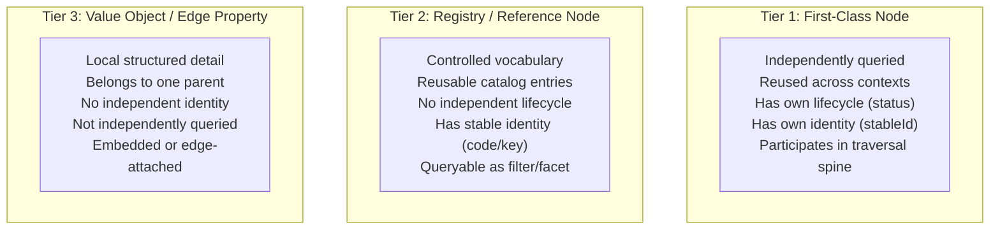
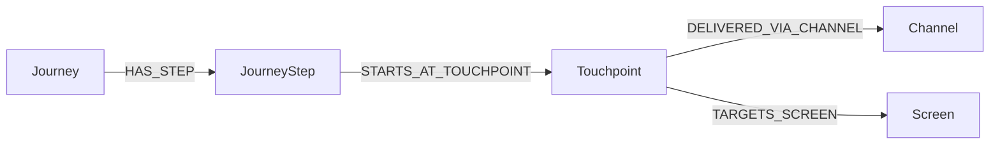
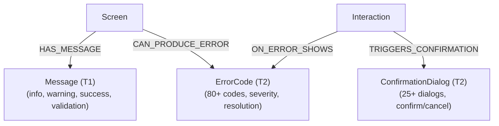
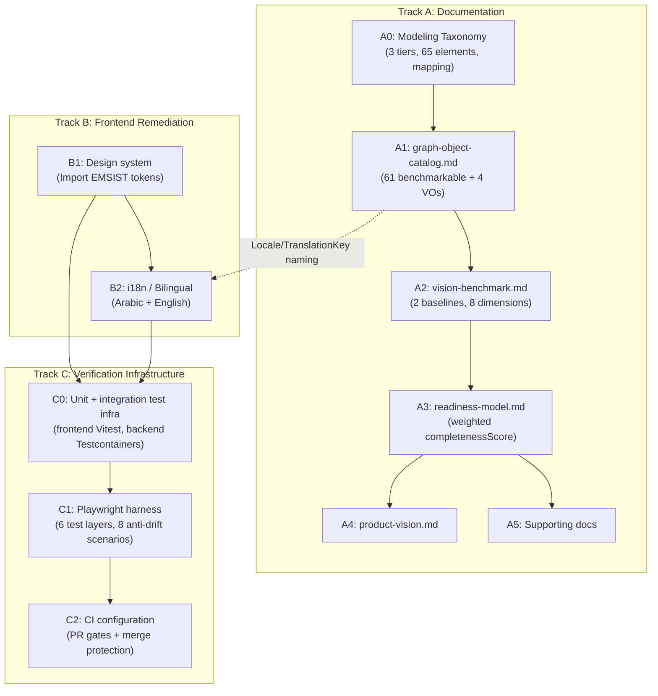
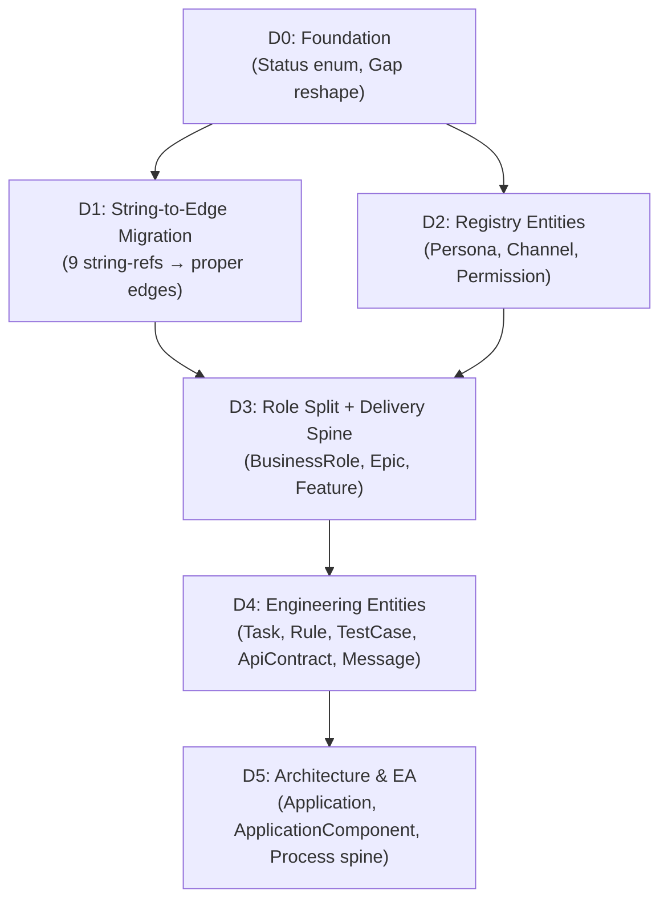
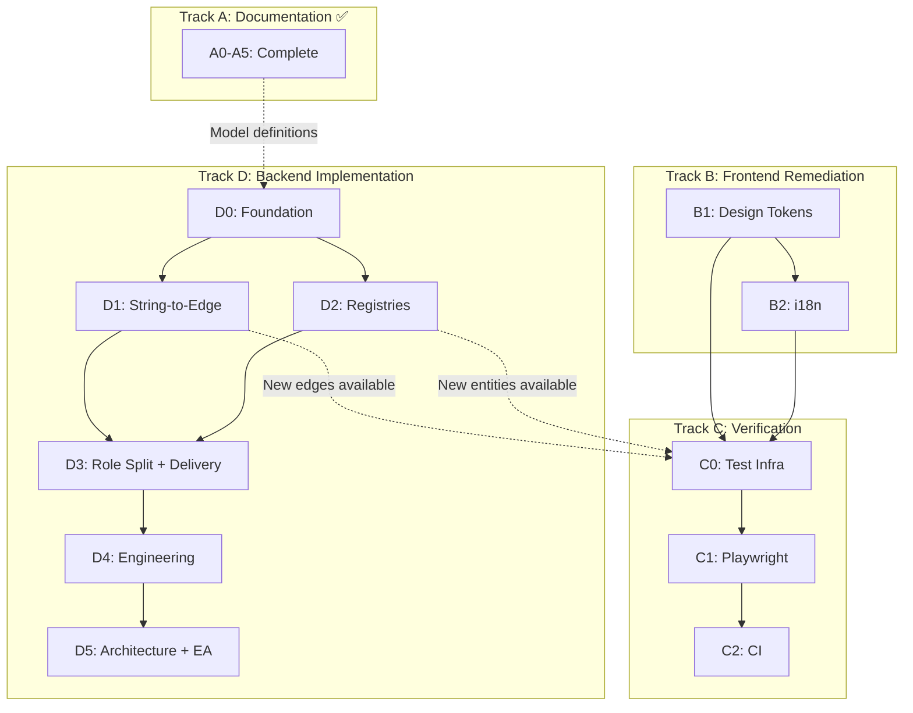

# Design Hub Plan

> **Canonical copy**: `docs/superpowers/plans/2026-03-14-design-hub-plan.md` — must be synced after edits to this file.

## Meta-Model Revision (2026-03-14) — Superseding Amendment

This amendment supersedes the node inventory, edge registry, tier counts, and category assignments in the original plan below. All downstream steps (A0–A5) must use these revised definitions.

### Frozen Decisions

| # | Decision | Resolution |
|---|----------|------------|
| 1 | BusinessDomain | T2 registry (facet, not lifecycle) |
| 2 | BusinessCapability | T1, enduring top-level concept |
| 3 | BusinessObjective | T1, stays separate (measurable outcome) |
| 4 | ProcessStep → ProcessActivity | T1, renamed for BPMN fidelity |
| 5 | ProcessGateway | T1, new — BPMN routing/branching node |
| 6 | ProcessEvent | T1, new — BPMN trigger/signal/timer node |
| 7 | Task | T1, standalone execution node |
| 8 | BacklogItem concept | Dropped — use concrete Epic/Feature/UserStory |
| 9 | Requirement (separate node) | Not needed now — backlog items carry requirement semantics |
| 10 | CRUD | Attribute on ProcessActivity (`actionType`), not a node |
| 11 | Edge verbs | REALIZES (backlog→origin), DELIVERS (story→artifact), IMPLEMENTS (task→artifact), VERIFIED_BY (story→test) |
| 12 | HAS_FLOW_NODE | Canonical process containment edge (replaces HAS_STEP on process spine; Journey HAS_STEP unchanged) |
| 13 | FLOWS_TO | Edge with properties (conditionExpression, isDefault, name) — canonical flow source of truth |
| 14 | EXPANDS_TO | Only for activityType=SUBPROCESS |
| 15 | CALLS_PROCESS | For activityType=CALL_ACTIVITY |
| 16 | Diagram support | 5 optional attributes on BusinessProcess (diagramFormat, diagramPath, diagramVersion, diagramSource, isExecutableModel) |
| 17 | Two anchors | Operational (BusinessProcess/ProcessActivity) and Delivery (UserStory/Task) |
| 18 | BPMN source | OMG BPMN 2.0.2 canonical, bpmn.io/bpmn-moddle practical, Camunda/Activiti as engine refs only |
| 19 | Technical Execution Context | Application gets workspace metadata (repoPath, repoUrl, workspaceType, defaultBuildCommand, defaultTestCommand). ApplicationComponent gets execution metadata (frameworkFamily, frameworkName, frameworkVersion, runtime, language, languageVersion, modulePath, manifestPath, buildCommand, testCommand, entrypointPath). UserStory gets executionMode. 3 new edges: DEPENDS_ON_COMPONENT, OWNS_DATA_ENTITY, ENFORCES_RULE. Total edges: 79. |

### Revised Tier Counts

| Tier | Count | Benchmarkable |
|------|-------|---------------|
| T1 (First-Class) | 52 | Yes |
| T2 (Registry) | 9 | Yes |
| T3 (Value Object) | 4 | No |
| **Total** | **65** | **61** |

### Revised T1 Categories (7)

| # | Category | Count | Objects |
|---|----------|-------|---------|
| 1 | Strategic & Governance | 8 | BusinessObjective, Decision, Assumption, Constraint, SourceReference, Finding, Bug, Risk |
| 2 | Business & Experience | 7 | Persona, BusinessRole, ValidationRole, Journey, JourneyStep, Topic, Touchpoint |
| 3 | Delivery & Execution | 4 | Epic, Feature, UserStory, Task |
| 4 | Requirement & Design | 9 | AcceptanceCriterion, Rule, ValidationRule, EdgeCase, ExceptionCase, Screen, ScreenState, Interaction, Transition |
| 5 | Engineering | 8 | ApiContract, RequestSchema, ResponseSchema, ErrorContract, DataEntity, DataField, Integration, TestCase |
| 6 | Architecture & EA | 12 | BusinessCapability, BusinessProcess, ProcessActivity, ProcessGateway, ProcessEvent, Organization, Application, ApplicationComponent, BusinessObject, InformationFlow, Deployment, InfrastructureNode |
| 7 | Cross-cutting | 4 | ExternalArtifact, OpenQuestion, Gap, Message |

### Revised T2 Registry (9)

| Family | Objects |
|--------|---------|
| Architecture & EA | BusinessDomain |
| Business & Experience | Channel |
| Requirement & Governance | Permission, ErrorCode, ConfirmationDialog |
| Engineering | Enum, Event |
| Cross-cutting / Localization | Locale, TranslationKey |

### Four-Verb Edge Model

| Family | Verb | Source Level | Targets | Count |
|--------|------|-------------|---------|-------|
| Traceability | `REALIZES` | Epic, Feature, UserStory | BusinessCapability, BusinessProcess, Journey, ProcessActivity, JourneyStep | 5 |
| Delivery | `DELIVERS` | UserStory | Screen, ApiContract, DataEntity, Rule, Message | 5 |
| Execution | `IMPLEMENTS` | Task | Screen, ApiContract, DataEntity, Rule, Message, TestCase, ApplicationComponent | 7 |
| Verification | `VERIFIED_BY` / `VERIFIES` | UserStory / TestCase | TestCase / Screen, ApiContract | 3 |

### Process Spine (BPMN-Aligned)

```
BusinessDomain(T2) -[HAS_CAPABILITY]-> BusinessCapability(T1)
BusinessCapability -[REALIZED_BY_PROCESS]-> BusinessProcess(T1)
BusinessProcess -[HAS_FLOW_NODE]-> ProcessActivity | ProcessGateway | ProcessEvent
ProcessActivity|ProcessGateway|ProcessEvent -[FLOWS_TO]-> ProcessActivity|ProcessGateway|ProcessEvent
ProcessActivity(SUBPROCESS) -[EXPANDS_TO]-> BusinessProcess
ProcessActivity(CALL_ACTIVITY) -[CALLS_PROCESS]-> BusinessProcess
ProcessEvent(BOUNDARY) -[ATTACHED_TO]-> ProcessActivity
```

### Delivery Spine

```
Epic -[HAS_FEATURE]-> Feature -[HAS_STORY]-> UserStory -[HAS_TASK]-> Task
Task -[DEPENDS_ON]-> Task
Task -[ASSIGNED_TO]-> Organization
```

### Five-Concern Story Gate

| Stage | Required Edges | Status Gate |
|-------|---------------|-------------|
| Traced | ≥1 REALIZES | Can enter IN_DEFINITION |
| Deliverable | ≥1 DELIVERS | Can enter APPROVED |
| Executable | ≥1 HAS_TASK | Can enter IN_IMPLEMENTATION |
| Verifiable | ≥1 VERIFIED_BY | Can enter VERIFIED |
| Agent-Ready | Implementation Pack resolves | ADVISORY (BLOCKING when executionMode=AGENT_FIRST) |

### Key MCRs

- **MCR-STORY-DELIVERS-001**: UserStory must have ≥1 DELIVERS edge. Family-level BLOCKING.
- **MCR-STORY-VERIFIED-001**: UserStory must have ≥1 VERIFIED_BY edge before status=VERIFIED. BLOCKING.
- **MCR-PROCESS-FLOW-001**: BusinessProcess must have ≥1 HAS_FLOW_NODE edge. BLOCKING.

### Deprecated Edges

| Edge | Replacement | Reason |
|------|-------------|--------|
| ON_SCREEN (Interaction→Screen) | HAS_INTERACTION (Screen→Interaction) | Duplicate inverse |
| IMPLEMENTS_STORY (Screen→UserStory) | DELIVERS (UserStory→Screen) | Direction reversal + new verb |
| DEPLOYS (Application→Deployment) | HOSTS + DEPLOYED_ON | Directional fix |
| DETECTED_BY_BENCHMARK (Gap→computed) | `detectedBy` property on Gap | Not a real edge |
| HAS_STEP (BusinessProcess→ProcessActivity) | HAS_FLOW_NODE | Semantic correction for BPMN alignment |

### Implementation Counts (Canonical Target)

| Status | Count |
|--------|-------|
| `[EDGE]` | 8 |
| `[STRING_REF]` | 9 |
| `[PLANNED]` | 62 |
| **Total** | **79** |

Note: CALLS_PROCESS (ProcessActivity(CALL_ACTIVITY)→BusinessProcess) is the 76th edge, added alongside EXPANDS_TO for the SUBPROCESS/CALL_ACTIVITY split. Edges 77–79 are DEPENDS_ON_COMPONENT, OWNS_DATA_ENTITY, ENFORCES_RULE (Technical Execution Context Extension).

### New Object Specifications

#### ProcessActivity (renamed from ProcessStep)

**Tier**: T1 | **Category**: Architecture & EA

| Attribute | Type | Required | Constraints |
|-----------|------|----------|-------------|
| activityId | String | Yes | Pattern: `ACT-{processId}-{seq}` |
| name | String | Yes | |
| description | String | No | |
| activityType | Enum | Yes | TASK, SUBPROCESS, CALL_ACTIVITY |
| actionType | Enum | Yes | CREATE, READ, UPDATE, DELETE, APPROVE, REJECT, ARCHIVE, SUBMIT, REVIEW, NOTIFY |
| taskNature | Enum | No | USER, SERVICE, MANUAL, RULE, SCRIPT, SEND, RECEIVE |
| orderIndex | Integer | No | Presentation hint only — FLOWS_TO is canonical |
| trigger | String | No | |
| preCondition | String | No | |
| postCondition | String | No | |
| status | Enum | Yes | Universal 10-value |

Relationships: HAS_FLOW_NODE(IN, BusinessProcess, BLOCKING), FLOWS_TO(OUT, any flow node, OPTIONAL), EXPANDS_TO(OUT, BusinessProcess, OPTIONAL — activityType=SUBPROCESS only), CALLS_PROCESS(OUT, BusinessProcess, OPTIONAL — activityType=CALL_ACTIVITY only), REALIZES(IN, UserStory, OPTIONAL)

#### ProcessGateway

**Tier**: T1 | **Category**: Architecture & EA

| Attribute | Type | Required | Constraints |
|-----------|------|----------|-------------|
| gatewayId | String | Yes | Pattern: `GW-{processId}-{seq}` |
| name | String | No | |
| gatewayType | Enum | Yes | EXCLUSIVE, PARALLEL, INCLUSIVE, EVENT_BASED, COMPLEX |
| defaultFlowTarget | String | No | References target node ID |
| status | Enum | Yes | Universal 10-value |

Relationships: HAS_FLOW_NODE(IN, BusinessProcess, BLOCKING), FLOWS_TO(OUT/IN, any flow node, BLOCKING)

#### ProcessEvent

**Tier**: T1 | **Category**: Architecture & EA

| Attribute | Type | Required | Constraints |
|-----------|------|----------|-------------|
| eventId | String | Yes | Pattern: `EVT-{processId}-{seq}` |
| name | String | No | |
| eventPosition | Enum | Yes | START, END, INTERMEDIATE_CATCH, INTERMEDIATE_THROW, BOUNDARY |
| eventTrigger | Enum | No | NONE, MESSAGE, TIMER, ERROR, SIGNAL, ESCALATION, CONDITIONAL, COMPENSATION, CANCEL, TERMINATE, LINK |
| isInterrupting | Boolean | No | Default: true |
| attachedToRef | String | No | Import-only metadata from BPMN source. Canonical semantic source is the ATTACHED_TO edge. Retained for round-trip fidelity with BPMN XML. |
| status | Enum | Yes | Universal 10-value |

Relationships: HAS_FLOW_NODE(IN, BusinessProcess, BLOCKING), FLOWS_TO(OUT, any flow node, OPTIONAL), ATTACHED_TO(OUT, ProcessActivity, OPTIONAL)

#### Task

**Tier**: T1 | **Category**: Delivery & Execution

| Attribute | Type | Required | Constraints |
|-----------|------|----------|-------------|
| taskId | String | Yes | Pattern: `TSK-{module}-{seq}` |
| title | String | Yes | Max 200 chars |
| description | String | No | |
| taskType | Enum | Yes | FRONTEND, BACKEND, API, DATA, TEST, DEVOPS, UX, DOCUMENTATION |
| status | Enum | Yes | Universal 10-value |
| priority | Enum | No | CRITICAL, HIGH, MEDIUM, LOW |
| estimate | String | No | |
| actualEffort | String | No | |
| assigneeName | String | No | Temporary until Person T1 |
| teamName | String | No | Temporary until team modeled |
| dueDate | Date | No | |

Relationships: HAS_TASK(IN, UserStory, BLOCKING), IMPLEMENTS(OUT, Screen|ApiContract|DataEntity|Rule|Message|TestCase|ApplicationComponent, OPTIONAL), DEPENDS_ON(OUT, Task, OPTIONAL), ASSIGNED_TO(OUT, Organization, OPTIONAL)

#### BusinessDomain

**Tier**: T2 | **Family**: Architecture & EA

| Attribute | Type | Required | Constraints |
|-----------|------|----------|-------------|
| domainCode | String | Yes | Pattern: `DOM-{code}` |
| name | String | Yes | |
| description | String | No | |
| activeStatus | Enum | No | ACTIVE, DEPRECATED |

Relationships: HAS_CAPABILITY(OUT, BusinessCapability, BLOCKING)

#### UserStory — New Edges and Attributes

New attributes: originType (PROCESS|EXPERIENCE|TECHNICAL|CROSS_CUTTING), natureType (FUNCTIONAL|NON_FUNCTIONAL), executionMode (HUMAN_ONLY|AGENT_ASSISTED|AGENT_FIRST, default HUMAN_ONLY)

New edges: REALIZES(OUT, ProcessActivity|JourneyStep, OPTIONAL), DELIVERS(OUT, Screen|ApiContract|DataEntity|Rule|Message, OPTIONAL), HAS_TASK(OUT, Task, OPTIONAL), VERIFIED_BY(OUT, TestCase, BLOCKING)

#### BusinessProcess — New Attributes

diagramFormat (BPMN_XML|SVG|PNG|PDF|DRAWIO), diagramPath (String), diagramVersion (String), diagramSource (OMG_BPMN|CAMUNDA|DRAWIO|MANUAL|BPMN_IO), isExecutableModel (Boolean, default false)

Critical rule: A BusinessProcess with diagramPath but no HAS_FLOW_NODE edges is scored as incomplete by the benchmark.

### Propagation Matrix (10 Files)

#### Step 0: Baseline Normalization

Before propagating changes, each file's current baseline must be established. Documents do not share a single baseline — they diverged during incremental drafting:

| File | Current T1 | Current T2 | Current Total | Current Benchmarkable | Current Edge Count | Target |
|------|-----------|-----------|--------------|----------------------|-------------------|--------|
| modeling-taxonomy.md | 48 | 8 | 60 | 56 | 73 | 52/9/65/61/79 |
| graph-object-catalog.md | 48 | 8 | 60 | 56 | 73 | 52/9/65/61/79 |
| vision-benchmark.md | 48 | 8 | 60 | 56 | — | 52/9/65/61/79 |
| implementation-readiness-graph-model.md | — | — | — | — | uses IMPLEMENTS_STORY, ON_SCREEN | replace with DELIVERS, HAS_INTERACTION |
| product-vision.md | 38 | 8 | 50 | 46 | — | 52/9/65/61/79 |
| feature-capability-map.md | — | — | — | — | — | reference 61 benchmarkable |
| architecture-blueprint.md | — | — | — | — | — | reference process spine |
| azure-jira-benchmark.md | — | — | 46 (line 66) | 46 | — | 61 benchmarkable, Task in hierarchy |
| alfabet-alignment-matrix.md | — | — | — | — | Arch&EA=10 | Arch&EA=12 |
| design-testing-strategy.md | — | — | — | — | — | add Process Flow View layer |

**Rule**: Each file edit must explicitly state what baseline it is moving FROM, not just what it is moving TO. This prevents silent count mismatches.

#### Propagation Steps

| # | File | Priority | Current Baseline | Key Changes |
|---|------|----------|-----------------|-------------|
| 1 | modeling-taxonomy.md | P0 | T1=48, T2=8, T3=4, Total=60, Bench=56, Edges=73 | Rename ProcessStep→ProcessActivity, add ProcessGateway+ProcessEvent (10→12 in Arch&EA), add Task+BusinessDomain, create Delivery & Execution category, rename Strategic & Governance, update all counts to 52/9/4/65/61, update edge count to 79, add BPMN alignment note, update traversal spines, add CALLS_PROCESS edge |
| 2 | graph-object-catalog.md | P0 | T1=48, T2=8, Total=60, Bench=56, Edges=73 | Rename ProcessStep spec, add ProcessGateway/ProcessEvent/Task/BusinessDomain specs, update UserStory (REALIZES/DELIVERS/HAS_TASK/VERIFIED_BY + originType/natureType), update BusinessProcess (diagram attrs, HAS_FLOW_NODE), update relationship registry to 79 edges, deprecate ON_SCREEN/IMPLEMENTS_STORY/DEPLOYS/DETECTED_BY_BENCHMARK/HAS_STEP(process) |
| 3 | vision-benchmark.md | P1 | T1=48, Bench=56 | Update benchmarkable 56→61, add BPMN queryability tests (process traversal, gateway routing, event triggering), add new object rows to coverage matrix, update edge count references to 79 |
| 4 | implementation-readiness-graph-model.md | P1 | Uses IMPLEMENTS_STORY, ON_SCREEN; no four-verb model; no process MCRs | **Edge replacements**: IMPLEMENTS_STORY→DELIVERS, ON_SCREEN→HAS_INTERACTION, HAS_STEP→HAS_FLOW_NODE in all Cypher queries. **New MCRs**: MCR-STORY-DELIVERS-001 (family BLOCKING), MCR-STORY-VERIFIED-001, MCR-PROCESS-FLOW-001. **Applicability matrix updates**: add rows for ProcessGateway, ProcessEvent, Task, BusinessDomain; decide which readiness flags apply (ProcessGateway/ProcessEvent likely exempt from `readiness` — they are structural, not deliverable). **Five-concern story gate**: Traced→Deliverable→Executable→Verifiable→Agent-Ready with required edge counts. **Cypher updates**: all HAS_STEP→HAS_FLOW_NODE, all IMPLEMENTS_STORY→DELIVERS, add process traversal queries. **completenessScore formula**: update edge inventory to 79 total |
| 5 | product-vision.md | P2 | T1=38, T2=8, Total=50, Bench=46 | Update counts 50→65/46→61, add BPMN process modeling to vision, update traversal spines with process spine and delivery spine, reference four-verb edge model |
| 6 | feature-capability-map.md | P2 | No process views | Update view specs to include Process Flow View, update capability-to-artifact mapping for 61 benchmarkable nodes |
| 7 | architecture-blueprint.md | P2 | No BPMN section | Add BPMN alignment section referencing OMG 2.0.2 source, update process layer with HAS_FLOW_NODE/FLOWS_TO, reference BPMN adoption profile |
| 8 | azure-jira-benchmark.md | P2 | 46 benchmarkable (line 66), no Task in mapping | Add Task to proposed mapping pattern (section 8), update hierarchy diagrams to show Task level, fix ExternalArtifact REPRESENTS targets to include Task, update benchmarkable count references to 61 |
| 9 | alfabet-alignment-matrix.md | P2 | Arch&EA=10 | Update Arch&EA count 10→12, note ProcessGateway/ProcessEvent as BPMN-sourced additions |
| 10 | design-testing-strategy.md | P2 | No process view coverage | Add Process Flow View to test layer coverage (layer 2 semantic interaction or new layer). Process traversal assertions: BusinessProcess→HAS_FLOW_NODE→activities/gateways/events→FLOWS_TO sequence. Add process view to anti-drift scenario list if P0 view |

### BPMN Adoption Profile

| Layer | BPMN Elements | Treatment | Priority |
|-------|--------------|-----------|----------|
| A: Process Essentials | Process, Task subtypes, SubProcess, SequenceFlow | Mapped to BusinessProcess, ProcessActivity, FLOWS_TO | P0 — now |
| B: Control Flow | Gateways, Events | ProcessGateway, ProcessEvent T1 nodes | P0 — now |
| C: Collaboration | Participant, Lane, MessageFlow | Participant→Organization, Lane→BusinessRole (partial) | P2 |
| D: Data | DataObject, DataStore | DataObject→BusinessObject (partial) | P2 |
| E: Advanced | Choreography, Conversation, Compensation | Out of scope | — |

---

## Context

The Design Hub is a graph-based implementation-readiness system (Neo4j + Spring Boot + Angular) that consolidates BA, UX, design, and engineering artifacts. The vision is to transform it into a **graph-based product and delivery intelligence system** where humans and coding agents can traverse from business intent down to API and data behavior.

**Current state**: 12 documentation files exist (including README index) with 26 objects in a flat table. 11 Neo4j entities are implemented in code. Many "relationships" exist only as string references (`storyRefs`, `roleKeys`, `personaIds`, `apiCalls`, `channelId`) rather than graph edges. No CI configuration, no test files (frontend or backend), and no Playwright harness exist yet.

**Goal**: Enhance documentation to deliver the 4 canonical deliverables:
1. Complete artifact list with full attribute specifications
2. Required attributes for each type (typed, constrained, with enums)
3. Valid relationships as graph edges with cardinality and traversal directions
4. Minimum completeness rules for "implementation-ready" status

**Frozen decisions**:
- **Semantic model**: Universal `status` + selective `readiness` as defined in `implementation-readiness-graph-model.md` (line 109). The benchmark measures migration cost, not model correctness.
- **Derived diagnostic**: `completenessScore` is a severity-weighted diagnostic metric, NOT part of `status` or `readiness` (line 137).
- **All diagrams**: Mermaid only.
- **Relationships**: Integrated into the catalog.

**Additional requirements**:
- **Design system alignment**: Adopt Emsist's ThinkPLUS tokens as imported canonical source.
- **Bilingual support (Arabic + English)**: All user-facing text externalized to JSON. RTL support.
- **Design testing**: Playwright as anti-drift verification layer (strategy defined in `design-testing-strategy.md`).
- **CI enforcement**: CI as merge-control layer for build, drift, design, localization, contracts, and regression (defined in `ci-quality-gates.md`).

**User-created documents already wired into the pack**:
- `docs/reference/design-testing-strategy.md` — Playwright-based design verification and anti-drift testing model
- `docs/reference/ci-quality-gates.md` — CI enforcement model for frontend and backend quality gates
- Both referenced from `README.md`, `feature-capability-map.md` (capability 8), and `architecture-blueprint.md` (layers 6-7)

**Four execution tracks**:
- **Track A**: Documentation architecture (Steps A0–A5) — ✅ Complete
- **Track B**: Frontend remediation — tokens and i18n (Steps B1–B2)
- **Track C**: Verification infrastructure — unit/integration tests, Playwright, and CI (Steps C0–C2)
- **Track D**: Backend implementation — Neo4j graph model (Steps D0–D5)
- **Dependency**: B2 must not finalize Locale/TranslationKey naming before A0/A1 defines them in the graph model.
- **Dependency**: C0 (test infra) depends on B1 (tokens) and B2 (i18n) being complete.
- **Dependency**: C1 (Playwright) depends on C0 (test infra) and B1+B2.
- **Dependency**: C2 (CI) depends on C1 (Playwright) for test harness availability.
- **Dependency**: D0 (foundation) depends on Track A documentation model being frozen.

---

# Track A: Documentation & Benchmark

> **⚠ SUPERSEDED COUNTS AND TERMS**: The A0–A5 body below was written before the Meta-Model Revision amendment (top of this file). Where this body says 50 elements / 46 benchmarkable / 38 T1 / 8 T2, the canonical counts are now **65 elements / 61 benchmarkable / 52 T1 / 9 T2 / 4 T3**. Where it says `ProcessStep`, read `ProcessActivity`. Where it says `HAS_STEP` on the process spine, read `HAS_FLOW_NODE` (Journey `HAS_STEP` is unchanged). Where it says `IMPLEMENTS_STORY`, read `DELIVERS`. Edge total is **79**, not the 73 stated below. The amendment is the canonical source; this body provides structural context only.

## Step A0: Modeling Taxonomy (Decision Framework)

**File**: `docs/reference/modeling-taxonomy.md` (new)

**Why this step exists**: Without explicit rules for what qualifies as a first-class node vs. a registry node vs. a value object, the artifact list keeps growing as we discover string-encoded relationships. A0 establishes the classification rules so A1 can produce a definitive artifact list.

### A0a. Three modeling tiers



| Criterion | Tier 1 (Node) | Tier 2 (Registry) | Tier 3 (Value Object) |
|-----------|--------------|-------------------|----------------------|
| Independently queried? | Yes | As filter/facet | No |
| Reused across >1 parent? | Yes | Yes | No |
| Has own lifecycle (status)? | Yes | No (active/deprecated at most) | No |
| Has stable identity? | Yes (pattern ID) | Yes (code or key) | No |
| Participates in traversal spine? | Yes | As filter dimension | No |
| Needs its own outbound relationships? | Yes | Rarely | No |

### A0b. Tier assignments

**Tier 1 — First-Class Nodes (38):**

| Category | Count | Objects |
|----------|-------|---------|
| Planning & Traceability | 9 | BusinessObjective, Feature, Decision, Assumption, Constraint, SourceReference, Finding, Bug, Risk |
| Business & Experience | 7 | Persona, BusinessRole, ValidationRole, Journey, JourneyStep, Topic, Touchpoint |
| Requirement & Design | 10 | UserStory, AcceptanceCriterion, Rule, ValidationRule, EdgeCase, ExceptionCase, Screen, ScreenState, Interaction, Transition |
| Engineering | 8 | ApiContract, RequestSchema, ResponseSchema, ErrorContract, DataEntity, DataField, Integration, TestCase |
| Cross-cutting | 4 | ExternalArtifact, OpenQuestion, Gap, Message |

**Tier 2 — Registry Nodes (8):**

| Object | Rationale |
|--------|-----------|
| Channel | Controlled vocabulary (web, mobile, tablet, chatbot, kiosk, API, voice). No independent lifecycle — channels exist or don't. Queryable as facet: "Which journeys are accessible via mobile?" |
| Permission | Closed registry per source (`2026-03-13-screen-flow-playground-remediation.md` line 138). Not free-form. Queryable: "Which interactions require ADMIN?" |
| ErrorCode | Registry of 80+ codes from CONSOLIDATED-STORY-INVENTORY (line 134). Reusable across screens. No lifecycle — codes are defined and referenced. |
| ConfirmationDialog | Registry of 25+ dialogs from CONSOLIDATED-STORY-INVENTORY (line 192). Reusable coded entries. |
| Enum | Controlled value sets for dropdown/select fields. Referenced by DataField. |
| Event | Named domain events. Referenced by Integration. No independent lifecycle. |
| Locale | Controlled language codes (en, ar). Required for i18n graph model. |
| TranslationKey | Registry of translatable strings linking Locale to UI elements. |

**Tier 3 — Value Objects (4):**

| Object | Rationale |
|--------|-----------|
| InteractionOutcome | Embedded in Interaction as structured outcomes (success, error, loading). Not independently queried or reused. Attached to parent Interaction. |
| Effect | Embedded in Interaction. Navigate, filter, mutation, toast outcomes. Not independently queried. |
| EntryMode | Embedded in Touchpoint. Channel + mechanism pair. Links to Channel (Tier 2) via edge but is not itself independent. |
| ContentElement | Embedded in Screen. Ordered content inventory. Not independently queried. |

**Totals: 38 + 8 + 4 = 50 model elements. Benchmarkable: 46 (Tier 1 + Tier 2).** *(Superseded — see amendment: 52 + 9 + 4 = 65, Benchmarkable: 61)*

**Tier 3 benchmark semantics (frozen decision)**:

Tier 3 value objects (InteractionOutcome, Effect, EntryMode, ContentElement) are embedded in their parent and do NOT participate in edge-walk traversal. The benchmark handles them as follows:

- **InteractionOutcome**: Queryability test #5 ("What happens if interaction I fails?") traverses the embedded `outcomes` structure on Interaction, then follows a reference (`errorCodeRef`) to ErrorCode (T2). The benchmark scores the *embedded-to-registry hop* as AMBER (partial), not GREEN (full edge walk). If future usage demands direct queryability (e.g., "Which interactions have error outcomes?"), InteractionOutcome would be promoted to Tier 1.
- **EntryMode**: Channel traversal is modeled as `Touchpoint -[DELIVERED_VIA_CHANNEL]-> Channel`. EntryMode remains embedded in Touchpoint as the structured detail carrying `mechanism` + `channelId`. The edge belongs to Touchpoint, not EntryMode. The benchmark scores the channel query as GREEN because the graph edge exists on the parent.
- **Benchmark rule**: Tier 3 objects are NOT counted in the 61 benchmarkable nodes *(was 46 pre-amendment)*. Their attributes are scored as part of the parent object's attribute depth. If a Tier 3 object's embedded structure blocks a queryability test from scoring GREEN, that test scores AMBER and the promotion question is flagged in gap recommendations.

### A0c. Current-to-target entity mapping

The current 11 implemented entities do not map 1:1 to the target model. This table resolves the ambiguity:

| Current Code Entity | Target Model Object(s) | Mapping Type | Notes |
|--------------------|----------------------|-------------|-------|
| `Role.java` | BusinessRole (T1), ValidationRole (T1) | **Split** | Current Role is a single entity. Target splits by responsibility type. Benchmark must not score Role as "missing" — it's implemented under a different shape. |
| `Gap.java` | Finding (T1), Gap (T1) | **Overlapping — frozen decision below** | See Gap vs Finding resolution. |

**Gap vs Finding resolution (frozen decision)**:

Gap and Finding are **separate Tier 1 nodes** with distinct purposes:

- **Finding** (`findingId`): A review observation, issue, or concern discovered during analysis. Broad scope — can affect any artifact. Has `findingType` (gap, issue, observation, concern), `severity`, `summary`, `status`, `sourceRefs`. Relationships: `AFFECTS_SCREEN`, `AFFECTS_STORY`, `AFFECTS_API`.
- **Gap** (`gapId`): A design-specific incompleteness — a missing artifact, missing relationship, or missing attribute that blocks implementation readiness. Has `gapType` (missing_artifact, missing_relationship, missing_attribute, missing_rule), `severity`, `description`, `status`, `sourceRefs`, `detectedBy` (property, not edge). Relationships: `BLOCKS_ARTIFACT`. *(Note: `DETECTED_BY_BENCHMARK` was deprecated — replaced by `detectedBy` property per deprecated-edge table.)*

Gap is NOT a subtype of Finding. A Finding is an observation from human review; a Gap is a structural incompleteness detectable by the benchmark engine. They can co-exist on the same artifact (e.g., a Screen can have a Finding from UX review AND a Gap from missing story edge).

**Benchmark scoring**: Both are counted as separate Tier 1 nodes in the 38 count. `Gap.java` maps to Gap (T1) with reshape required (current `type`/`severity`/`description` → target `gapType`/`severity`/`description` + relationships). Finding is `[PLANNED]` — no current code entity.
| `Screen.java` | Screen (T1) | **Direct** | But with attribute depth gap (3-status model vs universal status + readiness) and string-encoded relationships. |
| `Journey.java` | Journey (T1) | **Direct** | Same depth/status gaps as Screen. |
| `JourneyStep.java` | JourneyStep (T1) | **Direct** | Missing screen/interaction/touchpoint edges. |
| `UserStory.java` | UserStory (T1) | **Direct** | Minimal — 5 fields vs 8+ target. |
| `Interaction.java` | Interaction (T1) | **Direct** | `permission` as string, `apiCalls` as strings, no InteractionOutcome. |
| `Touchpoint.java` | Touchpoint (T1) | **Direct** | `channelId` as string in embedded EntryMode. |
| `EntryMode.java` | EntryMode (T3) | **Direct** | Value object, but `channelId` needs edge to Channel (T2). |
| `ContentElement.java` | ContentElement (T3) | **Direct** | Value object. |
| `Effect.java` | Effect (T3) | **Direct** | Value object. |

**Benchmark rule**: An entity with a different shape (e.g., Role) is scored as `[IMPLEMENTED — reshape required]`, not `[PLANNED]`.

### A0d. String-to-edge migration map

| Current String Field | Entity | Target Node (Tier) | New Relationship Edge | Canonical Direction |
|---------------------|--------|-------------------|----------------------|-------------------|
| `storyRefs: List<String>` | Screen.java (line 42) | UserStory (T1) | `DELIVERS` *(amended from IMPLEMENTS_STORY; direction reversed)* | UserStory -> Screen |
| `roleKeys: List<String>` | Screen.java, Interaction.java | BusinessRole (T1) | `ACCESSIBLE_BY_ROLE` | Screen -> BusinessRole |
| `personaIds: List<String>` | Screen.java, Interaction.java, Touchpoint.java | Persona (T1) | `USED_BY_PERSONA` | Screen -> Persona |
| `permission: String` | Interaction.java (line 25) | Permission (T2) | `REQUIRES_PERMISSION` | Interaction -> Permission |
| `channelId: String` | EntryMode (embedded in Touchpoint) | Channel (T2) | `DELIVERED_VIA_CHANNEL` | Touchpoint -> Channel (through EntryMode) |
| `apiCalls: List<String>` | Interaction.java (line 25) | ApiContract (T1) | `CALLS_API` | Interaction -> ApiContract |
| `journeyStepRefs: List<String>` | Touchpoint model (frontend) | JourneyStep (T1) | `STARTS_AT_TOUCHPOINT` *(canonical: JourneyStep → Touchpoint)* | JourneyStep -> Touchpoint |
| `personaId: String` | Journey.java (line 24) | Persona (T1) | `PERFORMED_BY_PERSONA` | Journey -> Persona |

**Benchmark rule**: `[EDGE]` = Neo4j `@Relationship`. `[STRING_REF]` = string/array. `[PLANNED]` = neither exists.

### A0e. Touchpoint–JourneyStep edge direction

**Canonical direction**: `JourneyStep -[STARTS_AT_TOUCHPOINT]-> Touchpoint`

Rationale: A journey step defines the entry context; a touchpoint is a reusable entry mechanism. The step "uses" the touchpoint, not the other way around.

Reverse traversal (`Touchpoint -> JourneyStep`) is handled by bidirectional Cypher query, not a separate named edge.



### A0f. Message decomposition

`Message` (Tier 1) retains as the general type for info, warning, success, and validation messages. Specialized registries are Tier 2:

- **ErrorCode** (T2): 80+ codes, with `code`, `severity`, `messageText`, `triggerCondition`, `resolutionHint`
- **ConfirmationDialog** (T2): 25+ dialogs, with `dialogId`, `triggerAction`, `confirmLabel`, `cancelLabel`, `consequenceText`



---

## Step A1: Expand `graph-object-catalog.md` (Foundation)

**File**: `docs/reference/graph-object-catalog.md`

**What to do**: Transform the flat 26-row table into a full specification covering all 65 model elements (52 T1 + 9 T2 + 4 T3) *(amended from 50)*, using the taxonomy from A0.

### A1a. Document structure

- **Modeling Taxonomy Summary** (link to `modeling-taxonomy.md`, repeat tier rules)
- **Object Design Rules** (keep existing, add tier classification rule)
- **Artifact Classification Diagram** (Mermaid: tiers and categories)
- **Per-object specification sections** (50 sections, grouped by tier then category)
- **Current-to-Target Mapping Table** (from A0c)
- **Relationship Registry** (full table)
- **Relationship Spine Diagrams** (Mermaid)
- **String-to-Edge Migration Table** (from A0d, scored)

### A1b. Per-object specification format

```markdown
### ObjectName

**Tier**: 1 (First-Class Node) | 2 (Registry) | 3 (Value Object)
**Category**: Planning | Experience | Requirement | Engineering | Cross-cutting
**Purpose**: One-liner
**Implementation Status**: [IMPLEMENTED] path | [IMPLEMENTED — reshape required] | [STRING_REF — migration required] | [PLANNED]

#### Attributes

| Attribute | Type | Required | Description | Constraints |
|-----------|------|----------|-------------|-------------|

#### Relationships (Graph Edges)

| Relationship | Target | Cardinality | Required | Severity | Implementation |
|-------------|--------|-------------|----------|----------|----------------|
```

**Severity** column (new): `BLOCKING` or `OPTIONAL` — feeds weighted completenessScore in A3.

### A1c. Relationship Registry

| Relationship | Source | Target | Cardinality | Required | Severity | Reverse Query | Implementation |
|-------------|--------|--------|-------------|----------|----------|---------------|----------------|

Implementation values: `[EDGE]`, `[STRING_REF]`, `[PLANNED]`

### A1d. Mermaid diagrams

1. **Tier classification** (3 tiers with their objects)
2. **Primary traversal spine** including touchpoint direction fix:
   `Objective -> Persona -> Journey -> JourneyStep -> Touchpoint -> Channel`
   `JourneyStep -> Screen -> Interaction -> ApiContract -> DataEntity`
   `Interaction -> Permission (T2)`, `Interaction -> ConfirmationDialog (T2)`
   `Screen -> Message`, `Screen -> ErrorCode (T2)`
3. **Reverse traversal** (Bug/Finding/ErrorCode -> Screen -> Step -> Journey -> Persona -> Objective)
4. **String-to-edge migration** (current strings vs target edges, color-coded)
5. **Current-to-target entity mapping** (11 current -> target shapes)

---

## Step A2: Create `vision-benchmark.md` (Holistic Validation)

**File**: `docs/reference/vision-benchmark.md`

**What to do**: Score the current state across 8 dimensions in two baselines.

### A2a. Two baselines

| Baseline | Scope | What it scores |
|----------|-------|---------------|
| **Domain benchmark** | EMSIST source completeness and traceability | Personas, journeys, screens, interactions, channels, permissions, outcomes, messages, error codes, confirmation dialogs, rules, validations, API contracts, data entities, test cases |
| **Delivery-tool benchmark** | Azure DevOps and Jira interoperability | External work-item fields, dependencies, hierarchy, sync metadata, ExternalArtifact links |

The domain benchmark uses EMSIST source documents as ground truth. The delivery-tool benchmark uses Azure DevOps/Jira field analysis from `azure-jira-benchmark.md`.

**These are scored separately** because they measure different things:
- Domain benchmark tells you if Channel, JourneyStep, ConfirmationDialog, InteractionOutcome are modeled correctly
- Delivery-tool benchmark tells you if work items, dependencies, and sync metadata are captured

### A2b. Eight benchmark dimensions

| # | Dimension | Baseline | What it measures |
|---|-----------|----------|------------------|
| 1 | Documentation completeness | Domain | Are all 61 benchmarkable nodes *(amended from 46)* specified with typed attributes? |
| 2 | Implementation completeness | Domain | Do Neo4j entities exist? (includes reshape detection via A0c mapping) |
| 3 | Attribute depth | Domain | Code attributes / target spec attributes per entity |
| 4 | Relationship coverage | Domain | [EDGE] count / total target relationships per entity |
| 5 | **Queryability & traversability** | Domain | Can key queries execute via edge walks, not string parsing? |
| 6 | Source traceability | Domain | Does each artifact link to SourceReference? |
| 7 | **Delivery-tool interoperability** | Delivery | Are ExternalArtifact links modeled for Azure DevOps/Jira sync? |
| 8 | UX implementation support | Both | Do frontend models and API responses expose what the UI needs? |

### A2c. Queryability test suite

Each query scored GREEN (full edge walk) / AMBER (partial — some edges, some string refs) / RED (string parsing or entity missing):

| # | Query | Path | Current Status |
|---|-------|------|---------------|
| 1 | Which journeys can persona P do? | `Persona <-[PERFORMED_BY_PERSONA]- Journey` | [STRING_REF] `personaId` string on Journey |
| 2 | Which channels serve journey J? | `Journey -[HAS_STEP]-> JourneyStep -[STARTS_AT_TOUCHPOINT]-> Touchpoint -[DELIVERED_VIA_CHANNEL]-> Channel` | [STRING_REF] `channelId` in EntryMode |
| 3 | Which screens can channel C reach? | `Channel <-[DELIVERED_VIA_CHANNEL]- Touchpoint -[TARGETS_SCREEN]-> Screen` | [STRING_REF] strings |
| 4 | Which permissions does screen S require? | `Screen -[HAS_INTERACTION]-> Interaction -[REQUIRES_PERMISSION]-> Permission` | [STRING_REF] `permission` string |
| 5 | What happens if interaction I fails? | `Interaction.outcomes[error]` (T3 value object) `.errorCodeRef -> ErrorCode` (T2) | [PLANNED] no outcome or error code |
| 6 | Which stories deliver screen S? | `UserStory -[DELIVERS]-> Screen` *(amended: reversed direction, IMPLEMENTS_STORY→DELIVERS)* | [STRING_REF] `storyRefs` array |
| 7 | Which bugs affect screen S? | `Bug -[AFFECTS]-> Screen` | [PLANNED] no Bug entity |
| 8 | Where did artifact A come from? | `A -[HAS_SOURCE]-> SourceReference` | [PLANNED] no SourceReference entity |
| 9 | Which Jira tickets track story S? | `ExternalArtifact -[REPRESENTS]-> UserStory` | [PLANNED] no ExternalArtifact entity |
| 10 | Which confirmation dialogs can interaction I trigger? | `Interaction -[TRIGGERS_CONFIRMATION]-> ConfirmationDialog` | [PLANNED] no ConfirmationDialog |

**Note on query 5**: InteractionOutcome is Tier 3 (value object), so the query traverses an embedded object, not a graph edge. The benchmark tests whether the embedded structure provides sufficient queryability or if promotion to Tier 1 is needed.

### A2d. Artifact Type Coverage Matrix

| Artifact Type | Tier | Documented | Attr Depth | Implemented | Mapping (from A0c) | Rel Coverage (edge/string/planned) | Queryable | completenessScore |
|--------------|------|-----------|------------|-------------|--------------------|------------------------------------|-----------|-------------------|

### A2e. Status Model Migration Cost

(Same as before — measures 3-enum to universal status effort)

### A2f. String-to-Edge Migration Cost

(Expanded from A0d with effort estimates and affected query counts)

### A2g. Gap Prioritization + Recommendations

---

## Step A3: Refine `implementation-readiness-graph-model.md` (Governance)

**File**: `docs/reference/implementation-readiness-graph-model.md`

### A3a. Severity-weighted `completenessScore`

**Critical correction**: Raw percentage distorts reality. A missing BLOCKING edge (e.g., Screen -> UserStory) should hurt more than a missing OPTIONAL link.

**Formula**:
```
completenessScore = (
    sum(satisfied_blocking_edges * 3) +
    sum(satisfied_optional_edges * 1) +
    sum(populated_required_attrs * 2) +
    sum(populated_optional_attrs * 1)
) / (
    sum(total_blocking_edges * 3) +
    sum(total_optional_edges * 1) +
    sum(total_required_attrs * 2) +
    sum(total_optional_attrs * 1)
) * 100
```

- Weights: BLOCKING edge = 3x, required attribute = 2x, optional = 1x
- Only `[EDGE]` counts as "satisfied" — `[STRING_REF]` counts as 0
- Threshold: RED (<40%), AMBER (40-79%), GREEN (>=80%)
- Explicitly documented: "completenessScore is a severity-weighted diagnostic. It does not replace or contribute to `status` or `readiness` flags."

### A3b. Formal completeness rules (edge-aware)

| Rule ID | Artifact | Condition | Severity | Edge Required |
|---------|----------|-----------|----------|---------------|
| MCR-JOURNEY-001 | Journey | Has >= 1 Persona via `PERFORMED_BY_PERSONA` edge | BLOCKING | Yes |
| MCR-JOURNEY-002 | Journey | Has >= 1 JourneyStep via `HAS_STEP` edge | BLOCKING | Yes |
| MCR-SCREEN-001 | Screen | Has >= 1 UserStory via `DELIVERS` edge *(amended from IMPLEMENTS_STORY)* (not `storyRefs` string) | BLOCKING | Yes |
| MCR-SCREEN-002 | Screen | Has >= 1 Interaction via `HAS_INTERACTION` edge | BLOCKING | Yes |
| MCR-INT-001 | Interaction | Has Permission via `REQUIRES_PERMISSION` edge (not `permission` string) | BLOCKING | Yes |
| MCR-STEP-001 | JourneyStep | Has Screen via `USES_SCREEN` edge | BLOCKING | Yes |
| MCR-TP-001 | Touchpoint | Has >= 1 Channel via `DELIVERED_VIA_CHANNEL` edge | BLOCKING | Yes |

### A3c. Readiness flag dependencies

(Same as before — Mermaid diagram of flag dependency chain)

### A3d. Sample Cypher queries

```cypher
-- Traversal: Persona -> Journey -> Step -> Touchpoint -> Channel
-- NOTE: HAS_STEP is correct here (Journey spine, not process spine)
MATCH (p:Persona)<-[:PERFORMED_BY_PERSONA]-(j:Journey)-[:HAS_STEP]->(s:JourneyStep)
      -[:STARTS_AT_TOUCHPOINT]->(tp:Touchpoint)-[:DELIVERED_VIA_CHANNEL]->(ch:Channel)
WHERE p.personaId = $personaId
RETURN ch.name, count(DISTINCT j) AS journeyCount

-- Traversal: Screen -> Interaction -> Permission
MATCH (scr:Screen)-[:HAS_INTERACTION]->(i:Interaction)-[:REQUIRES_PERMISSION]->(perm:Permission)
RETURN scr.surfaceId, collect(DISTINCT perm.permissionKey) AS requiredPermissions

-- Weighted completenessScore for a Screen (amended: DELIVERS replaces IMPLEMENTS_STORY, direction reversed)
MATCH (scr:Screen) WHERE scr.surfaceId = $id
OPTIONAL MATCH (us:UserStory)-[:DELIVERS]->(scr)
OPTIONAL MATCH (scr)-[:HAS_INTERACTION]->(i:Interaction)
OPTIONAL MATCH (scr)-[:HAS_MESSAGE]->(m:Message)
WITH scr,
     CASE WHEN count(us) > 0 THEN 3 ELSE 0 END AS storyScore,
     CASE WHEN count(i) > 0 THEN 3 ELSE 0 END AS interactionScore,
     CASE WHEN count(m) > 0 THEN 1 ELSE 0 END AS messageScore
RETURN scr.surfaceId,
       (storyScore + interactionScore + messageScore) * 100.0 / (3 + 3 + 1) AS completenessScore
```

---

## Step A4: Enhance `product-vision.md` (Alignment)

**File**: `docs/reference/product-vision.md`

- Update Vision section with the expanded vision statement
- Add the traversal spine including Channel (T2), Permission (T2), ErrorCode (T2), ConfirmationDialog (T2)
- Reference the 3-tier taxonomy from A0
- Update north-star queries to match the A2 queryability test suite
- Reference 61 benchmarkable nodes (52 T1 + 9 T2) *(amended from 46)*
- **State that the product supports multiple named views**, each anchored on a different traversal entry point from the graph model
- Reference the canonical view list (frozen below)

### Frozen: Canonical View List

**P0 — Core views (required for 1.0):**

| View | Primary Axis | Entry Point |
|------|-------------|-------------|
| Screen Flow View | Screen → transitions, interactions, states | Screen node |
| Persona View | Persona → Journeys, role context, channel reach | Persona node |
| Journey View | Journey → Steps → Screens → Touchpoints | Journey node |
| Channel View | Channel → Touchpoints → Screens, coverage gaps | Channel (T2) node |
| Delivery View | Stories by status/feature/module, linked screens/APIs, readiness gates | UserStory node |

**P1 — Intelligence views (required for 1.x):**

| View | Primary Axis | Entry Point |
|------|-------------|-------------|
| Traceability View | Objective → Feature → Story → Screen → API spine | BusinessObjective node |
| Benchmark View | Attribute/relationship parity, queryability scores | Computed diagnostic |
| Verification View | Test evidence, visual baselines, token compliance | Computed diagnostic |

**Naming decision:** Avoid plain "Backlog View" — it clashes with the thesis in `product-vision.md` (line 15: "Design Hub should not be another backlog viewer"). Use "Delivery View" and define it as graph-backed delivery intelligence, not a work-item list.

---

## Step A5: Enhance supporting documents

### A5a. `feature-capability-map.md`

- Add capability-to-artifact mapping referencing the 61 benchmarkable nodes *(amended from 46)*
- Update delivery sequence with benchmark status tags
- Convert text diagrams to Mermaid
- **Add View Catalog** — expand the Product Surfaces section into a full view taxonomy. Each named view must specify:

| View | Required Specification |
|------|----------------------|
| Screen Flow View | Screen transitions, interaction overlay, module grouping, status filter |
| Journey View | Persona → Journey → Steps → Screens, topic grouping, step drill-down |
| Channel View | Channel → Touchpoints → Screens, module/persona grouping, coverage gaps |
| Delivery View | Stories by status/feature/module, linked screens/APIs, readiness gates |
| Persona View | Persona → Journeys, role context, channel reach, story coverage |
| Benchmark View | Attribute/relationship parity, queryability scores, drift indicators |
| Verification View | Test evidence, visual baselines, token compliance, i18n status |
| Traceability View | Objective → Feature → Story → Screen → API spine, gap detection |

Per-view specification format:
- Purpose and primary axis
- Primary objects shown and default traversal query (Cypher)
- Grouping, filter, and sort options
- Selection behavior and detail panel behavior
- Required linked artifacts and empty/loading/error states
- Readiness/drift indicators
- Playwright test coverage expectations (cross-ref to C1)

**Rationale:** The graph model (A0-A2) defines traversal capabilities, but the plan does not yet define which traversals are first-class UI views. Without this, implementation drift will reappear at the presentation layer even if the graph is correct.

### A5b. `architecture-blueprint.md`

- Add implementation evidence mapping (layer -> actual code files)
- Add Mermaid component diagram showing current vs target
- Add i18n architecture section
- Reference the string-to-edge migration map from A0d
- Reference current-to-target entity mapping from A0c
- Tag each capability as [IMPLEMENTED] / [RESHAPE] / [STRING_REF] / [PLANNED]

### A5c. `azure-jira-benchmark.md`

- Score delivery-tool interoperability dimension from A2 (baseline 2)
- Ensure external artifact mapping references the expanded catalog
- Convert text diagrams to Mermaid

---

# Track B: Frontend Remediation

**Dependency on Track A**: B2 must not finalize Locale/TranslationKey naming or JSON structure until A0/A1 defines them in the graph model. B1 (design tokens) has no Track A dependency.

## Step B1: Design System Alignment (Theming & Branding)

(Unchanged from previous plan — import EMSIST tokens, not copy. Replace hardcoded hex in 6 files.)

**Key files**: `styles.scss`, `default-preset.ts`, `default-preset.scss`, `design-hub.page.ts`, `flow-canvas.component.ts`, `inventory-panel.component.ts`

**Token mapping**: `--tp-primary`, `--tp-primary-dark`, `--tp-primary-light`, `--tp-danger`, `--tp-warning`, `--tp-surface`, `--tp-text`, `--tp-white`

**Documentation ownership**: `design-system-contract.md` is created in **Track A (A5)** as a documentation deliverable, NOT in Track B1. Track B1 only performs the frontend code changes (token import, hex replacement). B1 references the contract doc but does not own or create it.

---

## Step B2: Bilingual Support — Arabic & English (i18n)

(Unchanged from previous plan — ngx-translate, en.json + ar.json, RTL support, string extraction, language switcher.)

**Dependency**: Locale and TranslationKey are Tier 2 registry nodes defined in A0/A1. B2 must align its JSON key structure and locale codes with those definitions. If A0/A1 completes first, B2 adopts the naming. If B2 starts before A1, use provisional names (`en`, `ar`) and reconcile after A1.

**Key files**: `package.json`, `app.config.ts`, `app.component.ts`, all component templates, `en.json`, `ar.json`

---

# Track C: Verification Infrastructure

**Dependencies**: C1 depends on B1+B2 (tokens and i18n must exist for meaningful visual/locale tests). C2 depends on C1 (CI gates reference Playwright test suites).

**User-created strategy documents**: `design-testing-strategy.md` and `ci-quality-gates.md` already define WHAT to test and WHAT to gate. Track C implements the harness and configuration.

## Step C0: Frontend and Backend Test Infrastructure

**Why this step exists**: C1 (Playwright) and C2 (CI) both expect unit and integration tests to exist. Today there are none — no frontend test runner in `package.json`, no backend test files under `backend/src/test`. Without C0, CI gates referencing unit and integration tests would be hollow.

### C0a. Frontend unit test stack

- Confirm Vitest (or Jest) is configured in `frontend/package.json` — currently missing
- Add test runner devDependencies and `test` script to `package.json`
- Create initial unit tests for:
  - State service filtering and selection logic
  - API adaptation and DTO mapping
  - Any localization utilities added in B2
  - Token/theme helper behavior added in B1

### C0b. Backend unit and integration tests

- `spring-boot-starter-test` already exists in `pom.xml` but no test sources exist under `backend/src/test`
- Create initial unit tests for:
  - DTO mapping and response construction
  - Stats aggregation
  - Service-layer filters and projections
  - Status enum migration logic (from D0)
- Create initial integration tests for:
  - Neo4j entity persistence (Testcontainers-backed)
  - Relationship creation and query correctness
  - Graph traversal expectations for implemented edges
  - API contract regression (response shape assertions for key endpoints)

### C0c. Seed validation tests

- Assert seed counts match expectations
- Assert referenced IDs exist
- Assert required relationships are created
- Assert no orphan journey steps, touchpoints, or interactions

---

## Step C1: Playwright Harness and Initial Test Suites

**Strategy doc**: `docs/reference/design-testing-strategy.md` (lines 133-154 define structure)

**What to do**: Install Playwright, create the test directory structure, and implement initial test suites covering the 6 test layers defined in the strategy.

### C1a. Installation and configuration

- Add `@playwright/test` to `frontend/package.json` devDependencies
- Create `frontend/playwright.config.ts` with:
  - `testDir: './tests'`
  - `forbidOnly: !!process.env.CI`
  - retries only on CI
  - trace on first retry
  - `webServer` entry for Angular dev server
  - Chromium project (minimum), desktop + mobile viewports
  - Visual comparison options (threshold, maxDiffPixels)

### C1b. Test directory structure

```text
frontend/tests/
  smoke/          → boot, routes, empty states, API-available states
  graph/          → object selection, relation traversal, filter behavior
  visual/         → screenshot baselines (full page + component regions)
  i18n/           → English, Arabic, RTL assertions
  fixtures/       → seeded scenarios and API mocks
  styles/         → screenshot stabilization CSS
```

### C1c. Initial test suites (per strategy layer)

| Layer | Test file(s) | Covers |
|-------|-------------|--------|
| 1. Contract/route smoke | `smoke/shell.spec.ts` | App shell, sidebar, canvas, detail panel render; backend unavailable state |
| 2. Semantic interaction | `graph/screen-selection.spec.ts`, `graph/persona-journey.spec.ts` | Screen detail updates, persona→journey→step traversal |
| 3. Visual baselines | `visual/shell.spec.ts`, `visual/detail-panel.spec.ts` | Full page + component region screenshots at desktop + mobile |
| 4. Token compliance | `styles/token-compliance.spec.ts` | Critical elements resolve `var(--tp-*)` values, no hardcoded hex |
| 5. Localization/RTL | `i18n/locale-switch.spec.ts`, `i18n/rtl-layout.spec.ts` | Language switch, `dir="rtl"`, no clipping/overlap |
| 6. Graph-UI drift | `graph/linked-objects.spec.ts` | Screen detail renders linked stories/roles, touchpoint renders channel |

### C1e. Canonical view semantic tests (P0 views)

At least one Playwright semantic test per P0 canonical view (frozen in A4):

| View | Test file | Minimum assertions |
|------|-----------|-------------------|
| Screen Flow View | `graph/screen-flow-view.spec.ts` | Screen transitions render, interaction overlay works, module grouping filters |
| Persona View | `graph/persona-view.spec.ts` | Persona selection reveals journeys, role context visible, channel reach accessible |
| Journey View | `graph/journey-view.spec.ts` | Journey → Steps → Screens traversal works, step drill-down, step ordering |
| Channel View | `graph/channel-view.spec.ts` | Channel selection reveals touchpoints and screens, coverage gaps surfaced |
| Delivery View | `graph/delivery-view.spec.ts` | Stories grouped by status, linked screens/APIs visible, readiness gates shown |

### C1d. Anti-drift scenarios (from strategy lines 196-208)

The 8 critical anti-drift scenarios from the strategy must all have corresponding test coverage:
1. Shell three-column layout renders
2. Screen selection updates detail panel
3. Screen detail renders linked roles and stories
4. Journey/touchpoint views render linked relationships
5. Empty and backend-unavailable states show correct messages
6. English and Arabic render without clipping
7. Key views match visual baselines
8. Token-backed elements render approved theme values

---

## Step C2: CI Configuration

**Strategy doc**: `docs/reference/ci-quality-gates.md` (lines 1-361 define the full gate model)

**What to do**: Create CI workflow configuration implementing the gates defined in the strategy document.

### C2a. GitHub Actions workflow (or equivalent)

Create `.github/workflows/pr-validation.yml` implementing the minimal required PR checks:
- Frontend: `npm ci` + `npm run build` + unit tests + Playwright semantic smoke + token compliance + i18n structure check
- Backend: `mvn compile` + unit tests + integration tests (Testcontainers)
- Cross-cutting: secret scan + dependency scan

### C2b. Merge protection workflow

Create `.github/workflows/merge-protection.yml` for expanded checks:
- Full Playwright semantic + visual suite
- Backend contract regression
- Benchmark integrity
- Seed validation

### C2c. Branch protection configuration

Document required branch protection settings:
- Protected main branch
- Required passing checks before merge
- Required review approvals
- No direct commits

---

# Execution Order & Dependencies



**Track A**: A0 -> A1 -> A2 -> A3 -> (A4 + A5 in parallel)
**Track B**: B1 -> B2
**Track C**: C0 -> C1 -> C2
**Cross-track dependencies**:
- A1 informs B2 naming (dashed — B2 can start with provisional names)
- B1 + B2 must complete before C0 (tokens and i18n must exist for meaningful tests)
- C0 (unit/integration tests) must complete before C1 (Playwright)
- C1 must complete before C2 (CI gates reference all test suites)

---

# Verification

### Track A

| # | Check | Pass Criteria |
|---|-------|--------------|
| 1 | Taxonomy doc | `modeling-taxonomy.md` defines 3 tiers with rules + current-to-target mapping |
| 2 | Tier counts | 52 T1 + 9 T2 + 4 T3 = 65 elements in catalog *(amended from 50)* |
| 3 | Current-to-target | All 11 current entities mapped (including Role->split, Gap->overlap) |
| 4 | Mermaid diagrams | All diagrams in Mermaid (no ASCII art) |
| 5 | EBD compliance | Every [IMPLEMENTED] tag has file path |
| 6 | Attribute depth | Every per-object spec has typed attributes with constraints |
| 7 | Relationship quality | Every relationship tagged [EDGE], [STRING_REF], or [PLANNED] + severity |
| 8 | Queryability suite | All 10 traversal queries scored GREEN/AMBER/RED |
| 9 | Two baselines | Domain benchmark and delivery-tool benchmark scored separately |
| 10 | Weighted scoring | `completenessScore` uses BLOCKING=3x, required=2x, optional=1x weights |
| 11 | Semantic integrity | `completenessScore` documented as diagnostic, not readiness |
| 12 | Edge direction | `JourneyStep -[STARTS_AT_TOUCHPOINT]-> Touchpoint` is canonical throughout |
| 13 | Cross-references | No orphan references between documents |

### Track B

| # | Check | Pass Criteria |
|---|-------|--------------|
| 14 | Zero hardcoded colors | Component files use `var(--tp-*)` only; hex only in token source |
| 15 | Token source | `styles.scss` imports from single canonical token file |
| 16 | Zero hardcoded user-facing text | Inline templates use `\| translate` pipe for visible labels/messages |
| 17 | Translation files | Both `en.json` and `ar.json` exist with identical key structure |
| 18 | RTL rendering | Arabic triggers `dir="rtl"` with CSS logical properties |
| 19 | Locale alignment | JSON locale codes match Locale registry defined in A0/A1 |

### Track C

| # | Check | Pass Criteria |
|---|-------|--------------|
| 20 | Frontend test runner | Vitest (or equivalent) configured in `package.json` with `test` script |
| 21 | Frontend unit tests exist | State service, DTO mapping, localization utility tests pass |
| 22 | Backend unit tests exist | DTO mapping, stats aggregation, service filter tests pass under `backend/src/test` |
| 23 | Backend integration tests | Neo4j persistence + relationship + traversal tests pass with Testcontainers |
| 24 | Seed validation tests | Seed counts, referenced IDs, required relationships, no orphans |
| 25 | Playwright installed | `@playwright/test` in devDependencies, `playwright.config.ts` exists |
| 26 | Test directory structure | 6 directories: `smoke/`, `graph/`, `visual/`, `i18n/`, `fixtures/`, `styles/` |
| 27 | Smoke tests pass | Shell renders, routes work, backend-unavailable state handled |
| 28 | Semantic tests pass | Screen selection, persona→journey traversal work |
| 29 | Visual baselines exist | Screenshots for shell, detail panel at desktop + mobile viewports |
| 30 | Token compliance tests | Critical elements resolve `var(--tp-*)` values |
| 31 | i18n/RTL tests | Language switch works, `dir="rtl"` applied, no layout breakage |
| 32 | Graph-UI drift tests | Linked stories/roles render in detail panel |
| 33 | 8 anti-drift scenarios | All 8 critical scenarios from `design-testing-strategy.md` covered |
| 34 | CI PR gate | GitHub Actions workflow runs build + unit + semantic smoke + compliance |
| 35 | CI merge protection | Visual regression + contract regression + benchmark integrity enforced |
| 36 | Branch protection | Main branch protected, required checks before merge |

---

# Critical Files

### Track A (Documentation — create/modify)

| File | Action | Priority |
|------|--------|----------|
| `docs/reference/modeling-taxonomy.md` | **Create new** (tiers, mapping, string-to-edge, edge direction) | P0 |
| `docs/reference/graph-object-catalog.md` | Major expand (26 flat rows -> 50 tiered specs + relationship registry) | P0 |
| `docs/reference/vision-benchmark.md` | **Create new** (2 baselines, 8 dimensions, queryability suite) | P1 |
| `docs/reference/implementation-readiness-graph-model.md` | Enhance (weighted completenessScore, edge-aware checklists, Cypher) | P1 |
| `docs/reference/design-system-contract.md` | **Create new** (token adoption spec) | P1 |
| `docs/reference/product-vision.md` | Enhance (expanded spine, 61 benchmarkable nodes) | P2 |
| `docs/reference/feature-capability-map.md` | Enhance (capability-to-artifact mapping) | P2 |
| `docs/reference/architecture-blueprint.md` | Enhance (i18n section, migration map, evidence mapping) | P2 |
| `docs/reference/azure-jira-benchmark.md` | Enhance (Mermaid, delivery interoperability scoring) | P3 |

### Track A (Read-only code references)

| File | Key Evidence |
|------|-------------|
| `domain/Screen.java` (line 42) | `storyRefs`, `roleKeys`, `personaIds` as strings; 3-status model (line 29) |
| `domain/Journey.java` (line 24) | `personaId` as string; 3-status model (line 29) |
| `domain/Interaction.java` (line 25) | `permission` as String, `apiCalls` as strings |
| `domain/Touchpoint.java` (line 25) | EntryMode with `channelId` as string |
| `domain/EntryMode.java` (line 16) | `channelId` as String |
| `domain/UserStory.java` (line 15) | Minimal — 5 fields |
| `domain/Role.java` | Single entity — target splits to BusinessRole + ValidationRole |
| `domain/Gap.java` | Overlaps with target Finding |
| `domain/JourneyStep.java` | No screen/interaction/touchpoint edges |

### Track B (Frontend remediation)

| File | Action | Priority |
|------|--------|----------|
| `frontend/src/styles.scss` | Import EMSIST tokens (replace ad-hoc vars at line 3) | P1 |
| `frontend/src/app/core/theme/default-preset.ts` | Refactor hex -> CSS variables | P1 |
| `frontend/src/app/core/theme/default-preset.scss` | Token-ize shadows | P1 |
| `features/design-hub/design-hub.page.ts` | Remove hardcoded inline CSS vars | P1 |
| `features/design-hub/components/flow-canvas/flow-canvas.component.ts` | Token-ize SVG colors | P1 |
| `features/design-hub/components/detail-panel/panels/inventory-panel.component.ts` | Token-ize badges | P1 |
| `features/design-hub/components/screen-sidebar/screen-sidebar.component.ts` | Extract text to i18n | P1 |
| `frontend/src/assets/i18n/en.json` | Create English translations | P1 |
| `frontend/src/assets/i18n/ar.json` | Create Arabic translations | P1 |
| `frontend/src/app/app.config.ts` | Configure ngx-translate | P1 |
| `package.json` | Add ngx-translate dependencies | P1 |

### Track C (Verification infrastructure — create)

| File | Action | Priority |
|------|--------|----------|
| `frontend/package.json` | Add Vitest devDependencies + `test` script (C0a) | P1 |
| `frontend/src/**/*.spec.ts` | **Create new** frontend unit tests for state services, DTO mapping, i18n utils (C0a) | P1 |
| `backend/src/test/java/**/*Test.java` | **Create new** backend unit tests for DTO, stats, filters (C0b) | P1 |
| `backend/src/test/java/**/*IntegrationTest.java` | **Create new** Neo4j integration tests with Testcontainers (C0b) | P1 |
| `backend/src/test/java/**/SeedValidationTest.java` | **Create new** seed consistency assertions (C0c) | P1 |
| `frontend/playwright.config.ts` | **Create new** (Playwright configuration with webServer, projects, visual options) | P1 |
| `frontend/tests/smoke/shell.spec.ts` | **Create new** (shell render, routes, backend-unavailable state) | P1 |
| `frontend/tests/graph/screen-selection.spec.ts` | **Create new** (screen selection updates detail panel) | P1 |
| `frontend/tests/graph/persona-journey.spec.ts` | **Create new** (persona→journey→step traversal) | P1 |
| `frontend/tests/graph/linked-objects.spec.ts` | **Create new** (graph-backed linked objects render) | P1 |
| `frontend/tests/visual/shell.spec.ts` | **Create new** (full page screenshot baselines) | P2 |
| `frontend/tests/visual/detail-panel.spec.ts` | **Create new** (component region baselines) | P2 |
| `frontend/tests/styles/token-compliance.spec.ts` | **Create new** (token resolution checks) | P2 |
| `frontend/tests/i18n/locale-switch.spec.ts` | **Create new** (language switching, translation keys) | P2 |
| `frontend/tests/i18n/rtl-layout.spec.ts` | **Create new** (RTL direction, no clipping/overlap) | P2 |
| `.github/workflows/pr-validation.yml` | **Create new** (PR gate: build, unit, smoke, compliance) | P2 |
| `.github/workflows/merge-protection.yml` | **Create new** (merge gate: visual, contract, benchmark) | P2 |

### Track C (Read-only strategy references)

| File | Key Reference |
|------|-------------|
| `docs/reference/design-testing-strategy.md` | 6 test layers (lines 37-98), 8 anti-drift scenarios (lines 196-208), strict rules (lines 100-131), directory structure (lines 133-154) |
| `docs/reference/ci-quality-gates.md` | Frontend gates (lines 44-140), backend gates (lines 142-250), cross-cutting gates (lines 252-310), CI stage diagram (lines 326-345) |

---

# Reusable Assets

- Existing catalog table in `graph-object-catalog.md` (lines 14-41) — expand, don't rewrite
- Readiness flags + applicability matrix in `implementation-readiness-graph-model.md` (lines 161-197) — keep as-is
- Implementation minimums in `implementation-readiness-graph-model.md` (lines 203-269) — convert to edge-aware, severity-weighted checklist
- Relationship baseline in `graph-object-catalog.md` (lines 43-56) — expand into full registry with [EDGE]/[STRING_REF]/[PLANNED] + severity tags
- EMSIST tokens from `tokens.css` and `prototype-extras.css` — import as canonical source
- EMSIST RTL patterns — logical properties and `[dir=rtl]` selectors
- EMSIST source: `2026-03-13-screen-flow-playground-remediation.md` for Touchpoint/Interaction/Outcome modeling
- EMSIST source: `CONSOLIDATED-STORY-INVENTORY.md` for ErrorCode/ConfirmationDialog registries
- Current-to-target mapping (A0c) for benchmark accuracy on Role, Gap entities
- User-created `design-testing-strategy.md` — defines 6 test layers, 8 anti-drift scenarios, strict Playwright rules, and directory structure
- User-created `ci-quality-gates.md` — defines frontend/backend/cross-cutting CI gates, PR validation vs merge protection lanes, and CI stage Mermaid diagram

---

# Track D: Backend Implementation (Neo4j Graph Model)

> **Added:** 2026-03-14
> **Purpose:** Close the gap between the documented 79-edge/65-node target model and the current 11-entity/14-edge baseline in the Neo4j backend. This is the primary implementation track — without it, the documentation model remains aspirational.

## Current Baseline (Verified)

| Metric | Current | Target | Gap |
|--------|---------|--------|-----|
| Domain entities (@Node) | 11 | 65 | 54 missing |
| @Relationship edges (SDN-managed) | 9 | 79 | 70 missing |
| Dynamic edges (GraphMetadataService) | 5 | 0 (retire) | 5 to migrate |
| String-ref fields | 9 | 0 | 9 to convert |
| Status model | 3-field (designStatus/prototypeStatus/deliveryStatus) | Universal 10-value enum | Full migration |
| Implementation completeness | 13.1% | 100% | 86.9% |
| Relationship coverage | 20.5% | 100% | 79.5% |
| GREEN queryability tests | 0/14 | 14/14 | All RED/AMBER |

### Current Entities (11)

| Entity | @Id | @Relationship edges | String-ref fields | Status model |
|--------|-----|---------------------|-------------------|--------------|
| Screen | surfaceId | HAS_GAP, HAS_CONTENT, TRANSITIONS_TO | storyRefs, roleKeys, personaIds | 3-field |
| UserStory | storyId | (none) | (none) | (none) |
| Interaction | interactionId | ON_SCREEN (deprecated), HAS_EFFECT | permission, apiCalls, roleKeys, personaIds | (none) |
| Journey | journeyId | HAS_STEP | personaId, roleKey | 3-field |
| JourneyStep | stepId | (none) | interactionRef | (none) |
| Touchpoint | touchpointId | TARGETS, HAS_ENTRY_MODE | personaIds, roleKeys | (none) |
| EntryMode | entryModeId | (none) | channelId | (none) |
| Role | roleKey | (none) | (none) | (none) |
| Gap | Long (generated) | (none) | (none) | (none) |
| Effect | Long (generated) | NAVIGATES_TO | (none) | (none) |
| ContentElement | Long (generated) | (none) | (none) | (none) |

### GraphMetadataService Dynamic Edges (5 — all deprecated)

| Edge | Source → Target | Created from | Replacement |
|------|----------------|-------------|-------------|
| VISIBLE_TO_ROLE | Screen → Role | storyRefs | ACCESSIBLE_BY_ROLE (Screen → BusinessRole) |
| IMPLEMENTS_STORY | Screen → UserStory | storyRefs | DELIVERS (UserStory → Screen) — direction reversed |
| ENTRY_FOR_ROLE | Touchpoint → Role | roleKeys | ACCESSIBLE_BY_ROLE (Touchpoint → BusinessRole) |
| PERMITTED_FOR_ROLE | Interaction → Role | roleKeys | REQUIRES_PERMISSION (Interaction → Permission) |
| PRIMARY_ROLE | Journey → Role | roleKey | PERFORMED_BY_PERSONA (Journey → Persona) + ACCESSIBLE_BY_ROLE |

### Key Architectural Constraints

1. **DataInitializer.java** (2481 lines) — seeds ~70+ screens with all relationships. Every entity/edge change requires updating this file.
2. **GraphMetadataService.java** — backfills deprecated edges on startup. Must be incrementally retired as proper @Relationship edges replace string-refs.
3. **ScreenResponse.java** — DTO that resolves string-refs to objects at response time. Must evolve as edges replace strings.
4. **Frontend models** (screen.model.ts, interaction.model.ts, etc.) — mirror current DTO shapes. Must be updated in lockstep with backend DTOs.
5. **Frontend API service** (design-hub-api.service.ts) — 12 endpoints with adaptation layer. Must be updated when DTO shapes change.
6. **Frontend state service** (design-hub-state.service.ts) — Angular signals for screens, roles, stories, etc. Must add signals for new entity types.

---

## Phase Dependencies



**Parallelism**: D1 and D2 can run in parallel after D0. D3 depends on both D1 and D2. D4 and D5 are sequential.

---

## Step D0: Foundation — Status Normalization & Gap Reshape

**Priority**: P0 (prerequisite for all subsequent phases)
**Complexity**: M
**Why first**: Every subsequent entity needs the universal status enum. Gap reshape removes the only `@GeneratedValue Long` id pattern, establishing the `String` pattern-id convention for all future entities.

### D0a. Universal Status Enum

**File**: Create `domain/Status.java`

```java
public enum Status {
    IDENTIFIED, IN_DEFINITION, DEFINED, IN_REVIEW,
    APPROVED, IN_IMPLEMENTATION, IMPLEMENTED,
    VERIFIED, DEPRECATED, RETIRED
}
```

This is the universal 10-value status enum from `graph-object-catalog.md` (line 59). All T1 entities use this.

### D0b. Screen Status Migration

**Files**: Modify `domain/Screen.java`, `dto/ScreenResponse.java`, `config/DataInitializer.java`

Current Screen has three string fields:
```java
private String designStatus;      // COMPLETE, SPECIFIED, NOT_STARTED
private String prototypeStatus;   // PROTOTYPED, NOT_STARTED
private String deliveryStatus;    // INTEGRATED, TESTED, NOT_STARTED
```

Target: Single `Status status` field. Migration mapping:

| Current Combination | Target Status |
|--------------------|---------------|
| designStatus=NOT_STARTED | IDENTIFIED |
| designStatus=SPECIFIED, prototypeStatus=NOT_STARTED | IN_DEFINITION |
| designStatus=SPECIFIED, prototypeStatus=PROTOTYPED | DEFINED |
| designStatus=COMPLETE, deliveryStatus=NOT_STARTED | APPROVED |
| designStatus=COMPLETE, deliveryStatus=INTEGRATED | IN_IMPLEMENTATION |
| designStatus=COMPLETE, deliveryStatus=TESTED | VERIFIED |

**Backward compatibility**: Keep the three string fields temporarily but mark `@Deprecated`. Add the new `status` field. ScreenResponse returns both during transition. Remove deprecated fields in D3 after frontend is updated.

### D0c. Journey Status Migration

**Files**: Modify `domain/Journey.java`, `config/DataInitializer.java`

Same pattern as Screen — Journey also has the 3-field status model. Apply same migration mapping.

### D0d. Gap Reshape

**Files**: Modify `domain/Gap.java`, `dto/ScreenResponse.java`, `config/DataInitializer.java`

Current:
```java
@Id @GeneratedValue private Long id;
private String type;        // warning, info, error
private String severity;
private String description;
```

Target:
```java
@Id private String gapId;   // Pattern: GAP-{parent}-{seq}
private String gapType;     // MISSING_ARTIFACT, MISSING_RELATIONSHIP, MISSING_ATTRIBUTE, MISSING_RULE
private String severity;    // CRITICAL, HIGH, MEDIUM, LOW
private String description;
private Status status;
```

### D0e. DataInitializer Updates

Update all Gap construction calls to use `gapId` + `gapType` instead of `id` + `type`. Update all Screen/Journey construction to include `status` field alongside deprecated 3-field values.

### D0f. Tests

- Unit test: Status enum mapping logic (3-field → universal)
- Unit test: Gap reshape (gapId pattern, gapType enum validation)
- Integration test: Screen persists with new status field, Gap persists with gapId

---

## Step D1: P0 String-to-Edge Migration

**Priority**: P0
**Complexity**: M
**Depends on**: D0
**Why now**: The 9 string-ref fields are the single largest source of RED queryability scores. Converting them to proper @Relationship edges is the highest-impact change.

### D1a. DELIVERS edge (UserStory → Screen)

**Files**: Modify `domain/UserStory.java`, `domain/Screen.java`, `dto/ScreenResponse.java`, `service/GraphMetadataService.java`, `config/DataInitializer.java`

Current: `Screen.storyRefs: List<String>` + dynamic `IMPLEMENTS_STORY` edge (Screen → UserStory)
Target: `@Relationship(type = "DELIVERS", direction = INCOMING)` on Screen, `@Relationship(type = "DELIVERS", direction = OUTGOING)` on UserStory

UserStory gains attributes from catalog spec:
```java
private String description;
private String originType;    // PROCESS, EXPERIENCE, TECHNICAL, CROSS_CUTTING
private String natureType;    // FUNCTIONAL, NON_FUNCTIONAL
private String executionMode; // HUMAN_ONLY, AGENT_ASSISTED, AGENT_FIRST
private Status status;
```

**Migration**: DataInitializer creates UserStory nodes with full attributes and DELIVERS edges. GraphMetadataService `IMPLEMENTS_STORY` block removed. Screen.storyRefs marked `@Deprecated`.

### D1b. HAS_INTERACTION edge (Screen → Interaction)

**Files**: Modify `domain/Screen.java`, `domain/Interaction.java`, `config/DataInitializer.java`

Current: `Interaction.surfaceId: String` + `ON_SCREEN` edge (Interaction → Screen, deprecated)
Target: `@Relationship(type = "HAS_INTERACTION", direction = OUTGOING)` on Screen

Remove `ON_SCREEN` from Interaction. Add `HAS_INTERACTION` to Screen. Update DataInitializer to create interactions as children of screens via the new edge.

### D1c. ACCESSIBLE_BY_ROLE edges

**Files**: Modify `domain/Screen.java`, `domain/Touchpoint.java`, `domain/Interaction.java`, `service/GraphMetadataService.java`, `config/DataInitializer.java`

Current: `roleKeys: List<String>` on Screen, Touchpoint, Interaction + dynamic edges (VISIBLE_TO_ROLE, ENTRY_FOR_ROLE, PERMITTED_FOR_ROLE)
Target: `@Relationship(type = "ACCESSIBLE_BY_ROLE", direction = OUTGOING)` pointing to Role (later BusinessRole in D3)

**Note**: This temporarily points to Role. In D3 when Role is split to BusinessRole + ValidationRole, the edge target changes. The edge name stays the same.

Remove VISIBLE_TO_ROLE, ENTRY_FOR_ROLE, PERMITTED_FOR_ROLE from GraphMetadataService. Mark roleKeys as `@Deprecated` on all three entities.

### D1d. USED_BY_PERSONA edges

**Files**: Modify `domain/Screen.java`, `domain/Touchpoint.java`, `domain/Interaction.java`, `config/DataInitializer.java`

Current: `personaIds: List<String>` on Screen, Touchpoint, Interaction
Target: `@Relationship(type = "USED_BY_PERSONA", direction = OUTGOING)` pointing to Persona (created in D2)

**Dependency**: Persona entity must exist (D2). This step creates the @Relationship annotations but the actual Persona nodes are seeded in D2. If D1 runs before D2, the personaIds strings are retained temporarily and the edge annotation added pointing to a not-yet-seeded Persona type. DataInitializer update for this specific edge deferred to D2.

### D1e. PERFORMED_BY_PERSONA edge (Journey → Persona)

**Files**: Modify `domain/Journey.java`, `config/DataInitializer.java`

Current: `Journey.personaId: String`
Target: `@Relationship(type = "PERFORMED_BY_PERSONA", direction = OUTGOING)` on Journey pointing to Persona

Same D2 dependency as D1d. Edge annotation added in D1; actual Persona node creation and DataInitializer wiring in D2.

### D1f. Retire GraphMetadataService

After D1a-D1e, all 5 dynamic edges are replaced by proper @Relationship edges. The entire `backfillRolesAndStories()` method and its call from DataInitializer become dead code.

**Action**: Remove the backfill call from DataInitializer. Keep GraphMetadataService class but empty (or delete entirely). Remove orphan cleanup queries (`DELETE r` blocks).

### D1g. Frontend DTO + Model Updates

**Files**: Modify `dto/ScreenResponse.java`, frontend `screen.model.ts`, `design-hub-api.service.ts`

ScreenResponse evolves:
- `storyRefs` → `@Deprecated`, replaced by `stories` resolved from DELIVERS edge
- `roleKeys` → `@Deprecated`, replaced by `roles` resolved from ACCESSIBLE_BY_ROLE edge
- `personaIds` → `@Deprecated`, replaced by `personas` resolved from USED_BY_PERSONA edge
- Add `status` field (from D0)

Frontend screen.model.ts adds: `status`, `personas`. API service adaptation layer updated.

### D1h. Tests

- Unit test: ScreenResponse.from() resolves edges instead of string lookups
- Integration test: DELIVERS edge traversal (UserStory → Screen)
- Integration test: ACCESSIBLE_BY_ROLE edge traversal (Screen → Role)
- Integration test: Queryability test #6 (Which stories deliver screen S?) scores GREEN
- Seed validation: No orphan UserStory or Role nodes after DataInitializer runs

---

## Step D2: Registry Entities (Persona, Channel, Permission)

**Priority**: P0
**Complexity**: L
**Depends on**: D0
**Can run in parallel with**: D1

### D2a. Persona Entity (T1)

**File**: Create `domain/Persona.java`

```
@Node: Persona
@Id: personaId (Pattern: PER-{code})
Attributes: name, description, archetype, goals, frustrations, status
```

**Relationships**:
- PERFORMED_BY_PERSONA (IN, Journey) — wired in D1e
- USED_BY_PERSONA (IN, Screen/Touchpoint/Interaction) — wired in D1d

**Files**: Create `repository/PersonaRepository.java`, `service/PersonaService.java`, `controller/PersonaController.java`, `dto/PersonaResponse.java`

**DataInitializer**: Seed personas from current `personaIds` values found in screens/touchpoints. Current values include persona IDs like "PER-ADMIN", "PER-DESIGNER", etc. — create corresponding Persona nodes.

### D2b. Channel Entity (T2)

**File**: Create `domain/Channel.java`

```
@Node: Channel
@Id: channelCode (Pattern: CH-{code})
Attributes: name, description, activeStatus (ACTIVE/DEPRECATED)
```

Seed values: WEB, MOBILE, TABLET, CHATBOT, KIOSK, API, VOICE

### D2c. DELIVERED_VIA_CHANNEL edge (Touchpoint → Channel)

**Files**: Modify `domain/Touchpoint.java`, `domain/EntryMode.java`, `config/DataInitializer.java`

Current: `EntryMode.channelId: String`
Target: `@Relationship(type = "DELIVERED_VIA_CHANNEL", direction = OUTGOING)` on Touchpoint pointing to Channel

EntryMode retains as T3 value object but `channelId` becomes `@Deprecated`. The edge lives on Touchpoint (parent), not EntryMode.

### D2d. Permission Entity (T2)

**File**: Create `domain/Permission.java`

```
@Node: Permission
@Id: permissionKey (Pattern: PERM-{code})
Attributes: name, description, activeStatus
```

Seed values from current Interaction.permission strings: ADMIN, SUPER_ADMIN, ARCHITECT, etc.

### D2e. REQUIRES_PERMISSION edge (Interaction → Permission)

**Files**: Modify `domain/Interaction.java`, `config/DataInitializer.java`

Current: `Interaction.permission: String`
Target: `@Relationship(type = "REQUIRES_PERMISSION", direction = OUTGOING)` on Interaction pointing to Permission

Mark `Interaction.permission` as `@Deprecated`.

### D2f. CALLS_API edge (Interaction → ApiContract)

**Note**: ApiContract entity doesn't exist yet (created in D4). This step is deferred to D4. `Interaction.apiCalls: List<String>` retained until then.

### D2g. Wire Persona edges from D1d/D1e

Now that Persona nodes exist, update DataInitializer to:
1. Create Persona nodes from seed data
2. Wire USED_BY_PERSONA edges from Screen/Touchpoint/Interaction to Persona
3. Wire PERFORMED_BY_PERSONA edges from Journey to Persona

Mark `personaIds` as `@Deprecated` on Screen, Touchpoint, Interaction. Mark `personaId` as `@Deprecated` on Journey.

### D2h. Frontend Updates

- Create `persona.model.ts`, `channel.model.ts`, `permission.model.ts`
- Add persona, channel, permission signals to state service
- Add API endpoints for personas, channels, permissions
- Update screen detail panel to show resolved personas (not just IDs)

### D2i. Tests

- Integration test: Queryability test #1 (Which journeys can persona P do?) scores GREEN
- Integration test: Queryability test #2 (Which channels serve journey J?) scores GREEN
- Integration test: Queryability test #3 (Which screens can channel C reach?) scores GREEN
- Integration test: Queryability test #4 (Which permissions does screen S require?) scores GREEN
- Seed validation: All Persona, Channel, Permission nodes exist with correct attributes

---

## Step D3: Role Split + Delivery Spine

**Priority**: P1
**Complexity**: XL
**Depends on**: D1, D2

### D3a. BusinessRole + ValidationRole (Role Split)

**Files**: Create `domain/BusinessRole.java`, `domain/ValidationRole.java`. Modify `domain/Role.java` (deprecate), `service/GraphMetadataService.java` (delete), `config/DataInitializer.java`

Current `Role` entity splits into:
- **BusinessRole** (T1): roleKey, displayName, roleGroup, sortOrder, description, status — represents access/authorization roles (ADMIN, USER, VIEWER, etc.)
- **ValidationRole** (T1): roleKey, displayName, description, status — represents review/approval roles (HITL_REVIEWER, AUDITOR, etc.)

Migration mapping from current Role nodes:

| Current roleKey | Target Entity | Rationale |
|----------------|---------------|-----------|
| SUPER_ADMIN, ADMIN, USER, VIEWER | BusinessRole | Access control |
| ARCHITECT, AGENT_DESIGNER | BusinessRole | Design access |
| HITL_REVIEWER, AUDITOR | ValidationRole | Review/approval |

All ACCESSIBLE_BY_ROLE edges (from D1c) retarget from Role to BusinessRole. Remove deprecated Role entity after migration.

### D3b. ConfirmationDialog Entity (T2)

**File**: Create `domain/ConfirmationDialog.java`

```
@Node: ConfirmationDialog
@Id: dialogId (Pattern: DLG-{code})
Attributes: triggerAction, confirmLabel, cancelLabel, consequenceText, activeStatus
```

### D3c. TRIGGERS_CONFIRMATION edge (Interaction → ConfirmationDialog)

**Files**: Modify `domain/Interaction.java`, `config/DataInitializer.java`

Current: `Interaction.confirmationCode: String`
Target: `@Relationship(type = "TRIGGERS_CONFIRMATION", direction = OUTGOING)` pointing to ConfirmationDialog

Mark `confirmationCode` as `@Deprecated`.

### D3d. Epic + Feature Entities (T1)

**Files**: Create `domain/Epic.java`, `domain/Feature.java`

```
Epic: epicId (Pattern: EPIC-{module}-{seq}), title, description, status
Feature: featureId (Pattern: FEAT-{module}-{seq}), title, description, status
```

Relationships:
- `Epic -[HAS_FEATURE]-> Feature`
- `Feature -[HAS_STORY]-> UserStory`

### D3e. Delivery Spine Wiring

**Files**: Modify `domain/UserStory.java`, `config/DataInitializer.java`

UserStory gains:
- `@Relationship(type = "HAS_STORY", direction = INCOMING)` from Feature
- `@Relationship(type = "VERIFIED_BY", direction = OUTGOING)` to TestCase (TestCase created in D4 — annotation added now, wiring deferred)

DataInitializer seeds Epic → Feature → UserStory hierarchy for existing stories.

### D3f. Remove Deprecated Fields

After D3a-D3e, remove all `@Deprecated` fields from D0-D2:
- Screen: remove storyRefs, roleKeys, personaIds, designStatus, prototypeStatus, deliveryStatus
- Interaction: remove permission, roleKeys, personaIds, confirmationCode, surfaceId, ON_SCREEN edge
- Journey: remove personaId, roleKey, designStatus, prototypeStatus, deliveryStatus
- Touchpoint: remove personaIds, roleKeys
- EntryMode: remove channelId
- Gap: old type field fully removed (gapType is canonical)

**Frontend**: Full model refresh — all deprecated fields removed from TypeScript interfaces.

### D3g. Delete GraphMetadataService

The entire class is now dead code. Delete `service/GraphMetadataService.java`. Remove its injection from DataInitializer.

### D3h. Tests

- Integration test: Role split — BusinessRole and ValidationRole both queryable
- Integration test: Delivery spine traversal (Epic → Feature → UserStory → Screen)
- Integration test: ConfirmationDialog resolution from Interaction
- Integration test: Queryability test #10 (Which confirmation dialogs can interaction I trigger?) scores GREEN
- Seed validation: No orphan Role nodes, all migrated to BusinessRole/ValidationRole
- Regression: All D1/D2 queryability tests still GREEN

---

## Step D4: Engineering Entities

**Priority**: P1
**Complexity**: XL
**Depends on**: D3

### D4a. Task Entity (T1)

**File**: Create `domain/Task.java`

```
@Node: Task
@Id: taskId (Pattern: TSK-{module}-{seq})
Attributes: title, description, taskType (FRONTEND/BACKEND/API/DATA/TEST/DEVOPS/UX/DOCUMENTATION),
            status, priority (CRITICAL/HIGH/MEDIUM/LOW), estimate, actualEffort,
            assigneeName, teamName, dueDate
```

Relationships:
- `@Relationship(type = "HAS_TASK", direction = INCOMING)` from UserStory
- `@Relationship(type = "IMPLEMENTS", direction = OUTGOING)` to Screen, ApiContract, DataEntity, Rule, Message, TestCase, ApplicationComponent
- `@Relationship(type = "DEPENDS_ON", direction = OUTGOING)` to Task

### D4b. AcceptanceCriterion Entity (T1)

**File**: Create `domain/AcceptanceCriterion.java`

```
@Node: AcceptanceCriterion
@Id: criterionId (Pattern: AC-{storyId}-{seq})
Attributes: description, givenWhenThen, status
```

Relationship: `@Relationship(type = "HAS_CRITERION", direction = INCOMING)` from UserStory

### D4c. Rule + ValidationRule Entities (T1)

**Files**: Create `domain/Rule.java`, `domain/ValidationRule.java`

```
Rule: ruleId (Pattern: RULE-{domain}-{seq}), name, description, ruleType, status
ValidationRule: validationRuleId, fieldPath, validationType, expression, errorMessage, status
```

Relationships:
- `UserStory -[GOVERNED_BY_RULE]-> Rule`
- `Screen -[ENFORCES_VALIDATION]-> ValidationRule`

### D4d. TestCase Entity (T1)

**File**: Create `domain/TestCase.java`

```
@Node: TestCase
@Id: testCaseId (Pattern: TC-{module}-{seq})
Attributes: title, description, testType (UNIT/INTEGRATION/E2E/VISUAL/ACCESSIBILITY/PERFORMANCE),
            preconditions, expectedResult, status
```

Relationships:
- `@Relationship(type = "VERIFIED_BY", direction = INCOMING)` from UserStory (wired from D3e)
- `@Relationship(type = "VERIFIES", direction = OUTGOING)` to Screen, ApiContract

### D4e. ApiContract + RequestSchema + ResponseSchema + ErrorContract Entities (T1)

**Files**: Create `domain/ApiContract.java`, `domain/RequestSchema.java`, `domain/ResponseSchema.java`, `domain/ErrorContract.java`

```
ApiContract: contractId (Pattern: API-{service}-{seq}), path, method, description, status
RequestSchema: schemaId, contentType, fields (embedded), status
ResponseSchema: schemaId, contentType, statusCode, fields (embedded), status
ErrorContract: errorContractId, httpStatus, errorCode, description, status
```

Relationships:
- `ApiContract -[HAS_REQUEST]-> RequestSchema`
- `ApiContract -[HAS_RESPONSE]-> ResponseSchema`
- `ApiContract -[HAS_ERROR]-> ErrorContract`
- `Interaction -[CALLS_API]-> ApiContract` (replaces `apiCalls: List<String>`)

Mark `Interaction.apiCalls` as `@Deprecated` and remove.

### D4f. DataEntity + DataField Entities (T1)

**Files**: Create `domain/DataEntity.java`, `domain/DataField.java`

```
DataEntity: entityId (Pattern: DE-{domain}-{seq}), name, description, entityType, status
DataField: fieldId, name, dataType, required, constraints, status
```

Relationships:
- `DataEntity -[HAS_FIELD]-> DataField`
- `ApiContract -[USES_ENTITY]-> DataEntity`

### D4g. Message Entity (T1)

**File**: Create `domain/Message.java`

```
@Node: Message
@Id: messageId (Pattern: MSG-{module}-{seq})
Attributes: messageText, messageType (INFO/WARNING/SUCCESS/VALIDATION), severity, status
```

Relationships:
- `Screen -[HAS_MESSAGE]-> Message`

### D4h. Frontend Updates

- Create TypeScript models for all new entities
- Add API endpoints and controllers for Task, TestCase, ApiContract, etc.
- Add state signals for new entity types
- Update detail panels to show linked tasks, test cases, API contracts

### D4i. Tests

- Integration test: Task hierarchy (UserStory → Task → IMPLEMENTS → Screen)
- Integration test: TestCase verification (UserStory → VERIFIED_BY → TestCase → VERIFIES → Screen)
- Integration test: ApiContract resolution (Interaction → CALLS_API → ApiContract)
- Integration test: Queryability test #5 (interaction failure path) — now AMBER→GREEN if ErrorContract wired
- Seed validation: All new entities have correct ID patterns

---

## Step D5: Architecture & EA Entities + Implementation Pack

**Priority**: P2
**Complexity**: L
**Depends on**: D4

### D5a. Application + ApplicationComponent Entities (T1)

**Files**: Create `domain/Application.java`, `domain/ApplicationComponent.java`

```
Application: applicationId (Pattern: APP-{code}), name, description,
             repoPath, repoUrl, workspaceType, defaultBuildCommand, defaultTestCommand, status

ApplicationComponent: componentId (Pattern: CMP-{app}-{seq}), name, description,
                      componentType (FRONTEND_APP/BFF/MICROSERVICE/LIBRARY/WORKER/DB_ADAPTER/GATEWAY/SERVICE_REGISTRY),
                      frameworkFamily, frameworkName, frameworkVersion,
                      runtime, language, languageVersion,
                      modulePath, manifestPath, buildCommand, testCommand, entrypointPath, status
```

Relationships:
- `Application -[HAS_COMPONENT]-> ApplicationComponent`
- `ApplicationComponent -[SUPPORTS_SCREEN]-> Screen`
- `ApplicationComponent -[EXPOSES]-> ApiContract`
- `ApplicationComponent -[DEPENDS_ON_COMPONENT]-> ApplicationComponent`
- `ApplicationComponent -[OWNS_DATA_ENTITY]-> DataEntity`
- `ApplicationComponent -[ENFORCES_RULE]-> Rule`
- `Task -[IMPLEMENTS]-> ApplicationComponent` (added in D4a)

### D5b. BusinessCapability + BusinessProcess Entities (T1)

**Files**: Create `domain/BusinessCapability.java`, `domain/BusinessProcess.java`

```
BusinessCapability: capabilityId (Pattern: CAP-{code}), name, description, status
BusinessProcess: processId (Pattern: PROC-{code}), name, description,
                 diagramFormat, diagramPath, diagramVersion, diagramSource, isExecutableModel, status
```

Relationships:
- `BusinessCapability -[REALIZED_BY_PROCESS]-> BusinessProcess`
- `BusinessProcess -[HAS_FLOW_NODE]-> ProcessActivity | ProcessGateway | ProcessEvent`

### D5c. ProcessActivity + ProcessGateway + ProcessEvent Entities (T1)

**Files**: Create `domain/ProcessActivity.java`, `domain/ProcessGateway.java`, `domain/ProcessEvent.java`

```
ProcessActivity: activityId (Pattern: ACT-{proc}-{seq}), name, description,
                 activityType (TASK/SUBPROCESS/CALL_ACTIVITY),
                 actionType (CREATE/READ/UPDATE/DELETE/APPROVE/REJECT/ARCHIVE/SUBMIT/REVIEW/NOTIFY),
                 taskNature (USER/SERVICE/MANUAL/RULE/SCRIPT/SEND/RECEIVE), status

ProcessGateway: gatewayId (Pattern: GW-{proc}-{seq}), name,
                gatewayType (EXCLUSIVE/PARALLEL/INCLUSIVE/EVENT_BASED/COMPLEX), status

ProcessEvent: eventId (Pattern: EVT-{proc}-{seq}), name,
              eventPosition (START/END/INTERMEDIATE_CATCH/INTERMEDIATE_THROW/BOUNDARY),
              eventTrigger (NONE/MESSAGE/TIMER/ERROR/SIGNAL/ESCALATION/CONDITIONAL/COMPENSATION/CANCEL/TERMINATE/LINK),
              isInterrupting, status
```

Relationships:
- `FLOWS_TO` edges with properties (conditionExpression, isDefault, name) between all flow node types
- `ProcessActivity(SUBPROCESS) -[EXPANDS_TO]-> BusinessProcess`
- `ProcessActivity(CALL_ACTIVITY) -[CALLS_PROCESS]-> BusinessProcess`
- `ProcessEvent(BOUNDARY) -[ATTACHED_TO]-> ProcessActivity`

### D5d. BusinessDomain Entity (T2)

**File**: Create `domain/BusinessDomain.java`

```
@Node: BusinessDomain
@Id: domainCode (Pattern: DOM-{code})
Attributes: name, description, activeStatus
```

Relationship: `BusinessDomain -[HAS_CAPABILITY]-> BusinessCapability`

### D5e. Implementation Pack — Computed Traversal

No new entity needed. The Implementation Pack is a computed traversal with two resolution paths:

**Direct path** (Screen, ApiContract, DataEntity, Rule):
```
UserStory → DELIVERS → Screen/ApiContract/DataEntity/Rule
         → DELIVERS targets → owning ApplicationComponent
           (via SUPPORTS_SCREEN / EXPOSES / OWNS_DATA_ENTITY / ENFORCES_RULE)
         → ApplicationComponent execution metadata (build/test commands, framework, runtime)
```

**Transitive path** (Message):
```
UserStory → DELIVERS → Message
         → Message <-[HAS_MESSAGE]- Screen <-[SUPPORTS_SCREEN]- ApplicationComponent
         → ApplicationComponent execution metadata
```

All five DELIVERS target types must resolve to at least one ApplicationComponent for the Implementation Pack to be complete. Dead-ending on any target type means the story fails the Agent-Ready concern.

With COALESCE precedence: `COALESCE(comp.testCommand, app.defaultTestCommand)`

Implement as a service method returning the resolved pack for a given UserStory.

### D5f. MCR-STORY-AGENT-READY-001 Enforcement

Implement the five-concern story gate check as a service:
1. **Traced**: ≥1 REALIZES edge
2. **Deliverable**: ≥1 DELIVERS edge
3. **Executable**: ≥1 HAS_TASK edge
4. **Verifiable**: ≥1 VERIFIED_BY edge
5. **Agent-Ready**: Implementation Pack resolves (ADVISORY default, BLOCKING when executionMode=AGENT_FIRST)

### D5g. Remaining T1 Entities (Stubs)

Create stub entities for the remaining T1 objects not covered above. These are seeded with minimal data and expanded in future iterations:

| Entity | Category | Stub Scope |
|--------|----------|------------|
| BusinessObjective | Strategic & Governance | ID + name + status |
| Decision | Strategic & Governance | ID + title + status + decisionDate |
| Assumption | Strategic & Governance | ID + description + status |
| Constraint | Strategic & Governance | ID + description + constraintType + status |
| SourceReference | Strategic & Governance | ID + sourceType + url + status |
| Finding | Strategic & Governance | ID + findingType + summary + severity + status |
| Bug | Strategic & Governance | ID + title + severity + status |
| Risk | Strategic & Governance | ID + description + probability + impact + status |
| Topic | Business & Experience | ID + name + description + status |
| ScreenState | Requirement & Design | ID + stateName + status |
| Transition | Requirement & Design | ID + fromState + toState + trigger + status |
| EdgeCase | Requirement & Design | ID + description + status |
| ExceptionCase | Requirement & Design | ID + description + status |
| Integration | Engineering | ID + name + integrationType + status |
| Organization | Architecture & EA | ID + name + orgType + status |
| BusinessObject | Architecture & EA | ID + name + description + status |
| InformationFlow | Architecture & EA | ID + name + source + target + status |
| Deployment | Architecture & EA | ID + name + environment + status |
| InfrastructureNode | Architecture & EA | ID + name + nodeType + status |
| ExternalArtifact | Cross-cutting | ID + externalSystem + externalId + status |
| OpenQuestion | Cross-cutting | ID + question + status |

These are created as @Node classes with @Id, minimal attributes, and Status. No relationships beyond what the catalog defines as BLOCKING. Full attribute depth deferred to when each entity becomes actively used.

### D5h. T2 Registry Stubs

Create stub entities for remaining T2 objects:

| Entity | Stub Scope |
|--------|------------|
| ErrorCode | errorCode + messageText + severity + activeStatus |
| Enum | enumCode + name + values + activeStatus |
| Event | eventCode + name + description + activeStatus |
| Locale | localeCode + name + direction (LTR/RTL) + activeStatus |
| TranslationKey | translationKey + defaultText + activeStatus |

### D5i. Tests

- Integration test: Process spine traversal (BusinessDomain → BusinessCapability → BusinessProcess → HAS_FLOW_NODE → ProcessActivity → FLOWS_TO)
- Integration test: Implementation Pack resolution (UserStory → DELIVERS → Screen → SUPPORTS_SCREEN ← ApplicationComponent)
- Integration test: COALESCE precedence (component testCommand overrides app defaultTestCommand)
- Integration test: Five-concern story gate check
- Benchmark: All 14 queryability tests scored

---

## Track D Verification

| # | Check | Pass Criteria |
|---|-------|--------------|
| 1 | Status enum | All T1 entities use `Status` enum, not strings |
| 2 | Gap reshaped | Gap uses `gapId` pattern, `gapType` enum, no `@GeneratedValue Long` |
| 3 | String-refs removed | Zero `List<String>` fields used for cross-entity references |
| 4 | GraphMetadataService deleted | No dynamic edge backfill on startup |
| 5 | DELIVERS direction | UserStory → Screen (not Screen → UserStory) |
| 6 | Role split | BusinessRole + ValidationRole exist, Role deleted |
| 7 | Delivery spine | Epic → Feature → UserStory → Task chain traversable |
| 8 | Process spine | BusinessProcess → HAS_FLOW_NODE → flow nodes → FLOWS_TO |
| 9 | Registry entities | Persona, Channel, Permission, ConfirmationDialog as proper @Node |
| 10 | Queryability | ≥10/14 queryability tests score GREEN |
| 11 | Frontend aligned | TypeScript models match backend DTOs |
| 12 | DataInitializer | Seeds all new entities with correct ID patterns |
| 13 | Edge count | ≥40 @Relationship edges implemented (of 79 target) |
| 14 | Implementation Pack | Computed traversal resolves for UserStory with DELIVERS + owning component |

---

## Track D Critical Files

### Create (Domain Entities)

| File | Phase | Entity |
|------|-------|--------|
| `domain/Status.java` | D0 | Universal status enum |
| `domain/Persona.java` | D2 | T1 — Business & Experience |
| `domain/Channel.java` | D2 | T2 — Registry |
| `domain/Permission.java` | D2 | T2 — Registry |
| `domain/BusinessRole.java` | D3 | T1 — Business & Experience |
| `domain/ValidationRole.java` | D3 | T1 — Business & Experience |
| `domain/ConfirmationDialog.java` | D3 | T2 — Registry |
| `domain/Epic.java` | D3 | T1 — Delivery & Execution |
| `domain/Feature.java` | D3 | T1 — Delivery & Execution |
| `domain/Task.java` | D4 | T1 — Delivery & Execution |
| `domain/AcceptanceCriterion.java` | D4 | T1 — Requirement & Design |
| `domain/Rule.java` | D4 | T1 — Requirement & Design |
| `domain/ValidationRule.java` | D4 | T1 — Requirement & Design |
| `domain/TestCase.java` | D4 | T1 — Engineering |
| `domain/ApiContract.java` | D4 | T1 — Engineering |
| `domain/RequestSchema.java` | D4 | T1 — Engineering |
| `domain/ResponseSchema.java` | D4 | T1 — Engineering |
| `domain/ErrorContract.java` | D4 | T1 — Engineering |
| `domain/DataEntity.java` | D4 | T1 — Engineering |
| `domain/DataField.java` | D4 | T1 — Engineering |
| `domain/Message.java` | D4 | T1 — Cross-cutting |
| `domain/Application.java` | D5 | T1 — Architecture & EA |
| `domain/ApplicationComponent.java` | D5 | T1 — Architecture & EA |
| `domain/BusinessCapability.java` | D5 | T1 — Architecture & EA |
| `domain/BusinessProcess.java` | D5 | T1 — Architecture & EA |
| `domain/ProcessActivity.java` | D5 | T1 — Architecture & EA |
| `domain/ProcessGateway.java` | D5 | T1 — Architecture & EA |
| `domain/ProcessEvent.java` | D5 | T1 — Architecture & EA |
| `domain/BusinessDomain.java` | D5 | T2 — Architecture & EA |
| + 21 remaining stub entities | D5 | Various categories |

### Modify (Existing)

| File | Phases | Key Changes |
|------|--------|-------------|
| `domain/Screen.java` | D0, D1, D3 | Add status, add DELIVERS(IN), HAS_INTERACTION, ACCESSIBLE_BY_ROLE, USED_BY_PERSONA; remove 3-field status, string-refs |
| `domain/UserStory.java` | D1, D3 | Add 6 attributes, add DELIVERS(OUT), HAS_STORY(IN), HAS_TASK(OUT), VERIFIED_BY(OUT), GOVERNED_BY_RULE(OUT) |
| `domain/Interaction.java` | D1, D2, D3, D4 | Add HAS_INTERACTION(IN), REQUIRES_PERMISSION, CALLS_API, TRIGGERS_CONFIRMATION; remove ON_SCREEN, string-refs |
| `domain/Journey.java` | D0, D1 | Add status, add PERFORMED_BY_PERSONA; remove 3-field status, personaId/roleKey |
| `domain/JourneyStep.java` | D1 | Add STARTS_AT_TOUCHPOINT; remove interactionRef |
| `domain/Touchpoint.java` | D1, D2 | Add DELIVERED_VIA_CHANNEL, ACCESSIBLE_BY_ROLE, USED_BY_PERSONA; remove string-refs |
| `domain/EntryMode.java` | D2, D3 | Remove channelId |
| `domain/Gap.java` | D0 | Reshape: gapId, gapType, status |
| `domain/Role.java` | D3 | Delete (split to BusinessRole + ValidationRole) |
| `config/DataInitializer.java` | D0-D5 | Incremental updates every phase |
| `service/GraphMetadataService.java` | D1, D3 | Incremental retirement then delete |
| `dto/ScreenResponse.java` | D0, D1, D3 | Add status, resolve edges, remove deprecated fields |

### Frontend (Create/Modify)

| File | Phase | Action |
|------|-------|--------|
| `frontend/src/app/models/persona.model.ts` | D2 | Create |
| `frontend/src/app/models/channel.model.ts` | D2 | Create |
| `frontend/src/app/models/permission.model.ts` | D2 | Create |
| `frontend/src/app/models/task.model.ts` | D4 | Create |
| `frontend/src/app/models/screen.model.ts` | D1, D3 | Modify (add status, personas; remove string-refs) |
| `frontend/src/app/models/interaction.model.ts` | D1, D3 | Modify |
| `frontend/src/app/models/journey.model.ts` | D0, D1 | Modify (add status, persona edge) |
| `frontend/.../services/design-hub-api.service.ts` | D1-D4 | Modify (new endpoints, updated adaptation) |
| `frontend/.../services/design-hub-state.service.ts` | D2-D4 | Modify (new signals for new entity types) |

---

## Cross-Track Integration



**Recommended execution order**:
1. **D0** — Foundation (unblocks everything)
2. **D1 + D2** in parallel — String-to-edge + Registries (biggest queryability impact)
3. **B1** — Design tokens (can run alongside D1/D2)
4. **D3** — Role split + delivery spine
5. **B2** — i18n (after D3 stabilizes frontend models)
6. **D4** — Engineering entities
7. **C0** — Test infrastructure (after D1-D4 provide entities to test)
8. **D5** — Architecture & EA entities
9. **C1** — Playwright (after B1+B2+D4 provide testable UI)
10. **C2** — CI (after C1)
