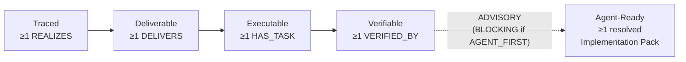

# Technical Execution Context — Documentation Propagation Plan

> **For agentic workers:** REQUIRED: Use superpowers:subagent-driven-development (if subagents available) or superpowers:executing-plans to implement this plan. Steps use checkbox (`- [ ]`) syntax for tracking.

**Goal:** Propagate the Technical Execution Context Extension spec into 8 target files, bringing all documentation to 79 edges and adding Application/ApplicationComponent execution metadata, UserStory `executionMode`, Implementation Pack traversal, and MCR-STORY-AGENT-READY-001.

**Architecture:** Pure documentation propagation — no code changes. Each task edits one file with specific line-level insertions and replacements. All changes derive from the frozen spec at `docs/superpowers/specs/2026-03-14-technical-execution-context-design.md`.

**Tech Stack:** Markdown, Mermaid diagrams, Cypher query notation.

**Spec:** `docs/superpowers/specs/2026-03-14-technical-execution-context-design.md`

---

## Chunk 1: Core Model Files (graph-object-catalog.md + modeling-taxonomy.md)

These two files define the canonical model. All other files reference them.

---

### Task 1: Update Application spec in graph-object-catalog.md

**Files:**
- Modify: `docs/reference/graph-object-catalog.md:1434-1456`

- [ ] **Step 1: Add 5 new attributes to Application attribute table**

After `sourceRefs` row (line 1443), add:

```markdown
| `repoPath` | String | No | Relative path from workspace root or absolute path | e.g., `.` for monorepo root, `backend/` for backend subtree |
| `repoUrl` | String | No | Git clone URL | For multi-repo setups |
| `workspaceType` | Enum | No | Repository structure | Enum: MONOREPO, POLYREPO |
| `defaultBuildCommand` | String | No | Fallback build command if component doesn't override | e.g., `mvn clean verify` |
| `defaultTestCommand` | String | No | Fallback test command if component doesn't override | e.g., `mvn test` |
```

No relationship changes on Application.

- [ ] **Step 2: Verify the edit**

Read lines 1434-1455 and confirm all 13 attributes are present (8 original + 5 new).

- [ ] **Step 3: Commit**

```bash
git add docs/reference/graph-object-catalog.md
git commit -m "docs: add execution metadata to Application spec (repoPath, repoUrl, workspaceType, defaultBuildCommand, defaultTestCommand)"
```

---

### Task 2: Update ApplicationComponent spec in graph-object-catalog.md

**Files:**
- Modify: `docs/reference/graph-object-catalog.md:1466-1486`

- [ ] **Step 1: Expand componentType enum**

Replace line 1473:
```
| `componentType` | String | No | Component classification | Enum: FRONTEND, BACKEND, SERVICE, LIBRARY, DATABASE, INTEGRATION |
```
With:
```
| `componentType` | Enum | Yes | Component classification | Enum: FRONTEND_APP, BFF, MICROSERVICE, LIBRARY, WORKER, DB_ADAPTER, GATEWAY, SERVICE_REGISTRY |
```

- [ ] **Step 2: Remove technologyStack attribute**

Delete line 1474:
```
| `technologyStack` | String | No | Primary technology | |
```

- [ ] **Step 3: Add 11 new execution metadata attributes**

After the `sourceRefs` row (line 1476, now shifted), add:

```markdown
| `frameworkFamily` | Enum | Yes | Framework family classification | Enum: ANGULAR, SPRING_BOOT, ASP_NET_CORE, NODE_EXPRESS, NODE_NEST, REACT, VUE, FASTAPI, DJANGO, FLASK, SVELTE, NEXTJS |
| `frameworkName` | String | No | Exact framework name (for non-standard or emerging frameworks) | Free text. e.g., `Spring Boot`, `ASP.NET Core`, `Analog` |
| `frameworkVersion` | String | No | Pinned framework version | e.g., `3.4.1`, `21.0.0`, `8.0` |
| `runtime` | Enum | No | Execution environment | Enum: BROWSER, JVM, DOTNET_CLR, NODE, PYTHON, CONTAINER (use CONTAINER only for infrastructure components without a language-level runtime, e.g., Envoy, Nginx) |
| `language` | Enum | Yes | Primary implementation language | Enum: TYPESCRIPT, JAVA, CSHARP, JAVASCRIPT, PYTHON, KOTLIN, GO |
| `languageVersion` | String | No | Language version | e.g., `Java 23`, `TypeScript 5.4`, `.NET 8` |
| `modulePath` | String | No | Path relative to Application's repoPath | e.g., `backend/auth-facade/`, `frontend/src/app/features/design-hub/` |
| `manifestPath` | String | No | Build manifest relative to modulePath | e.g., `pom.xml`, `package.json`, `*.csproj` |
| `buildCommand` | String | No | Overrides Application default | e.g., `mvn clean verify -pl auth-facade` |
| `testCommand` | String | No | Overrides Application default | e.g., `npx vitest run`, `dotnet test` |
| `entrypointPath` | String | No | Main entry file relative to modulePath | e.g., `src/main/java/.../AuthFacadeApplication.java`, `src/main.ts` |
```

- [ ] **Step 4: Add 3 new relationships to ApplicationComponent relationship table**

After the `HOSTS` row (line 1485, now shifted), add:

```markdown
| `DEPENDS_ON_COMPONENT` | OUTGOING | ApplicationComponent | N:M | No | OPTIONAL | `[PLANNED]` — edge properties: dependencyType (SYNC_API, ASYNC_EVENT, SHARED_DB, SHARED_LIBRARY, GATEWAY_ROUTE), protocol, required |
| `OWNS_DATA_ENTITY` | OUTGOING | DataEntity | 1:N | No | OPTIONAL | `[PLANNED]` — closes resolution dead-end for DELIVERS→DataEntity |
| `ENFORCES_RULE` | OUTGOING | Rule | N:M | No | OPTIONAL | `[PLANNED]` — closes resolution dead-end for DELIVERS→Rule |
```

- [ ] **Step 5: Verify the edit**

Read the ApplicationComponent section and confirm:
- 17 attributes (7 original minus technologyStack = 6 remaining + 11 new = 17 rows; componentType modified to Required=Yes with expanded enum)
- 7 relationships (4 original + 3 new)

- [ ] **Step 6: Commit**

```bash
git add docs/reference/graph-object-catalog.md
git commit -m "docs: add execution metadata to ApplicationComponent spec (+11 attrs, -1, +3 edges: DEPENDS_ON_COMPONENT, OWNS_DATA_ENTITY, ENFORCES_RULE)"
```

---

### Task 3: Update UserStory spec in graph-object-catalog.md

**Files:**
- Modify: `docs/reference/graph-object-catalog.md:548-575`

- [ ] **Step 1: Add executionMode attribute**

After `sourceRefs` row (line 561), add:

```markdown
| `executionMode` | Enum | No | How the story will be implemented | Enum: HUMAN_ONLY, AGENT_ASSISTED, AGENT_FIRST. Default: HUMAN_ONLY |
```

- [ ] **Step 2: Verify the edit**

Read lines 548-576 and confirm `executionMode` is present.

- [ ] **Step 3: Commit**

```bash
git add docs/reference/graph-object-catalog.md
git commit -m "docs: add executionMode attribute to UserStory spec"
```

---

### Task 4: Update Task IMPLEMENTS targets in graph-object-catalog.md

**Files:**
- Modify: `docs/reference/graph-object-catalog.md:607`

- [ ] **Step 1: Expand IMPLEMENTS target set**

Replace line 607:
```
| `IMPLEMENTS` | OUTGOING | Screen, ApiContract, DataEntity, Rule, Message, TestCase | N:M | No | OPTIONAL | `[PLANNED]` |
```
With:
```
| `IMPLEMENTS` | OUTGOING | Screen, ApiContract, DataEntity, Rule, Message, TestCase, ApplicationComponent | N:M | No | OPTIONAL | `[PLANNED]` |
```

- [ ] **Step 2: Verify the edit**

Read line 607 and confirm `ApplicationComponent` is in the target list.

- [ ] **Step 3: Commit**

```bash
git add docs/reference/graph-object-catalog.md
git commit -m "docs: extend Task IMPLEMENTS targets to include ApplicationComponent"
```

---

### Task 5: Add 3 new edges to relationship registry in graph-object-catalog.md

**Files:**
- Modify: `docs/reference/graph-object-catalog.md:1995-2002`

- [ ] **Step 1: Add DEPENDS_ON_COMPONENT, OWNS_DATA_ENTITY, ENFORCES_RULE to section 6.3**

After the `IMPLEMENTS` row (line 1995), add:

```markdown
| `DEPENDS_ON_COMPONENT` | ApplicationComponent | ApplicationComponent | N:M | OPTIONAL | `[PLANNED]` — edge properties: dependencyType, protocol, required |
| `OWNS_DATA_ENTITY` | ApplicationComponent | DataEntity | 1:N | OPTIONAL | `[PLANNED]` |
| `ENFORCES_RULE` | ApplicationComponent | Rule | N:M | OPTIONAL | `[PLANNED]` |
```

- [ ] **Step 2: Update IMPLEMENTS row**

Replace line 1995:
```
| `IMPLEMENTS` | Task | Screen, ApiContract, DataEntity, Rule, Message, TestCase | N:M | OPTIONAL | `[PLANNED]` |
```
With:
```
| `IMPLEMENTS` | Task | Screen, ApiContract, DataEntity, Rule, Message, TestCase, ApplicationComponent | N:M | OPTIONAL | `[PLANNED]` |
```

- [ ] **Step 3: Verify the edit**

Grep for `DEPENDS_ON_COMPONENT`, `OWNS_DATA_ENTITY`, `ENFORCES_RULE` in graph-object-catalog.md. Confirm each appears in both the per-object spec AND the registry.

- [ ] **Step 4: Commit**

```bash
git add docs/reference/graph-object-catalog.md
git commit -m "docs: add 3 new edges to relationship registry (DEPENDS_ON_COMPONENT, OWNS_DATA_ENTITY, ENFORCES_RULE) — edge count 76→79"
```

---

### Task 6: Add Implementation Pack Cypher query to graph-object-catalog.md

**Files:**
- Modify: `docs/reference/graph-object-catalog.md` (after the relationship registry, before spine diagrams — around line 2011)

- [ ] **Step 1: Add Implementation Pack traversal section**

After section 6.4 (Deprecated Edges) and before section 7 (Relationship Spine Diagrams), insert:

```markdown
### 6.5 Implementation Pack — Computed Traversal Query

The Implementation Pack resolves a UserStory to its full execution context. It is a **computed traversal result**, NOT a stored node.

**Resolution chain:**
- Direct: `deliverable <-[SUPPORTS_SCREEN|EXPOSES|OWNS_DATA_ENTITY|ENFORCES_RULE]- ApplicationComponent`
- Transitive (Message): `Message <-[HAS_MESSAGE]- Screen <-[SUPPORTS_SCREEN]- ApplicationComponent`
- Command precedence: `COALESCE(comp.buildCommand, app.defaultBuildCommand)` — component overrides Application default. Same for `testCommand`.

**Canonical Cypher query:** See `docs/superpowers/specs/2026-03-14-technical-execution-context-design.md` section 7.1 for the full staged query.

**MCR-STORY-AGENT-READY-001 Cypher check:**

​```cypher
// Direct resolution
MATCH (us:UserStory {storyId: $storyId})-[:DELIVERS]->(d)
OPTIONAL MATCH (d)<-[:SUPPORTS_SCREEN|EXPOSES|OWNS_DATA_ENTITY|ENFORCES_RULE]-(directComp:ApplicationComponent)
// Transitive resolution for Message deliverables
OPTIONAL MATCH (d)<-[:HAS_MESSAGE]-(ms:Screen)<-[:SUPPORTS_SCREEN]-(transitiveComp:ApplicationComponent)
WHERE d:Message
WITH us, COALESCE(directComp, transitiveComp) AS comp
WHERE comp IS NOT NULL
OPTIONAL MATCH (comp)<-[:HAS_COMPONENT]-(app:Application)
WITH comp, app
WHERE comp.frameworkFamily IS NOT NULL
  AND comp.modulePath IS NOT NULL
  AND COALESCE(comp.testCommand, app.defaultTestCommand) IS NOT NULL
RETURN count(comp) > 0 AS agentReady
​```
```

- [ ] **Step 2: Verify the edit**

Read the new section and confirm it references the spec, includes the MCR Cypher, and documents COALESCE precedence.

- [ ] **Step 3: Commit**

```bash
git add docs/reference/graph-object-catalog.md
git commit -m "docs: add Implementation Pack traversal section with MCR Cypher query and COALESCE precedence"
```

---

### Task 7: Update modeling-taxonomy.md edge count and taxonomy

**Files:**
- Modify: `docs/reference/modeling-taxonomy.md:371-377`

- [ ] **Step 1: Update the four-verb edge table IMPLEMENTS row**

Replace line 375:
```
| `IMPLEMENTS` | Task | Screen, ApiContract, DataEntity, Rule, Message, TestCase | What a task builds or creates | `[PLANNED]` |
```
With:
```
| `IMPLEMENTS` | Task | Screen, ApiContract, DataEntity, Rule, Message, TestCase, ApplicationComponent | What a task builds or creates | `[PLANNED]` |
```

- [ ] **Step 2: Add 3 new edges after the process spine table (after line 387)**

After the `ATTACHED_TO` row, add a new subsection:

```markdown

### 10.6 Technical Execution Context Edges

| Edge | Source | Target | Purpose | Implementation |
|------|--------|--------|---------|----------------|
| `DEPENDS_ON_COMPONENT` | ApplicationComponent | ApplicationComponent | Inter-component dependency with type and protocol | `[PLANNED]` |
| `OWNS_DATA_ENTITY` | ApplicationComponent | DataEntity | Component ownership of data entities (closes DELIVERS→DataEntity resolution) | `[PLANNED]` |
| `ENFORCES_RULE` | ApplicationComponent | Rule | Component enforcement of business rules (closes DELIVERS→Rule resolution) | `[PLANNED]` |
```

- [ ] **Step 3: Search for any "76 edge" references in modeling-taxonomy.md and update to 79**

Use grep to find all occurrences. Update each one.

- [ ] **Step 4: Verify the edit**

Read the updated sections. Confirm IMPLEMENTS targets expanded and 3 new edges added.

- [ ] **Step 5: Commit**

```bash
git add docs/reference/modeling-taxonomy.md
git commit -m "docs: update modeling-taxonomy edge count 76→79, add technical execution context edges"
```

---

## Chunk 2: Vision & Benchmark Files (product-vision.md + vision-benchmark.md)

---

### Task 8: Add Implementation Pack section to product-vision.md

**Files:**
- Modify: `docs/reference/product-vision.md:41, 186-188, 318`

- [ ] **Step 1: Update edge count on line 41**

Replace:
```
with 61 benchmarkable objects and 76 edge types
```
With:
```
with 61 benchmarkable objects and 79 edge types
```

- [ ] **Step 2: Add section 8.7 after section 8.6 (after line 186)**

Insert before the `---` separator (line 188):

```markdown

### 8.7 Implementation Pack resolution

Every UserStory must be resolvable to a complete **Implementation Pack** — a traversable subgraph that gives a human or coding agent everything needed to change code safely. The resolution chain is:

```
Story → deliverables → owning ApplicationComponent → execution context
```

The pack includes: story intent, business context, deliverables, owning component(s) with framework/module/build/test metadata, work decomposition (tasks), acceptance criteria, governing rules, and verification targets (test cases).

A story that cannot resolve to at least one ApplicationComponent with populated execution metadata (`frameworkFamily`, `modulePath`, and effective `testCommand` — component override or Application default) is scored as **not agent-ready** by the benchmark (MCR-STORY-AGENT-READY-001).

The Implementation Pack is a **computed traversal**, not a stored node. The graph is the source of truth.
```

- [ ] **Step 3: Add Implementation Pack query to north-star queries (after line 205)**

Add row 11 to the query table:

```markdown
| 11 | Can story S resolve to a complete Implementation Pack? | `UserStory -[DELIVERS]-> deliverable <-[SUPPORTS_SCREEN\|EXPOSES\|OWNS_DATA_ENTITY\|ENFORCES_RULE]- ApplicationComponent` (plus transitive via HAS_MESSAGE for Message) |
```

Update the query counts in line 207. Replace all denominators: "0/13 GREEN, 2/13 AMBER, 11/13 RED" becomes "0/14 GREEN, 2/14 AMBER, 12/14 RED" (the new query starts as RED). Update the target similarly.

- [ ] **Step 4: Update edge count on line 318**

Replace:
```
with 76 edge types
```
With:
```
with 79 edge types
```

- [ ] **Step 5: Verify the edit**

Read lines 186-210 and 41 to confirm section 8.7 is present, query 11 added, and edge counts updated to 79.

- [ ] **Step 6: Commit**

```bash
git add docs/reference/product-vision.md
git commit -m "docs: add Implementation Pack resolution to product vision, update edge count 76→79"
```

---

### Task 9: Add agent-readiness dimension to vision-benchmark.md

**Files:**
- Modify: `docs/reference/vision-benchmark.md:127-146, 150-176`

- [ ] **Step 1: Update edge count references**

Search for all "76" references in vision-benchmark.md and update to "79" where they refer to the total edge inventory.

- [ ] **Step 2: Add queryability test for Implementation Pack resolution**

After the last query row in the queryability table (section 3.5), add:

```markdown
| 14 | Can story S resolve to a complete Implementation Pack? | `UserStory -[DELIVERS]-> deliverable <-[SUPPORTS_SCREEN\|EXPOSES\|OWNS_DATA_ENTITY\|ENFORCES_RULE]- ApplicationComponent` (transitive: Message via HAS_MESSAGE→Screen→SUPPORTS_SCREEN) | `[PLANNED]` — no ApplicationComponent execution metadata populated | RED |

**Note on query numbering:** product-vision.md uses query numbers 1-11 (10 original + 1 new). vision-benchmark.md uses query numbers 1-14 (13 original including 3 BPMN queries #11-13 + 1 new as #14). The numbering diverges because the benchmark includes BPMN-specific queries not in the north-star list.
```

- [ ] **Step 3: Add agent-readiness benchmark subsection**

After the relationship coverage section (section 3.4, around line 146), add a new subsection:

```markdown
### 3.8 Agent Readiness

**Question:** Can coding agents resolve UserStories to complete Implementation Packs?

| Metric | Current | Target |
|--------|---------|--------|
| Stories with DELIVERS edges | 0% | 100% |
| Deliverables resolving to ApplicationComponent | 0% | >= 80% |
| ApplicationComponents with frameworkFamily populated | 0% | 100% |
| ApplicationComponents with modulePath populated | 0% | 100% |
| ApplicationComponents with effective testCommand | 0% | 100% |
| MCR-STORY-AGENT-READY-001 pass rate | 0% | >= 80% |

**Score: RED** — No ApplicationComponent execution metadata exists. Implementation Pack resolution is entirely `[PLANNED]`.
```

- [ ] **Step 4: Verify the edit**

Read updated sections. Confirm agent-readiness subsection present and edge counts updated.

- [ ] **Step 5: Commit**

```bash
git add docs/reference/vision-benchmark.md
git commit -m "docs: add agent-readiness benchmark dimension, Implementation Pack queryability test, update edge count 76→79"
```

---

## Chunk 3: Governance & Readiness (implementation-readiness-graph-model.md)

---

### Task 10: Add MCR-STORY-AGENT-READY-001 and update edge inventory

**Files:**
- Modify: `docs/reference/implementation-readiness-graph-model.md:407-435`

- [ ] **Step 1: Add MCR-STORY-AGENT-READY-001 to section 7.10**

After the MCR-PROCESS-FLOW-001 row (line 413), add:

```markdown
| MCR-STORY-AGENT-READY-001 | UserStory | At least one DELIVERS target resolves (via SUPPORTS_SCREEN, EXPOSES, OWNS_DATA_ENTITY, ENFORCES_RULE, or transitively via HAS_MESSAGE→Screen→SUPPORTS_SCREEN) to an ApplicationComponent with `frameworkFamily`, `modulePath`, and effective `testCommand` (component override or Application default) populated | **ADVISORY** (default) / **BLOCKING** when `executionMode = AGENT_FIRST` | `[PLANNED]` |
```

- [ ] **Step 2: Add agent-readiness concern to four-concern story gate (section 7.11)**

After the "Verifiable" row (line 424), add:

```markdown
| **Agent-Ready** | `DELIVERS → deliverable → ApplicationComponent` (via SUPPORTS_SCREEN/EXPOSES/OWNS_DATA_ENTITY/ENFORCES_RULE) with execution metadata | >= 1 resolvable component | Advisory (BLOCKING when `executionMode = AGENT_FIRST`) | Execution Context |
```

Update the Mermaid diagram (lines 426-431) to add the agent-ready node:



- [ ] **Step 3: Update total edge inventory note (line 435)**

Replace:
```
**Note on total edge inventory:** The target model contains **76 edge types**.
```
With:
```
**Note on total edge inventory:** The target model contains **79 edge types** (76 base + DEPENDS_ON_COMPONENT, OWNS_DATA_ENTITY, ENFORCES_RULE from Technical Execution Context Extension).
```

- [ ] **Step 4: Verify the edit**

Read lines 407-440. Confirm MCR added, story gate updated, edge count updated to 79.

- [ ] **Step 5: Commit**

```bash
git add docs/reference/implementation-readiness-graph-model.md
git commit -m "docs: add MCR-STORY-AGENT-READY-001, extend story gate with agent-readiness concern, update edge inventory 76→79"
```

---

### Task 11: Add Implementation Pack Cypher reference to implementation-readiness-graph-model.md

**Files:**
- Modify: `docs/reference/implementation-readiness-graph-model.md` (after the four-concern story gate section, around line 435)

- [ ] **Step 1: Add Implementation Pack resolution reference after the edge inventory note**

After line 435 (edge inventory note), insert:

```markdown

### 7.12 Implementation Pack Resolution

Every UserStory should resolve to a complete Implementation Pack — a computed traversal (NOT a stored node) that gives a coding agent everything needed to change code safely.

**Resolution chain:** `UserStory -[DELIVERS]-> deliverable → owning ApplicationComponent → execution metadata`

**Direct resolution edges:** SUPPORTS_SCREEN, EXPOSES, OWNS_DATA_ENTITY, ENFORCES_RULE
**Transitive resolution:** Message <-[HAS_MESSAGE]- Screen <-[SUPPORTS_SCREEN]- ApplicationComponent
**Command precedence:** `COALESCE(comp.testCommand, app.defaultTestCommand)` — component-level overrides Application-level defaults

See `docs/superpowers/specs/2026-03-14-technical-execution-context-design.md` section 7.1 for the full canonical Cypher query.
```

- [ ] **Step 2: Verify the edit**

Read lines 435-455. Confirm section 7.12 is present with resolution chain and COALESCE precedence.

- [ ] **Step 3: Commit**

```bash
git add docs/reference/implementation-readiness-graph-model.md
git commit -m "docs: add Implementation Pack resolution section to readiness model"
```

---

## Chunk 4: Supporting Files (feature-capability-map.md + design-testing-strategy.md + canonical plan)

---

### Task 12: Update edge count references in feature-capability-map.md

**Files:**
- Modify: `docs/reference/feature-capability-map.md`

- [ ] **Step 1: Search and update edge count references**

Search for all "76" references in feature-capability-map.md that refer to the edge inventory. Update each to "79".

- [ ] **Step 2: Verify the edit**

Grep for "76" in the file — should have 0 hits for edge count contexts (may still appear in non-edge contexts like line numbers or dates).

- [ ] **Step 3: Commit**

```bash
git add docs/reference/feature-capability-map.md
git commit -m "docs: update edge count references 76→79 in feature-capability-map"
```

---

### Task 13: Add Implementation Pack test to design-testing-strategy.md

**Files:**
- Modify: `docs/reference/design-testing-strategy.md:200-219`

- [ ] **Step 1: Add anti-drift scenario 10**

After scenario 9 (line 212), add:

```markdown
10. Implementation Pack resolution: a UserStory with DELIVERS edges resolves through deliverable→ApplicationComponent to yield frameworkFamily, modulePath, and effective testCommand. Dead-end deliverables (e.g., Message without HAS_MESSAGE→Screen→SUPPORTS_SCREEN) are flagged.
```

- [ ] **Step 2: Add drift gate for agent readiness**

After the `process flow drift` gate (line 219), add:

```markdown
- `agent readiness drift`: Implementation Pack query returns empty owningComponents for a story that has DELIVERS edges, indicating missing SUPPORTS_SCREEN/EXPOSES/OWNS_DATA_ENTITY/ENFORCES_RULE edges or unpopulated execution metadata
```

- [ ] **Step 3: Verify the edit**

Read lines 200-225. Confirm scenario 10 and agent readiness drift gate are present.

- [ ] **Step 4: Commit**

```bash
git add docs/reference/design-testing-strategy.md
git commit -m "docs: add Implementation Pack anti-drift scenario and agent readiness drift gate"
```

---

### Task 14: Update canonical plan file

**Files:**
- Modify: `~/.claude/plans/smooth-floating-wadler.md`

- [ ] **Step 1: Update Task IMPLEMENTS target set in the plan**

Find the Task relationships section. Update the IMPLEMENTS line from:
```
IMPLEMENTS(OUT, Screen|ApiContract|DataEntity|Rule|Message|TestCase, OPTIONAL)
```
To:
```
IMPLEMENTS(OUT, Screen|ApiContract|DataEntity|Rule|Message|TestCase|ApplicationComponent, OPTIONAL)
```

- [ ] **Step 2: Update the Implementation Counts table**

Update the total edge count from 76 to 79. Update the `[PLANNED]` count from 59 to 62 (adding DEPENDS_ON_COMPONENT, OWNS_DATA_ENTITY, ENFORCES_RULE).

- [ ] **Step 3: Add a note about the Technical Execution Context Extension**

At the end of the "Frozen Decisions" table, add:
```
| 19 | Technical Execution Context | Application gets workspace metadata (repoPath, repoUrl, workspaceType, defaultBuildCommand, defaultTestCommand). ApplicationComponent gets execution metadata (frameworkFamily, frameworkName, frameworkVersion, runtime, language, languageVersion, modulePath, manifestPath, buildCommand, testCommand, entrypointPath). UserStory gets executionMode. 3 new edges: DEPENDS_ON_COMPONENT, OWNS_DATA_ENTITY, ENFORCES_RULE. Total edges: 79. |
```

- [ ] **Step 4: Verify the edit**

Read the updated plan sections. Confirm IMPLEMENTS targets, edge count, and frozen decision 19 are correct.

- [ ] **Step 5: Commit**

The plan file is outside the repo, so no git commit needed. Just verify the edit.

---

## Chunk 5: Final Verification

---

### Task 15: Cross-file verification sweep

**Files:**
- Read-only verification across all 8 files

- [ ] **Step 1: Verify edge count consistency**

Run: `grep -n "79 edge" docs/reference/*.md`

Expected: All edge count references in product-vision.md, implementation-readiness-graph-model.md show "79". No file still says "76 edge types" in an active context.

- [ ] **Step 2: Verify no stale "76 edge" references remain**

Run: `grep -n "76 edge" docs/reference/*.md`

Expected: 0 matches in active contexts. (Allowed in deprecated/historical sections only.)

- [ ] **Step 3: Verify new edges in registries**

Run: `grep -n "DEPENDS_ON_COMPONENT\|OWNS_DATA_ENTITY\|ENFORCES_RULE" docs/reference/graph-object-catalog.md`

Expected: Each appears in both the per-object spec (ApplicationComponent section) AND the relationship registry (section 6.3).

- [ ] **Step 4: Verify UserStory executionMode**

Run: `grep -n "executionMode" docs/reference/graph-object-catalog.md`

Expected: At least 1 match in the UserStory attribute table.

- [ ] **Step 5: Verify Task IMPLEMENTS includes ApplicationComponent**

Run: `grep -n "IMPLEMENTS.*ApplicationComponent" docs/reference/graph-object-catalog.md docs/reference/modeling-taxonomy.md`

Expected: Matches in both files.

- [ ] **Step 6: Verify MCR-STORY-AGENT-READY-001**

Run: `grep -n "MCR-STORY-AGENT-READY" docs/reference/implementation-readiness-graph-model.md`

Expected: At least 1 match.

- [ ] **Step 7: Verify Implementation Pack is described as computed traversal (never stored node)**

Run: `grep -n "Implementation Pack" docs/reference/product-vision.md docs/reference/vision-benchmark.md docs/reference/design-testing-strategy.md`

Expected: Each mention describes it as "computed traversal" or "computed projection", never as a "stored node" or "first-class node".

- [ ] **Step 8: Verify Application default commands projected**

Run: `grep -n "defaultBuildCommand\|defaultTestCommand" docs/reference/graph-object-catalog.md`

Expected: Both appear in the Application attribute table.

- [ ] **Step 9: Verify GOVERNED_BY_RULE edge name is normalized**

Run: `grep -n "GOVERNED_BY_RULE" docs/reference/graph-object-catalog.md`

Expected: Appears in UserStory relationships (line ~570) and in the relationship registry (section 6.3). No alternative names (HAS_RULE, CONSTRAINED_BY) should appear for the same concept.

- [ ] **Step 10: Verify COALESCE precedence is documented**

Run: `grep -n "COALESCE\|component override\|Application default" docs/reference/graph-object-catalog.md docs/reference/implementation-readiness-graph-model.md`

Expected: COALESCE precedence pattern documented in graph-object-catalog.md (section 6.5) and implementation-readiness-graph-model.md (section 7.12).

- [ ] **Step 11: Verify no stale 76 references with broader pattern**

Run: `grep -n "76.relat\|76.edge\|76 edge" docs/reference/*.md`

Expected: 0 matches in active contexts. Also check for "76-relationship" variants.

- [ ] **Step 12: Report results**

Compile pass/fail for all 12 verification points from the spec (section 13). If any fail, fix before marking complete.

---

## Summary

| Task | File | Key Changes | Chunk |
|------|------|-------------|-------|
| 1 | graph-object-catalog.md | Application +5 attrs | 1 |
| 2 | graph-object-catalog.md | ApplicationComponent +11 attrs, -1, enum expansion, +3 edges | 1 |
| 3 | graph-object-catalog.md | UserStory +executionMode | 1 |
| 4 | graph-object-catalog.md | Task IMPLEMENTS +ApplicationComponent | 1 |
| 5 | graph-object-catalog.md | Relationship registry +3 edges, IMPLEMENTS expanded | 1 |
| 6 | graph-object-catalog.md | Implementation Pack Cypher query + COALESCE precedence | 1 |
| 7 | modeling-taxonomy.md | Edge count 76→79, +3 edges, IMPLEMENTS expanded | 1 |
| 8 | product-vision.md | Section 8.7, query 11, edge count 76→79 | 2 |
| 9 | vision-benchmark.md | Agent-readiness dimension, query 14, edge count 76→79 | 2 |
| 10 | implementation-readiness-graph-model.md | MCR-STORY-AGENT-READY-001, story gate, edge count 76→79 | 3 |
| 11 | implementation-readiness-graph-model.md | Implementation Pack resolution section with COALESCE reference | 3 |
| 12 | feature-capability-map.md | Edge count 76→79 | 4 |
| 13 | design-testing-strategy.md | Anti-drift scenario 10, agent readiness drift gate | 4 |
| 14 | Canonical plan file | IMPLEMENTS targets, edge count, frozen decision 19 | 4 |
| 15 | All files | Cross-file verification sweep (12 spec checkpoints + GOVERNED_BY_RULE + COALESCE) | 5 |
