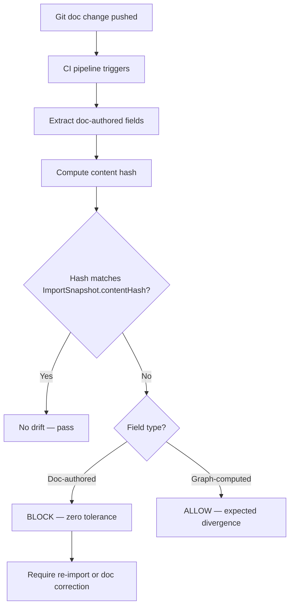
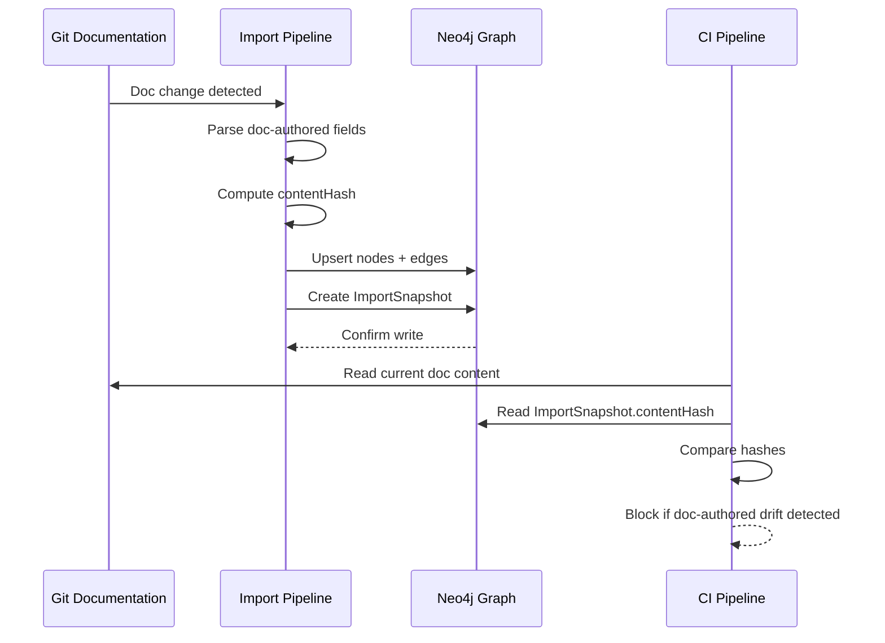

# Agent-Ready Information Model — Design Spec

**Date:** 2026-03-14
**Status:** Approved
**Scope:** CodeAsset (T1), TestCase enrichment, QualityConstraint (T1), CodingConvention (T2 Hybrid), ImportSnapshot (T2), RequirementSyncContract, MCR tightening, legacy edge cleanup
**Depends on:** Technical Execution Context Extension (2026-03-14) — this spec extends the 65-node / 79-edge model to enable near-zero-drift agent coding

---

## 1. Problem Statement

The Technical Execution Context spec (2026-03-14) gave agents the **Implementation Pack** — a traversable subgraph resolving from UserStory to owning ApplicationComponent with build/test commands. But a coding agent (Codex, Claude) answering the question "implement this story" still cannot resolve five critical concerns:

| # | Codex Question | What's Missing |
|---|----------------|----------------|
| 1 | **Why am I changing this?** | Requirement text lives in Git docs, not the graph. No ingestion or sync contract. |
| 2 | **What must exist when done?** | Acceptance criteria exist (AcceptanceCriterion), but quality constraints (performance, accessibility) have no model. |
| 3 | **Where do I change it?** | ApplicationComponent gives module-level targeting. File-level targeting requires inferring from repo structure. |
| 4 | **What must I not break?** | No coding conventions are queryable. Convention compliance is implicit, not graph-enforced. |
| 5 | **How is success proven?** | TestCase exists but has no execution metadata (file path, framework, command). Agent cannot run verification. |

### Gap Inventory (9 Gaps)

| # | Gap | Severity | Phase |
|---|-----|----------|-------|
| G1 | No file-level code targeting | BLOCKING | Phase 1 |
| G2 | TestCase has no execution metadata | BLOCKING | Phase 1 |
| G3 | No quality constraint model | HIGH | Phase 2 |
| G4 | No coding convention model | HIGH | Phase 2 |
| G5 | No requirement-to-graph ingestion contract | BLOCKING | Phase 1 |
| G6 | No drift detection mechanism | HIGH | Phase 1 |
| G7 | MCR-STORY-AGENT-READY-001 too loose | BLOCKING | Phase 1 |
| G8 | Legacy deprecated edges still in catalog | MEDIUM | Phase 1 |
| G9 | No import audit trail | MEDIUM | Phase 1 |

---

## 2. Frozen Decisions

| # | Decision | Resolution |
|---|----------|------------|
| 1 | CodeAsset tier | T1 First-Class Node — file-level targeting is a blocking gap; agents need stable, queryable code targets |
| 2 | CodeAsset scope | Curated, not exhaustive — only files that are explicit targets of stories/tasks/tests. Do not model every file in the repo blindly |
| 3 | CodingConvention tier | T2 Hybrid — structured categories in graph (conventionCode, category, enforcement, scope), detailed rules via docRef pointing to Markdown files |
| 4 | Convention resolution | All bindings materialized as explicit GOVERNED_BY_CONVENTION edges — no implicit attribute matching |
| 5 | Test execution metadata | Enrich TestCase directly with 7 new attributes + LOCATED_IN edge to CodeAsset — agents need immediate resolution from logical test to executable proof |
| 6 | QualityConstraint tier | T1 First-Class Node — instance-specific, verifiable non-functional requirements with thresholds |
| 7 | QualityConstraint verification verb | SATISFIED_BY (not VERIFIED_BY) — distinct semantics: VERIFIED_BY = "test proves story is functionally correct"; SATISFIED_BY = "test proves quality constraint threshold is met" |
| 8 | FieldBinding | Deferred to Phase 2 — not needed for agent-safe coding now |
| 9 | Source-of-truth boundary | Git docs authoritative (SOT-1), graph is materialized projection (SOT-2) |
| 10 | LOCATED_IN cardinality | N:1 default (many tests can live in one file, but one test lives in one file). N:M only for explicit multi-file cases |
| 11 | Path resolution | Three-part: `Application.repoPath + ApplicationComponent.modulePath + CodeAsset.filePath` |
| 12 | Drift hash scope | Doc-authored fields only (requirement text, acceptance criteria, business rules). Excludes graph-computed fields (status, readiness, completenessScore) |
| 13 | CI drift tolerance | Zero tolerance for doc-authored fields. Allowed divergence for graph-computed and runtime fields |
| 14 | ImportSnapshot conflict model | Result enum includes CONFLICTED (SUCCESS, PARTIAL, FAILED, CONFLICTED) |
| 15 | IMPORTED_BY scope | Importable T1 nodes only (those with content authored in Git docs) — not all T1 |

---

## 3. Two-Tier Delivery

### Phase 1: "Agent Can Code Safely Now"

Covers the minimum model for an agent to receive a story and produce correct, verifiable code without inferring architecture.

| Component | What It Adds |
|-----------|-------------|
| CodeAsset (T1) | File-level code targeting |
| TestCase enrichment | 7 new execution attributes + LOCATED_IN edge |
| Tightened MCR-STORY-AGENT-READY-001 | Adds AGENT_FIRST checks for repoPath, effective buildCommand, manifestPath, code-asset presence (≥1 HAS_CODE_ASSET), and verification test-file resolution (≥1 LOCATED_IN on TestCase); entrypointPath remains advisory |
| Legacy edge cleanup | 7 deprecated edges removed from catalog |
| ImportSnapshot (T2) | Operational audit trail for requirement ingestion |
| RequirementSyncContract | Source-of-truth rules and drift detection protocol |

**Model counts after Phase 1:** 67 nodes (+2: CodeAsset T1, ImportSnapshot T2) / 87 edges (+8)

**Agent-ready benchmarkable after Phase 1:** 63 (61 existing + CodeAsset + ImportSnapshot)

### Phase 2: "Higher Precision"

Adds precision layers that improve agent output quality but are not blocking for safe code generation.

| Component | What It Adds |
|-----------|-------------|
| QualityConstraint (T1) | Instance-specific non-functional requirements with thresholds |
| CodingConvention (T2 Hybrid) | Queryable coding standards with docRef to detailed rule files |

**Model counts after Full Extension:** 69 nodes (+2: QualityConstraint T1, CodingConvention T2) / 90 edges (+3)

**Agent-ready benchmarkable after Full Extension:** 65 (63 Phase 1 + QualityConstraint + CodingConvention)

Note: "Agent-ready benchmarkable" is distinct from the existing "benchmarkable" count of 61. It includes the base 61 plus nodes added by this extension.

### 5 Codex Questions by Phase

| # | Codex Question | Phase 1 Coverage | Phase 2 Coverage |
|---|----------------|------------------|------------------|
| 1 | Why am I changing this? | RequirementSyncContract ensures requirement text reaches graph | — |
| 2 | What must exist when done? | AcceptanceCriterion (existing) | QualityConstraint adds non-functional thresholds |
| 3 | Where do I change it? | CodeAsset provides file-level targeting; three-part path resolution | — |
| 4 | What must I not break? | Existing edges + MCR tightening | CodingConvention provides queryable coding standards |
| 5 | How is success proven? | TestCase enrichment enables executable verification | SATISFIED_BY links quality constraints to test evidence |

---

## 4. Source-of-Truth Boundaries

| ID | Rule | Description |
|----|------|-------------|
| SOT-1 | Git docs authoritative | Requirements documentation in Git is the single source of truth for requirement text, acceptance criteria, and business rules |
| SOT-2 | Graph is materialized projection | The Neo4j graph is a queryable projection of Git doc content, not an independent authoring surface for requirement semantics |
| SOT-3 | Graph owns lifecycle | Status, readiness, completenessScore, and relationship edges are owned by the graph — they do not exist in Git docs |
| SOT-4 | DataInitializer is transitional | Seed data via DataInitializer is a bootstrap mechanism. Target state is automated ingestion from Git docs via ImportSnapshot |
| SOT-5 | CI blocks divergence | CI pipeline enforces zero tolerance for drift between Git docs and graph on doc-authored fields. Graph-computed and runtime fields are exempt |

---

## 5. New Object Specifications

### 5.1 CodeAsset (T1)

**Tier:** 1 (First-Class Node)
**Category:** Engineering
**Purpose:** File-level code targeting for agent-safe implementation. Curated subset of repo files that are explicit targets of stories, tasks, or tests.

**Scope rule:** Only files that are explicit targets of stories/tasks/tests are modeled as CodeAsset nodes. Do not model every file in the repo. A CodeAsset exists because a UserStory DELIVERS an artifact whose implementation lives in that file, or a Task IMPLEMENTS work in that file, or a TestCase is LOCATED_IN that file.

#### Attributes

| Attribute | Type | Required | Description | Constraints |
|-----------|------|----------|-------------|-------------|
| codeAssetId | String | Yes | Stable identifier | Pattern: `CA-{componentId}-{seq}` |
| filePath | String | Yes | Path relative to ApplicationComponent.modulePath | Must not start with `/` |
| assetType | Enum | Yes | Role of the file | SOURCE, TEST, CONFIG, MIGRATION, SPEC, TEMPLATE, STYLE |
| language | Enum | No | Programming language (for logic files) | JAVA, TYPESCRIPT, PYTHON, KOTLIN, GO, RUST, SQL, CYPHER |
| fileFormat | Enum | No | File format (for non-logic files) | JSON, YAML, XML, HTML, CSS, SCSS, MARKDOWN, PROPERTIES, DOCKERFILE |
| layerType | Enum | No | Architectural layer | CONTROLLER, SERVICE, REPOSITORY, DOMAIN, DTO, CONFIG, MIGRATION, TEST, COMPONENT, MODULE, PIPE, GUARD, DIRECTIVE |
| packageName | String | No | Fully qualified package/module | e.g., `com.emsist.designhub.domain` |
| className | String | No | Primary class/component name | e.g., `ScreenController` |
| description | String | No | Brief description of the file's purpose | |
| status | Status | Yes | Universal 10-value enum | |

#### Relationships (Graph Edges)

| Relationship | Direction | Target | Cardinality | Required | Severity | Description |
|-------------|-----------|--------|-------------|----------|----------|-------------|
| HAS_CODE_ASSET | IN | ApplicationComponent | N:1 | Yes | BLOCKING | Every CodeAsset belongs to exactly one component |
| LOCATED_IN | IN | TestCase | N:1 | No | OPTIONAL | Test cases located in this file |
| IMPLEMENTS | IN | Task | N:M | No | OPTIONAL | Tasks targeting this file |
| ASSET_FOR_SCREEN | OUT | Screen | N:M | No | OPTIONAL | Code file implements this screen |
| ASSET_FOR_API | OUT | ApiContract | N:M | No | OPTIONAL | Code file implements this API |
| ASSET_FOR_ENTITY | OUT | DataEntity | N:M | No | OPTIONAL | Code file implements this entity |
| ASSET_FOR_RULE | OUT | Rule | N:M | No | OPTIONAL | Code file implements this rule |

#### Path Resolution Rule

The full filesystem path of a CodeAsset is resolved by concatenating three parts:

```
resolvedPath = Application.repoPath + ApplicationComponent.modulePath + CodeAsset.filePath
```

Example:
- `Application.repoPath = <repo-root>`
- `ApplicationComponent.modulePath = backend/src/main/java`
- `CodeAsset.filePath = com/emsist/designhub/domain/Screen.java`
- Resolved: `<repo-root>/backend/src/main/java/com/emsist/designhub/domain/Screen.java`

#### Traversal: Story to Code File

```
UserStory -[DELIVERS]-> Screen/ApiContract/DataEntity/Rule
  Screen/ApiContract/DataEntity/Rule <-[ASSET_FOR_*]- CodeAsset
  CodeAsset <-[HAS_CODE_ASSET]- ApplicationComponent
  ApplicationComponent <-[HAS_COMPONENT]- Application
```

---

### 5.2 ImportSnapshot (T2)

**Tier:** 2 (Registry)
**Category:** Cross-cutting
**Purpose:** Operational audit record tracking each requirement-to-graph import run. Enables drift detection and sync accountability.

**Operational exception:** ImportSnapshot is T2 by lifecycle semantics (no independent lifecycle — it is append-only audit data) but has a pattern ID for traceability. It is benchmarkable because agents query import history to assess graph freshness.

#### Attributes

| Attribute | Type | Required | Description | Constraints |
|-----------|------|----------|-------------|-------------|
| snapshotId | String | Yes | Stable identifier | Pattern: `IMP-{YYYYMMDD}-{seq}` |
| sourceType | Enum | Yes | What was imported | GIT_DOC, JIRA_SYNC, MANUAL_ENTRY |
| sourcePath | String | No | Git path or external URL | Relative to repo root for GIT_DOC |
| importedAt | DateTime | Yes | Timestamp of import | ISO 8601 |
| importedBy | String | Yes | Agent or user who triggered import | |
| result | Enum | Yes | Outcome of the import | SUCCESS, PARTIAL, FAILED, CONFLICTED |
| itemCount | Integer | No | Number of items processed | |
| errorSummary | String | No | Error details for PARTIAL/FAILED/CONFLICTED | |
| contentHash | String | No | Hash of doc-authored fields at import time | For drift detection |

#### Relationships (Graph Edges)

| Relationship | Direction | Target | Cardinality | Required | Severity | Description |
|-------------|-----------|--------|-------------|----------|----------|-------------|
| IMPORTED_BY | IN | Importable T1 | N:M | No | OPTIONAL | Links imported nodes to their import snapshot |

**Importable T1 definition:** T1 nodes whose content originates from Git docs or external sources — specifically UserStory, AcceptanceCriterion, Rule, Epic, Feature, BusinessObjective, BusinessProcess, ProcessActivity, and any T1 whose requirement text or business rules are authored in documentation rather than graph-native.

#### Content Hash and Drift Detection

The `contentHash` field stores a hash of doc-authored fields at import time. Drift detection compares the current Git doc content hash against the stored `contentHash`:

- **Doc-authored fields** (included in hash): requirement text, acceptance criteria text, business rules, description fields sourced from documentation
- **Graph-computed fields** (excluded from hash): status, readiness, completenessScore, relationship counts, any field computed by the graph engine

If the hashes diverge, the CI pipeline flags drift. The tolerance rule:

- **Zero tolerance** for doc-authored field divergence — CI blocks the merge
- **Allowed divergence** for graph-computed and runtime fields — these are expected to differ

---

## 6. Enriched Existing Objects

### 6.1 TestCase — Execution Metadata Enrichment

**Current state:** TestCase has 8 attributes and 3 relationships. No execution metadata — an agent cannot resolve from TestCase to an executable test.

**New attributes (7):**

| Attribute | Type | Required | Description | Constraints |
|-----------|------|----------|-------------|-------------|
| testFilePath | String | No | Denormalized convenience path to test file | Canonical source is LOCATED_IN edge to CodeAsset. This field is a cache for direct access |
| testClassName | String | No | Fully qualified test class | e.g., `com.emsist.designhub.domain.ScreenTest` |
| testMethodName | String | No | Specific test method | e.g., `shouldHoldBothLegacyAndUniversalStatus` |
| testFramework | Enum | No | Test framework | JUNIT5, VITEST, PLAYWRIGHT, JEST, TESTCONTAINERS, CYPRESS |
| suiteName | String | No | Logical test suite grouping | e.g., `smoke`, `regression`, `e2e` |
| tags | List\<String\> | No | Classification tags | e.g., `["unit", "domain", "status"]` |
| testCommand | String | No | Exact command to run this test | e.g., `mvn test -pl backend -Dtest=ScreenTest#shouldHoldBothLegacyAndUniversalStatus` |

**New relationship (1):**

| Relationship | Direction | Target | Cardinality | Required | Severity | Description |
|-------------|-----------|--------|-------------|----------|----------|-------------|
| LOCATED_IN | OUT | CodeAsset | N:1 | No | OPTIONAL | Test case is located in this code file. N:1 cardinality — one test lives in one file. Multiple tests can share a file. N:M only for explicit multi-file test cases (exceptional). |

**Canonical source rule:** When both `testFilePath` and a LOCATED_IN edge to CodeAsset exist, the LOCATED_IN edge is authoritative. `testFilePath` is a denormalized convenience field that should be consistent with `LOCATED_IN → CodeAsset.filePath` but is not the canonical source.

**Total after enrichment:** TestCase has 15 attributes and 4 relationships.

---

## 7. Phase 2 Object Specifications

### 7.1 QualityConstraint (T1)

**Tier:** 1 (First-Class Node)
**Category:** Requirement & Design
**Purpose:** Instance-specific, verifiable non-functional requirement with measurable thresholds. Each QualityConstraint is bound to a specific artifact and has a concrete pass/fail threshold.

#### Attributes

| Attribute | Type | Required | Description | Constraints |
|-----------|------|----------|-------------|-------------|
| constraintId | String | Yes | Stable identifier | Pattern: `QC-{domain}-{seq}` |
| name | String | Yes | Short descriptive name | e.g., "Screen load time < 2s" |
| description | String | No | Detailed description | |
| constraintType | Enum | Yes | Category of quality | PERFORMANCE, ACCESSIBILITY, SECURITY, RELIABILITY, SCALABILITY, USABILITY |
| threshold | String | Yes | Measurable pass/fail boundary | e.g., "< 2000ms", ">= 95%", "WCAG AAA" |
| measurementMethod | String | No | How to measure this constraint | e.g., "Lighthouse performance score", "axe-core WCAG audit" |
| priority | Enum | No | Importance level | CRITICAL, HIGH, MEDIUM, LOW |
| status | Status | Yes | Universal 10-value enum | |

#### Relationships (Graph Edges)

| Relationship | Direction | Target | Cardinality | Required | Severity | Description |
|-------------|-----------|--------|-------------|----------|----------|-------------|
| HAS_QUALITY_CONSTRAINT | IN | Screen, ApiContract, DataEntity, ApplicationComponent | N:M | No | OPTIONAL | Artifacts that this constraint applies to. Direction: artifact -[HAS_QUALITY_CONSTRAINT]-> QualityConstraint |
| SATISFIED_BY | OUT | TestCase | N:M | No | OPTIONAL | Tests that prove this constraint's threshold is met. Distinct from VERIFIED_BY (functional correctness) |

**SATISFIED_BY vs VERIFIED_BY semantics:**

| Verb | Source | Target | Meaning |
|------|--------|--------|---------|
| VERIFIED_BY | UserStory | TestCase | "This test proves the story is functionally correct" |
| SATISFIED_BY | QualityConstraint | TestCase | "This test proves the quality threshold is met" |

A single TestCase can be both a VERIFIED_BY target (for a story) and a SATISFIED_BY target (for a quality constraint). The verbs are distinct because the semantic relationship is different.

---

### 7.2 CodingConvention (T2 Hybrid)

**Tier:** 2 (Registry — Hybrid with docRef)
**Category:** Cross-cutting
**Purpose:** Queryable coding standards with structured categories in the graph and detailed rule content in Markdown files referenced by docRef.

**Hybrid rationale:** Pure graph nodes are too shallow for real coding conventions (rules like "use constructor injection, not field injection" need examples and rationale). Pure external docs are too loose for queryable agent readiness (agent cannot discover which conventions apply to which component). The hybrid stores the queryable metadata in the graph and the detailed content in Git-tracked Markdown.

#### Attributes

| Attribute | Type | Required | Description | Constraints |
|-----------|------|----------|-------------|-------------|
| conventionCode | String | Yes | Stable identifier | Pattern: `CONV-{category}-{seq}` |
| name | String | Yes | Short descriptive name | e.g., "Spring DI Pattern" |
| category | Enum | Yes | Convention category | NAMING, STRUCTURE, DEPENDENCY_INJECTION, ERROR_HANDLING, TESTING, LOGGING, SECURITY, API_DESIGN, DATABASE, DOCUMENTATION |
| enforcement | Enum | Yes | How strictly enforced | MANDATORY, RECOMMENDED, ADVISORY |
| scope | Enum | Yes | Applicability scope | GLOBAL, BACKEND, FRONTEND, SERVICE, COMPONENT |
| docRef | String | Yes | Path to detailed convention document | Relative to repo root. e.g., `docs/conventions/spring-di-pattern.md` |
| summary | String | No | One-line summary for quick agent reference | |
| activeStatus | Enum | No | Registry lifecycle | ACTIVE, DEPRECATED |

#### Relationships (Graph Edges)

| Relationship | Direction | Target | Cardinality | Required | Severity | Description |
|-------------|-----------|--------|-------------|----------|----------|-------------|
| GOVERNED_BY_CONVENTION | IN | Application, ApplicationComponent, CodeAsset | N:M | No | OPTIONAL | Entities governed by this convention. All bindings are explicit edges — no implicit attribute matching |

#### Convention Resolution Rule

Convention applicability is determined exclusively by materialized GOVERNED_BY_CONVENTION edges. There is no implicit resolution based on scope or category attributes — those are informational metadata only.

When multiple conventions apply to the same target (e.g., a CodeAsset governed by both a GLOBAL and a COMPONENT convention in the same category), the narrower scope overrides the broader:

```
COMPONENT > SERVICE > FRONTEND/BACKEND > GLOBAL
```

The agent reads the `docRef` Markdown file for the winning convention to get detailed rules, examples, and rationale.

---

## 8. Tightened MCR-STORY-AGENT-READY-001

### Current MCR (from Technical Execution Context spec)

The existing MCR checks 5 concerns: Traced (≥1 REALIZES), Deliverable (≥1 DELIVERS), Executable (≥1 HAS_TASK), Verifiable (≥1 VERIFIED_BY), Agent-Ready (Implementation Pack resolves).

### Tightened MCR for AGENT_FIRST Stories

When `UserStory.executionMode = AGENT_FIRST`, the Agent-Ready concern adds the following checks:

| Check | Condition | Severity |
|-------|-----------|----------|
| Repo path resolvable | `Application.repoPath IS NOT NULL` | BLOCKING |
| Build command available | `COALESCE(comp.buildCommand, app.defaultBuildCommand) IS NOT NULL` | BLOCKING |
| Manifest path available | `comp.manifestPath IS NOT NULL` | BLOCKING |
| Code asset presence | ≥1 `HAS_CODE_ASSET` edge on at least one DELIVERS target's owning ApplicationComponent | BLOCKING |
| Verification test-file resolution | ≥1 `LOCATED_IN` edge on at least one TestCase linked via VERIFIED_BY | BLOCKING |
| Entry point available | `comp.entrypointPath IS NOT NULL` | ADVISORY |

### Canonical Cypher — AGENT_FIRST Story Readiness

```cypher
// Five-Concern Story Gate with AGENT_FIRST tightening
MATCH (us:UserStory {storyId: $storyId})

// Concern 1: Traced
OPTIONAL MATCH (us)-[:REALIZES]->(origin)
WITH us, count(DISTINCT origin) AS traceCount

// Concern 2: Deliverable
OPTIONAL MATCH (us)-[:DELIVERS]->(d)
WITH us, traceCount, count(DISTINCT d) AS deliverCount

// Concern 3: Executable
OPTIONAL MATCH (us)-[:HAS_TASK]->(t:Task)
WITH us, traceCount, deliverCount, count(DISTINCT t) AS taskCount

// Concern 4: Verifiable
OPTIONAL MATCH (us)-[:VERIFIED_BY]->(tc:TestCase)
WITH us, traceCount, deliverCount, taskCount,
     count(DISTINCT tc) AS testCount

// Concern 5: Agent-Ready — Implementation Pack resolution
// Branch 1: Non-Message deliverables (direct component ownership)
OPTIONAL MATCH (us)-[:DELIVERS]->(d)
WHERE NOT d:Message
OPTIONAL MATCH (d)<-[:SUPPORTS_SCREEN|EXPOSES|OWNS_DATA_ENTITY|ENFORCES_RULE]-(comp:ApplicationComponent)
OPTIONAL MATCH (comp)<-[:HAS_COMPONENT]-(app:Application)
OPTIONAL MATCH (comp)-[:HAS_CODE_ASSET]->(ca:CodeAsset)
WITH us, traceCount, deliverCount, taskCount, testCount,
     collect(DISTINCT comp) AS directComps,
     collect(DISTINCT app) AS directApps,
     collect(DISTINCT ca) AS directAssets

// Branch 2: Message deliverables (transitive via Screen)
OPTIONAL MATCH (us)-[:DELIVERS]->(m:Message)
OPTIONAL MATCH (m)<-[:HAS_MESSAGE]-(scr:Screen)<-[:SUPPORTS_SCREEN]-(comp2:ApplicationComponent)
OPTIONAL MATCH (comp2)<-[:HAS_COMPONENT]-(app2:Application)
OPTIONAL MATCH (comp2)-[:HAS_CODE_ASSET]->(ca2:CodeAsset)
WITH us, traceCount, deliverCount, taskCount, testCount,
     directComps + collect(DISTINCT comp2) AS allComps,
     directApps + collect(DISTINCT app2) AS allApps,
     directAssets + collect(DISTINCT ca2) AS allAssets

// Verification test-file resolution
OPTIONAL MATCH (us)-[:VERIFIED_BY]->(tc:TestCase)-[:LOCATED_IN]->(tca:CodeAsset)
WITH us, traceCount, deliverCount, taskCount, testCount,
     allComps, allApps, allAssets,
     count(DISTINCT tca) AS testFileCount

// Compute concerns
WITH us,
     traceCount >= 1 AS traced,
     deliverCount >= 1 AS deliverable,
     taskCount >= 1 AS executable,
     testCount >= 1 AS verifiable,
     size(allComps) >= 1 AS hasComponent,
     size(allApps) >= 1 AS hasApp,
     size(allAssets) >= 1 AS hasCodeAsset,
     testFileCount >= 1 AS hasTestFile,
     // AGENT_FIRST additional checks — "at least one" semantics via any()
     any(a IN allApps WHERE a.repoPath IS NOT NULL) AS hasRepoPath,
     any(c IN allComps WHERE
          COALESCE(c.buildCommand,
               CASE WHEN size(allApps) >= 1
                    THEN [a IN allApps WHERE a.defaultBuildCommand IS NOT NULL][0].defaultBuildCommand
                    ELSE null END) IS NOT NULL) AS hasBuildCommand,
     any(c IN allComps WHERE c.manifestPath IS NOT NULL) AS hasManifestPath,
     any(c IN allComps WHERE c.entrypointPath IS NOT NULL) AS hasEntryPoint

RETURN us.storyId,
       traced, deliverable, executable, verifiable,
       hasComponent, hasApp,
       // AGENT_FIRST gate (BLOCKING checks)
       CASE WHEN us.executionMode = 'AGENT_FIRST'
            THEN hasRepoPath AND hasBuildCommand AND hasManifestPath
                 AND hasCodeAsset AND hasTestFile
            ELSE hasComponent AND hasApp
       END AS agentReady,
       // Advisory
       hasEntryPoint AS entryPointAvailable
```

---

## 9. RequirementSyncContract

The RequirementSyncContract is an **operational protocol**, not a graph node. It defines the rules governing how requirement content flows from Git docs into the graph and how drift is detected and prevented.

### Source-of-Truth Rules

| ID | Rule | Enforcement |
|----|------|-------------|
| SOT-1 | **Git docs authoritative** — Requirements documentation in Git is the single source of truth for requirement text, acceptance criteria, and business rules | Process discipline + CI gate |
| SOT-2 | **Graph is materialized projection** — The Neo4j graph is a queryable projection, not an independent authoring surface for requirement semantics | ImportSnapshot audit trail |
| SOT-3 | **Graph owns lifecycle** — Status, readiness, completenessScore, and relationship edges are graph-native; they do not exist in Git docs | Graph engine responsibility |
| SOT-4 | **DataInitializer is transitional** — Current seed data bootstraps the graph. Target state is automated ingestion from Git docs tracked by ImportSnapshot | Migration path |
| SOT-5 | **CI blocks divergence** — CI pipeline enforces zero tolerance for drift between Git docs and graph on doc-authored fields | CI gate (`.github/workflows/`) |

### Drift Detection Protocol



### Sync Lifecycle



---

## 10. Legacy Edge Cleanup

The following 7 deprecated edges must be removed from the graph-object-catalog relationship registry. They were deprecated in the Meta-Model Revision but are still listed:

| # | Deprecated Edge | Replacement | Reason |
|---|----------------|-------------|--------|
| 1 | USES_SCREEN (UserStory → Screen) | DELIVERS (UserStory → Screen) | Replaced by four-verb model. Note: JourneyStep -[USES_SCREEN]-> Screen is **not deprecated** — only the UserStory→Screen usage is removed |
| 2 | REQUIRES_API (UserStory → ApiContract) | DELIVERS (UserStory → ApiContract) | Replaced by four-verb model |
| 3 | ON_SCREEN (Interaction → Screen) | HAS_INTERACTION (Screen → Interaction) | Duplicate inverse, direction fixed |
| 4 | IMPLEMENTS_STORY (Screen → UserStory) | DELIVERS (UserStory → Screen) | Direction reversal + new verb |
| 5 | DEPLOYS (Application → Deployment) | HOSTS + DEPLOYED_ON | Directional fix |
| 6 | DETECTED_BY_BENCHMARK (Gap → computed) | `detectedBy` property on Gap | Not a real edge |
| 7 | HAS_STEP (BusinessProcess → ProcessActivity) | HAS_FLOW_NODE | Semantic correction for BPMN alignment (Journey HAS_STEP unchanged) |

**Action:** Remove these from the relationship registry in `graph-object-catalog.md`. Any Cypher queries referencing these edges must be updated to use the replacement.

---

## 11. Edge Inventory

### Phase 1 New Edges (+8)

| # | Edge | Source | Target | Cardinality | Phase |
|---|------|--------|--------|-------------|-------|
| 80 | HAS_CODE_ASSET | ApplicationComponent | CodeAsset | 1:N | Phase 1 |
| 81 | LOCATED_IN | TestCase | CodeAsset | N:1 | Phase 1 |
| 82 | ASSET_FOR_SCREEN | CodeAsset | Screen | N:M | Phase 1 |
| 83 | ASSET_FOR_API | CodeAsset | ApiContract | N:M | Phase 1 |
| 84 | ASSET_FOR_ENTITY | CodeAsset | DataEntity | N:M | Phase 1 |
| 85 | ASSET_FOR_RULE | CodeAsset | Rule | N:M | Phase 1 |
| 86 | IMPORTED_BY | Importable T1 | ImportSnapshot | N:M | Phase 1 |
| 87 | IMPLEMENTS (Task → CodeAsset) | Task | CodeAsset | N:M | Phase 1 |

### Phase 2 New Edges (+3)

| # | Edge | Source | Target | Cardinality | Phase |
|---|------|--------|--------|-------------|-------|
| 88 | HAS_QUALITY_CONSTRAINT | Screen, ApiContract, DataEntity, ApplicationComponent | QualityConstraint | N:M | Phase 2 |
| 89 | SATISFIED_BY | QualityConstraint | TestCase | N:M | Phase 2 |
| 90 | GOVERNED_BY_CONVENTION | Application, ApplicationComponent, CodeAsset | CodingConvention | N:M | Phase 2 |

**Note:** Edge 87 extends the existing IMPLEMENTS verb (Task → Screen/ApiContract/DataEntity/Rule/Message/TestCase/ApplicationComponent) to include CodeAsset as an additional target. It is counted as a new edge because the target type is new.

---

## 12. Model Count Summary

| Metric | Before This Spec | After Phase 1 | After Full Extension |
|--------|-----------------|---------------|---------------------|
| T1 nodes | 52 | 53 (+CodeAsset) | 54 (+QualityConstraint) |
| T2 nodes | 9 | 10 (+ImportSnapshot) | 11 (+CodingConvention) |
| T3 nodes | 4 | 4 | 4 |
| Total nodes | 65 | 67 | 69 |
| Total edges | 79 | 87 | 90 |
| Benchmarkable (base) | 61 | 61 | 61 |
| Agent-ready benchmarkable | — | 63 | 65 |

---

## 13. Propagation Matrix

The following files must be updated to reflect the counts and objects introduced by this spec:

| # | File | Priority | Key Changes |
|---|------|----------|-------------|
| 1 | `docs/reference/modeling-taxonomy.md` | P0 | Add CodeAsset to Engineering category (T1=53→54 full), add ImportSnapshot to T2 registry (T2=10→11 full), add QualityConstraint to Requirement & Design, add CodingConvention to Cross-cutting T2. Update tier counts per phase |
| 2 | `docs/reference/graph-object-catalog.md` | P0 | Add CodeAsset, ImportSnapshot, QualityConstraint, CodingConvention full specs. Add 8 Phase 1 edges + 3 Phase 2 edges to relationship registry. Enrich TestCase spec with 7 new attributes + LOCATED_IN. Remove 7 deprecated edges. Update total edge count 79→87 (Phase 1) / 90 (full) |
| 3 | `docs/reference/vision-benchmark.md` | P1 | Update benchmarkable count references. Add agent-ready benchmarkable metric (63/65). Add code-asset queryability tests. Add test-file resolution queryability test |
| 4 | `docs/reference/implementation-readiness-graph-model.md` | P1 | Add tightened MCR-STORY-AGENT-READY-001. Add CodeAsset to applicability matrix. Update completenessScore formula to include code-asset edges. Add ImportSnapshot to completeness checks |
| 5 | `docs/reference/product-vision.md` | P2 | Reference agent-ready extension. Update node/edge counts. Add code-targeting and convention resolution to north-star queries |
| 6 | `docs/reference/feature-capability-map.md` | P2 | Add Code Targeting capability. Add Convention Compliance capability. Update capability-to-artifact mapping for 63/65 agent-ready benchmarkable |
| 7 | `docs/reference/architecture-blueprint.md` | P2 | Add CodeAsset to engineering layer. Add RequirementSyncContract to governance layer. Reference drift detection protocol |
| 8 | `docs/reference/design-testing-strategy.md` | P2 | Add LOCATED_IN resolution tests. Add drift detection test scenarios |

**Rule:** Each file edit must explicitly state what baseline it is moving FROM and TO (e.g., "edges 79→87" not just "87 edges").

---

## 14. Implementation Notes

### Integration with Technical Execution Context Spec

This spec builds on the Implementation Pack traversal defined in the Technical Execution Context spec. The key extension is that the Implementation Pack now resolves one level deeper — from ApplicationComponent down to CodeAsset:

```
UserStory → DELIVERS → artifact → owning ApplicationComponent → HAS_CODE_ASSET → CodeAsset
```

This gives the agent the exact file to modify, not just the module.

### DataInitializer Impact

Phase 1 requires seeding:
- CodeAsset nodes for key domain, controller, service, and test files
- LOCATED_IN edges from existing TestCase nodes to CodeAsset nodes
- ImportSnapshot nodes for the initial seed (sourceType: MANUAL_ENTRY)
- TestCase attribute enrichment (testFilePath, testClassName, testMethodName, testFramework, testCommand)

### Frontend Impact

Phase 1 requires:
- `code-asset.model.ts` — new TypeScript model
- `import-snapshot.model.ts` — new TypeScript model
- State service updates for new entity signals
- API service updates for new endpoints
- Detail panel updates to show code assets linked to screens/APIs

Phase 2 requires:
- `quality-constraint.model.ts` — new TypeScript model
- `coding-convention.model.ts` — new TypeScript model
- Convention viewer component (reads docRef content)

---

## 15. Verification Checklist

| # | Check | Pass Criteria |
|---|-------|--------------|
| 1 | CodeAsset is T1 | Has @Node, pattern ID (CA-*), Status, participates in traversal |
| 2 | CodeAsset is curated | Only story/task/test targets are modeled — no bulk repo import |
| 3 | Path resolution works | Application.repoPath + ApplicationComponent.modulePath + CodeAsset.filePath resolves to real file |
| 4 | LOCATED_IN is N:1 | TestCase has at most one LOCATED_IN edge by default |
| 5 | testFilePath canonical source | LOCATED_IN edge is authoritative over testFilePath attribute |
| 6 | SATISFIED_BY distinct from VERIFIED_BY | Different verbs, different sources, different semantics |
| 7 | Convention resolution is edge-only | No implicit attribute matching — all GOVERNED_BY_CONVENTION edges explicit |
| 8 | ImportSnapshot result enum | Includes CONFLICTED alongside SUCCESS, PARTIAL, FAILED |
| 9 | Drift hash scope | Covers only doc-authored fields, excludes graph-computed |
| 10 | CI tolerance | Zero tolerance for doc-authored fields, allowed for graph-computed |
| 11 | MCR tightening | AGENT_FIRST stories check repoPath, buildCommand, manifestPath, code-asset presence, test-file resolution |
| 12 | entrypointPath | Advisory, not blocking |
| 13 | Legacy edges removed | 7 deprecated edges removed from catalog relationship registry |
| 14 | Edge count | Phase 1: 87, Full: 90 |
| 15 | Node count | Phase 1: 67, Full: 69 |
| 16 | language/fileFormat split | language for programming languages, fileFormat for non-logic file types |
