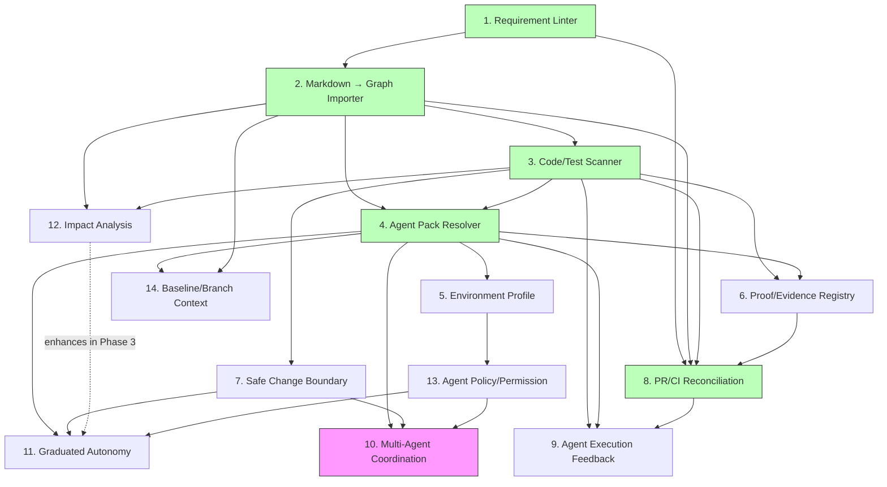
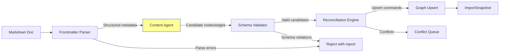
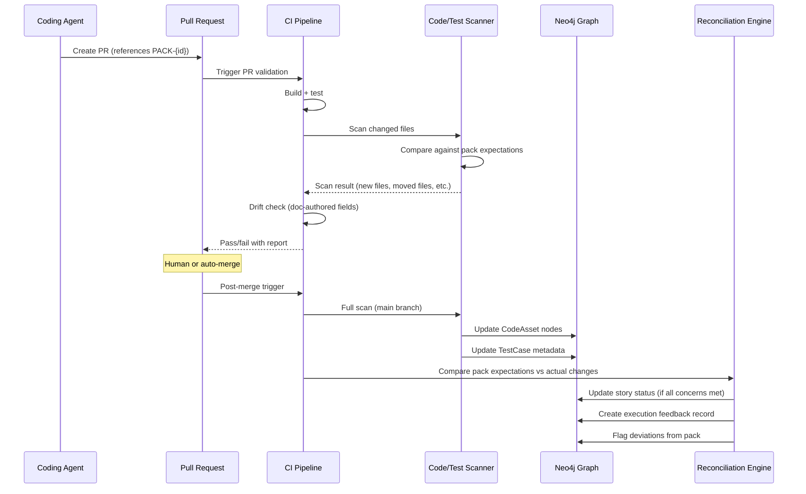
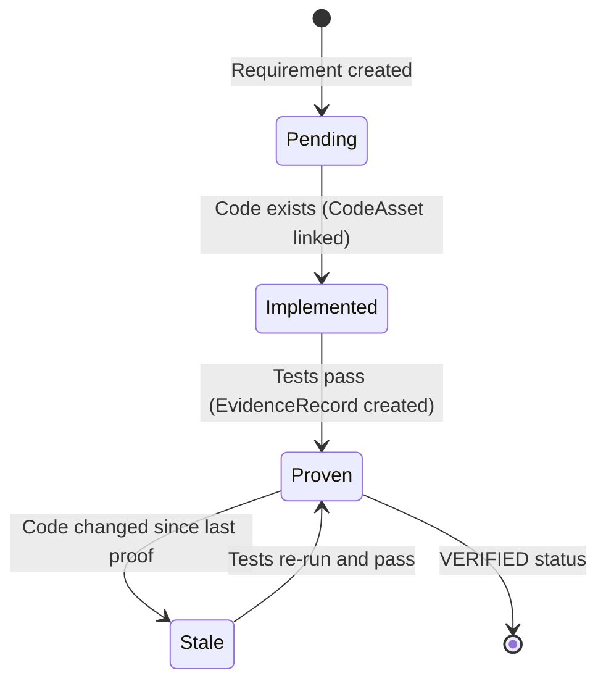
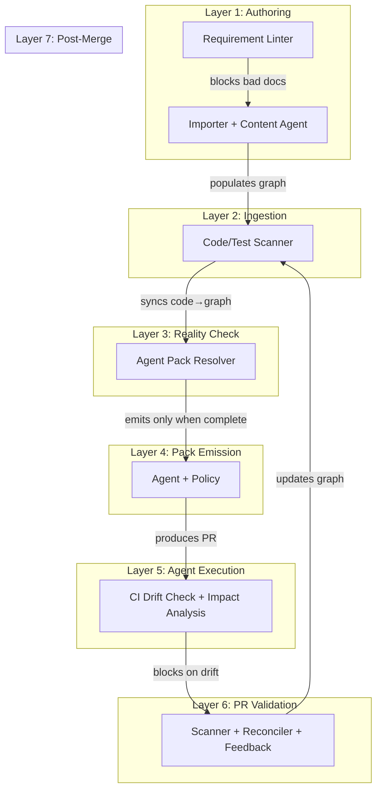
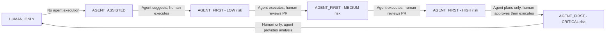
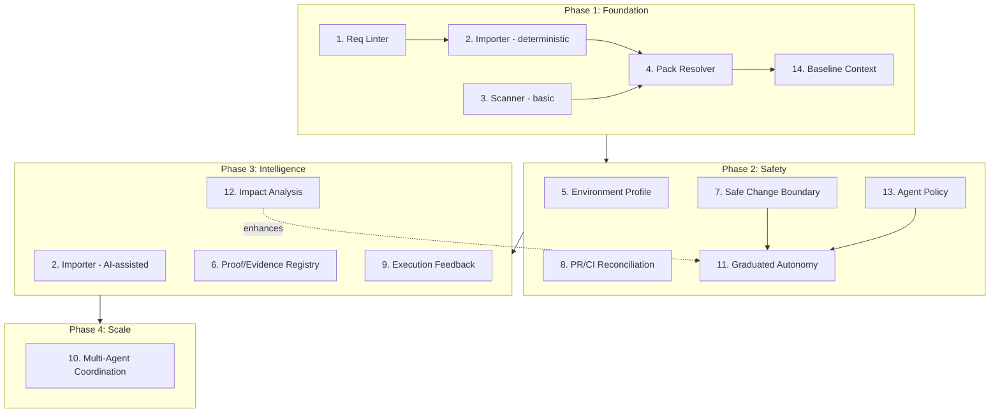

# Operational Near-Zero Drift — Design Spec

**Date:** 2026-03-14
**Status:** Draft
**Scope:** Application capabilities, operational protocols, enforcement model, and governance loop required for Design Hub to enable near-0 drift agent coding
**Depends on:** Agent-Ready Information Model spec (2026-03-14) — this spec does not re-specify CodeAsset, QualityConstraint, CodingConvention, ImportSnapshot, or TestCase enrichment

---

## 1. Scope, Non-Goals, and Dependencies

### Scope

This spec defines **what Design Hub must do as a running application and governance system** so that coding agents (Codex, Claude) can build documented applications with operational near-0 drift.

The Agent-Ready Information Model spec defines what the graph must **represent**. This spec defines what the application must **do**.

### Non-Goals

- Re-specifying graph model objects (covered by prior specs)
- Defining the graph query language or Cypher patterns (covered by prior specs)
- Specifying UI/UX design for application features (deferred to feature specs)
- Defining agent-internal architecture (Codex/Claude internals are opaque)

### Dependencies

| Dependency | What It Provides |
|-----------|-----------------|
| Meta-Model Revision (2026-03-14) | 65-node / 79-edge base model, BPMN alignment, delivery spine |
| Technical Execution Context (2026-03-14) | Application/ApplicationComponent attributes, Implementation Pack traversal, MCR-STORY-AGENT-READY-001 |
| Agent-Ready Information Model (2026-03-14) | CodeAsset (T1), TestCase enrichment, QualityConstraint (T1), CodingConvention (T2), ImportSnapshot (T2), RequirementSyncContract, legacy cleanup |

### Foundational Frozen Decision

> **Near-0 drift is an enforcement objective achieved through reconciliation and CI gating, not a guarantee of perfect semantic equivalence.**

The practical target:
1. Source docs are authoritative
2. Graph is derived and reconciled
3. Code/test reality is scanned back
4. CI blocks divergence
5. Agent packs are only emitted when completeness is sufficient

---

## 2. Capability Matrix

14 capabilities required for operational near-0 drift:

| # | Capability | Status | Blocking Level | Primary Owner | Dependencies |
|---|-----------|--------|---------------|---------------|-------------|
| 1 | Requirement Linter | Must add next | BLOCKING | Ingestion Pipeline | — |
| 2 | Markdown → Graph Importer | Must add next | BLOCKING | Ingestion Pipeline | Cap 1 |
| 3 | Code/Test Scanner | Must add next | BLOCKING | Reconciliation Engine | Cap 2 (graph must exist to compare against) |
| 4 | Agent Pack Resolver | Must add next | BLOCKING | Agent Execution Layer | Caps 1-3 (pack quality depends on graph quality) |
| 5 | Environment Profile | Must add next | BLOCKING | Agent Execution Layer | Cap 4 (pack includes environment) |
| 6 | Proof/Evidence Registry | Must add next | HIGH | Verification Layer | Caps 3-4 |
| 7 | Safe Change Boundary Model | Must add next | HIGH | Agent Execution Layer | Cap 3 (scanner identifies boundaries) |
| 8 | PR/CI Reconciliation Loop | Must add next | BLOCKING | Governance Loop | Caps 1-3, 6 |
| 9 | Agent Execution Feedback Loop | Must add next | HIGH | Governance Loop | Caps 3-4, 8 |
| 10 | Multi-Agent Coordination | Later maturity | HIGH | Agent Execution Layer | Caps 4, 7, 13 |
| 11 | Graduated Autonomy Model | Must add next | BLOCKING | Enforcement Layer | Caps 4, 7, 13 (basic); Cap 12 enhances in Phase 3 |
| 12 | Impact Analysis Engine | Must add next | HIGH | Intelligence Layer | Caps 2-3 (requires populated graph + code scan) |
| 13 | Agent Policy / Permission Model | Must add next | BLOCKING | Enforcement Layer | Cap 5 (environment defines boundaries) |
| 14 | Baseline / Branch Context | Must add next | BLOCKING | Agent Execution Layer | Caps 2, 4 |

### Capability Dependency Graph



Legend: Green = critical path to operational near-0 drift. Pink = later maturity.

---

## 3. Operational Protocols

### 3.1 Requirement Authoring Protocol

**Purpose:** Ensure source docs are well-formed before they enter the graph.

#### Doc Schema Requirements

Every requirement document (UserStory, Epic, Feature, BusinessProcess, Rule) must conform to a schema that defines:

| Requirement | Description | Enforcement |
|------------|-------------|-------------|
| Frontmatter block | YAML frontmatter with `id`, `type`, `status`, `version` | Linter — BLOCKING |
| Stable ID | Pattern ID matching graph convention (e.g., `US-{module}-{seq}`) | Linter — BLOCKING |
| Required sections | Defined per artifact type (see below) | Linter — WARNING (BLOCKING for AGENT_FIRST) |
| Cross-reference validity | All referenced IDs must exist in the graph or in other docs | Linter — WARNING |
| No duplicate IDs | Across entire doc corpus | Linter — BLOCKING |

#### Required Sections by Artifact Type

| Artifact Type | Required Sections |
|--------------|-------------------|
| UserStory | Description, Acceptance Criteria, Deliverables, Verification |
| Epic | Description, Features (list), Business Objective |
| Feature | Description, Stories (list), Acceptance Criteria |
| BusinessProcess | Description, Flow Nodes, Triggers, Outcomes |
| Rule | Description, Condition, Action, Exceptions |
| ApiContract | Path, Method, Request Schema, Response Schema, Error Contracts |

#### Authoring-Time Warnings

The linter should emit warnings (not blocks) for:
- Missing `executionMode` on UserStory (defaults to HUMAN_ONLY)
- Missing deliverable references (story with no DELIVERS targets)
- Missing verification references (story with no VERIFIED_BY targets)
- "Incomplete for agent use" when AGENT_FIRST story lacks required sections

### 3.2 Ingestion Protocol

**Purpose:** Transform authored requirement docs into graph nodes and edges with full audit trail.

#### Pipeline Architecture



#### Pipeline Stages

| Stage | Type | Input | Output | Failure Mode |
|-------|------|-------|--------|-------------|
| 1. Frontmatter Parser | Deterministic | Raw Markdown | Structured metadata (id, type, status, version, references) | REJECT — parse error |
| 2. Content Agent | AI-assisted | Markdown body + graph schema | Candidate nodes with attributes + candidate edges | PARTIAL — agent uncertainty flagged |
| 3. Schema Validator | Deterministic | Candidates | Validated candidates conforming to graph object catalog | REJECT — schema violation |
| 4. Reconciliation Engine | Deterministic | Validated candidates + current graph state | Upsert/update/conflict decisions | CONFLICT — queued for resolution |
| 5. Graph Upsert | Deterministic | Reconciled upsert commands | Neo4j mutations | FAILED — transaction rollback |
| 6. ImportSnapshot | Deterministic | Upsert result | Audit record with contentHash, result, itemCount | Always succeeds (audit) |

**Critical guardrail:** The AI content agent **proposes candidates**. Schema validation and reconciliation rules **decide what is admissible**. The agent does not become the source of truth. The agent's role is extraction and mapping, not authoring or overriding.

#### Content Agent Constraints

| Constraint | Description |
|-----------|-------------|
| Schema-bound | Agent output must conform to graph object catalog attribute types and enums |
| Non-creative | Agent extracts and maps — does not invent requirements, attributes, or relationships not present in the source doc |
| Confidence-tagged | Every candidate node/edge includes a confidence score (HIGH/MEDIUM/LOW) |
| Auditable | Agent reasoning is logged alongside ImportSnapshot for review |
| Idempotent | Re-running the agent on the same doc version produces the same candidates |

#### Re-Import / Update Semantics

| Scenario | Behavior |
|----------|----------|
| Doc unchanged (same contentHash) | Skip — no re-import needed |
| Doc updated (new contentHash) | Re-extract candidates, reconcile against existing graph nodes, update changed attributes, preserve graph-computed fields |
| Doc deleted / retired | Mark corresponding graph nodes as DEPRECATED, do not delete (preserve audit trail) |
| Doc ID changed | CONFLICT — old ID nodes become orphans, new ID nodes created, conflict queued for human resolution |
| New doc (no existing graph node) | Create new nodes/edges from candidates |

#### Import Diff Report

Every import produces a diff report:

```
Import: IMP-20260314-001
Source: docs/stories/US-SCR-042.md
Result: PARTIAL (3 nodes created, 1 edge updated, 1 conflict)

Created:
  + AcceptanceCriterion AC-US-SCR-042-01 (confidence: HIGH)
  + AcceptanceCriterion AC-US-SCR-042-02 (confidence: HIGH)
  + AcceptanceCriterion AC-US-SCR-042-03 (confidence: MEDIUM)

Updated:
  ~ UserStory US-SCR-042: description changed (hash: abc123 → def456)

Conflicts:
  ! DELIVERS edge: doc says US-SCR-042 → SCR-SETTINGS-01, graph has US-SCR-042 → SCR-SETTINGS-02
    Resolution: QUEUED (requires human decision)
```

### 3.3 Code/Test Scanning Protocol

**Purpose:** Discover actual code and test reality, sync back to graph, detect undocumented changes.

#### Scanner Responsibilities

| Scan Type | What It Discovers | Graph Action |
|-----------|-------------------|-------------|
| File discovery | Files in repo matching ApplicationComponent.modulePath | Create/update CodeAsset nodes |
| Test discovery | Test files, classes, methods, frameworks | Enrich TestCase metadata (testFilePath, testClassName, testMethodName, testFramework) |
| Component mapping | Package structure → ApplicationComponent boundaries | Validate HAS_CODE_ASSET edges |
| Orphan detection | CodeAsset nodes with no corresponding file | Mark DEPRECATED or flag for review |
| Undocumented files | Files touching modeled artifacts (by import/reference analysis) that have no CodeAsset | Flag as "undocumented implementation" |
| Implementation gap | Modeled artifacts (Screen, ApiContract, etc.) with no corresponding CodeAsset | Flag as "modeled but not implemented" |
| Rename/move detection | Files that moved (via git follow or content hash) | Update CodeAsset.filePath |

#### Scanner Output Contract

```typescript
interface ScanResult {
  scanId: string;              // Pattern: SCAN-{YYYYMMDD}-{seq}
  scannedAt: DateTime;
  repoCommit: string;          // Git SHA at scan time
  branch: string;

  discovered: CodeAssetCandidate[];   // New files found
  updated: CodeAssetUpdate[];         // Changed files (moved, renamed)
  orphaned: string[];                 // CodeAsset IDs with no file
  undocumented: UndocumentedFile[];   // Files touching modeled artifacts
  implementationGaps: string[];       // Artifact IDs with no CodeAsset

  testDiscovery: TestDiscoveryResult[];  // Test metadata found
}
```

#### Scan Triggers

| Trigger | Scope | Frequency |
|---------|-------|-----------|
| Post-merge to main | Full repo | Every merge |
| Pre-pack emission | Story-scoped (files relevant to story) | On demand |
| Scheduled | Full repo | Daily (configurable) |
| Manual | Configurable scope | On demand |

### 3.4 Agent Execution Protocol

**Purpose:** Define the contract between Design Hub and a coding agent for story execution.

#### Agent Pack Structure

The "Generate Agent Pack for Story X" endpoint produces:

```typescript
interface AgentPack {
  // Identity
  packId: string;               // Pattern: PACK-{storyId}-{version}
  packVersion: number;          // Monotonically increasing
  generatedAt: DateTime;

  // Baseline context (Capability 14)
  baseline: {
    repoCommit: string;         // Git SHA the pack was built against
    graphSnapshotId: string;    // Graph state identifier
    branch: string;             // Target branch
    dependencyManifest: string; // Lock file hash
  };

  // Story (Codex Q1: Why am I changing this?)
  story: {
    storyId: string;
    title: string;
    description: string;
    acceptanceCriteria: AcceptanceCriterion[];
    originType: string;
    executionMode: string;
  };

  // Deliverables (Codex Q2: What must exist when done?)
  deliverables: {
    screens: Screen[];
    apiContracts: ApiContract[];
    dataEntities: DataEntity[];
    rules: Rule[];
    messages: Message[];
  };

  // Code targets (Codex Q3: Where do I change it?)
  codeTargets: {
    components: ApplicationComponent[];  // With resolved paths
    codeAssets: CodeAsset[];             // With full resolved paths
    environment: EnvironmentProfile;     // Toolchain, bootstrap, prerequisites
  };

  // Safety boundaries (Codex Q4: What must I not break?)
  boundaries: {
    protectedAssets: CodeAsset[];        // Do not modify
    generatedFiles: CodeAsset[];         // Will be overwritten
    extensionPoints: CodeAsset[];        // Approved modification points
    conventions: CodingConvention[];     // With resolved docRef content
    qualityConstraints: QualityConstraint[];
    blastRadius: ImpactAnalysis;         // Affected downstream artifacts
  };

  // Verification targets (Codex Q5: How is success proven?)
  verification: {
    testCases: TestCase[];               // With execution metadata
    testCommands: string[];              // Resolved build + test commands
    qualityThresholds: QualityConstraint[];  // With measurable thresholds
  };

  // Completeness
  completeness: {
    isComplete: boolean;
    missingConcerns: string[];           // Which of the 5 concerns are unresolved
    missingFields: string[];             // Specific fields that are null
    readinessScore: number;              // 0-100
  };

  // Policy (Capability 13)
  policy: {
    allowedRepos: string[];
    allowedCommands: string[];
    requiresHumanApproval: boolean;
    maxFilesTouched: number;
    secretScopes: string[];              // What config/secrets are accessible
  };
}
```

#### Pack Emission Rules

| Rule | Description |
|------|-------------|
| Completeness gate | Pack is NOT emitted if `isComplete = false` AND `executionMode = AGENT_FIRST`. For AGENT_ASSISTED, pack is emitted with warnings. |
| Baseline freshness | Pack is NOT emitted if `baseline.repoCommit` is more than N commits behind HEAD (configurable, default 10) |
| Scan freshness | Pack is NOT emitted if last code scan is older than configured threshold (default 24h) |
| Policy attachment | Every pack includes the agent's policy constraints. Agent must not exceed these boundaries. |
| Version tracking | Every emission increments `packVersion`. Agent execution references the exact pack version used. |

### 3.5 Reconciliation Protocol

**Purpose:** After agent execution and merge, reconcile graph state with code reality.

#### Post-Merge Reconciliation Flow



#### PR-to-Story Linking

| Mechanism | Description |
|-----------|-------------|
| Pack reference | PR description or commit message includes `PACK-{storyId}-{version}` |
| File-to-CodeAsset | Changed files are matched to CodeAsset nodes via path resolution |
| CodeAsset-to-Story | CodeAsset → ASSET_FOR_* → Artifact ← DELIVERS ← UserStory |
| Verification | If PR touches files outside the pack's code targets, flag as deviation |

#### Automatic Status Advancement

Status advances automatically **only when proof exists**:

| Current Status | Advances To | Required Proof |
|---------------|-------------|----------------|
| APPROVED | IN_IMPLEMENTATION | ≥1 PR linked to story pack |
| IN_IMPLEMENTATION | IMPLEMENTED | All DELIVERS targets have corresponding CodeAssets with passing tests |
| IMPLEMENTED | VERIFIED | All VERIFIED_BY TestCases pass AND all SATISFIED_BY TestCases pass |

**No status advances without proof.** Manual override requires human approval and is logged.

---

## 4. Required Application Capabilities

### Capability 1: Requirement Linter

**Purpose:** Validate requirement docs before ingestion.

**Product feature:** CLI tool + CI gate that validates Markdown requirement docs against the doc schema.

| Aspect | Specification |
|--------|--------------|
| Input | Markdown file path or glob pattern |
| Output | Lint report (errors, warnings, info) |
| Integration | Pre-commit hook, CI PR gate, editor plugin (optional) |
| Configuration | `.requirement-lint.yml` with per-artifact-type rules |

**Output contract:**

```typescript
interface LintResult {
  file: string;
  artifactId: string;
  artifactType: string;
  errors: LintIssue[];     // BLOCKING — prevents import
  warnings: LintIssue[];   // Non-blocking — flagged for review
}

interface LintIssue {
  rule: string;            // e.g., "stable-id-format", "required-section-missing"
  line: number;
  message: string;
  severity: 'ERROR' | 'WARNING' | 'INFO';
  autoFixable: boolean;
}
```

### Capability 2: Markdown → Graph Importer

**Purpose:** Transform validated requirement docs into graph nodes and edges.

**Product feature:** Service endpoint + CLI tool that runs the ingestion pipeline (Section 3.2).

| Aspect | Specification |
|--------|--------------|
| Input | Validated Markdown file(s) or directory |
| Output | Import diff report + ImportSnapshot record |
| Integration | CI post-merge hook, manual trigger via API/CLI |
| AI component | Content agent for semantic extraction (schema-bound, non-creative, confidence-tagged) |

**Input contract:**

```typescript
interface ImportRequest {
  sources: string[];         // File paths or glob patterns
  mode: 'FULL' | 'INCREMENTAL' | 'DRY_RUN';
  conflictStrategy: 'QUEUE' | 'OVERWRITE' | 'SKIP';
}
```

**Output contract:**

```typescript
interface ImportResult {
  snapshotId: string;        // ImportSnapshot ID
  result: 'SUCCESS' | 'PARTIAL' | 'FAILED' | 'CONFLICTED';
  created: NodeSummary[];
  updated: NodeSummary[];
  conflicts: ConflictSummary[];
  errors: string[];
  diffReport: string;        // Human-readable diff
}
```

### Capability 3: Code/Test Scanner

**Purpose:** Discover code/test reality and sync back to graph.

**Product feature:** Service endpoint + CLI tool that scans repositories and updates graph state.

| Aspect | Specification |
|--------|--------------|
| Input | Repository path + optional scope (full, story-scoped, component-scoped) |
| Output | Scan result (Section 3.3) |
| Integration | Post-merge CI hook, pre-pack trigger, scheduled job |

**Output contract:** See `ScanResult` interface in Section 3.3.

### Capability 4: Agent Pack Resolver

**Purpose:** Produce a complete, versioned agent pack for a given story.

**Product feature:** REST API endpoint + UI view.

| Aspect | Specification |
|--------|--------------|
| Endpoint | `GET /api/v1/stories/{storyId}/agent-pack` |
| Input | Story ID + optional baseline override |
| Output | AgentPack (Section 3.4) |
| Caching | Pack is cached until story or its transitive dependencies change |
| Versioning | Each emission increments pack version |

**View requirements:**
- Story summary with 5-concern gate status
- Deliverables with linked code assets
- Missing concerns highlighted with actionable reasons
- "Download Pack" / "Copy Pack JSON" actions
- Pack history (previous versions with diffs)

### Capability 5: Environment Profile

**Purpose:** Capture runtime prerequisites so agents can bootstrap execution environments.

**Model extension needed:** Enrich Application and ApplicationComponent with:

| Attribute | On | Type | Description |
|-----------|-----|------|-------------|
| toolchainVersions | ApplicationComponent | Map\<String, String\> | e.g., `{"java": "21.0.2", "node": "20.11.0", "angular-cli": "17.3"}` |
| bootstrapSteps | Application | List\<String\> | Ordered commands to set up workspace |
| secretPrerequisites | ApplicationComponent | List\<String\> | Required secret/config keys (not values) |
| fixturePrerequisites | ApplicationComponent | List\<String\> | Required seed data or fixture descriptions |
| externalDependencies | ApplicationComponent | List\<ExternalDependency\> | External services required (name, healthCheckUrl, required) |
| localRunCommand | ApplicationComponent | String | Command to start the component locally |
| localRunPrerequisites | ApplicationComponent | List\<String\> | What must be running before this component starts |

**Note:** These are new attributes on existing objects, not new nodes. They extend ApplicationComponent from the Technical Execution Context spec.

### Capability 6: Proof/Evidence Registry

**Purpose:** Link requirements to concrete proof artifacts with provenance.

**Model extension needed:**

| Concept | Treatment | Description |
|---------|-----------|-------------|
| EvidenceRecord | New T2 registry | Records a proof artifact (test result, screenshot, contract snapshot) linked to a requirement |
| expectedAssertions | TestCase attribute | List of assertions this test must check (not just "test exists") |
| goldenBaseline | New edge: BASELINED_BY | Links Screen/ApiContract to a golden baseline EvidenceRecord (screenshot, contract snapshot, visual regression artifact) |
| proofProvenance | EvidenceRecord attribute | When the proof was produced, by whom, on which commit |
| "implemented but unproven" | Computed state | Story has DELIVERS targets with CodeAssets but no passing VERIFIED_BY tests |

**Evidence lifecycle:**



### Capability 7: Safe Change Boundary Model

**Purpose:** Tell agents what they must not modify.

**Model extension needed:** Enrich CodeAsset with:

| Attribute | Type | Description |
|-----------|------|-------------|
| changePolicy | Enum | OPEN (freely modifiable), EXTENSION_ONLY (add, don't modify), PROTECTED (no agent changes), GENERATED (will be overwritten) |
| ownerAgent | String | Which agent/team owns this file (for conflict resolution) |
| migrationRequired | Boolean | Changes to this file require a migration script |
| backwardCompatibilityObligation | Boolean | Changes must not break existing consumers |

**New relationship:**

| Edge | Source | Target | Description |
|------|--------|--------|-------------|
| DEPENDS_ON_ASSET | CodeAsset | CodeAsset | Dependency between code files (blast radius) |

**Blast radius computation:** Given a CodeAsset, traverse DEPENDS_ON_ASSET transitively to compute all affected files. This feeds the `blastRadius` field in the agent pack.

### Capability 8: PR/CI Reconciliation Loop

**Purpose:** Close the loop between code changes and graph state.

**Product features:**

| Feature | Description |
|---------|-------------|
| PR-to-story link extraction | Parse PR description/commits for PACK references |
| Changed-file-to-CodeAsset matching | Map PR file diff to CodeAsset nodes via path resolution |
| Drift check gate | Compare doc-authored fields in graph against Git docs (zero tolerance) |
| Post-merge graph update | Scanner runs, CodeAssets updated, TestCase metadata refreshed |
| Stale node detection | Scheduled job flags graph nodes with no recent scan or import |
| Orphan detection | CodeAsset with no file, TestCase with no test file, Story with no PR |

**CI gate output contract:**

```typescript
interface DriftCheckResult {
  passed: boolean;
  docAuthoredDrift: DriftItem[];    // BLOCKING
  graphComputedDrift: DriftItem[];  // Informational only
  orphanedNodes: string[];          // Warning
  staleNodes: string[];             // Warning
}

interface DriftItem {
  nodeId: string;
  field: string;
  graphValue: string;
  docValue: string;
  driftType: 'DOC_AUTHORED' | 'GRAPH_COMPUTED';
}
```

### Capability 9: Agent Execution Feedback Loop

**Purpose:** Record what the agent actually did vs. what the pack said to do.

**Product feature:** Post-execution report ingestion endpoint.

| Aspect | Specification |
|--------|--------------|
| Input | Execution report from agent (files touched, tests run, deviations) |
| Output | Execution feedback record in graph |
| Integration | Agent submits report after PR creation; CI can also generate from PR diff |

**Execution feedback record:**

```typescript
interface ExecutionFeedback {
  feedbackId: string;           // Pattern: EXEC-{packId}-{seq}
  packId: string;               // Which pack was used
  packVersion: number;
  executedAt: DateTime;
  executedBy: string;           // Agent identifier

  // Planned vs actual
  plannedFiles: string[];       // CodeAssets from pack
  actualFilesTouched: string[]; // Files actually modified
  newFilesCreated: string[];    // Files not in pack

  // Test results
  testsRun: TestResult[];
  testsSkipped: string[];

  // Deviations
  deviations: Deviation[];

  // Overall
  result: 'ALIGNED' | 'DEVIATED' | 'FAILED';
}

interface Deviation {
  type: 'EXTRA_FILE' | 'MISSING_FILE' | 'UNEXPECTED_CHANGE' | 'SCOPE_EXCEEDED';
  description: string;
  severity: 'INFO' | 'WARNING' | 'BLOCKING';
}
```

### Capability 10: Multi-Agent Coordination (Later Maturity)

**Purpose:** Prevent conflicts when multiple agents work on overlapping stories.

| Feature | Description |
|---------|-------------|
| CodeAsset locking | Optimistic locking — agent claims assets at pack emission, conflict detected at PR time |
| Pack invalidation | If a story's transitive dependencies change while an agent is working, the pack is invalidated and agent is notified |
| Conflict detection | Pre-merge check: do two PRs modify the same CodeAssets? If so, require sequential merge with re-scan between |
| Priority ordering | When two agents compete for the same CodeAsset, the higher-priority story wins |

**Deferred to later maturity** because single-agent execution is the immediate target.

### Capability 11: Graduated Autonomy Model

**Purpose:** Not all stories deserve the same level of agent trust.

#### Risk Scoring

| Factor | Weight | Scoring |
|--------|--------|---------|
| Blast radius | 3x | Number of transitively affected CodeAssets |
| Cross-service impact | 3x | Story spans >1 ApplicationComponent |
| Data model changes | 2x | Story DELIVERS DataEntity |
| API contract changes | 2x | Story DELIVERS ApiContract |
| Security-sensitive | 3x | Story touches Permission, auth components, or PROTECTED CodeAssets |
| First-time file | 1x | Story creates new CodeAssets (no prior history) |

**Risk levels:**

| Score | Level | Agent Autonomy |
|-------|-------|---------------|
| 0-5 | LOW | Auto-approve, no human gate |
| 6-12 | MEDIUM | Agent executes, human reviews PR before merge |
| 13-20 | HIGH | Agent produces plan only, human approves before execution |
| 21+ | CRITICAL | Human-only, agent provides analysis but does not execute |

#### Dry-Run Mode

For HIGH and CRITICAL stories, the agent pack includes a `dryRun: true` flag. The agent:
1. Produces a change plan (files to modify, estimated diff)
2. Does NOT create a PR
3. Submits the plan for human review
4. Only executes after human approval

#### Rollback Requirement

Stories above MEDIUM risk must include a rollback plan in the agent pack:
- Which files to revert
- Which migrations to roll back
- Which tests to re-run to verify rollback

### Capability 12: Impact Analysis Engine

**Purpose:** Pre-change and post-change semantic blast-radius analysis.

**Product feature:** Service endpoint for impact queries.

| Query | Input | Output |
|-------|-------|--------|
| "What does changing this artifact affect?" | Artifact ID | Transitively affected artifacts, screens, APIs, tests, stories |
| "What stories become stale if this artifact changes?" | Artifact ID | Stories with DELIVERS edges to affected artifacts |
| "What is the blast radius of this PR?" | PR diff (file list) | Affected CodeAssets → artifacts → stories → tests |

**Traversal pattern:**

```
Changed file → CodeAsset → ASSET_FOR_* → Artifact
                                        → DELIVERS ← UserStory
                                        → VERIFIED_BY → TestCase
                                        → HAS_QUALITY_CONSTRAINT → QualityConstraint

CodeAsset → DEPENDS_ON_ASSET → CodeAsset (transitive)
         → Each dependent CodeAsset → same traversal above
```

### Capability 13: Agent Policy / Permission Model

**Purpose:** Define what an agent is authorized to do.

**Model extension needed:**

| Concept | Treatment | Description |
|---------|-----------|-------------|
| AgentPolicy | New T2 registry | Named policy with permission constraints |
| GOVERNED_BY_POLICY | New edge | Links Application or ApplicationComponent to AgentPolicy |

#### Policy Attributes

| Attribute | Type | Description |
|-----------|------|-------------|
| policyId | String | Pattern: `POL-{scope}-{seq}` |
| name | String | e.g., "Backend Service Agent Policy" |
| allowedRepos | List\<String\> | Repository paths agent may access |
| allowedCommands | List\<String\> | Commands agent may execute (whitelist) |
| forbiddenCommands | List\<String\> | Commands agent must not execute (blacklist overrides whitelist) |
| allowedEnvironments | List\<String\> | Environments agent may access (dev, staging — never production) |
| secretScopes | List\<String\> | Config/secret keys agent may read (not values) |
| maxFilesTouched | Integer | Upper bound on files per execution |
| requiresHumanApproval | Boolean | Whether agent execution requires human gate |
| approvalThreshold | String | Risk level above which human approval is required |

### Capability 14: Baseline / Branch Context

**Purpose:** Ensure agent pack is reproducible and tied to a specific point in time.

**Included in AgentPack.baseline** (Section 3.4). No additional model extension needed — this is an operational concern resolved by the pack resolver capturing:

| Baseline Field | Source |
|---------------|--------|
| repoCommit | `git rev-parse HEAD` at pack generation time |
| graphSnapshotId | Monotonic ID from last ImportSnapshot + last ScanResult |
| branch | Target branch for agent's PR |
| dependencyManifest | Hash of lock files (pom.xml hash, package-lock.json hash) |
| requirementSnapshot | Hash of all requirement docs referenced by the story |

**Staleness rule:** If any baseline field changes between pack emission and PR creation, the PR validation gate flags "stale pack" and requires re-generation.

---

## 5. Enforcement and Autonomy Model

### Enforcement Layers



### Where Drift Is Caught

| Drift Type | Caught At | Enforcement |
|-----------|-----------|-------------|
| Bad requirement doc | Layer 1 (Linter) | BLOCKING — doc not importable |
| Import conflict | Layer 2 (Importer) | QUEUED — human resolution |
| Undocumented code | Layer 3 (Scanner) | WARNING — flagged for review |
| Incomplete pack | Layer 4 (Pack Resolver) | BLOCKING for AGENT_FIRST — pack not emitted |
| Policy violation | Layer 5 (Agent) | BLOCKING — agent constrained by policy |
| Doc-authored drift | Layer 6 (CI) | BLOCKING — PR fails |
| Graph-code divergence | Layer 7 (Reconciler) | WARNING — stale nodes flagged |
| Agent deviation | Layer 7 (Feedback) | WARNING or BLOCKING based on severity |

### Autonomy Spectrum



---

## 6. Phase Plan / Adoption Order

### Phase 1: Foundation (Enables Agent Coding)

| Priority | Capability | What to Build | Depends On |
|----------|-----------|---------------|------------|
| P0 | 1. Requirement Linter | CLI tool + CI gate | — |
| P0 | 2. Importer (deterministic only) | Frontmatter parser + schema validator + graph upsert + ImportSnapshot | Cap 1 |
| P0 | 3. Code/Test Scanner (basic) | File discovery + test discovery + orphan detection | — |
| P0 | 4. Agent Pack Resolver | REST endpoint + pack structure + completeness gate | Caps 1-3 |
| P0 | 14. Baseline/Branch Context | Embed in pack resolver | Cap 4 |

**Milestone:** Agent can receive a pack and code safely. Graph is populated. Code reality is scanned.

### Phase 2: Safety (Enables Trusted Execution)

| Priority | Capability | What to Build | Depends On |
|----------|-----------|---------------|------------|
| P1 | 5. Environment Profile | ApplicationComponent enrichment + pack inclusion | Phase 1 |
| P1 | 7. Safe Change Boundary | CodeAsset enrichment (changePolicy, ownerAgent) + DEPENDS_ON_ASSET | Phase 1 |
| P1 | 8. PR/CI Reconciliation | PR-to-story linking + drift gate + post-merge scanner | Phase 1 |
| P1 | 11. Graduated Autonomy (basic) | Risk scoring from DEPENDS_ON_ASSET blast radius + dry-run mode. Phase 3 enhances with Cap 12 full transitive impact analysis | Caps 7, 13 |
| P1 | 13. Agent Policy/Permission | AgentPolicy T2 + GOVERNED_BY_POLICY edge | Phase 1 |

**Milestone:** Agent execution is policy-bounded, risk-scored, and reconciled.

### Phase 3: Intelligence (Enables Proactive Quality)

| Priority | Capability | What to Build | Depends On |
|----------|-----------|---------------|------------|
| P2 | 2. Importer (AI-assisted) | Content agent for semantic extraction | Phase 1 importer |
| P2 | 6. Proof/Evidence Registry | EvidenceRecord T2 + BASELINED_BY edge + evidence lifecycle | Phase 2 |
| P2 | 9. Agent Execution Feedback | Execution feedback ingestion + deviation tracking | Phase 2 |
| P2 | 12. Impact Analysis Engine | Transitive blast-radius queries + stale story detection | Phase 2 |

**Milestone:** System proactively detects quality issues and provides intelligence.

### Phase 4: Scale (Enables Multi-Agent Operations)

| Priority | Capability | What to Build | Depends On |
|----------|-----------|---------------|------------|
| P3 | 10. Multi-Agent Coordination | Optimistic locking + pack invalidation + conflict detection | Phase 3 |

**Milestone:** Multiple agents can work concurrently without conflict.

### Phase Dependency Diagram



---

## 7. Model Extensions Summary

This spec requires the following model changes beyond the Agent-Ready Information Model spec:

### New Attributes on Existing Objects

| Object | New Attributes | Phase |
|--------|---------------|-------|
| ApplicationComponent | toolchainVersions, secretPrerequisites, fixturePrerequisites, externalDependencies, localRunCommand, localRunPrerequisites | Phase 2 |
| Application | bootstrapSteps | Phase 2 |
| CodeAsset | changePolicy, ownerAgent, migrationRequired, backwardCompatibilityObligation | Phase 2 |
| TestCase | expectedAssertions | Phase 3 |

### New Objects

| Object | Tier | Phase | Description |
|--------|------|-------|-------------|
| EvidenceRecord | T2 | Phase 3 | Proof artifact linking test results/screenshots to requirements |
| AgentPolicy | T2 | Phase 2 | Named permission policy for agent execution |

### New Edges

| Edge | Source | Target | Phase |
|------|--------|--------|-------|
| DEPENDS_ON_ASSET | CodeAsset | CodeAsset | Phase 2 |
| BASELINED_BY | Screen, ApiContract | EvidenceRecord (golden baseline) | Phase 3 |
| GOVERNED_BY_POLICY | Application, ApplicationComponent | AgentPolicy | Phase 2 |

### Updated Model Counts (Cumulative)

| Metric | After Agent-Ready Spec (Full) | After This Spec (Phase 2) | After This Spec (Full) |
|--------|------------------------------|--------------------------|----------------------|
| T1 nodes | 54 | 54 | 54 |
| T2 nodes | 11 | 12 (+AgentPolicy) | 13 (+EvidenceRecord) |
| Total nodes | 69 | 70 | 71 |
| Total edges | 90 | 92 (+DEPENDS_ON_ASSET, +GOVERNED_BY_POLICY) | 93 (+BASELINED_BY) |

---

## 8. Interfaces Summary

| Interface | Input | Output | Section |
|-----------|-------|--------|---------|
| Requirement Linter | Markdown file path | LintResult (errors, warnings) | 4.1 |
| Markdown Importer | ImportRequest (sources, mode, conflictStrategy) | ImportResult (snapshot, diff report) | 4.2 |
| Content Agent | Markdown body + graph schema | Candidate nodes/edges with confidence | 3.2 |
| Code/Test Scanner | Repo path + scope | ScanResult (discovered, updated, orphaned, gaps) | 3.3, 4.3 |
| Agent Pack Resolver | Story ID + baseline override | AgentPack (full resolved pack) | 3.4, 4.4 |
| CI Drift Check | PR diff + graph state | DriftCheckResult (pass/fail, drift items) | 4.8 |
| Execution Feedback | ExecutionFeedback report | Graph update + deviation record | 4.9 |
| Impact Analysis | Artifact ID or PR diff | Affected artifacts, stories, tests (transitive) | 4.12 |

---

## 9. Verification Checklist

| # | Check | Pass Criteria |
|---|-------|--------------|
| 1 | Near-0 drift is enforcement objective | Frozen decision documented, not "guarantee" |
| 2 | 14 capabilities identified | All 14 in capability matrix with status, blocking level, owner, dependencies |
| 3 | Ingestion pipeline is AI-assisted, not AI-authored | Content agent proposes, schema validates, agent is not source of truth |
| 4 | Pack emission gated | Incomplete packs not emitted for AGENT_FIRST stories |
| 5 | Baseline context in every pack | repoCommit, graphSnapshotId, branch, dependencyManifest, requirementSnapshot |
| 6 | Drift tolerance defined | Zero for doc-authored, allowed for graph-computed |
| 7 | Status advancement requires proof | No automatic status change without passing tests |
| 8 | Risk scoring defined | Factors, weights, and autonomy levels specified |
| 9 | Policy model exists | AgentPolicy with allowed/forbidden commands, repos, environments |
| 10 | Feedback loop closes | Agent execution report ingested, deviations tracked |
| 11 | Phase plan ordered | 4 phases with dependencies, milestones, and capability mapping |
| 12 | All interfaces defined | 8 interface contracts with input/output types |
| 13 | Model extensions enumerated | New attributes, new objects, new edges, updated counts |
| 14 | Propagation to prior specs | Agent-Ready spec and plan file need count updates |
