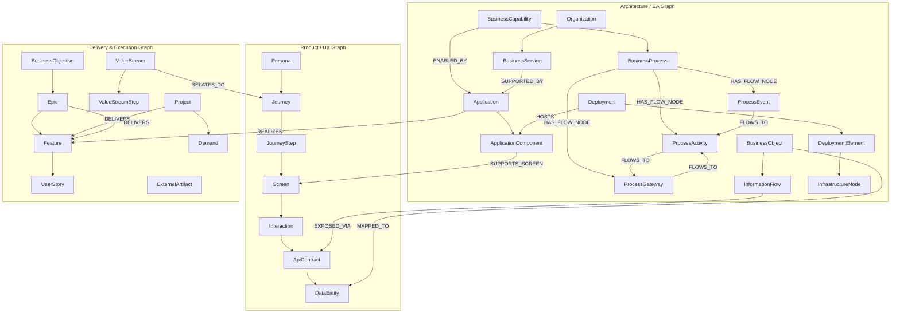
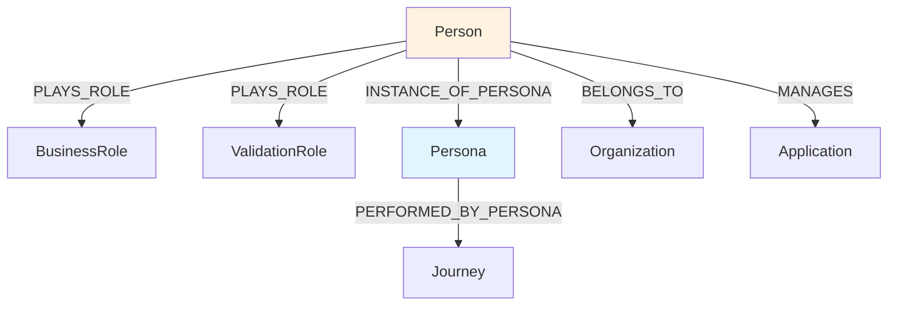
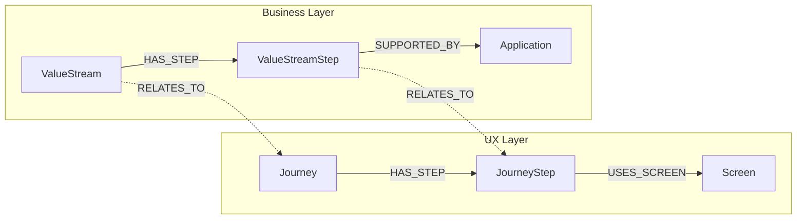
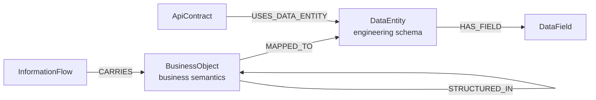
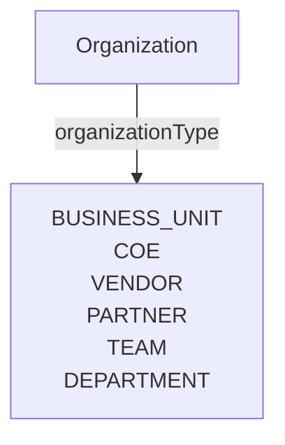

# Alfabet-to-Design Hub Alignment Matrix

**Status:** Draft
**Source:** Alfabet Accelerator Metamodel (6-slide deck — `02-02 Accelerator - Metamodel.pptx`)
**Purpose:** Map enterprise architecture and portfolio concepts from the Alfabet metamodel to Design Hub graph objects. Classify each concept for adoption, alignment, or exclusion.

**Related documents:**

- `modeling-taxonomy.md` (tier classification rules)
- `graph-object-catalog.md` (full per-object specifications)
- `product-vision.md` (traversal spine, canonical views)
- `feature-capability-map.md` (view registry including architecture views)

---

## 1. Context

The Alfabet Accelerator metamodel provides an enterprise architecture and portfolio metamodel covering 6 domains:

1. **Business Architecture** — Business Capability, Business Process, Organization, Person, Vendor, Business Support
2. **Application Architecture** — Application, Local Component, Business Data Usage
3. **Information Architecture** — Business Data, Business Object, Information Flow
4. **Technology Architecture** — Component, IT Capability, Physical/Virtual Server, Deployment, Deployment Element, Interface System
5. **Service Architecture** — Business Service, Support Service, SLA, Service Items, Service Consumers
6. **Investment Portfolio** — Strategic Theme, Portfolio, ART, PI, Epic, Feature, Story, Value Stream, Value Stream Step, Solution, Demand, Project, Bucket

Design Hub's current 65-element model (52 T1 + 9 T2 + 4 T3) covers the **product/delivery/UX layer** and the **architecture/EA layer** — personas, journeys, screens, interactions, APIs, stories, capabilities, applications, components, deployments. The Alfabet deck covers the **enterprise context layer** — capabilities, applications, components, deployments, portfolio.

These two layers connect but do not replace each other.

---

## 2. Three Connected Object Families

Design Hub should maintain one graph, one canvas, one detail panel, but support three connected object families:

**Design rule:** The same node can appear in different views. For example:
- `Application` appears in Application Architecture View, Infrastructure View, and Delivery Traceability
- `DataEntity` appears in Data Architecture View and API/Delivery View
- `Screen` appears in Screen Flow View, Journey View, and Application Architecture View
- `ApiContract` appears in Delivery View, Application Architecture View, and Data Architecture View

---

## 3. Alignment Matrix

### 3.1 Classification legend

| Classification | Meaning |
|---------------|---------|
| **Direct match** | Alfabet concept maps 1:1 to an existing Design Hub object |
| **Partial match / reshape** | Alfabet concept overlaps with an existing object but needs attribute or scope adjustment |
| **New T1 node** | Alfabet concept should become a new Tier 1 first-class node in Design Hub |
| **New T2 registry** | Alfabet concept should become a new Tier 2 registry node |
| **Relationship property** | Alfabet concept is better modeled as edge payload, not a standalone node |
| **Out of scope** | Alfabet concept is not relevant for Design Hub's current or planned domain |

### 3.2 Critical modeling rule

> **Persona is NOT the parent of everything human-related.**

| Concept | Correct Model |
|---------|--------------|
| Persona | UX archetype — behavioral model, not a real person |
| Person | Real actor or stakeholder. `Person -[PLAYS_ROLE]-> BusinessRole/ValidationRole`. `Person -[INSTANCE_OF_PERSONA]-> Persona` when relevant |
| Vendor | External organization. Subtype of `Organization` with `organizationType = VENDOR`, NOT a Persona |

### 3.3 Business Architecture alignment

| Alfabet Concept | Design Hub Object | Classification | Tier | Priority | Notes |
|----------------|-------------------|---------------|------|----------|-------|
| **Business Capability** | `BusinessCapability` | **New T1 node** | T1 | P0 | Stable functional classification ("Onboarding", "KYC"). Not time-bound like BusinessObjective. Links: `BusinessObjective -[REQUIRES_CAPABILITY]-> BusinessCapability`, `Feature -[REALIZES]-> BusinessCapability`, `BusinessCapability -[ENABLED_BY]-> Application` |
| **Business Process** | `BusinessProcess` | **New T1 node** | T1 | P1 | Formal process model (BPMN-aligned). NOT the same as Journey — Journey is UX-focused, BusinessProcess is operations-focused. Links: `BusinessCapability -[REALIZED_BY_PROCESS]-> BusinessProcess`, `BusinessProcess -[SUPPORTED_BY]-> Application` |
| **Organization** | `Organization` | **New T1 node** | T1 | **P0** | Business units, CoEs, departments. Carries `organizationType` enum: `BUSINESS_UNIT`, `COE`, `VENDOR`, `PARTNER`, `TEAM`. Links: `Organization -[OWNS]-> Application`, `Organization -[PROVIDES]-> BusinessService`, `Person -[BELONGS_TO]-> Organization` |
| **Person** | `Person` | **New T1 node** | T1 | P1 | Real actor/stakeholder — application manager, business owner, IT owner, architect. NOT the same as Persona. Links: `Person -[PLAYS_ROLE]-> BusinessRole`, `Person -[INSTANCE_OF_PERSONA]-> Persona`, `Person -[BELONGS_TO]-> Organization`, `Person -[MANAGES]-> Application` |
| **Vendor** | `Organization` subtype | **Partial match** | — | P1 | Model as `Organization` with `organizationType = VENDOR`. Add `vendorStatus`, `contractRef` attributes. Do NOT create separate Vendor node. |
| **Business Support** | `BusinessService` | **New T1 node** | T1 | P2 | Business-level service wrapper. Links: `BusinessService -[SUPPORTED_BY]-> Application`, `BusinessService -[SUPPORTS]-> BusinessCapability`, `BusinessService -[HAS_SLA]-> SLA (T2)`. Includes both Business Service and Support Service from Alfabet. |

### 3.4 Application Architecture alignment

| Alfabet Concept | Design Hub Object | Classification | Tier | Priority | Notes |
|----------------|-------------------|---------------|------|----------|-------|
| **Application** | `Application` | **New T1 node** | T1 | P1 | Central node in EA model. If Design Hub models a single product, Application is implicit. If cross-app traceability needed, it becomes explicit. Links: `Application -[REALIZES]-> Feature`, `Application -[HAS_COMPONENT]-> ApplicationComponent`, `Organization -[OWNS]-> Application` |
| **Local Component** | `ApplicationComponent` | **New T1 node** | T1 | P1 | Technical component within an application. Links: `ApplicationComponent -[SUPPORTS_SCREEN]-> Screen`, `ApplicationComponent -[EXPOSES]-> ApiContract`, `Deployment -[HOSTS]-> ApplicationComponent` |
| **IT Capability** | `ITCapability` | **New T1 node** | T1 | P2 | Technical capability classification. Links: `ITCapability -[PROVIDED_BY]-> Component`, `ApplicationComponent -[DERIVED_FROM]-> ITCapability` |
| **Interface System** | `Integration` (existing T1) | **Partial match** | T1 | — | Already designed in graph-object-catalog.md. May need attributes for system-level topology beyond API contracts. |
| **Business Data Usage** | Relationship property | **Relationship property** | — | P2 | Better as edge payload on `Application -[USES_DATA]-> BusinessObject` relationship. Promote to T1/T3 only if independently queried. |

### 3.5 Information Architecture alignment

| Alfabet Concept | Design Hub Object | Classification | Tier | Priority | Notes |
|----------------|-------------------|---------------|------|----------|-------|
| **Business Object** | `BusinessObject` | **New T1 node** | T1 | P1 | Business-level data concept ("Customer", "Contract", "Invoice"). NOT the same as `DataEntity` — BusinessObject is business semantics, DataEntity is engineering schema. Links: `BusinessObject -[MAPPED_TO]-> DataEntity`, `BusinessObject -[STRUCTURED_IN]-> BusinessObject` (hierarchy), `InformationFlow -[CARRIES]-> BusinessObject` |
| **Business Data** | `BusinessObject` attribute or T3 | **Partial match** | T3 | P2 | In Alfabet, Business Data is a container for business objects. In Design Hub, this can be an attribute of BusinessObject (`dataClassification`, `sensitivity`) rather than a separate node. |
| **Information Flow** | `InformationFlow` | **New T1 node** | T1 | P1 | Data movement between applications. Links: `Application -[SOURCE_OF]-> InformationFlow`, `Application -[TARGET_OF]-> InformationFlow`, `InformationFlow -[CARRIES]-> BusinessObject`, `InformationFlow -[EXPOSED_VIA]-> ApiContract` |

### 3.6 Technology Architecture alignment

| Alfabet Concept | Design Hub Object | Classification | Tier | Priority | Notes |
|----------------|-------------------|---------------|------|----------|-------|
| **Component** (technology) | `ApplicationComponent` | **Covered in 3.4** | T1 | P1 | Same as Local Component — technical component. Alfabet uses "Component" at technology layer and "Local Component" at application layer; Design Hub should use a single `ApplicationComponent` with a `componentType` attribute. |
| **Deployment** | `Deployment` | **New T1 node** | T1 | P2 | Deployment configuration. Links: `Deployment -[HOSTS]-> ApplicationComponent`, `Deployment -[DEPLOYED_ON]-> InfrastructureNode` (deprecated `DEPLOYS` edge removed) |
| **Deployment Element** | `DeploymentElement` | **New T1 node** | T1 | P2 | Deployable unit (container, package, artifact). Links: `Deployment -[CONTAINS]-> DeploymentElement`, `DeploymentElement -[DEPLOYED_ON]-> InfrastructureNode` |
| **Physical / Virtual Server** | `InfrastructureNode` | **New T1 node** | T1 | P2 | Server, VM, container host, cloud instance. Links: `InfrastructureNode -[LOCATED_IN]-> Location (T2)`, `DeploymentElement -[DEPLOYED_ON]-> InfrastructureNode` |
| **Location** | `Location` | **New T2 registry** | T2 | P2 | Controlled vocabulary: datacenter, region, availability zone. No independent lifecycle. |

### 3.7 Service Architecture alignment

| Alfabet Concept | Design Hub Object | Classification | Tier | Priority | Notes |
|----------------|-------------------|---------------|------|----------|-------|
| **Business Service** | `BusinessService` | **Covered in 3.3** | T1 | P2 | See row in Business Architecture alignment |
| **Support Service** | `BusinessService` subtype | **Partial match** | — | P2 | Model as `BusinessService` with `serviceType` = `BUSINESS` or `SUPPORT`. Do not create separate node. |
| **SLA** | `SLA` | **New T2 registry** | T2 | P2 | Service level agreement. Referenced by BusinessService. No independent lifecycle. |
| **Service Item** | Relationship property or T3 | **Relationship property** | — | P3 | Edge payload on `BusinessService -[DELIVERED_BY]-> Application/Component`. Promote only if independently queried. |
| **Service Consumer** | Relationship property | **Relationship property** | — | P3 | Edge payload on Organization/Person consuming a BusinessService. |

### 3.8 Portfolio / SAFe alignment

| Alfabet Concept | Design Hub Object | Classification | Tier | Priority | Notes |
|----------------|-------------------|---------------|------|----------|-------|
| **Strategic Theme** | `StrategicTheme` | **New T1 node** | T1 | P2 | Top-level strategic intent. Links: `StrategicTheme -[DRIVES]-> BusinessObjective`, `StrategicTheme -[SUPPORTED_BY]-> ValueStream` |
| **Portfolio** | `Portfolio` | **New T1 node** | T1 | P2 | Container for value streams and investment allocation. Links: `Portfolio -[CONSISTS_OF]-> ValueStream`, `Portfolio -[HAS_THEME]-> StrategicTheme` |
| **Epic** | `Epic` | **New T1 node** | T1 | **P0** | Key missing hierarchy level between BusinessObjective/StrategicTheme and Feature. Links: `Epic -[HAS_FEATURE]-> Feature`, `Epic -[AFFECTS]-> Solution/Application`, `BusinessObjective -[REALIZED_BY]-> Epic` or `StrategicTheme -[DRIVES]-> Epic` |
| **Feature** | `Feature` (existing T1) | **Direct match** | T1 | — | Already designed |
| **Story** | `UserStory` (existing T1) | **Direct match** | T1 | — | Already designed |
| **Operational Value Stream** | `ValueStream` | **New T1 node** | T1 | P1 | End-to-end flow of business value. **NOT the same as Journey** — ValueStream is business-value-focused, Journey is UX-focused. They may relate via `ValueStream -[RELATES_TO]-> Journey` but must NOT be merged. Links: `ValueStream -[HAS_STEP]-> ValueStreamStep`, `Portfolio -[CONSISTS_OF]-> ValueStream` |
| **Value Stream Step** | `ValueStreamStep` | **New T1 node** | T1 | P1 | Step within a value stream. **NOT the same as JourneyStep**. Links: `ValueStream -[HAS_STEP]-> ValueStreamStep`, `ValueStreamStep -[SUPPORTED_BY]-> Application` |
| **Development Value Stream** | `ValueStream` subtype | **Partial match** | — | P2 | Model as `ValueStream` with `valueStreamType` = `OPERATIONAL` or `DEVELOPMENT`. |
| **Solution** | `Solution` | **New T1 node** | T1 | P2 | Application or component group. Links: `Solution -[COMPOSED_OF]-> Application/Component`, `Epic -[AFFECTS]-> Solution` |
| **ART** (Agile Release Train) | `ART` | **New T1 node** | T1 | P2 | SAFe delivery construct. Links: `ART -[HAS_PI]-> ProgramIncrement`, `ART -[DELIVERS]-> Solution` |
| **PI** (Program Increment) | `ProgramIncrement` | **New T1 node** | T1 | P2 | SAFe time-box. Links: `ProgramIncrement -[HAS_ITERATION]-> Iteration`, `ProgramIncrement -[DELIVERS]-> Feature` |
| **Iteration** | `Iteration` | **New T1 node** | T1 | P2 | Sprint equivalent. Links: `Iteration -[DELIVERS]-> UserStory` |
| **Project** | `Project` | **New T1 node** | T1 | P1 | Transformation/delivery project. Links: `Project -[DELIVERS]-> Feature/UserStory`, `Project -[AFFECTS]-> Application` |
| **Demand** | `Demand` | **New T1 node** | T1 | P2 | Change request or investment demand. Links: `Demand -[AFFECTS]-> Application`, `Project -[IMPLEMENTS]-> Demand` |
| **Bucket** | `PortfolioBucket` | **New T2 registry** | T2 | P3 | Budget allocation category. No lifecycle. |

---

## 4. Model Impact Summary

### 4.1 New object counts

| Category | New T1 | New T2 | Relationship Properties | Total New |
|---------|--------|--------|------------------------|-----------|
| Business Architecture | 4 (BusinessCapability, BusinessProcess, Organization, Person) | 0 | 0 | 4 |
| BPMN Process (non-Alfabet) | 2 (ProcessGateway, ProcessEvent) | 0 | 0 | 2 |
| Application Architecture | 2 (Application, ApplicationComponent) | 0 | 1 (BusinessDataUsage) | 2 |
| Information Architecture | 2 (BusinessObject, InformationFlow) | 0 | 0 | 2 |
| Technology Architecture | 3 (Deployment, DeploymentElement, InfrastructureNode) | 1 (Location) | 0 | 4 |
| Service Architecture | 1 (BusinessService) | 1 (SLA) | 2 (ServiceItem, ServiceConsumer) | 2 |
| Portfolio / SAFe | 11 (StrategicTheme, Portfolio, Epic, ValueStream, ValueStreamStep, Solution, ART, ProgramIncrement, Iteration, Project, Demand) | 1 (PortfolioBucket) | 0 | 12 |
| **Total** | **23** | **3** | **3** | **26** (nodes only) |

### 4.2 Updated model totals

**Confirmed absorb-now set: 12 objects** (10 from Alfabet alignment + ProcessGateway and ProcessEvent from BPMN decomposition).

| Metric | Before | After (absorb now — confirmed) | After (all conditional) |
|--------|--------|-------------------------------|----------------------|
| Tier 1 (first-class nodes) | 38 | **52** (+14) | 58 (+20) |
| Tier 2 (registry nodes) | 8 | **9** (+1) | 12 (+4) |
| Tier 3 (value objects) | 4 | **4** | 4 |
| **Total model elements** | **50** | **65** | **74** |
| Benchmarkable nodes (T1 + T2) | 46 | **61** | 70 |

**Active totals:** 52 T1 + 9 T2 + 4 T3 = **65 model elements**, **61 benchmarkable**. These counts are propagated through `modeling-taxonomy.md`, `graph-object-catalog.md`, `vision-benchmark.md`, and `implementation-readiness-graph-model.md`.

**Note:** ProcessGateway and ProcessEvent are BPMN-sourced additions (derived from OMG BPMN 2.0.2 decomposition of process flow), not from the Alfabet/EA metamodel deck. They were added to provide first-class routing and lifecycle nodes within BusinessProcess flows.

### 4.3 New cross-family edges

| Edge | Source | Target | Family Crossing |
|------|--------|--------|----------------|
| `REQUIRES_CAPABILITY` | BusinessObjective | BusinessCapability | Strategic → Architecture |
| `REALIZES` | Feature | BusinessCapability | Delivery → Architecture (four-verb traceability) |
| `ENABLED_BY` | BusinessCapability | Application | Architecture internal |
| `REALIZES` | Application | Feature | Architecture → Implementation |
| `SUPPORTS_SCREEN` | ApplicationComponent | Screen | Architecture → Implementation |
| `EXPOSED_VIA` | InformationFlow | ApiContract | Architecture → Implementation |
| `HOSTS` | Deployment | ApplicationComponent | Architecture internal |
| `DELIVERS` | Project/Epic | Feature/UserStory | Portfolio → Implementation |
| `SUPPORTED_BY` | BusinessService | Application | Architecture internal |
| `MAPPED_TO` | BusinessObject | DataEntity | Architecture → Implementation |
| `RELATES_TO` | ValueStream | Journey | Portfolio → Implementation |
| `AFFECTS` | Epic/Demand | Application/Solution | Portfolio → Architecture |

---

## 5. Priority Phasing

### Absorb now — required for architecture views

These objects must be added to the graph model immediately. Architecture views are not viable without them.

| Object | Family | Rationale |
|--------|--------|-----------|
| `BusinessCapability` | Architecture/EA | Strongest gap. Stable capability classification. Required for Business Architecture View. |
| `Application` | Architecture/EA | Central node in Application Architecture View. Required even for single-product model. |
| `ApplicationComponent` | Architecture/EA | Required for Application and Infrastructure Architecture Views. Links to Screen and ApiContract. |
| `InformationFlow` | Architecture/EA | Required for Data Architecture View. Connects applications via data movement. |
| `BusinessProcess` | Architecture/EA | Required for Business Architecture View. NOT the same as Journey. |
| `BusinessObject` | Architecture/EA | Required for Data Architecture View. Business-level data concept. Links to DataEntity via `MAPPED_TO`. |
| `Deployment` | Architecture/EA | Required for Infrastructure Architecture View. |
| `InfrastructureNode` | Architecture/EA | Required for Infrastructure Architecture View. Server, VM, container host. |
| `Epic` | Delivery & Execution | Key missing hierarchy level. Required for Delivery View and Traceability View depth. |
| `Organization` | Architecture/EA | Required for Business Architecture View — governance ownership (who owns which app/capability). Carries `organizationType` enum including VENDOR subtype. |
| `ProcessGateway` | Architecture/EA | BPMN-sourced (not Alfabet). Exclusive/parallel/inclusive routing node within BusinessProcess. Required for Process Flow View. |
| `ProcessEvent` | Architecture/EA | BPMN-sourced (not Alfabet). Start/end/intermediate lifecycle event within BusinessProcess. Required for Process Flow View. |

**Architecture & EA category now contains 12 objects:** BusinessCapability, BusinessProcess, Organization, Person, Application, ApplicationComponent, BusinessObject, InformationFlow, Deployment, InfrastructureNode, ProcessGateway, ProcessEvent.

### Absorb conditionally — add if operational need confirmed

| Object | Family | Condition |
|--------|--------|-----------|
| `Person` | Architecture/EA | Absorb if stakeholder tracking matters. Distinct from Persona. |
| `BusinessService` | Architecture/EA | Absorb if service catalog layer is needed between capability and application |
| `ValueStream` | Delivery & Execution | Absorb if SAFe value stream mapping is used operationally |
| `ValueStreamStep` | Delivery & Execution | Absorb alongside ValueStream |
| `Project` | Delivery & Execution | Absorb if project-to-feature traceability is needed |
| `DeploymentElement` | Architecture/EA | Absorb if fine-grained deployment topology is needed |

### Keep as external reference

| Object | Reason |
|--------|--------|
| `Location` (T2) | Registry only — no lifecycle |
| `SLA` (T2) | Registry only — referenced by BusinessService |
| `PortfolioBucket` (T2) | Registry only — budget allocation category |
| `ITCapability` | Can start as attribute of ApplicationComponent, promote later |
| `StrategicTheme`, `Portfolio`, `Solution` | Full SAFe portfolio layer — absorb only if portfolio view becomes P0 |
| `ART`, `ProgramIncrement`, `Iteration` | SAFe delivery cadence — can be tracked via ExternalArtifact |
| `Demand` | Investment demand — can be tracked via ExternalArtifact |

### Out of scope

| Concept | Reason |
|---------|--------|
| ServiceItem, ServiceConsumer | Better as relationship properties |
| BusinessDataUsage | Better as relationship properties |
| BusinessData (as separate node) | Attribute of BusinessObject, not independent node |

---

## 6. Key Modeling Decisions

### 6.1 Persona vs Person

- **Persona** = UX archetype (behavioral model, fictional representative)
- **Person** = Real actor/stakeholder (has name, org, role assignments)
- A Person MAY be an instance of a Persona, but Personas exist independently

### 6.2 Journey vs ValueStream

- **Journey** = UX-focused: persona → steps → screens → interactions
- **ValueStream** = Business-value-focused: capability → steps → applications → outcomes
- They may relate, but they must NOT be merged
- A JourneyStep may relate to a ValueStreamStep, but the relationship is optional and non-structural

### 6.3 BusinessObject vs DataEntity

- **BusinessObject** = Business-level concept ("Customer", "Contract", "Invoice") — language of BA/domain experts
- **DataEntity** = Engineering-level schema (table, document, graph node) — language of developers
- The `MAPPED_TO` edge connects the two layers

### 6.4 Application and ApplicationComponent scope

If Design Hub models **one product**, `Application` is implicit (Design Hub itself). If Design Hub models **cross-application traceability**, `Application` becomes a first-class node.

Recommendation: Add `Application` as T1 now, even if there is initially only one instance. It becomes essential once architecture views are active.

### 6.5 Organization subtypes

Vendor is NOT a separate node. It is an Organization with `organizationType = VENDOR` and optional attributes: `vendorStatus`, `contractRef`, `vendorTier`.

---

## 7. Document Impact

| Document | Required Change | Priority |
|---------|----------------|----------|
| `modeling-taxonomy.md` | Add 12 absorb-now objects to tier classification. Update counts from 50 → 65 (61 benchmarkable). Add cross-family edge catalog. | P0 |
| `graph-object-catalog.md` | Add per-object specifications for all new T1/T2 nodes. Add cross-family relationship registry entries. | P1 |
| `product-vision.md` | State that Design Hub supports both product/delivery views AND architecture views. Reference three object families. Update element counts to 65/61. | P0 |
| `feature-capability-map.md` | Add 4 Architecture Views to view registry. Add architecture capabilities to capability model. | P0 |
| `vision-benchmark.md` | Expand benchmarkable count from 46 → 61. Add architecture view queryability tests. Score whether architecture views are graph-queryable. | P1 |
| `implementation-readiness-graph-model.md` | Add MCR rules for architecture objects. Extend completenessScore to cover cross-family edges. | P1 |
| `architecture-blueprint.md` | Add architecture graph persistence and query patterns. Update component diagrams. | P1 |

---

## 8. Alfabet Source Reference

**Document:** `02-02 Accelerator - Metamodel.pptx`
**Location:** `/Users/mksulty/Library/CloudStorage/OneDrive-bittecs.com/00 Business data/E03 Ministry of Education/ESE/`

| Slide | Content | Design Hub Impact |
|-------|---------|------------------|
| 2 | Simplified data model (6 domains) | Confirms the 6-domain structure |
| 3 | Detailed conceptual metamodel (Business, Application, Information, Technology, Investment) | Primary source for alignment matrix |
| 4 | Service Architecture (Business Service, Support Service, SLA, Consumers) | Source for BusinessService and SLA modeling |
| 5 | Lean Portfolio / SAFe model (Strategic Theme, Portfolio, ART, PI, Epic, Feature, Story, Value Stream) | Source for portfolio and SAFe alignment |
