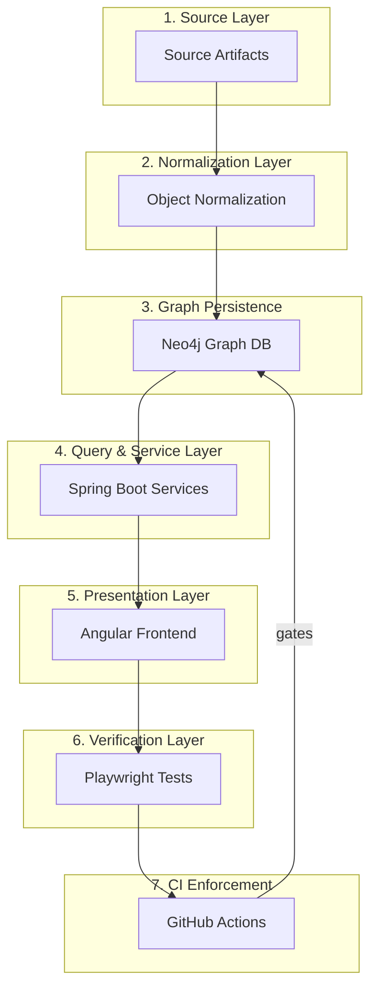
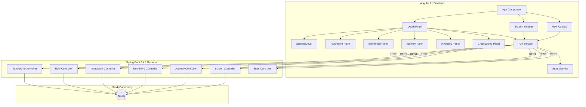
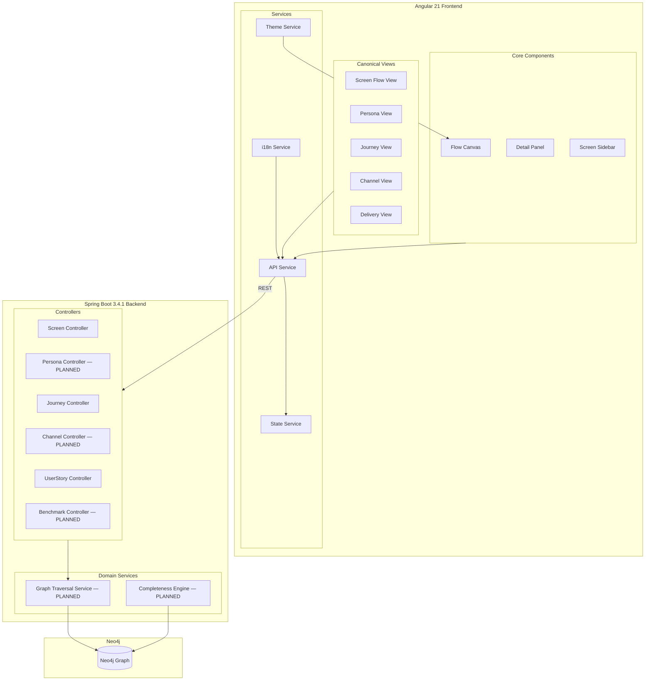
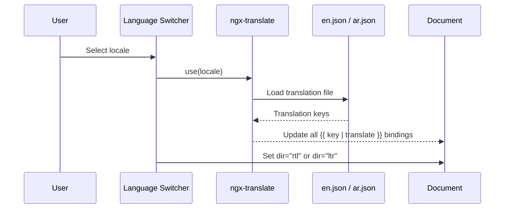
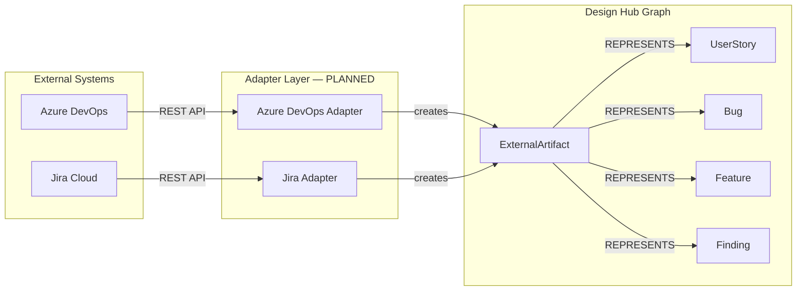

# Architecture Blueprint

**Status:** Draft

**Related documents:**

- `modeling-taxonomy.md` (3-tier classification: 58 T1 + 13 T2 + 4 T3 = 75 model elements with current-to-target entity mapping)
- `graph-object-catalog.md` (full per-object specifications)
- `product-vision.md` (traversal spine, canonical views)
- `vision-benchmark.md` (8-dimension scoring, string-to-edge migration cost)
- `implementation-readiness-graph-model.md` (status, readiness, completenessScore)
- `feature-capability-map.md` (capability model, view registry)
- `design-testing-strategy.md` (6 test layers)
- `ci-quality-gates.md` (CI enforcement model)

---

## 1. System Role

Design Hub is a graph-centric requirements and delivery intelligence system. It sits between source artifacts and implementation teams. It does not replace backlog tools, but it should provide the richer domain model that backlog tools usually lack.

---

## 2. Logical Architecture



### 2.1 Source layer

**Inputs:**

- EMSIST requirement and UX specifications
- Consolidated story inventory
- Design and prototype artifacts
- External delivery systems such as Azure DevOps and Jira

**Responsibilities:** source parsing, identity extraction, reference capture, change detection

**Implementation status:** `[PLANNED]` — no source ingestion pipeline exists. Data is seeded via `DataInitializer.java`.

### 2.2 Normalization layer

**Responsibilities:**

- Map source records into canonical graph objects
- Assign stable identifiers
- Resolve aliases and duplicates
- Enforce required attributes
- Record provenance in `SourceReference`

**Outputs:** canonical object records, typed relationship records, sync metadata

**Implementation status:** `[PLANNED]` — normalization is implicit in seed data. No `SourceReference` entity exists.

### 2.3 Graph persistence layer

**Store:** Neo4j (Community Edition)

**Responsibilities:**

- Persist first-class nodes and typed edges
- Support bidirectional traversal
- Support object-centric filtering by status, readiness, module, topic, and external sync state

**Implementation status:** `[IMPLEMENTED — partial]`

| Aspect | Status | Evidence |
|--------|--------|----------|
| Node persistence | `[IMPLEMENTED]` | 31 `@Node` entities in `backend/src/main/java/com/emsist/designhub/domain/` |
| Typed edges | `[PARTIAL]` | 46 SDN `@Relationship` declarations + 1 Cypher-only `ASSESSES` edge; 9 string references remain |
| Bidirectional traversal | `[PARTIAL]` | Forward traversal works for implemented edges; reverse requires Cypher |
| Status filtering | `[IMPLEMENTED — reshape required]` | 3-enum status model; target is universal 10-value `status` |
| Readiness filtering | `[PLANNED]` | No readiness flags on entities |

### 2.4 Query and service layer

**Current implementation:**

| Component | Status | Evidence |
|-----------|--------|----------|
| Spring Boot backend | `[IMPLEMENTED]` | `backend/pom.xml` — Spring Boot 3.4.1 |
| Screen REST API | `[IMPLEMENTED]` | `ScreenController.java` — CRUD + resolution |
| Journey REST API | `[IMPLEMENTED]` | `JourneyController.java` |
| UserStory REST API | `[IMPLEMENTED]` | `UserStoryController.java` |
| Interaction REST API | `[IMPLEMENTED]` | `InteractionController.java` |
| Role REST API | `[IMPLEMENTED]` | `RoleController.java` |
| Touchpoint REST API | `[IMPLEMENTED]` | `TouchpointController.java` |
| Stats API | `[IMPLEMENTED]` | `StatsController.java` |
| OpenAPI docs | `[IMPLEMENTED]` | Springdoc OpenAPI 2.3.0 |

**Target responsibilities (not yet implemented):**

- Graph-object query endpoints by node type `[PLANNED]`
- Relation expansion endpoints `[PLANNED]`
- Persona and journey traversal endpoints `[PLANNED]`
- External-artifact mapping endpoints `[PLANNED]`
- Readiness and missing-artifact diagnostics `[PLANNED]`
- completenessScore computation endpoint `[PLANNED]`

**API resolution layer** (current):

`ScreenController.java` builds in-memory lookup maps from `roleService.getAll()` and `userStoryService.getAll()`, then resolves string references (`storyRefs`, `roleKeys`) into full response objects (`UserStoryResponse[]`, `RoleResponse[]`). This is application-level resolution, not graph-edge-backed traversal.

### 2.5 Presentation layer

**Current implementation:**

| Component | Status | Evidence |
|-----------|--------|----------|
| Angular 21 frontend | `[IMPLEMENTED]` | `frontend/package.json` |
| Flow canvas | `[IMPLEMENTED]` | `flow-canvas.component.ts` |
| Screen sidebar | `[IMPLEMENTED]` | `screen-sidebar.component.ts` |
| Detail panel | `[IMPLEMENTED]` | `detail-panel.component.ts` with 6 sub-panels |
| State management | `[IMPLEMENTED]` | `design-hub-state.service.ts` — computed signals |
| API service | `[IMPLEMENTED]` | `design-hub-api.service.ts` |
| PrimeNG components | `[IMPLEMENTED]` | PrimeNG 21 in `package.json` |

**Target responsibilities (not yet implemented):**

- Persona and journey views `[PLANNED]`
- Channel view `[PLANNED]`
- Delivery view `[PLANNED]`
- Business Architecture View `[PLANNED]` — BusinessCapability → BusinessProcess → Organization → Application
- Application Architecture View `[PLANNED]` — Application → ApplicationComponent → ApiContract / Screen
- Data Architecture View `[PLANNED]` — BusinessObject → InformationFlow → DataEntity → ApiContract
- Infrastructure Architecture View `[PLANNED]` — Deployment → InfrastructureNode → ApplicationComponent
- Benchmark and verification views `[PLANNED]`
- i18n / bilingual support `[PLANNED]`
- Design token compliance `[PLANNED]`

### 2.6 Verification layer

**Strategy:** Defined in `design-testing-strategy.md` (6 test layers, 8 anti-drift scenarios)

**Implementation status:** `[PLANNED]` — no Playwright harness, no test files exist.

| Test Layer | Status |
|-----------|--------|
| 1. Contract/route smoke | `[PLANNED]` |
| 2. Semantic interaction | `[PLANNED]` |
| 3. Visual baselines | `[PLANNED]` |
| 4. Token compliance | `[PLANNED]` — requires B1 (token import) |
| 5. Localization/RTL | `[PLANNED]` — requires B2 (i18n) |
| 6. Graph-UI drift | `[PLANNED]` |

### 2.7 CI enforcement layer

**Strategy:** Defined in `ci-quality-gates.md` (PR validation + merge protection lanes)

**Implementation status:** `[PLANNED]` — no CI workflow configuration exists.

### 2.8 Agent-ready layer (extension)

The agent-ready and operational safety layer adds code-targeting, convention compliance, policy, and evidence capabilities to the graph model, enabling coding agents to resolve from delivery artifacts to exact filesystem paths, applicable standards, and proof artifacts.

**Code targeting:**

- **CodeAsset** (T1): File-level code targeting. Resolves `Application.repoPath + ApplicationComponent.modulePath + CodeAsset.filePath` for full filesystem path. 10 attributes, 7 relationships.
- **ImportSnapshot** (T2): Records point-in-time imports from Git docs to graph nodes. Enables drift detection via `contentHash` comparison between stored and current document content.
- **RequirementSyncContract**: Protocol for maintaining doc↔graph consistency. See agent-ready spec Section 9.

**Convention compliance:**

- **CodingConvention** (T2 Hybrid): Stores queryable metadata in graph, detailed rules in Git-tracked Markdown via `docRef`. Resolution is edge-only via `GOVERNED_BY_CONVENTION` — no implicit matching. When multiple conventions apply, narrower scope overrides broader: `COMPONENT > SERVICE > FRONTEND/BACKEND > GLOBAL`.
- **QualityConstraint** (T1): Instance-specific non-functional requirement with measurable threshold. Bound to Screen/ApiContract/DataEntity/ApplicationComponent via `HAS_QUALITY_CONSTRAINT`. Verified via `SATISFIED_BY → TestCase`.

**Operational safety/intelligence additions:**

- **AgentPolicy** (T2): Agent execution guardrails. Bound from Application and ApplicationComponent via `GOVERNED_BY_POLICY`.
- **EvidenceRecord** (T2): Proof registry for test results, screenshots, and baselines. Bound from Screen and ApiContract via `BASELINED_BY`.

**Implementation status:** `[IMPLEMENTED]` — CodeAsset, ImportSnapshot, QualityConstraint, CodingConvention, AgentPolicy, and EvidenceRecord now exist in code. Remaining work is broader coverage and UI/product surfacing, not entity creation.

### 2.9 Capability/project meta-model layer

The capability/project layer separates assessment/governance from delivery execution:

- **Assessment** (T1): Polymorphic evaluation of an assessable T1 target via Cypher-only `ASSESSES`
- **RequirementPortfolio** (T1): Owns the Epic → Feature → UserStory tree for one project
- **Milestone** (T1): Sprint/phase/release checkpoint with optional task assignment
- **ProjectInstance** (T1): Bridges gaps/capabilities to scoped application/component change work

This layer is implemented in code and raises the approved taxonomy to **75 nodes / 106 edge types / 71 benchmarkable**.

---

## 3. Current-to-Target Entity Mapping

From `modeling-taxonomy.md` section 3 — the 11 current code entities and their target model mappings:

| Current Entity | File | Target Object(s) | Mapping Type |
|---------------|------|------------------|-------------|
| `Screen.java` | `domain/Screen.java` | Screen (T1) | Direct — attribute depth gap + string refs |
| `Journey.java` | `domain/Journey.java` | Journey (T1) | Direct — `personaId` as string |
| `JourneyStep.java` | `domain/JourneyStep.java` | JourneyStep (T1) | Direct — missing screen/touchpoint edges |
| `UserStory.java` | `domain/UserStory.java` | UserStory (T1) | Direct — minimal (5 fields vs 8+ target) |
| `Interaction.java` | `domain/Interaction.java` | Interaction (T1) | Direct — `permission` string, `apiCalls` strings |
| `Touchpoint.java` | `domain/Touchpoint.java` | Touchpoint (T1) | Direct — `channelId` string in EntryMode |
| `Role.java` | `domain/Role.java` | BusinessRole (T1) + ValidationRole (T1) | **Split** |
| `Gap.java` | `domain/Gap.java` | Gap (T1) | **Reshape** — `type`/`severity` → `gapType`/`severity` + relationships |
| `EntryMode.java` | `domain/EntryMode.java` | EntryMode (T3) | Direct — value object |
| `ContentElement.java` | `domain/ContentElement.java` | ContentElement (T3) | Direct — value object |
| `Effect.java` | `domain/Effect.java` | Effect (T3) | Direct — value object |

**Benchmark rule:** An entity with a different shape (e.g., Role) is scored as `[IMPLEMENTED — reshape required]`, not `[PLANNED]`.

---

## 4. String-to-Edge Migration Map

From `modeling-taxonomy.md` section 4 — the 10 string fields that must become graph edges:

| # | Current String Field | Entity | Target Node | New Edge | Priority |
|---|---------------------|--------|-------------|----------|----------|
| 1 | `storyRefs: List<String>` | Screen | UserStory (T1) | `DELIVERS` | P0 |
| 2 | `personaId: String` | Journey | Persona (T1) | `PERFORMED_BY_PERSONA` | P0 |
| 3 | `permission: String` | Interaction | Permission (T2) | `REQUIRES_PERMISSION` | P0 |
| 4 | `channelId: String` | EntryMode (Touchpoint) | Channel (T2) | `DELIVERED_VIA_CHANNEL` | P0 |
| 5 | `apiCalls: List<String>` | Interaction | ApiContract (T1) | `CALLS_API` | P1 |
| 6 | `roleKeys: List<String>` | Screen, Interaction | BusinessRole (T1) | `ACCESSIBLE_BY_ROLE` | P1 |
| 7 | `personaIds: List<String>` | Screen, Interaction, Touchpoint | Persona (T1) | `USED_BY_PERSONA` | P2 |
| 8 | `journeyStepRefs: List<String>` | Touchpoint (frontend) | JourneyStep (T1) | `STARTS_AT_TOUCHPOINT` | P2 |
| 9 | `confirmationCode: String` | Interaction | ConfirmationDialog (T2) | `TRIGGERS_CONFIRMATION` | P3 |
| 10 | `interactionRef: String` | Effect | Interaction (T1) | `BELONGS_TO_INTERACTION` | P3 |

**P0 migrations** unblock 4 of 10 north-star queries. See `vision-benchmark.md` section 7 for full migration cost analysis.

---

## 5. Component Architecture

### 5.1 Current state



### 5.2 Target state (additions shown)



---

## 6. Core Architecture Decisions

### 6.1 Domain graph over tracker graph

Azure DevOps and Jira center on work items and issue objects. Design Hub must preserve a broader domain graph that includes personas, journeys, steps, screens, interactions, validations, messages, and APIs.

### 6.2 External artifacts as linked nodes

Azure DevOps and Jira records should be modeled as linked `ExternalArtifact` nodes instead of being flattened into primary domain nodes. This preserves:

- tool-specific identity
- field parity
- sync metadata
- many-to-one mappings between domain objects and delivery-tool records

### 6.3 Typed relationships over free-form references

Relationships such as `HAS_STEP`, `USES_SCREEN`, `CALLS_API`, `BLOCKS`, `DUPLICATES`, and `RELATES_TO` should be stored as explicit edge types so traversal logic stays deterministic.

**Current state:** 9 relationships exist as `@Relationship` edges. 9 remain as string references requiring migration. See section 4.

### 6.4 Status and readiness separation

All objects carry universal `status`. Only implementation-driving objects carry `readiness`. This avoids false precision on artifacts where readiness has no SDLC meaning.

**Current state:** `[IMPLEMENTED — reshape required]` — entities use a 3-enum status model (`IDENTIFIED`, `IN_PROGRESS`, `DONE`). Target is the universal 10-value status enum. See `implementation-readiness-graph-model.md` section 4.

### 6.5 Verification as architecture, not tooling

Playwright should be treated as a verification layer in the product architecture. Its job is to prove that the rendered UI still matches:

- graph relationships returned by the backend
- design-system token rules
- localization and RTL rules
- approved visual baselines

**Strategy:** Defined in `design-testing-strategy.md` (6 test layers, 8 anti-drift scenarios).

### 6.6 CI as enforcement, not automation theater

CI should be treated as the merge-control layer that turns architecture, documentation, design-system, and testing rules into required checks. A documented rule that does not fail CI is not a real guardrail.

**Strategy:** Defined in `ci-quality-gates.md` (PR validation + merge protection lanes).

---

## 7. i18n Architecture

### 7.1 Design decisions

| Decision | Choice | Rationale |
|---------|--------|-----------|
| Translation library | `@ngx-translate` | Standard Angular i18n library; runtime switching |
| Supported locales | `en` (English), `ar` (Arabic) | Project requirement |
| Translation storage | JSON files (`en.json`, `ar.json`) | Simple, versionable, diffable |
| RTL support | CSS logical properties + `dir="rtl"` | Standard, no layout duplication |
| Locale registry | `Locale` (T2) in graph model | Graph-aware locale tracking |
| Translation keys | `TranslationKey` (T2) in graph model | Graph-aware key registry |

### 7.2 Runtime flow



### 7.3 File structure

```
frontend/src/
  assets/
    i18n/
      en.json          # English translations
      ar.json          # Arabic translations (RTL)
  app/
    app.config.ts      # ngx-translate configuration
    app.component.ts   # dir attribute binding
```

### 7.4 CSS logical properties

All layout CSS must use logical properties for RTL compatibility:

| Physical (avoid) | Logical (use) |
|-----------------|---------------|
| `margin-left` | `margin-inline-start` |
| `margin-right` | `margin-inline-end` |
| `padding-left` | `padding-inline-start` |
| `padding-right` | `padding-inline-end` |
| `text-align: left` | `text-align: start` |
| `float: left` | `float: inline-start` |
| `border-left` | `border-inline-start` |

**Implementation status:** `[PLANNED]` — requires Track B2 completion.

---

## 8. Design System Integration

### 8.1 Token source

Design Hub adopts EMSIST's ThinkPLUS design tokens (`--tp-*`) as the canonical imported source. All UI elements must resolve colors, typography, spacing, and accents from tokenized theme values.

### 8.2 Token contract

| Token | Purpose | Source |
|-------|---------|--------|
| `--tp-primary` | Primary brand color | EMSIST `tokens.css` |
| `--tp-primary-dark` | Primary dark variant | EMSIST `tokens.css` |
| `--tp-primary-light` | Primary light variant | EMSIST `tokens.css` |
| `--tp-danger` | Error / destructive actions | EMSIST `tokens.css` |
| `--tp-warning` | Warning states | EMSIST `tokens.css` |
| `--tp-surface` | Background surfaces | EMSIST `tokens.css` |
| `--tp-text` | Default text color | EMSIST `tokens.css` |
| `--tp-white` | White reference | EMSIST `tokens.css` |

### 8.3 Files requiring token remediation

| File | Current State | Target |
|------|--------------|--------|
| `styles.scss` | Ad-hoc CSS variables (line 3) | Import from single canonical token file |
| `default-preset.ts` | Hardcoded hex values | CSS variable references |
| `default-preset.scss` | Hardcoded shadow values | Token-ized shadows |
| `design-hub.page.ts` | Inline CSS variables | Token references |
| `flow-canvas.component.ts` | Hardcoded SVG colors | Token references |
| `inventory-panel.component.ts` | Hardcoded badge colors | Token references |

**Implementation status:** `[PLANNED]` — requires Track B1 completion.

---

## 9. Integration Model for Azure DevOps and Jira

### 9.1 Integration architecture



### 9.2 Azure DevOps adapter

**Design goals:**

- Ingest work item identity, type, state, area, iteration, assignment, tags, priority, parent-child, predecessor-successor, and related links
- Map Azure items to `ExternalArtifact`
- Attach mapped records to `UserStory`, `Bug`, `Feature`, or `Finding`

**Implementation status:** `[PLANNED]`

### 9.3 Jira adapter

**Design goals:**

- Ingest issue identity, issue type, status, parent, issue links, assignee, project scope, labels, and custom fields
- Preserve issue-link types with inward and outward semantics
- Map Jira issues to `ExternalArtifact`

**Implementation status:** `[PLANNED]`

---

## 10. BPMN Alignment

### 10.1 Source standard

Design Hub's process modeling objects align with the **OMG BPMN 2.0.2** specification (Business Process Model and Notation). The graph model uses `BusinessProcess`, `ProcessActivity`, `ProcessGateway`, and `ProcessEvent` as first-class nodes connected by `HAS_FLOW_NODE` and `FLOWS_TO` edges.

### 10.2 BPMN adoption profile

The meta-model adopts BPMN concepts in layered priority tiers:

| Layer | Name | Priority | Scope | Design Hub Objects |
|-------|------|----------|-------|-------------------|
| A | Process Essentials | P0 | Process, activity, start/end events | `BusinessProcess`, `ProcessActivity`, `ProcessEvent` |
| B | Control Flow | P0 | Gateways (exclusive, parallel, inclusive), sequence flows | `ProcessGateway`, `FLOWS_TO` edge |
| C | Collaboration | P2 | Pools, lanes, message flows between participants | Future — not yet modeled |
| D | Data | P2 | Data objects, data stores, data associations | Future — not yet modeled |
| E | Advanced | Out of scope | Choreography, conversation, complex events | Not planned |

### 10.3 Process layer relationship mapping

| Relationship | Context | Source | Target |
|-------------|---------|--------|--------|
| `HAS_FLOW_NODE` | Process layer | `BusinessProcess` | `ProcessActivity`, `ProcessGateway`, `ProcessEvent` |
| `FLOWS_TO` | Process layer | `ProcessActivity`, `ProcessGateway`, `ProcessEvent` | `ProcessActivity`, `ProcessGateway`, `ProcessEvent` |
| `HAS_STEP` | Journey layer (unchanged) | `Journey` | `JourneyStep` |

**Note:** `HAS_STEP` remains the Journey-to-JourneyStep relationship. Process flow structure uses `HAS_FLOW_NODE` for containment and `FLOWS_TO` for sequencing.

---

## 11. Query Patterns the Architecture Should Support

These patterns correspond to the 10 north-star queries in `product-vision.md`:

| # | Query Pattern | Current Status |
|---|--------------|---------------|
| 1 | `persona -> journeys -> steps -> screens -> stories` | `[STRING_REF]` — `personaId` on Journey |
| 2 | `journey -> steps -> touchpoints -> channels` | `[STRING_REF]` — `channelId` in EntryMode |
| 3 | `channel -> touchpoints -> screens` | `[STRING_REF]` |
| 4 | `screen -> interactions -> permissions` | `[STRING_REF]` — `permission` string on Interaction |
| 5 | `interaction -> outcomes -> error codes` | `[PLANNED]` — no InteractionOutcome or ErrorCode |
| 6 | `screen -> stories` | `[STRING_REF]` — `storyRefs` on Screen (resolved at API level) |
| 7 | `bug -> affected screens` | `[PLANNED]` — no Bug entity |
| 8 | `artifact -> source references` | `[PLANNED]` — no SourceReference |
| 9 | `external artifact -> domain objects` | `[PLANNED]` — no ExternalArtifact |
| 10 | `interaction -> confirmation dialogs` | `[PLANNED]` — no ConfirmationDialog |

---

## 12. Verification Patterns the Architecture Should Support

From `design-testing-strategy.md` — the 6 test layers map to architecture verification:

| Layer | Verification Pattern | Architecture Dependency |
|-------|---------------------|------------------------|
| 1. Smoke | App shell, routes, backend-unavailable state | Layer 5 (Presentation) |
| 2. Semantic | `API graph data -> rendered detail panel` | Layers 4-5 (Query + Presentation) |
| 3. Visual | `Screen -> interactions -> messages -> rendered UI state` | Layer 5 (Presentation) |
| 4. Token | `Token contract -> rendered style value` | Layer 5 + Design System |
| 5. i18n/RTL | `Locale -> RTL/LTR -> rendered layout` | Layer 5 + i18n |
| 6. Graph-UI drift | `persona -> journeys -> steps -> rendered UI state` | Layers 3-5 (Graph + Query + Presentation) |

---

## 13. Implementation Roadmap Implication

The next architectural step is not another specialized screen endpoint. It is a generic graph object and relation service that can support multiple views from the same node and edge model. The 13 canonical views defined in `feature-capability-map.md` section 4 share the same underlying graph — they differ only in entry point, traversal depth, and projection shape.
