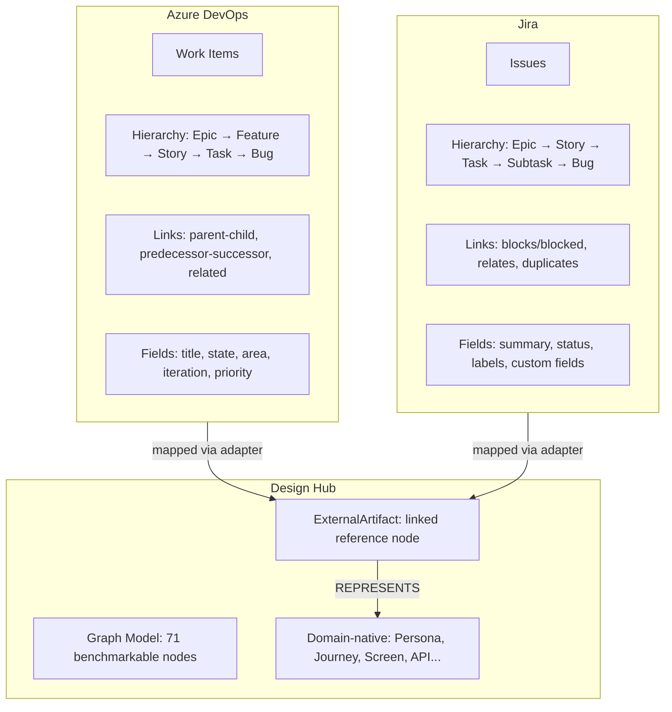
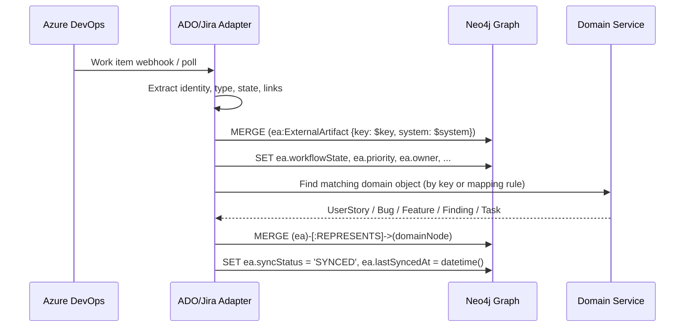
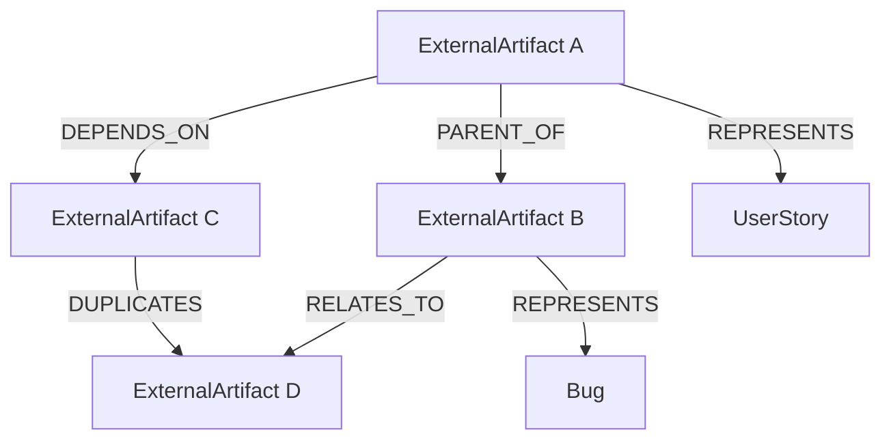
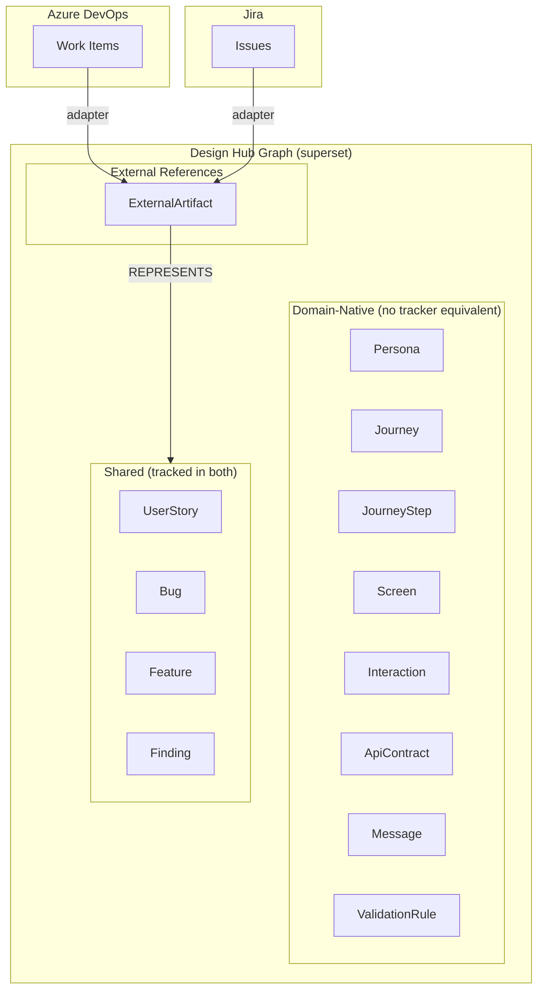

# Azure DevOps and Jira Benchmark

**Status:** Draft

**Related documents:**

- `vision-benchmark.md` (dimension 7: delivery-tool interoperability scoring)
- `graph-object-catalog.md` (`ExternalArtifact` specification)
- `modeling-taxonomy.md` (tier classification for external integration nodes)
- `architecture-blueprint.md` (integration model, adapter architecture)

---

## 1. Benchmark Position

Azure DevOps and Jira are useful benchmarks because both expose mature models for tracking work items, hierarchy, state, fields, and dependencies. Neither system, however, is sufficient as the native domain model for Design Hub. Both are centered on work items or issues, while Design Hub must model personas, journeys, journey steps, screens, messages, validations, and API contracts as first-class objects.

**Inference:** Azure DevOps and Jira should be treated as external delivery systems that enrich the graph, not as the source of truth for the graph schema itself.

---

## 2. What Azure DevOps Contributes

Azure DevOps work items provide:

- stable work item identity
- typed work-item hierarchy across epic, feature, requirement-story, task, and bug categories
- common fields such as title, assigned to, state, reason, area, and iteration
- field extensibility and process-specific fields such as priority and story points
- typed work links including parent-child, predecessor-successor, and related

---

## 3. What Jira Contributes

Jira issues provide:

- stable issue identity and issue type
- project-scoped field metadata and edit metadata
- issue-link types with explicit inward and outward semantics
- parent-child hierarchy with epic, story, task, bug, and subtask patterns
- system and custom field discovery through field APIs
- workflow status and transition APIs

---

## 4. Benchmark Summary

| Concern | Azure DevOps | Jira | Design Hub Recommendation |
|---------|-------------|------|--------------------------|
| Primary tracking unit | Work item | Issue | Keep domain objects separate from external tracker records |
| Hierarchy | Epic → Feature → Requirement/Story → Task → Bug | Epic → Story → Task → Bug → Subtask | Model domain hierarchy with `BusinessObjective`, `Feature`, `UserStory`, `Journey`, `JourneyStep`, `Screen`; store tracker hierarchy on `ExternalArtifact` |
| Common fields | Title, Assigned To, State, Reason, Area, Iteration | Summary, project/issue-type metadata, editable fields, parent, status | Add `externalKey`, `owner`, `priority`, `labels`, `projectScope`, `workflowState`, `externalUrl` on `ExternalArtifact` |
| Dependencies | Parent-child, predecessor-successor, related | Issue links with named inward/outward semantics | Create superset relation model: `PARENT_OF`, `CHILD_OF`, `DEPENDS_ON`, `BLOCKS`, `RELATES_TO`, `DUPLICATES`, `TRACKS` |
| Field extensibility | Process customization and field index | System/custom fields via `/field` APIs | Support custom attribute bags on `ExternalArtifact`; keep required canonical attributes explicit on primary nodes |
| Workflow | State and reason | Status and transitions | Keep universal `status` in Design Hub; store external workflow metadata on `ExternalArtifact` |
| Missing domain coverage | Personas, journeys, screens, messages, API contracts | Personas, journeys, screens, messages, API contracts | Model these natively as first-class nodes |

---

## 5. ExternalArtifact Specification

`ExternalArtifact` is a Tier 1 first-class node in the graph model. Full specification in `graph-object-catalog.md`.

### 5.1 Attributes

| Attribute | Type | Required | Description |
|-----------|------|----------|-------------|
| `externalId` | String | Yes | Stable identifier (pattern: `EA-{system}-{key}`) |
| `system` | Enum | Yes | `AZURE_DEVOPS`, `JIRA` |
| `externalType` | String | Yes | Work item type / issue type from source system |
| `key` | String | Yes | Source system key (e.g., ADO work item ID, Jira issue key) |
| `title` | String | Yes | Title from source system |
| `projectScope` | String | No | Project / area path from source system |
| `workflowState` | String | No | Current state/status in source system |
| `priority` | String | No | Priority from source system |
| `owner` | String | No | Assigned to / assignee |
| `reporter` | String | No | Created by / reporter |
| `labels` | List | No | Tags / labels from source system |
| `url` | String | No | Direct URL to source system record |
| `syncStatus` | Enum | No | `SYNCED`, `STALE`, `CONFLICT`, `PENDING` |
| `lastSyncedAt` | DateTime | No | Last successful sync timestamp |
| `customFields` | Map | No | Extensible key-value bag for system-specific fields |

### 5.2 Relationships

| Relationship | Target | Cardinality | Description |
|-------------|--------|-------------|-------------|
| `REPRESENTS` | UserStory, Bug, Feature, Finding, Task | 1:1 | Links external record to domain object |
| `PARENT_OF` | ExternalArtifact | 1:N | Preserves source hierarchy |
| `CHILD_OF` | ExternalArtifact | N:1 | Reverse hierarchy |
| `DEPENDS_ON` | ExternalArtifact | N:N | Predecessor-successor / blocks |
| `RELATES_TO` | ExternalArtifact | N:N | Generic relation |
| `DUPLICATES` | ExternalArtifact | N:N | Duplicate tracking |

### 5.3 Mapping flow

---

## 6. Recommended Graph Enhancements From Benchmarking

### 6.1 External relationship semantics

The graph should preserve tracker semantics with normalized edge types:

When Jira supplies directional link-type names such as `Blocks` / `Blocked by`, keep both the normalized edge and the original external relationship metadata.

### 6.2 Strengthen delivery attributes on primary objects

Selected primary objects should support delivery-aware attributes benchmarked from Azure and Jira:

| Object | Recommended Additional Attributes | Status |
|--------|----------------------------------|--------|
| `UserStory` | `owner`, `priority`, `labels`, `externalRefs` | `[PLANNED]` — current entity has 5 fields |
| `Bug` | `severity`, `priority`, `owner`, `externalRefs`, `workflowState` | `[PLANNED]` — no Bug entity |
| `Finding` | `severity`, `disposition`, `owner`, `externalRefs` | `[PLANNED]` — no Finding entity |
| `Feature` | `owner`, `targetIteration`, `externalRefs` | `[PLANNED]` — no Feature entity |
| `ApiContract` | `owner`, `consumerTeams`, `dependencyRefs`, `externalRefs` | `[PLANNED]` — no ApiContract entity |

### 6.3 Keep domain-native objects separate

Do not flatten these into work-item or issue fields:

- `Persona`, `Journey`, `JourneyStep`, `Screen`, `ScreenState`, `Interaction`, `Message`, `ValidationRule`, `SourceReference`

These are implementation-critical domain objects that Azure DevOps and Jira do not natively model at the required depth.

---

## 7. Delivery-Tool Interoperability Score

This section scores dimension 7 from `vision-benchmark.md`.

### 7.1 Scoring criteria

| Criterion | Weight | Current State | Score |
|----------|--------|---------------|-------|
| `ExternalArtifact` entity exists | 3 | `[PLANNED]` — no entity | 0/3 |
| `REPRESENTS` edge to domain objects | 3 | `[PLANNED]` — no edge | 0/3 |
| External hierarchy edges (`PARENT_OF`, `CHILD_OF`) | 2 | `[PLANNED]` | 0/2 |
| External dependency edges (`DEPENDS_ON`, `BLOCKS`) | 2 | `[PLANNED]` | 0/2 |
| Sync metadata (`syncStatus`, `lastSyncedAt`) | 1 | `[PLANNED]` | 0/1 |
| Custom field extensibility | 1 | `[PLANNED]` | 0/1 |
| Adapter implementation (Azure DevOps) | 2 | `[PLANNED]` | 0/2 |
| Adapter implementation (Jira) | 2 | `[PLANNED]` | 0/2 |

**Total: 0/16 = 0% = RED**

### 7.2 Target milestones

| Milestone | Score | Threshold |
|-----------|-------|-----------|
| `ExternalArtifact` entity + `REPRESENTS` edge | 6/16 = 37.5% | RED → AMBER boundary |
| + hierarchy + dependency edges + sync metadata | 12/16 = 75% | AMBER |
| + both adapters implemented | 16/16 = 100% | GREEN |

---

## 8. Proposed Mapping Pattern

| Design Hub Object | Azure DevOps Mapping | Jira Mapping |
|------------------|---------------------|-------------|
| `Feature` | Feature work item | Epic or custom higher-level issue type |
| `UserStory` | User Story or Requirement | Story |
| `Bug` | Bug | Bug |
| `Task` | Task work item | Task |
| `Finding` | Issue, task, or custom work item | Task, bug, or custom issue type |
| `BusinessObjective` | No strong native equivalent | No strong native equivalent |
| `Journey` | No strong native equivalent | No strong native equivalent |
| `JourneyStep` | No strong native equivalent | No strong native equivalent |
| `Screen` | No strong native equivalent | No strong native equivalent |
| `ApiContract` | Partial via task or custom work item | Partial via task or custom issue type |

**Key insight:** The 5 domain objects with no native equivalent (BusinessObjective, Journey, JourneyStep, Screen, ApiContract) are precisely why Design Hub exists. These objects represent the domain coverage gap that backlog tools cannot fill.

---

## 9. Design Implication

Design Hub should be a superset graph:

- Domain-native artifacts remain first-class nodes
- External work items and issues are linked supporting artifacts
- Benchmarked tracker metadata is preserved for delivery integration
- Traceability spans from business objective to external delivery record without reducing the graph to a backlog-only model

---

## 10. Official Source Notes

**Azure DevOps:**

- Microsoft documents work items as typed objects used to track features, requirements, bugs, and issues, with common fields including title, assigned to, state, reason, area, and iteration
- Microsoft documents system-defined link types including parent-child, predecessor-successor, and related

**Jira:**

- Atlassian documents issue fields as both system and custom fields exposed through field APIs
- Atlassian documents issue-link types with `name`, `inward`, and `outward` semantics
- Atlassian documents software work types around epic, bug, story, task, and subtask structures
