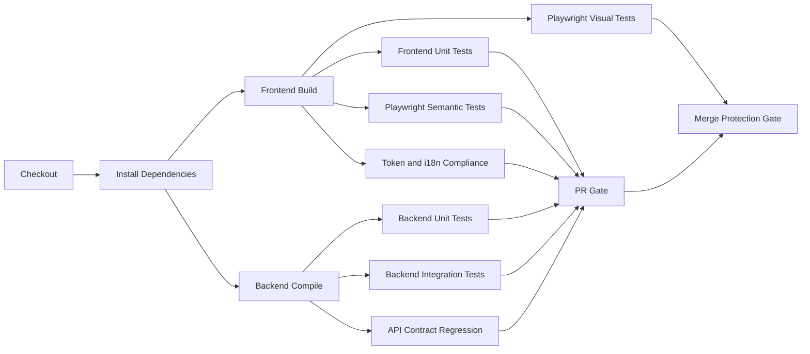

# CI Quality Gates

**Status:** Draft  
**Purpose:** Define the required CI gates for frontend and backend so Design Hub can prevent implementation drift, design drift, schema drift, localization drift, and untested changes from being merged.

## Position

CI in Design Hub must do more than run unit tests. It should act as the merge-time enforcement layer for:

- build correctness
- graph-model correctness
- API and UI contract stability
- design-system compliance
- localization completeness
- regression protection
- security and dependency hygiene

This is necessary because the product is intended to serve as an implementation-readiness system. If CI only checks compilation, the system can still drift away from its documented model, design tokens, and required UX behavior.

## Current State

As of now:

- there is no CI configuration in the repository
- the backend has Maven test dependencies but no actual test sources
- the frontend has build scripts but no test or Playwright harness

That means Design Hub currently has no automated merge gate against drift.

## CI Model

Use two CI lanes plus one release lane:

- `PR validation lane`: fast checks required on every pull request
- `merge protection lane`: broader regression and visual checks required before merge
- `release lane`: packaging, versioning, artifact publication, and environment verification

## Required Frontend Gates

### 1. Dependency install and deterministic build

Purpose:

- verify lockfile integrity
- ensure the Angular app builds consistently in CI

Required checks:

- `npm ci`
- `npm run build`

### 2. Type and template correctness

Purpose:

- prevent broken templates, typing regressions, and unsafe interface changes

Required checks:

- strict TypeScript compilation through Angular build
- future addition of ESLint or equivalent static analysis

### 3. Unit and component testing

Purpose:

- verify component logic, adapters, state services, and transformation logic

Required coverage targets:

- state service filtering and selection logic
- API adaptation and DTO mapping
- localization utilities
- token or theme helper behavior

### 4. Playwright semantic regression

Purpose:

- verify that the user-visible UI behavior still matches the graph model and expected routes

Required scenarios:

- shell renders
- sidebar, canvas, and detail panel render
- selecting a screen updates the detail panel
- empty-state and backend-unavailable behavior are correct
- key graph-backed relationships render when present

### 5. Playwright visual regression

Purpose:

- detect design drift

Required visual coverage:

- full three-column shell
- sidebar
- canvas
- detail panel
- key detail tabs
- desktop and mobile viewports
- English and Arabic
- LTR and RTL

### 6. Design-system compliance

Purpose:

- block ad hoc styling drift from EMSIST ThinkPLUS tokens

Required checks:

- component styles must not contain hardcoded hex or rgb values
- token source must be imported from one canonical token entry
- critical rendered values must resolve from `--tp-*`, `--nm-*`, or approved semantic variables

### 7. Localization and RTL compliance

Purpose:

- prevent untranslated UI, broken Arabic layouts, and hardcoded user-facing strings

Required checks:

- translation files exist for all supported locales
- locale key structures are identical across `en.json` and `ar.json`
- user-facing strings are externalized
- Arabic switches document direction to `rtl`
- layout remains functional under RTL

## Required Backend Gates

### 1. Dependency restore and compile

Purpose:

- verify the service compiles cleanly on CI

Required checks:

- `mvn -q -DskipTests compile`

### 2. Unit testing

Purpose:

- verify pure Java logic, mapping, and service-level transformations

Required coverage targets:

- DTO mapping
- graph metadata backfill logic
- stats aggregation
- service-layer filters and projections

### 3. Repository and graph integration testing

Purpose:

- verify Neo4j persistence, relationships, and query semantics

Required coverage targets:

- entity persistence
- relationship creation
- query correctness
- graph traversal expectations

Recommended approach:

- Spring Boot integration tests
- Testcontainers-backed Neo4j for realistic graph behavior

### 4. API contract regression

Purpose:

- prevent silent response-shape drift between backend and frontend

Required checks:

- response schema assertions for key endpoints
- compatibility checks for screen, story, role, touchpoint, interaction, and stats payloads
- contract snapshots or schema-based assertions for stable endpoints

### 5. String-to-edge migration protection

Purpose:

- detect regressions where graph relationships fall back to string references instead of edges

Required checks:

- relationship quality audit in benchmark-oriented tests
- repository-level assertions that required edges exist for implemented model slices
- failure when a required graph traversal depends on string parsing rather than relationships

### 6. Data initialization and seed validation

Purpose:

- ensure seeded sample data remains internally consistent

Required checks:

- seed counts match expectations
- referenced IDs exist
- required relationships are created
- no orphan journey steps, touchpoints, or interactions

## Cross-Cutting Gates

### 1. Documentation integrity

Purpose:

- keep the implementation and documentation pack aligned

Required checks:

- Markdown files referenced from the documentation pack exist
- Mermaid blocks use valid fenced syntax
- no orphan references to removed documents

### 2. Benchmark integrity

Purpose:

- keep the benchmark honest as the graph evolves

Required checks:

- artifact counts in benchmark and catalog stay aligned
- benchmark labels such as `[EDGE]`, `[STRING_REF]`, and `[PLANNED]` are used consistently
- required benchmark dimensions are present

### 3. Security and dependency hygiene

Purpose:

- reduce merge-time security regressions

Required checks:

- dependency vulnerability scan
- secret scanning
- lockfile enforcement
- dependency license policy if required by the organization

### 4. Branch protection and review policy

Purpose:

- stop bypassing the CI model socially or procedurally

Required policy:

- protected main branch
- required passing checks before merge
- required review approvals
- no direct commits to protected branch

## Minimal Required PR Checks

These should run on every pull request:

- frontend build
- backend compile
- backend unit and integration tests
- frontend unit tests
- frontend semantic Playwright smoke
- token-compliance scan
- localization structure check
- secret and dependency scan

## Expanded Merge Protection Checks

These can run on merge queue or as required pre-merge checks:

- full Playwright semantic suite
- full Playwright visual suite
- backend contract regression suite
- benchmark integrity checks
- seed validation suite

## Release Lane Checks

Before a release artifact is produced:

- all PR and merge checks pass
- versioned build artifacts are produced
- release notes or change summary generated
- environment smoke checks executed

## Recommended CI Stages

## Frontend Drift Gates

Frontend changes should fail CI when they introduce:

- hardcoded design values in component styles
- hardcoded user-facing strings
- broken visual baselines
- broken RTL layouts
- missing translation keys
- graph-backed UI panels not rendering required linked objects

## Backend Drift Gates

Backend changes should fail CI when they introduce:

- response contract breakage
- missing required graph relationships
- string-based pseudo-relationships where edge-backed relationships are required
- seed-data inconsistencies
- traversal regressions on critical graph queries

## Definition of Done for CI Adoption

CI adoption is not complete until:

- frontend and backend both have required checks in CI
- protected-branch policy requires them
- visual and semantic regressions are enforced
- token and i18n drift are enforced
- contract and graph-relationship drift are enforced

## Implementation Sequence

1. Add basic frontend and backend build jobs.
2. Add backend unit and integration tests.
3. Add frontend unit tests.
4. Add Playwright semantic smoke tests.
5. Add visual baselines and visual regression tests.
6. Add token and i18n compliance checks.
7. Add contract and graph-drift enforcement.
8. Turn all required checks into protected-branch merge gates.
