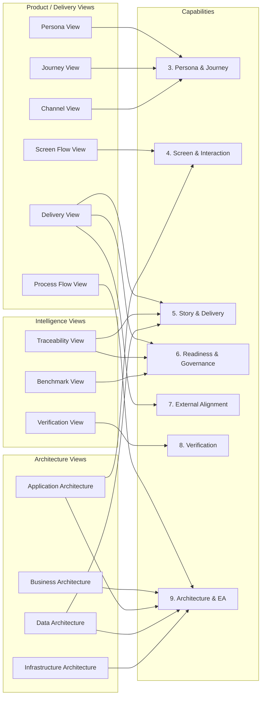
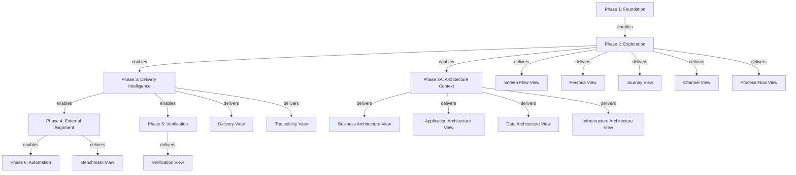

# Feature Capability Map

**Status:** Draft

**Related documents:**

- `modeling-taxonomy.md` (3-tier classification: 58 T1 + 13 T2 + 4 T3 = 75 model elements, 71 benchmarkable)
- `graph-object-catalog.md` (full per-object specifications with attributes and relationships)
- `product-vision.md` (traversal spine, north-star queries, canonical views)
- `vision-benchmark.md` (8-dimension scoring with queryability test suite)
- `implementation-readiness-graph-model.md` (status, readiness, completenessScore governance)
- `design-testing-strategy.md` (6 test layers, 8 anti-drift scenarios)
- `ci-quality-gates.md` (PR validation and merge protection gates)

---

## 1. Capability Model

### 1.1 Source ingestion and normalization

Design Hub should ingest canonical requirement and design sources, normalize them into graph objects, and preserve source references for every implementation-driving artifact.

**Primary objects** (8 T1 nodes):

- `SourceReference` `[PLANNED]`
- `BusinessObjective` `[PLANNED]`
- `UserStory` `[IMPLEMENTED]`
- `Persona` `[IMPLEMENTED]`
- `Journey` `[IMPLEMENTED]`
- `JourneyStep` `[IMPLEMENTED]`
- `Screen` `[IMPLEMENTED]`
- `Interaction` `[IMPLEMENTED]`
- `ApiContract` `[IMPLEMENTED]`
- `DataEntity` `[IMPLEMENTED]`

### 1.2 Artifact registry and graph model

The platform should maintain a first-class graph object registry covering 71 benchmarkable nodes (58 T1 + 13 T2) rather than a flat record list.

**Primary capabilities:**

| Capability | Status | Evidence |
|-----------|--------|----------|
| Stable object identity | `[IMPLEMENTED]` | `stableId` / `surfaceId` / `storyId` on implemented entities |
| Typed relationships | `[PARTIAL]` | 78 SDN `@Relationship` declarations plus 1 Cypher-only edge exist; several deferred string-backed relationships remain |
| Object status tracking | `[IMPLEMENTED — reshape required]` | 3-enum model exists; target is universal 10-value `status` |
| Selective readiness flags | `[PLANNED]` | No readiness flags in current entities |
| Source traceability | `[PLANNED]` | No `SourceReference` entity |
| Cross-artifact search | `[PARTIAL]` | REST endpoints exist per entity; no graph-wide search |

### 1.3 Persona and journey exploration

Selecting a persona should reveal journeys, steps, screens, stories, and related delivery artifacts. Grouping and filtering by topic, module, status, and readiness should be supported.

**Primary objects:**

| Object | Tier | Status |
|--------|------|--------|
| `Persona` | T1 | `[IMPLEMENTED]` |
| `Journey` | T1 | `[IMPLEMENTED]` |
| `JourneyStep` | T1 | `[IMPLEMENTED]` |
| `Topic` | T1 | `[PLANNED]` |
| `Screen` | T1 | `[IMPLEMENTED]` |
| `UserStory` | T1 | `[IMPLEMENTED]` |

**Key traversal**: `Persona <- PERFORMED_BY_PERSONA <- Journey -> HAS_STEP -> JourneyStep -> USES_SCREEN -> Screen`

**Current gap**: the core `Journey -> Persona` edge exists, but dedicated Persona exploration views and the remaining journey-step traversal edges are still missing.

### 1.4 Screen and interaction exploration

Selecting a screen should reveal its route, states, interactions, messages, validations, findings, APIs, and linked stories.

**Primary objects:**

| Object | Tier | Status |
|--------|------|--------|
| `Screen` | T1 | `[IMPLEMENTED]` |
| `ScreenState` | T1 | `[PLANNED]` |
| `Interaction` | T1 | `[IMPLEMENTED]` |
| `Transition` | T1 | `[PLANNED]` |
| `Message` | T1 | `[IMPLEMENTED]` |
| `ValidationRule` | T1 | `[IMPLEMENTED]` |
| `Finding` | T1 | `[PLANNED]` |
| `ErrorCode` | T2 | `[PLANNED]` |

**Current gap**: Screen returns resolved stories and roles via API projection (`ScreenResponse.java`), but the underlying graph uses `storyRefs` and `roleKeys` as strings.

### 1.5 Story and delivery exploration

Selecting a story, bug, finding, or API should show the connected screens, journeys, rules, and dependencies beside the object's own attributes.

**Primary objects:**

| Object | Tier | Status |
|--------|------|--------|
| `UserStory` | T1 | `[IMPLEMENTED]` |
| `Bug` | T1 | `[PLANNED]` |
| `Finding` | T1 | `[PLANNED]` |
| `ApiContract` | T1 | `[IMPLEMENTED]` |
| `DataEntity` | T1 | `[IMPLEMENTED]` |
| `Rule` | T1 | `[IMPLEMENTED]` |

### 1.6 Readiness and governance

The system should separate universal object `status` from implementation-facing `readiness` flags and expose missing artifacts before a story or screen is treated as ready.

**Primary capabilities:**

| Capability | Status |
|-----------|--------|
| Missing-link detection | `[PLANNED]` — requires completenessScore engine |
| Unresolved-findings view | `[PLANNED]` — requires Finding entity |
| Readiness gate evaluation | `[PLANNED]` — requires readiness flags on entities |
| Governance-state reporting | `[PLANNED]` — requires status migration |

### 1.7 External delivery-tool alignment

The system should benchmark and link to external tool objects from Azure DevOps and Jira without forcing Design Hub to adopt their limited domain models.

**Primary capabilities:**

| Capability | Status |
|-----------|--------|
| External artifact reference mapping | `[PLANNED]` — requires `ExternalArtifact` entity |
| Work-item and issue-link synchronization | `[PLANNED]` |
| Field parity audit | `[PLANNED]` |
| Attribute superset design | `[DOCUMENTED]` — specified in `azure-jira-benchmark.md` |

### 1.8 Design verification and anti-drift testing

The platform should include strict design verification so rendered UI stays aligned with the graph model, source artifacts, design tokens, and localization rules.

**Primary capabilities:**

| Capability | Status |
|-----------|--------|
| Semantic end-to-end verification | `[IMPLEMENTED]` — Playwright Layers 1-2 smoke and semantic suites are running against the live backend |
| Visual baseline comparison | `[PLANNED]` |
| Token-compliance verification | `[PLANNED]` — requires B1 (token import) first |
| Localization and RTL verification | `[PLANNED]` — requires B2 (i18n) first |
| Graph-to-UI drift detection | `[PLANNED]` |

### 1.9 Code targeting (agent-ready extension)

Agents must be able to resolve from a UserStory to the exact code files and test files that need to change. This capability is the bridge between the delivery model and the filesystem.

**Objects:** CodeAsset (T1), ImportSnapshot (T2)
**Edges:** HAS_CODE_ASSET, LOCATED_IN, ASSET_FOR_SCREEN, ASSET_FOR_API, ASSET_FOR_ENTITY, ASSET_FOR_RULE, IMPORTED_BY, IMPLEMENTS→CodeAsset
**Enables:** Agent can resolve from UserStory to exact code files and test files
**Status:** `[IMPLEMENTED]` — CodeAsset and ImportSnapshot exist in code; broader story-to-pack resolution is still maturing

### 1.10 Convention compliance (agent-ready extension)

Agents must be able to discover which coding standards and quality thresholds apply to their work before generating or modifying code.

**Objects:** CodingConvention (T2 Hybrid), QualityConstraint (T1)
**Edges:** GOVERNED_BY_CONVENTION, HAS_QUALITY_CONSTRAINT, SATISFIED_BY
**Enables:** Agent can discover which coding standards and quality thresholds apply to its work
**Status:** `[IMPLEMENTED]` — CodingConvention and QualityConstraint exist in code; broader UI and policy surfacing remains planned

---

## 2. Capability-to-Artifact Mapping

```mermaid
graph TD
    subgraph Cap1["1. Source Ingestion"]
        C1[Ingest & Normalize]
    end
    subgraph Cap2["2. Artifact Registry"]
        C2[Graph Model]
    end
    subgraph Cap3["3. Persona & Journey"]
        C3[Exploration]
    end
    subgraph Cap4["4. Screen & Interaction"]
        C4[Exploration]
    end
    subgraph Cap5["5. Story & Delivery"]
        C5[Exploration]
    end
    subgraph Cap6["6. Readiness & Governance"]
        C6[Governance]
    end
    subgraph Cap7["7. External Alignment"]
        C7[Delivery Tools]
    end
    subgraph Cap8["8. Verification"]
        C8[Anti-Drift Testing]
    end

    C1 -->|produces| SR[SourceReference]
    C1 -->|produces| BO[BusinessObjective]
    C2 -->|manages| ALL["71 benchmarkable nodes"]
    C3 -->|traverses| PE[Persona] & JO[Journey] & JS[JourneyStep]
    C4 -->|traverses| SC[Screen] & IN[Interaction] & TR[Transition]
    C5 -->|traverses| US[UserStory] & BG[Bug] & FI[Finding]
    C6 -->|evaluates| ST["status + readiness + completenessScore"]
    C7 -->|links| EA[ExternalArtifact]
    C8 -->|verifies| PW[Playwright Tests]
```



---

## 3. Delivery Sequence

| Phase | Scope | Benchmark Status | Key Artifacts |
|-------|-------|-----------------|---------------|
| 1. Foundation | Graph object catalog, source references, status/readiness rules, baseline screen and story graph | `[IMPLEMENTED]` — 48 `@Node` entities in code, 78 SDN edges + 1 Cypher edge, 281 tests | Screen, Journey, JourneyStep, UserStory, Interaction, Touchpoint, Persona, BusinessRole, ValidationRole, Channel, Permission, ConfirmationDialog, Gap, Assessment, RequirementPortfolio, ProjectInstance, Milestone, Application, ApplicationComponent, CodeAsset, AcceptanceCriterion, Rule, ValidationRule, Message, ApiContract, RequestSchema, ResponseSchema, ErrorContract, DataEntity, DataField, TestCase, BusinessDomain, BusinessCapability, BusinessProcess, ProcessActivity, ProcessGateway, ProcessEvent, Task |
| 2. Exploration | Persona, journey, screen, and story traversal views | `[PLANNED]` — Persona/role/channel nodes exist; Topic, ScreenState, Transition, and dedicated exploration views still missing | Persona View, Journey View, Screen Flow View |
| 3. Delivery intelligence | Findings, bugs, readiness gaps, API and data dependencies | `[PLANNED]` — requires Bug, Finding, ApiContract, DataEntity | Delivery View, completenessScore engine |
| 4. External alignment | Azure DevOps and Jira mapping, sync objects, benchmark reporting | `[PLANNED]` — requires ExternalArtifact | Benchmark View |
| 5. Verification | Playwright-based design testing, visual baselines, and anti-drift gates | `[PARTIAL]` — Layers 1-2 are implemented; visual, token, and i18n layers still require B1+B2 completion | Verification View |
| 6. Automation | Agent-facing query patterns, export contracts, generation workflows | `[PLANNED]` | Agent API, export contracts |

```mermaid
gantt
    title Delivery Sequence
    dateFormat X
    axisFormat %s

    section Foundation
    Graph catalog + status rules        :done, 1, 2
    String-to-edge migration            :active, 2, 3

    section Exploration
    Persona + Journey views             :3, 4
    Screen Flow + Channel views         :3, 4

    section Delivery Intelligence
    Bug + Finding + API entities        :4, 5
    Delivery View + completenessScore   :4, 5

    section External Alignment
    ExternalArtifact + sync             :5, 6

    section Verification
    Playwright harness + baselines      :5, 6

    section Automation
    Agent API + export contracts        :6, 7
```



---

## 4. View Registry

The product supports 13 canonical views, each anchored on a different traversal entry point from the graph model. Views are first-class product requirements — they define how the graph is consumed, not just what the graph contains.

**Frozen in**: `product-vision.md` section 10

### 4.1 View design rules

1. Every view has a single **primary axis** — the entry node type that anchors the traversal
2. Every view has a **default entry query** — a Cypher pattern that populates the initial list
3. Every view specifies **grouping, filtering, and sorting** — the facets users can apply
4. Every view specifies **selection behavior** — what happens when a node is clicked
5. Every view specifies **detail panel behavior** — what the right panel shows for the selected node
6. Every view specifies **required projections** — the API response shapes the backend must return
7. Every view specifies **anti-drift test expectations** — the Playwright coverage required

### 4.2 P0 — Core Views (required for 1.0)

---

#### 4.2.1 Screen Flow View

**Purpose**: Explore screen transitions, interactions, states, and linked stories in a flow-oriented layout.

**Primary axis**: Screen

**Entry node**: `Screen`

**Default entry query**:

```cypher
MATCH (s:Screen)
OPTIONAL MATCH (s)-[:TRANSITIONS_TO]->(t:Screen)
OPTIONAL MATCH (s)-[:HAS_INTERACTION]->(i:Interaction)
OPTIONAL MATCH (s)-[:HAS_STATE]->(ss:ScreenState)
RETURN s, collect(DISTINCT t) AS targets, collect(DISTINCT i) AS interactions, collect(DISTINCT ss) AS states
ORDER BY s.module, s.surfaceId
```

**Core linked objects**: Screen, Transition, Interaction, ScreenState, Message, ErrorCode (T2)

**Grouping options**:

| Facet | Source |
|-------|--------|
| Module | `Screen.module` |
| Status | `Screen.status` |
| Has interactions | Computed: `count(interactions) > 0` |

**Filter options**: module, status, hasStories (boolean), hasInteractions (boolean)

**Sort options**: surfaceId (alpha), module, status, interactionCount (desc)

**Selection behavior**: Clicking a screen node highlights it and its outgoing transitions. The detail panel updates to show the selected screen's full specification.

**Detail panel behavior**: Shows for the selected Screen:

| Section | Content |
|---------|---------|
| Header | `surfaceId`, `title`, `route`, `status` |
| States | List of `ScreenState` nodes with state type and description |
| Interactions | List of `Interaction` nodes with type, trigger, and permission |
| Stories | Resolved `UserStory` objects linked via `DELIVERS` |
| Messages | `Message` nodes linked via `HAS_MESSAGE` |
| Errors | `ErrorCode` (T2) nodes linked via `CAN_PRODUCE_ERROR` |
| Readiness | Readiness flags (if applicable) and `completenessScore` |

**Required projections** (API response shape):

```
GET /api/screens/{surfaceId}
→ ScreenResponse {
    surfaceId, title, route, module, status, readiness?,
    states: ScreenState[],
    interactions: InteractionResponse[],
    stories: UserStoryResponse[],   // resolved, not string refs
    roles: RoleResponse[],          // resolved, not string refs
    messages: Message[],
    errorCodes: ErrorCode[],
    transitions: { targetSurfaceId, transitionType, trigger }[],
    completenessScore?: number
  }
```

**Anti-drift test expectations** (Playwright — `tests/graph/screen-flow-view.spec.ts`):

- Screen list renders with correct count
- Screen transitions render as edges between nodes
- Clicking a screen updates the detail panel
- Interaction overlay shows linked interactions
- Module grouping filters correctly
- Empty state shown when no screens match filter

---

#### 4.2.2 Persona View

**Purpose**: Explore persona context, associated journeys, role reach, and channel coverage.

**Primary axis**: Persona

**Entry node**: `Persona`

**Default entry query**:

```cypher
MATCH (p:Persona)
OPTIONAL MATCH (p)<-[:PERFORMED_BY_PERSONA]-(j:Journey)
OPTIONAL MATCH (j)-[:HAS_STEP]->(js:JourneyStep)-[:USES_SCREEN]->(s:Screen)
RETURN p, collect(DISTINCT j) AS journeys, count(DISTINCT s) AS screenCount
ORDER BY p.name
```

**Core linked objects**: Persona, Journey, JourneyStep, Screen, BusinessRole, Channel (T2)

**Grouping options**:

| Facet | Source |
|-------|--------|
| Role type | `Persona.roleType` or linked `BusinessRole` |
| Journey count | Computed: `count(journeys)` |
| Channel reach | Computed: distinct channels across all journey touchpoints |

**Filter options**: roleType, hasJourneys (boolean), channelReach (multi-select)

**Sort options**: name (alpha), journeyCount (desc), screenReach (desc)

**Selection behavior**: Clicking a persona reveals its journeys in a subordinate list. Clicking a journey expands its steps.

**Detail panel behavior**: Shows for the selected Persona:

| Section | Content |
|---------|---------|
| Header | `personaId`, `name`, `description`, `roleType` |
| Journeys | List of Journey nodes with step count and status |
| Role context | Linked `BusinessRole` nodes with permissions summary |
| Channel reach | Distinct `Channel` (T2) nodes reachable through journey touchpoints |
| Screen coverage | Count and list of distinct screens reachable through journeys |
| Story coverage | Count of `UserStory` nodes linked to reachable screens |

**Required projections**:

```
GET /api/personas/{personaId}
→ PersonaResponse {
    personaId, name, description, roleType, status,
    journeys: JourneyResponse[],
    roles: BusinessRole[],
    channelReach: Channel[],
    screenCount: number,
    storyCount: number
  }
```

**Anti-drift test expectations** (Playwright — `tests/graph/persona-view.spec.ts`):

- Persona list renders
- Selecting a persona reveals associated journeys
- Journey count matches expected data
- Role context section visible
- Channel reach accessible from persona context

---

#### 4.2.3 Journey View

**Purpose**: Explore journey steps, linked screens, touchpoints, and step-level detail in sequential order.

**Primary axis**: Journey

**Entry node**: `Journey`

**Default entry query**:

```cypher
MATCH (j:Journey)
OPTIONAL MATCH (j)<-[:PERFORMED_BY_PERSONA]-(p:Persona)
OPTIONAL MATCH (j)-[:HAS_STEP]->(js:JourneyStep)
RETURN j, p.name AS personaName, collect(DISTINCT js) AS steps
ORDER BY j.title
```

**Core linked objects**: Journey, JourneyStep, Screen, Touchpoint, Channel (T2), Topic

**Grouping options**:

| Facet | Source |
|-------|--------|
| Topic | `Journey.topicRef` or linked `Topic` |
| Persona | Linked `Persona.name` |
| Status | `Journey.status` |
| Step count | Computed |

**Filter options**: topic, persona, status, module

**Sort options**: title (alpha), stepCount (desc), status

**Selection behavior**: Clicking a journey expands its steps in sequential order. Clicking a step shows its linked screen and touchpoint.

**Detail panel behavior**: Shows for the selected Journey:

| Section | Content |
|---------|---------|
| Header | `journeyId`, `title`, `description`, `status` |
| Persona | Linked `Persona` name and role |
| Steps | Ordered list of `JourneyStep` nodes with `stepOrder`, `action`, `expectedOutcome` |
| Step detail | For selected step: linked `Screen`, `Touchpoint`, `Channel` |
| Topic | Associated `Topic` if any |
| Readiness | Readiness flags and `completenessScore` |

**Required projections**:

```
GET /api/journeys/{journeyId}
→ JourneyResponse {
    journeyId, title, description, module, status, readiness?,
    persona: { personaId, name }?,    // resolved from edge
    steps: JourneyStepResponse[],     // ordered by stepOrder
    topic: Topic?,
    completenessScore?: number
  }

JourneyStepResponse {
    stepId, stepOrder, action, expectedOutcome, channel?,
    screen: { surfaceId, title }?,    // resolved from USES_SCREEN edge
    touchpoint: TouchpointResponse?,  // resolved from STARTS_AT_TOUCHPOINT edge
  }
```

**Anti-drift test expectations** (Playwright — `tests/graph/journey-view.spec.ts`):

- Journey list renders
- Journey-to-steps traversal works (expanding a journey shows steps)
- Step ordering matches `stepOrder`
- Step drill-down shows linked screen
- Topic grouping filters correctly

---

#### 4.2.4 Channel View

**Purpose**: Explore channel reach, associated touchpoints, and reachable screens. Surface coverage gaps where a channel has touchpoints but no linked screens.

**Primary axis**: Channel (T2)

**Entry node**: `Channel`

**Default entry query**:

```cypher
MATCH (ch:Channel)
OPTIONAL MATCH (ch)<-[:DELIVERED_VIA_CHANNEL]-(tp:Touchpoint)
OPTIONAL MATCH (tp)-[:TARGETS]->(s:Screen)
RETURN ch, collect(DISTINCT tp) AS touchpoints, collect(DISTINCT s) AS screens
ORDER BY ch.name
```

**Core linked objects**: Channel (T2), Touchpoint, Screen, JourneyStep, Persona

**Grouping options**:

| Facet | Source |
|-------|--------|
| Channel type | `Channel.channelType` (web, mobile, tablet, chatbot, kiosk, API, voice) |
| Touchpoint count | Computed |
| Screen coverage | Computed: screens with at least one touchpoint on this channel |

**Filter options**: channelType, hasTouchpoints (boolean), hasScreens (boolean)

**Sort options**: name (alpha), touchpointCount (desc), screenCount (desc)

**Selection behavior**: Clicking a channel shows its touchpoints. Clicking a touchpoint shows its target screen.

**Detail panel behavior**: Shows for the selected Channel:

| Section | Content |
|---------|---------|
| Header | `channelCode`, `name`, `channelType`, `description` |
| Touchpoints | List of `Touchpoint` nodes using this channel |
| Screens | Distinct `Screen` nodes reachable through touchpoints |
| Coverage gaps | Touchpoints with no linked screen (missing `TARGETS` edge) |
| Personas | Distinct `Persona` nodes reachable through journey steps that use these touchpoints |

**Required projections**:

```
GET /api/channels/{channelCode}
→ ChannelResponse {
    channelCode, name, channelType, description,
    touchpoints: TouchpointResponse[],
    screens: { surfaceId, title, module }[],
    coverageGaps: { touchpointId, reason }[],
    personaReach: { personaId, name }[]
  }
```

**Anti-drift test expectations** (Playwright — `tests/graph/channel-view.spec.ts`):

- Channel list renders with correct count
- Channel selection reveals touchpoints and screens
- Coverage gaps surfaced when touchpoint has no screen
- Channel type filter works

---

#### 4.2.5 Process Flow View

**Purpose**: Explore business processes, their flow nodes (activities, gateways, events), and sequential flow structure aligned with BPMN semantics.

**Primary axis**: BusinessProcess

**Entry node**: `BusinessProcess`

**Default entry query**:

```cypher
MATCH (bp:BusinessProcess)
OPTIONAL MATCH (bp)-[:HAS_FLOW_NODE]->(node)
WHERE node:ProcessActivity OR node:ProcessGateway OR node:ProcessEvent
OPTIONAL MATCH (node)-[:FLOWS_TO]->(next)
RETURN bp, collect(DISTINCT node) AS flowNodes, collect(DISTINCT {from: node, to: next}) AS flows
ORDER BY bp.name
```

**Core linked objects**: BusinessProcess, ProcessActivity, ProcessGateway, ProcessEvent

**Grouping options**:

| Facet | Source |
|-------|--------|
| Process domain | `BusinessProcess.domain` |
| Status | `BusinessProcess.status` |
| Node count | Computed: `count(flowNodes)` |

**Filter options**: domain, status, hasActivities (boolean), hasGateways (boolean)

**Sort options**: name (alpha), nodeCount (desc), status

**Selection behavior**: Clicking a process reveals its flow nodes in sequential order following `FLOWS_TO` edges. Clicking a node shows its details and outgoing flows.

**Detail panel behavior**: Shows for the selected BusinessProcess:

| Section | Content |
|---------|---------|
| Header | `processId`, `name`, `domain`, `description`, `status` |
| Activities | `ProcessActivity` nodes linked via `HAS_FLOW_NODE` |
| Gateways | `ProcessGateway` nodes linked via `HAS_FLOW_NODE` |
| Events | `ProcessEvent` nodes linked via `HAS_FLOW_NODE` |
| Flow sequence | Ordered flow via `FLOWS_TO` edges between nodes |
| Capabilities | Linked `BusinessCapability` nodes via `REALIZED_BY_PROCESS` |

**Required projections**:

```
GET /api/processes/{processId}
→ BusinessProcessResponse {
    processId, name, domain, description, status,
    flowNodes: (ProcessActivity | ProcessGateway | ProcessEvent)[],
    flows: { fromNodeId, toNodeId }[],
    capabilities: { capabilityId, name }[]
  }
```

**Anti-drift test expectations** (Playwright — `tests/graph/process-flow-view.spec.ts`):

- Process list renders
- Process selection reveals flow nodes
- Flow sequence renders as connected nodes
- Gateway branching visible
- Activity detail shown on selection

---

#### 4.2.6 Delivery View

**Purpose**: Show stories by status, linked screens, APIs, readiness gates, and gaps. This is graph-backed delivery intelligence, not a flat work-item list (see `product-vision.md` section 10.3).

**Primary axis**: UserStory

**Entry node**: `UserStory`

**Default entry query**:

```cypher
MATCH (us:UserStory)
OPTIONAL MATCH (us)<-[:HAS_STORY]-(f:Feature)
OPTIONAL MATCH (us)-[:DELIVERS]->(s:Screen)
OPTIONAL MATCH (s)-[:HAS_INTERACTION]->(i:Interaction)-[:CALLS_API]->(api:ApiContract)
RETURN us, f.name AS featureName,
       collect(DISTINCT s.surfaceId) AS screens,
       collect(DISTINCT api.contractId) AS apis
ORDER BY us.status, us.priority
```

**Core linked objects**: UserStory, Feature, Screen, Interaction, ApiContract, Bug, Finding, ExternalArtifact

**Grouping options**:

| Facet | Source |
|-------|--------|
| Status | `UserStory.status` |
| Feature | Linked `Feature.name` |
| Module | `UserStory.module` |
| Priority | `UserStory.priority` |
| Readiness gate | Computed from readiness flags |

**Filter options**: status, feature, module, priority, isReady (boolean), hasScreens (boolean), hasApis (boolean)

**Sort options**: status, priority (desc), title (alpha), screenCount (desc)

**Selection behavior**: Clicking a story shows its full context — linked screens, APIs, readiness gaps, and external artifacts.

**Detail panel behavior**: Shows for the selected UserStory:

| Section | Content |
|---------|---------|
| Header | `storyId`, `title`, `status`, `priority`, `module` |
| Feature | Parent `Feature` with objective context |
| Screens | `Screen` nodes linked via `DELIVERS` |
| APIs | `ApiContract` nodes reachable through screen interactions |
| Readiness | Readiness flags with dependency chain visualization |
| Gaps | Missing artifacts detected by completenessScore engine |
| Bugs | `Bug` nodes linked via `AFFECTS_STORY` |
| External | `ExternalArtifact` nodes linked via `REPRESENTS` |
| completenessScore | Severity-weighted diagnostic score |

**Required projections**:

```
GET /api/stories/{storyId}
→ UserStoryResponse {
    storyId, title, description, status, priority, module, readiness?,
    feature: { featureId, name }?,
    screens: { surfaceId, title }[],
    apis: { contractId, method, path }[],
    bugs: BugResponse[],
    findings: FindingResponse[],
    externalArtifacts: ExternalArtifactResponse[],
    completenessScore?: number,
    missingArtifacts?: { type, rule, severity }[]
  }
```

**Anti-drift test expectations** (Playwright — `tests/graph/delivery-view.spec.ts`):

- Story list renders grouped by status
- Linked screens and APIs visible in detail panel
- Readiness gates shown with visual indicators
- Status filter works
- Feature grouping works
- Empty state when no stories match filter

---

### 4.3 P1 — Intelligence Views (required for 1.x)

---

#### 4.3.1 Traceability View

**Purpose**: Show the full traversal spine from business objective to API contract. Expose gaps at any level of the chain.

**Primary axis**: Full spine traversal

**Entry node**: `BusinessObjective`

**Default entry query**:

```cypher
MATCH (bo:BusinessObjective)-[:HAS_FEATURE]->(f:Feature)-[:HAS_STORY]->(us:UserStory)
OPTIONAL MATCH (us)-[:DELIVERS]->(s:Screen)
OPTIONAL MATCH (s)-[:HAS_INTERACTION]->(i:Interaction)-[:CALLS_API]->(api:ApiContract)
RETURN bo, f, us, s, i, api
ORDER BY bo.name, f.name, us.title
```

**Core linked objects**: BusinessObjective, Feature, UserStory, Screen, Interaction, ApiContract, DataEntity

**Grouping options**: by objective, by feature, by module

**Filter options**: objective, feature, status, hasScreens, hasApis

**Selection behavior**: Clicking any node in the spine highlights the full chain from objective to API.

**Detail panel behavior**: Shows the selected node's attributes plus upstream and downstream context (parent objective, child features/stories/screens/APIs).

**Required projections**: Spine query endpoint returning hierarchical objective → feature → story → screen → API tree.

**Anti-drift test expectations**: At least one test verifying the full spine traversal renders from objective through API.

---

#### 4.3.2 Benchmark View

**Purpose**: Show attribute and relationship parity scores, queryability test results, and drift indicators across all 71 benchmarkable nodes.

**Primary axis**: Computed diagnostic

**Entry node**: Computed (no single graph node)

**Default entry query**: Aggregation query across all entity types computing attribute depth, relationship coverage, and completenessScore.

**Core linked objects**: All 71 benchmarkable nodes (diagnostic metadata)

**Grouping options**: by tier (T1/T2), by category, by implementation status

**Filter options**: tier, status ([IMPLEMENTED]/[PLANNED]/[STRING_REF]), dimension (1-8), score threshold

**Selection behavior**: Clicking an artifact type shows its per-dimension scores.

**Detail panel behavior**: Shows attribute depth (populated/target), relationship coverage (edge/string/planned), queryability test results, and gap recommendations.

**Required projections**: Benchmark aggregation endpoint returning per-type and per-dimension scores.

**Anti-drift test expectations**: At least one test verifying benchmark scores render and update when entity state changes.

---

#### 4.3.3 Verification View

**Purpose**: Show test evidence, visual baselines, token compliance status, and i18n coverage.

**Primary axis**: Computed diagnostic

**Entry node**: Computed (test execution results)

**Default entry query**: Aggregation of Playwright test results, visual baseline comparison status, and token audit results.

**Core linked objects**: Test results (external), Screen (for visual baselines), Locale (T2), TranslationKey (T2)

**Grouping options**: by test layer (smoke, semantic, visual, token, i18n, drift), by pass/fail status, by view

**Filter options**: test layer, status, view, locale

**Selection behavior**: Clicking a test result shows the test details — assertion, screenshot diff, or token violation.

**Detail panel behavior**: Shows test execution evidence, visual baseline comparison (expected vs actual), token compliance details, or i18n coverage gaps.

**Required projections**: Test execution report endpoint or static report file.

**Anti-drift test expectations**: At least one test verifying the verification view renders test results correctly.

---

### 4.4 P1 — Architecture Views (required for 1.x)

Architecture views provide enterprise context lenses over the same graph. They share nodes with product/delivery views (e.g., Screen, ApiContract, DataEntity appear in both families). These are **view lenses, not separate mini-apps**.

**Required objects** (from `alfabet-alignment-matrix.md` "absorb now" set): BusinessCapability, Application, ApplicationComponent, InformationFlow, BusinessProcess, BusinessObject, Deployment, InfrastructureNode, Epic, Organization. **Conditional objects** (optional per view): BusinessService, DeploymentElement, Person, ValueStream, ValueStreamStep, Project.

---

#### 4.4.1 Business Architecture View

**Purpose**: Explore business capabilities, processes, organizational ownership, and the services/applications that support them.

**Primary axis**: BusinessCapability → BusinessProcess → Organization → Application (BusinessService is optional — included only if service catalog layer is absorbed)

**Entry node**: `BusinessCapability`

**Default entry query**:

```cypher
MATCH (bc:BusinessCapability)
OPTIONAL MATCH (bc)<-[:REALIZES]-(f:Feature)
OPTIONAL MATCH (bc)-[:REALIZED_BY_PROCESS]->(bp:BusinessProcess)
OPTIONAL MATCH (bc)-[:ENABLED_BY]->(app:Application)
OPTIONAL MATCH (app)<-[:OWNS]-(org:Organization)
RETURN bc, collect(DISTINCT f) AS features,
       collect(DISTINCT bp) AS processes,
       collect(DISTINCT app) AS applications,
       collect(DISTINCT org) AS owners
ORDER BY bc.name
```

**Core linked objects**: BusinessCapability, BusinessProcess, Organization, Application, Feature (optional: Person, BusinessService — conditional objects)

**Grouping options**:

| Facet | Source |
|-------|--------|
| Capability domain | `BusinessCapability.domain` |
| Owning organization | Linked `Organization.name` |
| Has application support | Computed: `count(applications) > 0` |

**Filter options**: domain, organization, hasApplications (boolean), hasProcesses (boolean)

**Sort options**: name (alpha), featureCount (desc), applicationCount (desc)

**Selection behavior**: Clicking a capability shows its processes, supporting applications, and implementing features.

**Detail panel behavior**: Shows for the selected BusinessCapability:

| Section | Content |
|---------|---------|
| Header | `capabilityId`, `name`, `domain`, `description`, `maturityLevel` |
| Processes | `BusinessProcess` nodes linked via `REALIZED_BY_PROCESS` |
| Applications | `Application` nodes linked via `ENABLED_BY` |
| Features | `Feature` nodes linked via `REALIZES` |
| Organization | Owning `Organization` nodes (through Application ownership) |
| Business services | `BusinessService` nodes linked via `SUPPORTS` (optional — shown only if BusinessService is absorbed) |
| Value streams | `ValueStream` nodes linked via `SUPPORTS` (optional — shown only if ValueStream is absorbed) |

**Required projections**:

```
GET /api/capabilities/{capabilityId}
→ BusinessCapabilityResponse {
    capabilityId, name, domain, description, maturityLevel, status,
    processes: BusinessProcess[],
    applications: { applicationId, name, owner }[],
    features: { featureId, name, status }[],
    organizations: { orgId, name, orgType }[]
  }
```

**Anti-drift test expectations** (Playwright — `tests/arch/business-arch-view.spec.ts`):

- Capability list renders
- Selecting a capability reveals processes and applications
- Feature linkage visible
- Organization ownership shown

---

#### 4.4.2 Application Architecture View

**Purpose**: Explore applications, their components, exposed APIs, supported screens, and inter-application dependencies.

**Primary axis**: Application → ApplicationComponent → ApiContract / Screen / UserStory

**Entry node**: `Application`

**Default entry query**:

```cypher
MATCH (app:Application)
OPTIONAL MATCH (app)-[:HAS_COMPONENT]->(ac:ApplicationComponent)
OPTIONAL MATCH (ac)-[:EXPOSES]->(api:ApiContract)
OPTIONAL MATCH (ac)-[:SUPPORTS_SCREEN]->(s:Screen)
OPTIONAL MATCH (app)-[:REALIZES]->(f:Feature)
RETURN app, collect(DISTINCT ac) AS components,
       collect(DISTINCT api) AS apis,
       collect(DISTINCT s) AS screens,
       collect(DISTINCT f) AS features
ORDER BY app.name
```

**Core linked objects**: Application, ApplicationComponent, ApiContract, Screen, Feature, UserStory, Integration, Organization

**Grouping options**:

| Facet | Source |
|-------|--------|
| Application type | `Application.applicationType` |
| Owning organization | Linked `Organization.name` |
| Component count | Computed |

**Filter options**: applicationType, organization, hasComponents (boolean), hasApis (boolean)

**Sort options**: name (alpha), componentCount (desc), screenCount (desc)

**Selection behavior**: Clicking an application shows its components. Clicking a component shows its APIs and supported screens.

**Detail panel behavior**: Shows for the selected Application:

| Section | Content |
|---------|---------|
| Header | `applicationId`, `name`, `applicationType`, `status`, `owner` |
| Components | `ApplicationComponent` nodes with their APIs and screens |
| APIs | `ApiContract` nodes exposed by components |
| Screens | `Screen` nodes supported by components |
| Features | `Feature` nodes realized by this application |
| Dependencies | Other `Application` nodes connected via `InformationFlow` |
| Deployment | `Deployment` nodes hosting this application's components |

**Required projections**:

```
GET /api/applications/{applicationId}
→ ApplicationResponse {
    applicationId, name, applicationType, status, owner,
    components: ApplicationComponentResponse[],
    apis: { contractId, method, path }[],
    screens: { surfaceId, title }[],
    features: { featureId, name }[],
    dependencies: { applicationId, name, flowDirection }[],
    deployments: DeploymentResponse[]
  }
```

**Anti-drift test expectations** (Playwright — `tests/arch/app-arch-view.spec.ts`):

- Application list renders
- Selecting an application reveals components
- Component-to-API linkage visible
- Component-to-Screen linkage visible
- Cross-application dependencies shown

---

#### 4.4.3 Data Architecture View

**Purpose**: Explore business-level data concepts, information flows between applications, and their mapping to engineering-level data entities and API contracts.

**Primary axis**: BusinessObject → InformationFlow → DataEntity → DataField → ApiContract

**Entry node**: `BusinessObject`

**Default entry query**:

```cypher
MATCH (bo:BusinessObject)
OPTIONAL MATCH (bo)-[:MAPPED_TO]->(de:DataEntity)
OPTIONAL MATCH (bo)<-[:CARRIES]-(iflow:InformationFlow)
OPTIONAL MATCH (iflow)-[:EXPOSED_VIA]->(api:ApiContract)
OPTIONAL MATCH (de)-[:HAS_FIELD]->(df:DataField)
RETURN bo, collect(DISTINCT de) AS entities,
       collect(DISTINCT iflow) AS flows,
       collect(DISTINCT api) AS apis,
       count(DISTINCT df) AS fieldCount
ORDER BY bo.name
```

**Core linked objects**: BusinessObject, DataEntity, DataField, InformationFlow, ApiContract, Application, Screen

**Grouping options**:

| Facet | Source |
|-------|--------|
| Data domain | `BusinessObject.domain` |
| Has engineering mapping | Computed: `count(entities) > 0` |
| Flow direction | `InformationFlow.direction` (inbound, outbound, bidirectional) |

**Filter options**: domain, hasMappedEntity (boolean), hasFlow (boolean), application (source/target)

**Sort options**: name (alpha), entityCount (desc), flowCount (desc)

**Selection behavior**: Clicking a business object shows its data entity mappings and information flows. Clicking a flow shows source/target applications.

**Detail panel behavior**: Shows for the selected BusinessObject:

| Section | Content |
|---------|---------|
| Header | `objectId`, `name`, `domain`, `description`, `sensitivity` |
| Data entities | `DataEntity` nodes linked via `MAPPED_TO` with field counts |
| Information flows | `InformationFlow` nodes carrying this object, with source/target applications |
| APIs | `ApiContract` nodes that expose/consume this data |
| Screens | `Screen` nodes that display data from mapped entities |
| Hierarchy | Parent/child `BusinessObject` nodes via `STRUCTURED_IN` |

**Required projections**:

```
GET /api/business-objects/{objectId}
→ BusinessObjectResponse {
    objectId, name, domain, description, sensitivity,
    entities: { entityId, name, fieldCount }[],
    flows: { flowId, source, target, direction }[],
    apis: { contractId, method, path }[],
    screens: { surfaceId, title }[],
    children: { objectId, name }[]
  }
```

**Anti-drift test expectations** (Playwright — `tests/arch/data-arch-view.spec.ts`):

- Business object list renders
- Selecting a business object reveals mapped data entities
- Information flow visualization works
- API linkage visible

---

#### 4.4.4 Infrastructure Architecture View

**Purpose**: Explore deployment topology — which components are deployed where, on what infrastructure, and how they relate to applications and screens.

**Primary axis**: Application / ApplicationComponent → Deployment → InfrastructureNode (DeploymentElement is optional — included only if fine-grained deployment topology is absorbed)

**Entry node**: `Deployment`

**Default entry query**:

```cypher
MATCH (dep:Deployment)
OPTIONAL MATCH (dep)-[:HOSTS]->(ac:ApplicationComponent)
OPTIONAL MATCH (dep)-[:DEPLOYED_ON]->(srv:InfrastructureNode)
OPTIONAL MATCH (dep)-[:CONTAINS]->(de:DeploymentElement)
RETURN dep, collect(DISTINCT ac) AS components,
       collect(DISTINCT srv) AS servers,
       collect(DISTINCT de) AS elements
ORDER BY dep.name
```

**Core linked objects**: Deployment, InfrastructureNode, ApplicationComponent, Application (optional: DeploymentElement — conditional object)

**Grouping options**:

| Facet | Source |
|-------|--------|
| Environment | `Deployment.environment` (dev, staging, production) |
| Infrastructure type | `InfrastructureNode.nodeType` (physical, virtual, container, cloud) |
| Application | Linked `Application.name` |

**Filter options**: environment, nodeType, application

**Sort options**: name (alpha), componentCount (desc), environment

**Selection behavior**: Clicking a deployment shows its hosted components and infrastructure nodes.

**Detail panel behavior**: Shows for the selected Deployment:

| Section | Content |
|---------|---------|
| Header | `deploymentId`, `name`, `environment`, `status` |
| Components | `ApplicationComponent` nodes hosted by this deployment |
| Infrastructure | `InfrastructureNode` nodes this deployment runs on |
| Applications | `Application` nodes deployed here |
| Elements | `DeploymentElement` nodes (optional — shown only if DeploymentElement is absorbed) |

**Required projections**:

```
GET /api/deployments/{deploymentId}
→ DeploymentResponse {
    deploymentId, name, environment, status,
    components: { componentId, name }[],
    servers: { nodeId, name, nodeType, location }[],
    applications: { applicationId, name }[],
    elements: { elementId, name, elementType }[]
  }
```

**Anti-drift test expectations** (Playwright — `tests/arch/infra-arch-view.spec.ts`):

- Deployment list renders
- Environment filter works
- Component-to-infrastructure linkage visible
- Application deployment mapping shown

---

### 4.5 View-to-capability mapping



### 4.6 View-to-query mapping

Each P0 view maps to at least one north-star query from `product-vision.md` section 9:

| View | North-Star Queries Covered |
|------|--------------------------|
| Screen Flow View | #4 (permissions), #5 (interaction failure), #7 (bugs), #10 (confirmation dialogs) |
| Persona View | #1 (persona journeys) |
| Journey View | #2 (journey channels) |
| Channel View | #3 (channel screens) |
| Delivery View | #6 (screen stories), #7 (screen bugs), #8 (source), #9 (Jira tickets) |

Architecture views introduce additional traversal queries (to be scored in benchmark when architecture objects are implemented):

| View | Example Queries |
|------|----------------|
| Business Architecture | Which capabilities are supported by which applications? Which processes realize which capabilities? |
| Application Architecture | Which components expose which APIs? Which components support which screens? |
| Data Architecture | Which business objects map to which data entities? Which information flows carry which data? |
| Infrastructure Architecture | Which deployments host which components? Which servers run which applications? |

### 4.7 View family summary

| Family | Views | Priority | Object Family |
|--------|-------|----------|---------------|
| Product / Delivery | Screen Flow, Persona, Journey, Channel, Process Flow, Delivery | P0 | Product / UX Graph |
| Intelligence | Traceability, Benchmark, Verification | P1 | Cross-family (computed) |
| Architecture | Business, Application, Data, Infrastructure | P1 | Architecture / EA Graph |

**Total canonical views: 13** (6 P0 + 3 P1 Intelligence + 4 P1 Architecture)

---

## 5. Delivery Sequence with View Dependencies



**Phase-view dependencies**:

| View | Minimum Entity Requirements | Earliest Phase |
|------|---------------------------|----------------|
| Screen Flow View | Screen, Interaction, Transition, ScreenState | Phase 2 |
| Persona View | Persona, Journey, JourneyStep, BusinessRole | Phase 2 |
| Journey View | Journey, JourneyStep, Screen, Touchpoint | Phase 2 |
| Channel View | Channel (T2), Touchpoint, Screen | Phase 2 |
| Process Flow View | BusinessProcess, ProcessActivity, ProcessGateway, ProcessEvent | Phase 2 |
| Delivery View | UserStory, Feature, Screen, Bug, Finding, Epic | Phase 3 |
| Traceability View | BusinessObjective, Epic, Feature, UserStory, Screen, ApiContract | Phase 3 |
| Business Architecture View | BusinessCapability, BusinessProcess, Organization, Application | Phase 3A |
| Application Architecture View | Application, ApplicationComponent, ApiContract, Screen | Phase 3A |
| Data Architecture View | BusinessObject, InformationFlow, DataEntity, ApiContract | Phase 3A |
| Infrastructure Architecture View | Deployment, DeploymentElement, InfrastructureNode, ApplicationComponent | Phase 3A |
| Benchmark View | All benchmarkable nodes (diagnostic) | Phase 4 |
| Verification View | Playwright results, token audit, i18n audit | Phase 5 |
