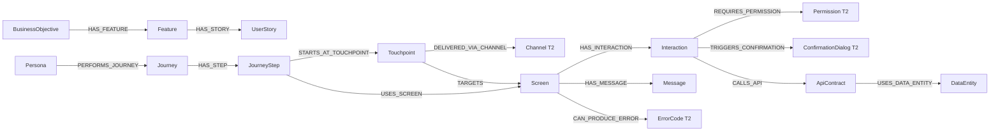
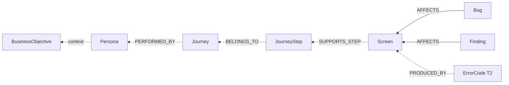
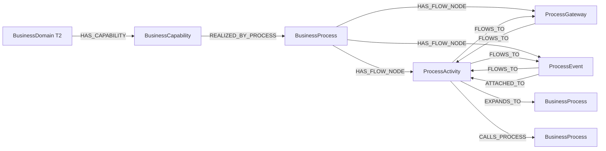
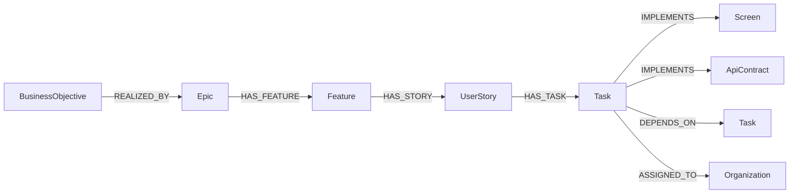
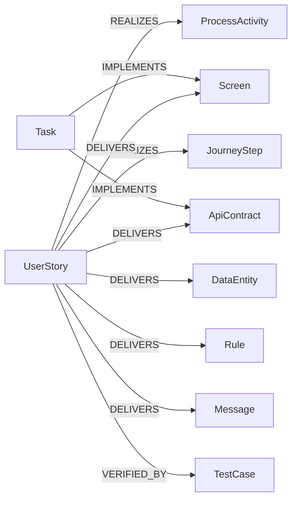
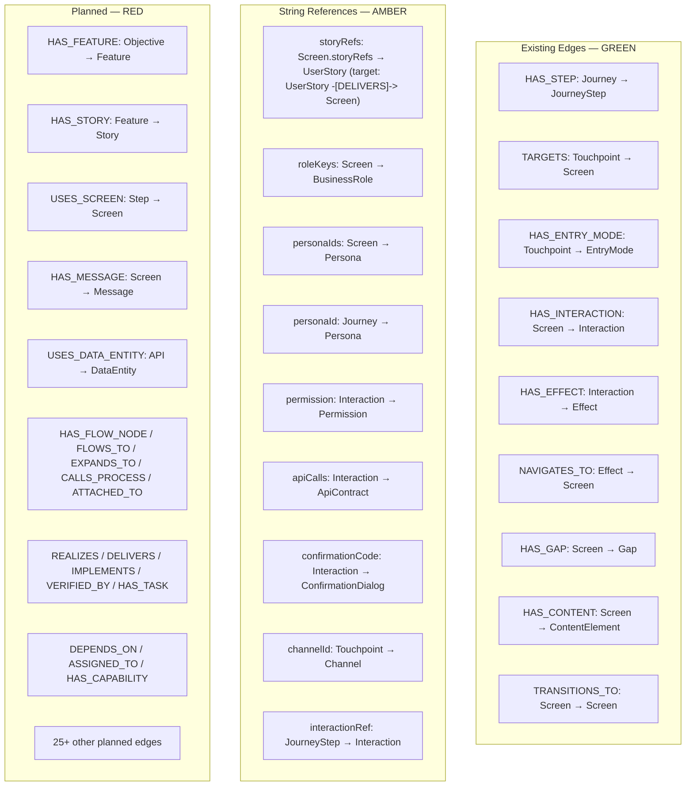

# Graph Object Catalog

**Status:** Draft
**Purpose:** Full specification of all graph model elements for Design Hub, classified by the three-tier taxonomy defined in `modeling-taxonomy.md`.

**Related documents:**

- `modeling-taxonomy.md` (classification rules, current-to-target mapping, string-to-edge migration)
- `implementation-readiness-graph-model.md` (status, readiness, and completeness governance)
- `vision-benchmark.md` (scoring against this catalog)

---

## 1. Object Design Rules

- Every Tier 1 object has a pattern-based stable identifier and universal `status`
- Every Tier 2 object has a code or key identifier; no independent `status` lifecycle
- Every Tier 3 object inherits identity and lifecycle from its parent
- Only implementation-driving objects carry `readiness` flags
- Every implementation-driving object should support `sourceRefs`
- Relationship edges are typed, directional, and queryable in both directions
- Objects are classified into Tier 1 (first-class node), Tier 2 (registry), or Tier 3 (value object) per `modeling-taxonomy.md`

---

## 2. Tier Summary

| Tier | Count | Benchmarkable | Objects |
|------|-------|---------------|---------|
| Tier 1 — First-Class Node | 52 | Yes | See sections 3.1 through 3.7 |
| Tier 2 — Registry Node | 9 | Yes | See section 4 |
| Tier 3 — Value Object | 4 | No (scored via parent) | See section 5 |
| **Total** | **65** | **61** | |

---

## 3. Tier 1 — First-Class Nodes (52)

### 3.1 Strategic & Governance (8)

---

### BusinessObjective

**Tier**: 1 (First-Class Node)
**Category**: Strategic & Governance
**Purpose**: Business intent and outcome target
**Implementation Status**: `[PLANNED]`

#### Attributes

| Attribute | Type | Required | Description | Constraints |
|-----------|------|----------|-------------|-------------|
| `objectiveId` | String | Yes | Stable identifier | Pattern: `OBJ-{module}-{seq}` |
| `title` | String | Yes | Short descriptive title | Max 200 chars |
| `description` | String | Yes | Full description of the objective | |
| `module` | String | Yes | Owning module | Enum: defined per project |
| `topic` | String | No | Thematic grouping | |
| `status` | String | Yes | Lifecycle status | Enum: IDENTIFIED, IN_DEFINITION, DEFINED, IN_REVIEW, APPROVED, IN_IMPLEMENTATION, IMPLEMENTED, VERIFIED, DEPRECATED, RETIRED |
| `sourceRefs` | List | No | Provenance links | List of SourceReference IDs |

#### Relationships

| Relationship | Direction | Target | Cardinality | Required | Severity | Implementation |
|-------------|-----------|--------|-------------|----------|----------|----------------|
| `HAS_FEATURE` | OUTGOING | Feature | 1:N | Yes | BLOCKING | `[PLANNED]` |
| `DRIVES_STORY` | OUTGOING | UserStory | 1:N | No | OPTIONAL | `[PLANNED]` |

---

### Decision

**Tier**: 1 (First-Class Node)
**Category**: Strategic & Governance
**Purpose**: Recorded decision with rationale and status
**Implementation Status**: `[PLANNED]`

#### Attributes

| Attribute | Type | Required | Description | Constraints |
|-----------|------|----------|-------------|-------------|
| `decisionId` | String | Yes | Stable identifier | Pattern: `DEC-{seq}` |
| `title` | String | Yes | Short descriptive title | Max 200 chars |
| `context` | String | Yes | Context and drivers | |
| `outcome` | String | Yes | What was decided | |
| `rationale` | String | No | Why this was chosen | |
| `alternatives` | List | No | Rejected alternatives | |
| `status` | String | Yes | Lifecycle status | Universal status enum |
| `sourceRefs` | List | No | Provenance links | |

#### Relationships

| Relationship | Direction | Target | Cardinality | Required | Severity | Implementation |
|-------------|-----------|--------|-------------|----------|----------|----------------|
| `AFFECTS_FEATURE` | OUTGOING | Feature | N:M | No | OPTIONAL | `[PLANNED]` |
| `AFFECTS_SCREEN` | OUTGOING | Screen | N:M | No | OPTIONAL | `[PLANNED]` |
| `AFFECTS_API` | OUTGOING | ApiContract | N:M | No | OPTIONAL | `[PLANNED]` |

---

### Assumption

**Tier**: 1 (First-Class Node)
**Category**: Strategic & Governance
**Purpose**: Stated assumption underlying design or scope
**Implementation Status**: `[PLANNED]`

#### Attributes

| Attribute | Type | Required | Description | Constraints |
|-----------|------|----------|-------------|-------------|
| `assumptionId` | String | Yes | Stable identifier | Pattern: `ASM-{seq}` |
| `statement` | String | Yes | The assumption | |
| `impact` | String | No | What breaks if wrong | |
| `status` | String | Yes | Lifecycle status | Universal status enum |
| `sourceRefs` | List | No | Provenance links | |

#### Relationships

| Relationship | Direction | Target | Cardinality | Required | Severity | Implementation |
|-------------|-----------|--------|-------------|----------|----------|----------------|
| `UNDERLIES_FEATURE` | OUTGOING | Feature | N:M | No | OPTIONAL | `[PLANNED]` |
| `UNDERLIES_STORY` | OUTGOING | UserStory | N:M | No | OPTIONAL | `[PLANNED]` |

---

### Constraint

**Tier**: 1 (First-Class Node)
**Category**: Strategic & Governance
**Purpose**: Technical, business, or regulatory constraint
**Implementation Status**: `[PLANNED]`

#### Attributes

| Attribute | Type | Required | Description | Constraints |
|-----------|------|----------|-------------|-------------|
| `constraintId` | String | Yes | Stable identifier | Pattern: `CON-{seq}` |
| `constraintType` | String | Yes | Type of constraint | Enum: TECHNICAL, BUSINESS, REGULATORY, OPERATIONAL |
| `statement` | String | Yes | The constraint | |
| `status` | String | Yes | Lifecycle status | Universal status enum |
| `sourceRefs` | List | No | Provenance links | |

#### Relationships

| Relationship | Direction | Target | Cardinality | Required | Severity | Implementation |
|-------------|-----------|--------|-------------|----------|----------|----------------|
| `CONSTRAINS_FEATURE` | OUTGOING | Feature | N:M | No | OPTIONAL | `[PLANNED]` |
| `CONSTRAINS_API` | OUTGOING | ApiContract | N:M | No | OPTIONAL | `[PLANNED]` |

---

### SourceReference

**Tier**: 1 (First-Class Node)
**Category**: Strategic & Governance
**Purpose**: Traceable provenance link to external artifact
**Implementation Status**: `[PLANNED]`

#### Attributes

| Attribute | Type | Required | Description | Constraints |
|-----------|------|----------|-------------|-------------|
| `sourceId` | String | Yes | Stable identifier | Pattern: `SRC-{seq}` |
| `artifactPath` | String | Yes | File path or document reference | |
| `section` | String | No | Section within the artifact | |
| `lineRef` | String | No | Line or range reference | |
| `url` | String | No | External URL | Valid URL format |
| `status` | String | Yes | Lifecycle status | Universal status enum |

#### Relationships

| Relationship | Direction | Target | Cardinality | Required | Severity | Implementation |
|-------------|-----------|--------|-------------|----------|----------|----------------|
| `SUPPORTS` | OUTGOING | Any Tier 1 object | 1:N | Yes | BLOCKING | `[PLANNED]` |

---

### Finding

**Tier**: 1 (First-Class Node)
**Category**: Strategic & Governance
**Purpose**: Review observation, issue, or concern discovered during human analysis
**Implementation Status**: `[PLANNED]`

#### Attributes

| Attribute | Type | Required | Description | Constraints |
|-----------|------|----------|-------------|-------------|
| `findingId` | String | Yes | Stable identifier | Pattern: `FND-{seq}` |
| `findingType` | String | Yes | Classification | Enum: GAP, ISSUE, OBSERVATION, CONCERN |
| `summary` | String | Yes | Short description | Max 500 chars |
| `severity` | String | Yes | Impact severity | Enum: CRITICAL, HIGH, MEDIUM, LOW |
| `status` | String | Yes | Lifecycle status | Universal status enum |
| `sourceRefs` | List | No | Provenance links | |

#### Relationships

| Relationship | Direction | Target | Cardinality | Required | Severity | Implementation |
|-------------|-----------|--------|-------------|----------|----------|----------------|
| `AFFECTS_SCREEN` | OUTGOING | Screen | N:M | No | OPTIONAL | `[PLANNED]` |
| `AFFECTS_STORY` | OUTGOING | UserStory | N:M | No | OPTIONAL | `[PLANNED]` |
| `AFFECTS_API` | OUTGOING | ApiContract | N:M | No | OPTIONAL | `[PLANNED]` |

---

### Bug

**Tier**: 1 (First-Class Node)
**Category**: Strategic & Governance
**Purpose**: Delivery defect linked to graph artifacts
**Implementation Status**: `[PLANNED]`

#### Attributes

| Attribute | Type | Required | Description | Constraints |
|-----------|------|----------|-------------|-------------|
| `bugId` | String | Yes | Stable identifier | Pattern: `BUG-{seq}` |
| `externalKey` | String | No | External tracker key | e.g., JIRA-1234, AB#5678 |
| `summary` | String | Yes | Short description | Max 500 chars |
| `severity` | String | Yes | Impact severity | Enum: CRITICAL, HIGH, MEDIUM, LOW |
| `status` | String | Yes | Lifecycle status | Universal status enum |
| `sourceRefs` | List | No | Provenance links | |

#### Relationships

| Relationship | Direction | Target | Cardinality | Required | Severity | Implementation |
|-------------|-----------|--------|-------------|----------|----------|----------------|
| `AFFECTS_SCREEN` | OUTGOING | Screen | N:M | No | OPTIONAL | `[PLANNED]` |
| `AFFECTS_STORY` | OUTGOING | UserStory | N:M | No | OPTIONAL | `[PLANNED]` |
| `AFFECTS_API` | OUTGOING | ApiContract | N:M | No | OPTIONAL | `[PLANNED]` |
| `TRACKED_IN_EXTERNAL_SYSTEM` | OUTGOING | ExternalArtifact | N:1 | No | OPTIONAL | `[PLANNED]` |

---

### Risk

**Tier**: 1 (First-Class Node)
**Category**: Strategic & Governance
**Purpose**: Identified risk with probability and impact
**Implementation Status**: `[PLANNED]`

#### Attributes

| Attribute | Type | Required | Description | Constraints |
|-----------|------|----------|-------------|-------------|
| `riskId` | String | Yes | Stable identifier | Pattern: `RSK-{seq}` |
| `title` | String | Yes | Short description | Max 200 chars |
| `probability` | String | Yes | Likelihood | Enum: HIGH, MEDIUM, LOW |
| `impact` | String | Yes | Consequence severity | Enum: CRITICAL, HIGH, MEDIUM, LOW |
| `mitigation` | String | No | Mitigation strategy | |
| `status` | String | Yes | Lifecycle status | Universal status enum |
| `sourceRefs` | List | No | Provenance links | |

#### Relationships

| Relationship | Direction | Target | Cardinality | Required | Severity | Implementation |
|-------------|-----------|--------|-------------|----------|----------|----------------|
| `THREATENS_FEATURE` | OUTGOING | Feature | N:M | No | OPTIONAL | `[PLANNED]` |
| `THREATENS_STORY` | OUTGOING | UserStory | N:M | No | OPTIONAL | `[PLANNED]` |

---

### 3.2 Business and Experience (7)

---

### Persona

**Tier**: 1 (First-Class Node)
**Category**: Business and Experience
**Purpose**: User archetype and operational context (19 unique in EMSIST source)
**Implementation Status**: `[PLANNED]` — currently only string references in `personaIds` fields

#### Attributes

| Attribute | Type | Required | Description | Constraints |
|-----------|------|----------|-------------|-------------|
| `personaId` | String | Yes | Stable identifier | Pattern: `PER-{domain}-{seq}` (e.g., PER-UX-001) |
| `name` | String | Yes | Display name | |
| `summary` | String | Yes | Role and context summary | |
| `goals` | List | No | Key goals | |
| `painPoints` | List | No | Key pain points | |
| `roleKeys` | List | No | Associated business roles | List of BusinessRole keys |
| `status` | String | Yes | Lifecycle status | Universal status enum |
| `sourceRefs` | List | No | Provenance links | |

#### Relationships

| Relationship | Direction | Target | Cardinality | Required | Severity | Implementation |
|-------------|-----------|--------|-------------|----------|----------|----------------|
| `PERFORMS_JOURNEY` | OUTGOING | Journey | 1:N | Yes | BLOCKING | `[PLANNED]` |
| `USES_SCREEN` | OUTGOING | Screen | 1:N | No | OPTIONAL | `[STRING_REF]` — `personaIds` on Screen |
| `AFFECTED_BY_FINDING` | INCOMING | Finding | N:M | No | OPTIONAL | `[PLANNED]` |

---

### BusinessRole

**Tier**: 1 (First-Class Node)
**Category**: Business and Experience
**Purpose**: Domain or business responsibility (split from current `Role.java`)
**Implementation Status**: `[IMPLEMENTED — reshape required]` `domain/Role.java`

#### Attributes

| Attribute | Type | Required | Description | Constraints |
|-----------|------|----------|-------------|-------------|
| `roleKey` | String | Yes | Stable identifier | Pattern: uppercase key (e.g., ADMIN, USER, ARCHITECT) |
| `displayName` | String | Yes | Human-readable name | |
| `roleGroup` | String | No | Grouping category | |
| `scope` | String | No | Scope of authority | |
| `sortOrder` | Integer | No | Display ordering | |
| `status` | String | Yes | Lifecycle status | Universal status enum |
| `sourceRefs` | List | No | Provenance links | |

#### Relationships

| Relationship | Direction | Target | Cardinality | Required | Severity | Implementation |
|-------------|-----------|--------|-------------|----------|----------|----------------|
| `ACTS_IN_JOURNEY` | OUTGOING | Journey | N:M | No | OPTIONAL | `[PLANNED]` |
| `CAN_ACCESS_SCREEN` | INCOMING | Screen | N:M | No | OPTIONAL | `[STRING_REF]` — `roleKeys` on Screen |
| `OWNS_RULE` | OUTGOING | Rule | N:M | No | OPTIONAL | `[PLANNED]` |

---

### ValidationRole

**Tier**: 1 (First-Class Node)
**Category**: Business and Experience
**Purpose**: Role responsible for approval or governance checks (split from current `Role.java`)
**Implementation Status**: `[IMPLEMENTED — reshape required]` `domain/Role.java`

#### Attributes

| Attribute | Type | Required | Description | Constraints |
|-----------|------|----------|-------------|-------------|
| `validationRoleKey` | String | Yes | Stable identifier | Pattern: uppercase key |
| `displayName` | String | Yes | Human-readable name | |
| `scope` | String | No | Scope of validation authority | |
| `status` | String | Yes | Lifecycle status | Universal status enum |
| `sourceRefs` | List | No | Provenance links | |

#### Relationships

| Relationship | Direction | Target | Cardinality | Required | Severity | Implementation |
|-------------|-----------|--------|-------------|----------|----------|----------------|
| `VALIDATES_STORY` | OUTGOING | UserStory | N:M | No | OPTIONAL | `[PLANNED]` |
| `VALIDATES_RULE` | OUTGOING | Rule | N:M | No | OPTIONAL | `[PLANNED]` |
| `VALIDATES_API` | OUTGOING | ApiContract | N:M | No | OPTIONAL | `[PLANNED]` |

---

### Journey

**Tier**: 1 (First-Class Node)
**Category**: Business and Experience
**Purpose**: End-to-end user goal path
**Implementation Status**: `[IMPLEMENTED]` `domain/Journey.java`

#### Attributes

| Attribute | Type | Required | Description | Constraints |
|-----------|------|----------|-------------|-------------|
| `journeyId` | String | Yes | Stable identifier | Pattern: `JRN-{module}-{seq}` |
| `title` | String | Yes | Journey name | Max 200 chars |
| `topic` | String | No | Thematic grouping | |
| `module` | String | No | Owning module | |
| `personaId` | String | Yes | Owning persona | Persona ID reference |
| `roleKey` | String | No | Primary role context | BusinessRole key |
| `goalStatement` | String | Yes | What the persona aims to achieve | |
| `designStatus` | String | Yes | Current design status | **Current code**: Enum: NOT_STARTED, IN_PROGRESS, COMPLETE. **Target**: Universal status enum |
| `prototypeStatus` | String | Yes | Current prototype status | Same migration needed |
| `deliveryStatus` | String | Yes | Current delivery status | Same migration needed |
| `readiness` | Object | No | Readiness flags | Applicable: requirementsReady, designReady, qaReady |
| `sourceRefs` | List | No | Provenance links | **Missing from code** |

#### Relationships

| Relationship | Direction | Target | Cardinality | Required | Severity | Implementation |
|-------------|-----------|--------|-------------|----------|----------|----------------|
| `HAS_STEP` | OUTGOING | JourneyStep | 1:N | Yes | BLOCKING | `[EDGE]` |
| `PERFORMED_BY_PERSONA` | OUTGOING | Persona | N:1 | Yes | BLOCKING | `[STRING_REF]` — `personaId` string |
| `REALIZES` | INCOMING | Epic, Feature, UserStory | N:M | No | OPTIONAL | `[PLANNED]` — four-verb traceability |

---

### JourneyStep

**Tier**: 1 (First-Class Node)
**Category**: Business and Experience
**Purpose**: Ordered step inside a journey
**Implementation Status**: `[IMPLEMENTED]` `domain/JourneyStep.java`

#### Attributes

| Attribute | Type | Required | Description | Constraints |
|-----------|------|----------|-------------|-------------|
| `stepId` | String | Yes | Stable identifier | Pattern: `{journeyId}.{seq}` |
| `journeyId` | String | Yes | Parent journey | Journey ID reference |
| `orderIndex` | Integer | Yes | Step ordering | >= 0 |
| `label` | String | Yes | Step description | |
| `trigger` | String | No | What initiates this step | |
| `preCondition` | String | No | Required precondition | |
| `postCondition` | String | No | Expected postcondition | |
| `interactionRef` | String | No | Referenced interaction | **Current code**: string. **Target**: edge |
| `status` | String | Yes | Lifecycle status | Universal status enum |
| `readiness` | Object | No | Readiness flags | Applicable: requirementsReady, designReady, qaReady |
| `sourceRefs` | List | No | Provenance links | |

#### Relationships

| Relationship | Direction | Target | Cardinality | Required | Severity | Implementation |
|-------------|-----------|--------|-------------|----------|----------|----------------|
| `BELONGS_TO_JOURNEY` | INCOMING | Journey | N:1 | Yes | BLOCKING | `[EDGE]` — via Journey.HAS_STEP |
| `USES_SCREEN` | OUTGOING | Screen | N:1 | Yes | BLOCKING | `[PLANNED]` |
| `EXECUTES_INTERACTION` | OUTGOING | Interaction | N:1 | No | OPTIONAL | `[STRING_REF]` — `interactionRef` |
| `STARTS_AT_TOUCHPOINT` | OUTGOING | Touchpoint | N:M | No | OPTIONAL | `[PLANNED]` |
| `REALIZES` | INCOMING | UserStory | N:M | No | OPTIONAL | `[PLANNED]` — UserStory REALIZES JourneyStep |

---

### Topic

**Tier**: 1 (First-Class Node)
**Category**: Business and Experience
**Purpose**: Thematic grouping for journeys and features
**Implementation Status**: `[PLANNED]`

#### Attributes

| Attribute | Type | Required | Description | Constraints |
|-----------|------|----------|-------------|-------------|
| `topicId` | String | Yes | Stable identifier | Pattern: `TOP-{seq}` |
| `name` | String | Yes | Topic name | |
| `description` | String | No | Description | |
| `status` | String | Yes | Lifecycle status | Universal status enum |

#### Relationships

| Relationship | Direction | Target | Cardinality | Required | Severity | Implementation |
|-------------|-----------|--------|-------------|----------|----------|----------------|
| `GROUPS_JOURNEY` | OUTGOING | Journey | 1:N | No | OPTIONAL | `[PLANNED]` |
| `GROUPS_FEATURE` | OUTGOING | Feature | 1:N | No | OPTIONAL | `[PLANNED]` |

---

### Touchpoint

**Tier**: 1 (First-Class Node)
**Category**: Business and Experience
**Purpose**: Entry point into a journey or screen
**Implementation Status**: `[IMPLEMENTED]` `domain/Touchpoint.java`

#### Attributes

| Attribute | Type | Required | Description | Constraints |
|-----------|------|----------|-------------|-------------|
| `touchpointId` | String | Yes | Stable identifier | Pattern: `TP-{surfaceId}-{seq}` |
| `label` | String | Yes | Display label | |
| `surfaceId` | String | Yes | Target screen reference | Screen ID |
| `personaIds` | List | No | Associated personas | **Current code**: string list. **Target**: edge |
| `roleKeys` | List | No | Associated roles | **Current code**: string list. **Target**: edge |
| `status` | String | Yes | Lifecycle status | Universal status enum |
| `sourceRefs` | List | No | Provenance links | |

#### Relationships

| Relationship | Direction | Target | Cardinality | Required | Severity | Implementation |
|-------------|-----------|--------|-------------|----------|----------|----------------|
| `TARGETS` | OUTGOING | Screen | N:1 | Yes | BLOCKING | `[EDGE]` |
| `HAS_ENTRY_MODE` | OUTGOING | EntryMode (T3) | 1:N | Yes | BLOCKING | `[EDGE]` |
| `DELIVERED_VIA_CHANNEL` | OUTGOING | Channel (T2) | N:M | Yes | BLOCKING | `[STRING_REF]` — `channelId` in EntryMode |
| `USED_BY_PERSONA` | OUTGOING | Persona | N:M | No | OPTIONAL | `[STRING_REF]` — `personaIds` |

---

### 3.3 Delivery & Execution (4)

---

### Epic

**Tier**: 1 (First-Class Node)
**Category**: Delivery & Execution
**Purpose**: Key hierarchy level between BusinessObjective and Feature. Enables traceability from strategic intent to delivery.
**Implementation Status**: `[PLANNED]`

#### Attributes

| Attribute | Type | Required | Description | Constraints |
|-----------|------|----------|-------------|-------------|
| `epicId` | String | Yes | Stable identifier | Pattern: `EPC-{seq}` |
| `title` | String | Yes | Epic title | Max 200 chars |
| `description` | String | No | Full description | |
| `owner` | String | No | Epic owner | |
| `priority` | String | No | Priority level | Enum: CRITICAL, HIGH, MEDIUM, LOW |
| `status` | String | Yes | Lifecycle status | Enum: IDENTIFIED through RETIRED |
| `sourceRefs` | List | No | Provenance links | |

#### Relationships

| Relationship | Direction | Target | Cardinality | Required | Severity | Implementation |
|-------------|-----------|--------|-------------|----------|----------|----------------|
| `HAS_FEATURE` | OUTGOING | Feature | 1:N | Yes | BLOCKING | `[PLANNED]` |
| `REALIZED_BY` | INCOMING | BusinessObjective | N:M | No | OPTIONAL | `[PLANNED]` |
| `AFFECTS` | OUTGOING | Application | 1:N | No | OPTIONAL | `[PLANNED]` |

---

### Feature

**Tier**: 1 (First-Class Node)
**Category**: Delivery & Execution
**Purpose**: Cohesive delivery capability grouping
**Implementation Status**: `[PLANNED]`

#### Attributes

| Attribute | Type | Required | Description | Constraints |
|-----------|------|----------|-------------|-------------|
| `featureId` | String | Yes | Stable identifier | Pattern: `FEAT-{module}-{seq}` |
| `title` | String | Yes | Short descriptive title | Max 200 chars |
| `module` | String | Yes | Owning module | |
| `scope` | String | No | Scope description | |
| `status` | String | Yes | Lifecycle status | Universal status enum |
| `sourceRefs` | List | No | Provenance links | |

#### Relationships

| Relationship | Direction | Target | Cardinality | Required | Severity | Implementation |
|-------------|-----------|--------|-------------|----------|----------|----------------|
| `BELONGS_TO_OBJECTIVE` | OUTGOING | BusinessObjective | N:1 | Yes | BLOCKING | `[PLANNED]` |
| `HAS_STORY` | OUTGOING | UserStory | 1:N | Yes | BLOCKING | `[PLANNED]` |
| `HAS_SCREEN` | OUTGOING | Screen | 1:N | No | OPTIONAL | `[PLANNED]` |

---

### UserStory

**Tier**: 1 (First-Class Node)
**Category**: Delivery & Execution
**Purpose**: Deliverable requirement unit
**Implementation Status**: `[IMPLEMENTED]` `domain/UserStory.java` — minimal (5 fields vs 8+ target)

#### Attributes

| Attribute | Type | Required | Description | Constraints |
|-----------|------|----------|-------------|-------------|
| `storyId` | String | Yes | Stable identifier | Pattern: `US-{domain}-{seq}` (e.g., US-DM-001) |
| `title` | String | Yes | Story title | Max 200 chars. **Current code**: `label` |
| `module` | String | Yes | Owning module | |
| `domain` | String | No | Business domain | **Current code**: exists |
| `storyNumber` | Integer | No | Sequential number | **Current code**: exists |
| `storyType` | String | No | Classification | Enum: FUNCTIONAL, NON_FUNCTIONAL, ENABLER, SPIKE |
| `originType` | String | No | Where the story originates | Enum: PROCESS, EXPERIENCE, TECHNICAL, CROSS_CUTTING |
| `natureType` | String | No | Functional classification | Enum: FUNCTIONAL, NON_FUNCTIONAL |
| `description` | String | No | Full description | |
| `status` | String | Yes | Lifecycle status | Universal status enum |
| `readiness` | Object | No | Readiness flags | All 7 flags applicable |
| `sourceRefs` | List | No | Provenance links | |
| `executionMode` | Enum | No | How the story will be implemented | Enum: HUMAN_ONLY, AGENT_ASSISTED, AGENT_FIRST. Default: HUMAN_ONLY |

#### Relationships

| Relationship | Direction | Target | Cardinality | Required | Severity | Implementation |
|-------------|-----------|--------|-------------|----------|----------|----------------|
| `HAS_STORY` | INCOMING | Feature | N:1 | Yes | BLOCKING | `[PLANNED]` — delivery spine: Feature HAS_STORY UserStory |
| `USES_SCREEN` | OUTGOING | Screen | N:M | No | OPTIONAL | `[STRING_REF]` — `storyRefs` on Screen (reverse) |
| `REQUIRES_API` | OUTGOING | ApiContract | N:M | No | OPTIONAL | `[PLANNED]` |
| `GOVERNED_BY_RULE` | OUTGOING | Rule | N:M | No | OPTIONAL | `[PLANNED]` |
| `HAS_CRITERION` | OUTGOING | AcceptanceCriterion | 1:N | Yes | BLOCKING | `[PLANNED]` |
| `REALIZES` | OUTGOING | ProcessActivity, JourneyStep | N:M | No | OPTIONAL | `[PLANNED]` |
| `DELIVERS` | OUTGOING | Screen, ApiContract, DataEntity, Rule, Message | N:M | No | OPTIONAL | `[PLANNED]` |
| `HAS_TASK` | OUTGOING | Task | 1:N | No | OPTIONAL | `[PLANNED]` |
| `VERIFIED_BY` | OUTGOING | TestCase | 1:N | Yes | BLOCKING | `[PLANNED]` |

---

### Task

**Tier**: 1 (First-Class Node)
**Category**: Delivery & Execution
**Purpose**: Atomic unit of work assigned to an individual or team, decomposed from a UserStory
**Implementation Status**: `[PLANNED]`

#### Attributes

| Attribute | Type | Required | Description | Constraints |
|-----------|------|----------|-------------|-------------|
| `taskId` | String | Yes | Stable identifier | Pattern: `TSK-{module}-{seq}` |
| `title` | String | Yes | Task title | Max 200 chars |
| `description` | String | No | Full description | |
| `taskType` | String | Yes | Classification | Enum: FRONTEND, BACKEND, API, DATA, TEST, DEVOPS, UX, DOCUMENTATION |
| `status` | String | Yes | Lifecycle status | Enum: IDENTIFIED, IN_DEFINITION, DEFINED, IN_REVIEW, APPROVED, IN_IMPLEMENTATION, IMPLEMENTED, VERIFIED, DEPRECATED, RETIRED |
| `priority` | String | No | Priority level | Enum: CRITICAL, HIGH, MEDIUM, LOW |
| `estimate` | String | No | Effort estimate | |
| `actualEffort` | String | No | Actual effort spent | |
| `assigneeName` | String | No | Assigned individual | Temporary until Person T1 |
| `teamName` | String | No | Assigned team | Temporary until team modeled |
| `dueDate` | Date | No | Target completion date | |

#### Relationships

| Relationship | Direction | Target | Cardinality | Required | Severity | Implementation |
|-------------|-----------|--------|-------------|----------|----------|----------------|
| `HAS_TASK` | INCOMING | UserStory | N:1 | Yes | BLOCKING | `[PLANNED]` |
| `IMPLEMENTS` | OUTGOING | Screen, ApiContract, DataEntity, Rule, Message, TestCase, ApplicationComponent | N:M | No | OPTIONAL | `[PLANNED]` |
| `DEPENDS_ON` | OUTGOING | Task | N:M | No | OPTIONAL | `[PLANNED]` |
| `ASSIGNED_TO` | OUTGOING | Organization | N:1 | No | OPTIONAL | `[PLANNED]` |

---

### 3.4 Requirement & Design (9)

---

### AcceptanceCriterion

**Tier**: 1 (First-Class Node)
**Category**: Requirement & Design
**Purpose**: Verifiable story condition
**Implementation Status**: `[PLANNED]`

#### Attributes

| Attribute | Type | Required | Description | Constraints |
|-----------|------|----------|-------------|-------------|
| `criterionId` | String | Yes | Stable identifier | Pattern: `AC-{storyId}-{seq}` |
| `storyId` | String | Yes | Parent story | UserStory ID |
| `statement` | String | Yes | Verifiable condition | |
| `status` | String | Yes | Lifecycle status | Universal status enum |
| `sourceRefs` | List | No | Provenance links | |

#### Relationships

| Relationship | Direction | Target | Cardinality | Required | Severity | Implementation |
|-------------|-----------|--------|-------------|----------|----------|----------------|
| `BELONGS_TO_STORY` | INCOMING | UserStory | N:1 | Yes | BLOCKING | `[PLANNED]` |
| `VERIFIED_BY` | OUTGOING | TestCase | 1:N | No | OPTIONAL | `[PLANNED]` — consistent with four-verb model |

---

### Rule

**Tier**: 1 (First-Class Node)
**Category**: Requirement & Design
**Purpose**: Business rule or domain rule
**Implementation Status**: `[PLANNED]`

#### Attributes

| Attribute | Type | Required | Description | Constraints |
|-----------|------|----------|-------------|-------------|
| `ruleId` | String | Yes | Stable identifier | Pattern: `RULE-{seq}` |
| `ruleType` | String | Yes | Classification | Enum: BUSINESS, DOMAIN, REGULATORY, OPERATIONAL |
| `statement` | String | Yes | Rule description | |
| `status` | String | Yes | Lifecycle status | Universal status enum |
| `sourceRefs` | List | No | Provenance links | |

#### Relationships

| Relationship | Direction | Target | Cardinality | Required | Severity | Implementation |
|-------------|-----------|--------|-------------|----------|----------|----------------|
| `GOVERNS_STORY` | OUTGOING | UserStory | N:M | No | OPTIONAL | `[PLANNED]` |
| `GOVERNS_SCREEN` | OUTGOING | Screen | N:M | No | OPTIONAL | `[PLANNED]` |
| `GOVERNS_API` | OUTGOING | ApiContract | N:M | No | OPTIONAL | `[PLANNED]` |

---

### ValidationRule

**Tier**: 1 (First-Class Node)
**Category**: Requirement & Design
**Purpose**: Explicit validation behavior
**Implementation Status**: `[PLANNED]`

#### Attributes

| Attribute | Type | Required | Description | Constraints |
|-----------|------|----------|-------------|-------------|
| `validationId` | String | Yes | Stable identifier | Pattern: `VAL-{seq}` |
| `scopeType` | String | Yes | What is validated | Enum: SCREEN, API, DATA_FIELD |
| `scopeRef` | String | Yes | Reference to validated object | |
| `condition` | String | Yes | Validation condition | |
| `messageCode` | String | No | Error message code | ErrorCode reference |
| `status` | String | Yes | Lifecycle status | Universal status enum |
| `sourceRefs` | List | No | Provenance links | |

#### Relationships

| Relationship | Direction | Target | Cardinality | Required | Severity | Implementation |
|-------------|-----------|--------|-------------|----------|----------|----------------|
| `VALIDATES_SCREEN` | OUTGOING | Screen | N:M | No | OPTIONAL | `[PLANNED]` |
| `VALIDATES_API` | OUTGOING | ApiContract | N:M | No | OPTIONAL | `[PLANNED]` |
| `REFERENCES_ERROR_CODE` | OUTGOING | ErrorCode (T2) | N:1 | No | OPTIONAL | `[PLANNED]` |

---

### EdgeCase

**Tier**: 1 (First-Class Node)
**Category**: Requirement & Design
**Purpose**: Non-happy-path scenario
**Implementation Status**: `[PLANNED]`

#### Attributes

| Attribute | Type | Required | Description | Constraints |
|-----------|------|----------|-------------|-------------|
| `edgeCaseId` | String | Yes | Stable identifier | Pattern: `EDGE-{seq}` |
| `context` | String | Yes | When this occurs | |
| `behavior` | String | Yes | Expected behavior | |
| `status` | String | Yes | Lifecycle status | Universal status enum |
| `sourceRefs` | List | No | Provenance links | |

#### Relationships

| Relationship | Direction | Target | Cardinality | Required | Severity | Implementation |
|-------------|-----------|--------|-------------|----------|----------|----------------|
| `AFFECTS_STORY` | OUTGOING | UserStory | N:M | No | OPTIONAL | `[PLANNED]` |
| `AFFECTS_SCREEN` | OUTGOING | Screen | N:M | No | OPTIONAL | `[PLANNED]` |
| `AFFECTS_JOURNEY_STEP` | OUTGOING | JourneyStep | N:M | No | OPTIONAL | `[PLANNED]` |

---

### ExceptionCase

**Tier**: 1 (First-Class Node)
**Category**: Requirement & Design
**Purpose**: Failure or exceptional path
**Implementation Status**: `[PLANNED]`

#### Attributes

| Attribute | Type | Required | Description | Constraints |
|-----------|------|----------|-------------|-------------|
| `exceptionId` | String | Yes | Stable identifier | Pattern: `EXC-{seq}` |
| `context` | String | Yes | When this occurs | |
| `behavior` | String | Yes | Expected behavior | |
| `status` | String | Yes | Lifecycle status | Universal status enum |
| `sourceRefs` | List | No | Provenance links | |

#### Relationships

| Relationship | Direction | Target | Cardinality | Required | Severity | Implementation |
|-------------|-----------|--------|-------------|----------|----------|----------------|
| `AFFECTS_INTERACTION` | OUTGOING | Interaction | N:M | No | OPTIONAL | `[PLANNED]` |
| `AFFECTS_API` | OUTGOING | ApiContract | N:M | No | OPTIONAL | `[PLANNED]` |
| `AFFECTS_JOURNEY_STEP` | OUTGOING | JourneyStep | N:M | No | OPTIONAL | `[PLANNED]` |

---

### Screen

**Tier**: 1 (First-Class Node)
**Category**: Requirement & Design
**Purpose**: Navigable UI surface or always-present surface
**Implementation Status**: `[IMPLEMENTED]` `domain/Screen.java`

#### Attributes

| Attribute | Type | Required | Description | Constraints |
|-----------|------|----------|-------------|-------------|
| `surfaceId` | String | Yes | Stable identifier | Pattern: `SURF-{module}-{seq}` |
| `label` | String | Yes | Display label | |
| `module` | String | Yes | Owning module | |
| `routePath` | String | No | Frontend route path | |
| `screenType` | String | No | Surface classification | Enum: PAGE, GLOBAL, MODAL, DRAWER, OVERLAY |
| `designStatus` | String | Yes | Current design status | **Current code**: NOT_STARTED, IN_PROGRESS, COMPLETE. **Target**: Universal status |
| `prototypeStatus` | String | Yes | Prototype status | Same migration |
| `deliveryStatus` | String | Yes | Delivery status | Same migration |
| `wcag` | Boolean | No | WCAG compliance flag | |
| `responsive` | Boolean | No | Responsive design flag | |
| `roleAdaptive` | Boolean | No | Role-adaptive behavior | |
| `deepLinkable` | Boolean | No | Deep-linkable | |
| `loadingStates` | Boolean | No | Has loading states | |
| `messageRegistryCount` | Integer | No | Count of registered messages | |
| `notes` | String | No | Additional notes | |
| `readiness` | Object | No | Readiness flags | Applicable: requirementsReady, designReady, frontendReady, integrationReady, qaReady |
| `sourceRefs` | List | No | Provenance links | **Missing from code** |

#### Relationships

| Relationship | Direction | Target | Cardinality | Required | Severity | Implementation |
|-------------|-----------|--------|-------------|----------|----------|----------------|
| `HAS_INTERACTION` | OUTGOING | Interaction | 1:N | Yes | BLOCKING | `[EDGE]` — replaces deprecated ON_SCREEN (direction reversed: Screen→Interaction) |
| `DELIVERS` | INCOMING | UserStory | N:M | Yes | BLOCKING | `[STRING_REF]` — `storyRefs` (UserStory DELIVERS Screen) |
| `ACCESSIBLE_BY_ROLE` | OUTGOING | BusinessRole | N:M | No | OPTIONAL | `[STRING_REF]` — `roleKeys` |
| `USED_BY_PERSONA` | OUTGOING | Persona | N:M | No | OPTIONAL | `[STRING_REF]` — `personaIds` |
| `HAS_MESSAGE` | OUTGOING | Message | 1:N | No | OPTIONAL | `[PLANNED]` |
| `HAS_GAP` | OUTGOING | Gap | 1:N | No | OPTIONAL | `[EDGE]` |
| `HAS_CONTENT` | OUTGOING | ContentElement (T3) | 1:N | No | OPTIONAL | `[EDGE]` |
| `TRANSITIONS_TO` | OUTGOING | Screen | N:M | No | OPTIONAL | `[EDGE]` |
| `CAN_PRODUCE_ERROR` | OUTGOING | ErrorCode (T2) | N:M | No | OPTIONAL | `[PLANNED]` |

---

### ScreenState

**Tier**: 1 (First-Class Node)
**Category**: Requirement & Design
**Purpose**: Distinct state of a screen
**Implementation Status**: `[PLANNED]`

#### Attributes

| Attribute | Type | Required | Description | Constraints |
|-----------|------|----------|-------------|-------------|
| `stateId` | String | Yes | Stable identifier | Pattern: `STATE-{surfaceId}-{seq}` |
| `surfaceId` | String | Yes | Parent screen | Screen ID |
| `stateType` | String | Yes | Classification | Enum: DEFAULT, LOADING, EMPTY, ERROR, SUCCESS, ROLE_VARIANT |
| `description` | String | No | State description | |
| `status` | String | Yes | Lifecycle status | Universal status enum |
| `sourceRefs` | List | No | Provenance links | |

#### Relationships

| Relationship | Direction | Target | Cardinality | Required | Severity | Implementation |
|-------------|-----------|--------|-------------|----------|----------|----------------|
| `BELONGS_TO_SCREEN` | OUTGOING | Screen | N:1 | Yes | BLOCKING | `[PLANNED]` |
| `TRIGGERED_BY_INTERACTION` | INCOMING | Interaction | N:M | No | OPTIONAL | `[PLANNED]` |

---

### Interaction

**Tier**: 1 (First-Class Node)
**Category**: Requirement & Design
**Purpose**: User or system action on a surface
**Implementation Status**: `[IMPLEMENTED]` `domain/Interaction.java`

#### Attributes

| Attribute | Type | Required | Description | Constraints |
|-----------|------|----------|-------------|-------------|
| `interactionId` | String | Yes | Stable identifier | Pattern: `INT-{surfaceId}-{seq}` |
| `surfaceId` | String | Yes | Parent screen | Screen ID |
| `element` | String | Yes | UI element acted upon | |
| `trigger` | String | Yes | What initiates the interaction | Enum: click, type, drag-drop, hover, scroll, keyboard-shortcut, system, timer, 401-response, sse-event, jwt-expiry |
| `permission` | String | No | Required permission | **Current code**: string. **Target**: edge to Permission (T2) |
| `confirmationCode` | String | No | Confirmation dialog code | **Current code**: string. **Target**: edge to ConfirmationDialog (T2) |
| `personaIds` | List | No | Associated personas | **Current code**: string list. **Target**: edge |
| `roleKeys` | List | No | Associated roles | **Current code**: string list. **Target**: edge |
| `apiCalls` | List | No | Called APIs | **Current code**: string list. **Target**: edge to ApiContract |
| `outcomes` | Object | No | Structured outcomes | **Missing from code**: `{success: String, error: String, loading: String}` — see InteractionOutcome (T3) |
| `status` | String | Yes | Lifecycle status | Universal status enum |
| `readiness` | Object | No | Readiness flags | All 7 flags applicable |
| `sourceRefs` | List | No | Provenance links | **Missing from code** |

#### Relationships

| Relationship | Direction | Target | Cardinality | Required | Severity | Implementation |
|-------------|-----------|--------|-------------|----------|----------|----------------|
| `HAS_INTERACTION` | INCOMING | Screen | N:1 | Yes | BLOCKING | `[EDGE]` — Screen HAS_INTERACTION Interaction (replaces deprecated ON_SCREEN) |
| `HAS_EFFECT` | OUTGOING | Effect (T3) | 1:N | No | OPTIONAL | `[EDGE]` |
| `REQUIRES_PERMISSION` | OUTGOING | Permission (T2) | N:1 | No | OPTIONAL | `[STRING_REF]` — `permission` |
| `TRIGGERS_CONFIRMATION` | OUTGOING | ConfirmationDialog (T2) | N:1 | No | OPTIONAL | `[STRING_REF]` — `confirmationCode` |
| `CALLS_API` | OUTGOING | ApiContract | N:M | No | OPTIONAL | `[STRING_REF]` — `apiCalls` |
| `ON_ERROR_SHOWS` | OUTGOING | ErrorCode (T2) | N:M | No | OPTIONAL | `[PLANNED]` |

---

### Transition

**Tier**: 1 (First-Class Node)
**Category**: Requirement & Design
**Purpose**: Screen-to-screen or state transition
**Implementation Status**: `[PLANNED]` — TRANSITIONS_TO edge exists on Screen but Transition as independent node is planned

#### Attributes

| Attribute | Type | Required | Description | Constraints |
|-----------|------|----------|-------------|-------------|
| `transitionId` | String | Yes | Stable identifier | Pattern: `TRANS-{seq}` |
| `fromRef` | String | Yes | Source screen or state | Screen or ScreenState ID |
| `toRef` | String | Yes | Target screen or state | Screen or ScreenState ID |
| `triggerRef` | String | No | Triggering interaction | Interaction ID |
| `status` | String | Yes | Lifecycle status | Universal status enum |
| `sourceRefs` | List | No | Provenance links | |

#### Relationships

| Relationship | Direction | Target | Cardinality | Required | Severity | Implementation |
|-------------|-----------|--------|-------------|----------|----------|----------------|
| `FROM_SCREEN` | OUTGOING | Screen | N:1 | Yes | BLOCKING | `[PLANNED]` |
| `TO_SCREEN` | OUTGOING | Screen | N:1 | Yes | BLOCKING | `[PLANNED]` |
| `CAUSED_BY_INTERACTION` | OUTGOING | Interaction | N:1 | No | OPTIONAL | `[PLANNED]` |

---

### 3.5 Engineering (8)

---

### ApiContract

**Tier**: 1 (First-Class Node)
**Category**: Engineering
**Purpose**: Backend contract needed by a story or interaction
**Implementation Status**: `[PLANNED]`

#### Attributes

| Attribute | Type | Required | Description | Constraints |
|-----------|------|----------|-------------|-------------|
| `apiId` | String | Yes | Stable identifier | Pattern: `API-{service}-{seq}` |
| `method` | String | Yes | HTTP method | Enum: GET, POST, PUT, PATCH, DELETE |
| `path` | String | Yes | Endpoint path | |
| `authModel` | String | No | Authentication model | Enum: BEARER, API_KEY, NONE |
| `requestSchemaRef` | String | No | Request schema reference | RequestSchema ID |
| `responseSchemaRef` | String | No | Response schema reference | ResponseSchema ID |
| `errorContractRef` | String | No | Error contract reference | ErrorContract ID |
| `status` | String | Yes | Lifecycle status | Universal status enum |
| `readiness` | Object | No | Readiness flags | Applicable: requirementsReady, contractReady, backendReady, integrationReady, qaReady |
| `sourceRefs` | List | No | Provenance links | |

#### Relationships

| Relationship | Direction | Target | Cardinality | Required | Severity | Implementation |
|-------------|-----------|--------|-------------|----------|----------|----------------|
| `REQUIRED_BY_STORY` | INCOMING | UserStory | N:M | No | OPTIONAL | `[PLANNED]` |
| `CALLED_BY_INTERACTION` | INCOMING | Interaction | N:M | No | OPTIONAL | `[STRING_REF]` — `apiCalls` |
| `USES_DATA_ENTITY` | OUTGOING | DataEntity | N:M | No | OPTIONAL | `[PLANNED]` |
| `HAS_REQUEST_SCHEMA` | OUTGOING | RequestSchema | 1:1 | No | OPTIONAL | `[PLANNED]` |
| `HAS_RESPONSE_SCHEMA` | OUTGOING | ResponseSchema | 1:1 | No | OPTIONAL | `[PLANNED]` |
| `HAS_ERROR_CONTRACT` | OUTGOING | ErrorContract | 1:1 | No | OPTIONAL | `[PLANNED]` |

---

### RequestSchema

**Tier**: 1 (First-Class Node)
**Category**: Engineering
**Purpose**: Input schema for an API contract
**Implementation Status**: `[PLANNED]`

#### Attributes

| Attribute | Type | Required | Description | Constraints |
|-----------|------|----------|-------------|-------------|
| `schemaId` | String | Yes | Stable identifier | Pattern: `REQSCH-{apiId}` |
| `contentType` | String | Yes | Media type | Enum: application/json, multipart/form-data |
| `fields` | List | Yes | Schema fields | List of field definitions |
| `status` | String | Yes | Lifecycle status | Universal status enum |

#### Relationships

| Relationship | Direction | Target | Cardinality | Required | Severity | Implementation |
|-------------|-----------|--------|-------------|----------|----------|----------------|
| `BELONGS_TO_API` | INCOMING | ApiContract | 1:1 | Yes | BLOCKING | `[PLANNED]` |

---

### ResponseSchema

**Tier**: 1 (First-Class Node)
**Category**: Engineering
**Purpose**: Output schema for an API contract
**Implementation Status**: `[PLANNED]`

#### Attributes

| Attribute | Type | Required | Description | Constraints |
|-----------|------|----------|-------------|-------------|
| `schemaId` | String | Yes | Stable identifier | Pattern: `RESSCH-{apiId}` |
| `contentType` | String | Yes | Media type | Enum: application/json |
| `fields` | List | Yes | Schema fields | List of field definitions |
| `status` | String | Yes | Lifecycle status | Universal status enum |

#### Relationships

| Relationship | Direction | Target | Cardinality | Required | Severity | Implementation |
|-------------|-----------|--------|-------------|----------|----------|----------------|
| `BELONGS_TO_API` | INCOMING | ApiContract | 1:1 | Yes | BLOCKING | `[PLANNED]` |

---

### ErrorContract

**Tier**: 1 (First-Class Node)
**Category**: Engineering
**Purpose**: Error response structure for an API contract
**Implementation Status**: `[PLANNED]`

#### Attributes

| Attribute | Type | Required | Description | Constraints |
|-----------|------|----------|-------------|-------------|
| `errorContractId` | String | Yes | Stable identifier | Pattern: `ERRCON-{apiId}` |
| `errorCodes` | List | Yes | Applicable error codes | List of ErrorCode references |
| `responseShape` | String | No | Error response format | |
| `status` | String | Yes | Lifecycle status | Universal status enum |

#### Relationships

| Relationship | Direction | Target | Cardinality | Required | Severity | Implementation |
|-------------|-----------|--------|-------------|----------|----------|----------------|
| `BELONGS_TO_API` | INCOMING | ApiContract | 1:1 | Yes | BLOCKING | `[PLANNED]` |
| `REFERENCES_ERROR_CODE` | OUTGOING | ErrorCode (T2) | 1:N | No | OPTIONAL | `[PLANNED]` |

---

### DataEntity

**Tier**: 1 (First-Class Node)
**Category**: Engineering
**Purpose**: Domain data object
**Implementation Status**: `[PLANNED]`

#### Attributes

| Attribute | Type | Required | Description | Constraints |
|-----------|------|----------|-------------|-------------|
| `entityId` | String | Yes | Stable identifier | Pattern: `ENT-{seq}` |
| `name` | String | Yes | Entity name | |
| `ownership` | String | No | Owning service or bounded context | |
| `status` | String | Yes | Lifecycle status | Universal status enum |
| `readiness` | Object | No | Readiness flags | Applicable: requirementsReady, contractReady, backendReady, integrationReady, qaReady |
| `sourceRefs` | List | No | Provenance links | |

#### Relationships

| Relationship | Direction | Target | Cardinality | Required | Severity | Implementation |
|-------------|-----------|--------|-------------|----------|----------|----------------|
| `USED_BY_API` | INCOMING | ApiContract | N:M | No | OPTIONAL | `[PLANNED]` |
| `USED_BY_STORY` | INCOMING | UserStory | N:M | No | OPTIONAL | `[PLANNED]` |
| `HAS_FIELD` | OUTGOING | DataField | 1:N | Yes | BLOCKING | `[PLANNED]` |

---

### DataField

**Tier**: 1 (First-Class Node)
**Category**: Engineering
**Purpose**: Field inside a data entity
**Implementation Status**: `[PLANNED]`

#### Attributes

| Attribute | Type | Required | Description | Constraints |
|-----------|------|----------|-------------|-------------|
| `fieldId` | String | Yes | Stable identifier | Pattern: `FLD-{entityId}-{seq}` |
| `entityId` | String | Yes | Parent entity | DataEntity ID |
| `name` | String | Yes | Field name | |
| `dataType` | String | Yes | Data type | Enum: STRING, INTEGER, FLOAT, BOOLEAN, DATE, DATETIME, ENUM, OBJECT, ARRAY |
| `required` | Boolean | Yes | Whether field is required | |
| `status` | String | Yes | Lifecycle status | Universal status enum |
| `sourceRefs` | List | No | Provenance links | |

#### Relationships

| Relationship | Direction | Target | Cardinality | Required | Severity | Implementation |
|-------------|-----------|--------|-------------|----------|----------|----------------|
| `BELONGS_TO_ENTITY` | INCOMING | DataEntity | N:1 | Yes | BLOCKING | `[PLANNED]` |
| `VALIDATED_BY_RULE` | OUTGOING | ValidationRule | N:M | No | OPTIONAL | `[PLANNED]` |
| `USES_ENUM` | OUTGOING | Enum (T2) | N:1 | No | OPTIONAL | `[PLANNED]` |

---

### Integration

**Tier**: 1 (First-Class Node)
**Category**: Engineering
**Purpose**: Cross-system or cross-service integration point
**Implementation Status**: `[PLANNED]`

#### Attributes

| Attribute | Type | Required | Description | Constraints |
|-----------|------|----------|-------------|-------------|
| `integrationId` | String | Yes | Stable identifier | Pattern: `INTG-{seq}` |
| `name` | String | Yes | Integration name | |
| `integrationType` | String | Yes | Classification | Enum: REST, GRAPHQL, GRPC, KAFKA, WEBHOOK, SSE |
| `sourceSystem` | String | Yes | Source system | |
| `targetSystem` | String | Yes | Target system | |
| `status` | String | Yes | Lifecycle status | Universal status enum |
| `sourceRefs` | List | No | Provenance links | |

#### Relationships

| Relationship | Direction | Target | Cardinality | Required | Severity | Implementation |
|-------------|-----------|--------|-------------|----------|----------|----------------|
| `USES_API` | OUTGOING | ApiContract | N:M | No | OPTIONAL | `[PLANNED]` |
| `FIRES_EVENT` | OUTGOING | Event (T2) | N:M | No | OPTIONAL | `[PLANNED]` |

---

### TestCase

**Tier**: 1 (First-Class Node)
**Category**: Engineering
**Purpose**: Verifiable test scenario linked to acceptance criteria
**Implementation Status**: `[PLANNED]`

#### Attributes

| Attribute | Type | Required | Description | Constraints |
|-----------|------|----------|-------------|-------------|
| `testCaseId` | String | Yes | Stable identifier | Pattern: `TC-{seq}` |
| `title` | String | Yes | Test description | |
| `testType` | String | Yes | Classification | Enum: UNIT, INTEGRATION, E2E, VISUAL, ACCESSIBILITY, PERFORMANCE |
| `preconditions` | String | No | Required preconditions | |
| `steps` | List | No | Test steps | |
| `expectedResult` | String | Yes | Expected outcome | |
| `status` | String | Yes | Lifecycle status | Universal status enum |
| `sourceRefs` | List | No | Provenance links | |

#### Relationships

| Relationship | Direction | Target | Cardinality | Required | Severity | Implementation |
|-------------|-----------|--------|-------------|----------|----------|----------------|
| `VERIFIES_CRITERION` | OUTGOING | AcceptanceCriterion | N:M | No | OPTIONAL | `[PLANNED]` |
| `TESTS_SCREEN` | OUTGOING | Screen | N:M | No | OPTIONAL | `[PLANNED]` |
| `TESTS_API` | OUTGOING | ApiContract | N:M | No | OPTIONAL | `[PLANNED]` |

---

### 3.6 Cross-cutting (4)

---

### ExternalArtifact

**Tier**: 1 (First-Class Node)
**Category**: Cross-cutting
**Purpose**: Synced or linked record from Azure DevOps, Jira, or other tools
**Implementation Status**: `[PLANNED]`

#### Attributes

| Attribute | Type | Required | Description | Constraints |
|-----------|------|----------|-------------|-------------|
| `externalId` | String | Yes | Stable identifier | Pattern: `EXT-{system}-{seq}` |
| `system` | String | Yes | Source system | Enum: AZURE_DEVOPS, JIRA, GITHUB |
| `externalType` | String | Yes | Item type in source system | |
| `key` | String | Yes | External key | e.g., AB#1234, PROJ-567 |
| `url` | String | No | External URL | Valid URL |
| `syncStatus` | String | No | Synchronization state | Enum: SYNCED, STALE, CONFLICT |
| `lastSyncedAt` | DateTime | No | Last sync timestamp | ISO 8601 |
| `status` | String | Yes | Lifecycle status | Universal status enum |

#### Relationships

| Relationship | Direction | Target | Cardinality | Required | Severity | Implementation |
|-------------|-----------|--------|-------------|----------|----------|----------------|
| `REPRESENTS_STORY` | OUTGOING | UserStory | N:1 | No | OPTIONAL | `[PLANNED]` |
| `REPRESENTS_BUG` | OUTGOING | Bug | N:1 | No | OPTIONAL | `[PLANNED]` |
| `LINKS_TO_OBJECT` | OUTGOING | Any Tier 1 | N:M | No | OPTIONAL | `[PLANNED]` |

---

### OpenQuestion

**Tier**: 1 (First-Class Node)
**Category**: Cross-cutting
**Purpose**: Unresolved question blocking design or implementation
**Implementation Status**: `[PLANNED]`

#### Attributes

| Attribute | Type | Required | Description | Constraints |
|-----------|------|----------|-------------|-------------|
| `questionId` | String | Yes | Stable identifier | Pattern: `OQ-{seq}` |
| `question` | String | Yes | The question | |
| `context` | String | No | Why this matters | |
| `resolution` | String | No | Answer when resolved | |
| `status` | String | Yes | Lifecycle status | Universal status enum |
| `sourceRefs` | List | No | Provenance links | |

#### Relationships

| Relationship | Direction | Target | Cardinality | Required | Severity | Implementation |
|-------------|-----------|--------|-------------|----------|----------|----------------|
| `BLOCKS_ARTIFACT` | OUTGOING | Any Tier 1 | N:M | No | OPTIONAL | `[PLANNED]` |

---

### Gap

**Tier**: 1 (First-Class Node)
**Category**: Cross-cutting
**Purpose**: Structural incompleteness detectable by benchmark engine
**Implementation Status**: `[IMPLEMENTED — reshape required]` `domain/Gap.java`

#### Attributes

| Attribute | Type | Required | Description | Constraints |
|-----------|------|----------|-------------|-------------|
| `gapId` | String | Yes | Stable identifier | Pattern: `GAP-{seq}`. **Current code**: uses Long `id` |
| `gapType` | String | Yes | Classification | Enum: MISSING_ARTIFACT, MISSING_RELATIONSHIP, MISSING_ATTRIBUTE, MISSING_RULE. **Current code**: `type` (free-form) |
| `severity` | String | Yes | Impact severity | Enum: CRITICAL, HIGH, MEDIUM, LOW |
| `description` | String | Yes | Gap description | |
| `status` | String | Yes | Lifecycle status | Universal status enum |
| `sourceRefs` | List | No | Provenance links | **Missing from code** |

#### Relationships

| Relationship | Direction | Target | Cardinality | Required | Severity | Implementation |
|-------------|-----------|--------|-------------|----------|----------|----------------|
| `BLOCKS_ARTIFACT` | OUTGOING | Any Tier 1 | N:M | No | OPTIONAL | `[PLANNED]` |
| — | — | — | — | — | — | `detectedBy` property on Gap replaces deprecated DETECTED_BY_BENCHMARK edge |
| `BELONGS_TO_SCREEN` | INCOMING | Screen | N:1 | No | OPTIONAL | `[EDGE]` — via Screen.HAS_GAP |

---

### Message

**Tier**: 1 (First-Class Node)
**Category**: Cross-cutting
**Purpose**: User-visible confirmation, warning, info, or error text
**Implementation Status**: `[PLANNED]`

#### Attributes

| Attribute | Type | Required | Description | Constraints |
|-----------|------|----------|-------------|-------------|
| `messageId` | String | Yes | Stable identifier | Pattern: `MSG-{seq}` |
| `messageType` | String | Yes | Classification | Enum: INFO, WARNING, SUCCESS, VALIDATION, ERROR |
| `code` | String | No | Message code | |
| `text` | String | Yes | Display text | Should reference TranslationKey |
| `triggerCondition` | String | No | When this appears | |
| `status` | String | Yes | Lifecycle status | Universal status enum |
| `sourceRefs` | List | No | Provenance links | |

#### Relationships

| Relationship | Direction | Target | Cardinality | Required | Severity | Implementation |
|-------------|-----------|--------|-------------|----------|----------|----------------|
| `DISPLAYED_ON_SCREEN` | OUTGOING | Screen | N:M | No | OPTIONAL | `[PLANNED]` |
| `TRIGGERED_BY_INTERACTION` | INCOMING | Interaction | N:M | No | OPTIONAL | `[PLANNED]` |
| `BACKED_BY_VALIDATION` | OUTGOING | ValidationRule | N:1 | No | OPTIONAL | `[PLANNED]` |

---

### 3.7 Architecture & EA (12)

---

### BusinessCapability

**Tier**: 1 (First-Class Node)
**Category**: Architecture & EA
**Purpose**: Stable functional classification of what the business does ("Onboarding", "KYC", "Compliance"). Not time-bound like BusinessObjective.
**Implementation Status**: `[PLANNED]`

#### Attributes

| Attribute | Type | Required | Description | Constraints |
|-----------|------|----------|-------------|-------------|
| `capabilityId` | String | Yes | Stable identifier | Pattern: `CAP-{domain}-{seq}` |
| `name` | String | Yes | Capability name | Max 200 chars |
| `domain` | String | Yes | Business domain grouping | |
| `description` | String | No | Full description | |
| `maturityLevel` | String | No | Current maturity assessment | Enum: INITIAL, DEVELOPING, DEFINED, MANAGED, OPTIMIZED |
| `status` | String | Yes | Lifecycle status | Enum: IDENTIFIED through RETIRED |
| `sourceRefs` | List | No | Provenance links | |

#### Relationships

| Relationship | Direction | Target | Cardinality | Required | Severity | Implementation |
|-------------|-----------|--------|-------------|----------|----------|----------------|
| `HAS_CAPABILITY` | INCOMING | BusinessDomain (T2) | N:1 | No | OPTIONAL | `[PLANNED]` |
| `REALIZED_BY_PROCESS` | OUTGOING | BusinessProcess | 1:N | No | OPTIONAL | `[PLANNED]` |
| `ENABLED_BY` | OUTGOING | Application | 1:N | Yes | BLOCKING | `[PLANNED]` |
| `REALIZES` | INCOMING | Feature | N:M | No | OPTIONAL | `[PLANNED]` — Feature REALIZES BusinessCapability |
| `REQUIRES_CAPABILITY` | INCOMING | BusinessObjective | N:M | No | OPTIONAL | `[PLANNED]` — BusinessObjective REQUIRES_CAPABILITY |

---

### BusinessProcess

**Tier**: 1 (First-Class Node)
**Category**: Architecture & EA
**Purpose**: Formal process model (BPMN-aligned). NOT the same as Journey — Journey is UX-focused, BusinessProcess is operations-focused.
**Implementation Status**: `[PLANNED]`

#### Attributes

| Attribute | Type | Required | Description | Constraints |
|-----------|------|----------|-------------|-------------|
| `processId` | String | Yes | Stable identifier | Pattern: `BPR-{domain}-{seq}` |
| `name` | String | Yes | Process name | Max 200 chars |
| `description` | String | No | Full description | |
| `processType` | String | No | Process classification | Enum: CORE, SUPPORT, MANAGEMENT |
| `owner` | String | No | Process owner | |
| `diagramFormat` | String | No | Source diagram format | Enum: BPMN, CMMN, DMN, FREEFORM |
| `diagramPath` | String | No | File path to the diagram source | e.g., `docs/bpmn/onboarding.bpmn` |
| `diagramVersion` | String | No | Diagram file version | Semantic version or commit hash |
| `diagramSource` | String | No | Tooling origin | Enum: CAMUNDA, SIGNAVIO, LUCIDCHART, DRAW_IO, MANUAL |
| `isExecutableModel` | Boolean | No | Whether the BPMN model is engine-executable | Default: false |
| `status` | String | Yes | Lifecycle status | Enum: IDENTIFIED through RETIRED |
| `sourceRefs` | List | No | Provenance links | |

> **Critical rule:** If `diagramPath` is set but the process has zero `HAS_FLOW_NODE` edges, the benchmark engine MUST flag the process as `GAP: DIAGRAM_WITHOUT_GRAPH` — indicating the BPMN was imported as a file reference but its internal structure has not been decomposed into graph nodes.

#### Relationships

| Relationship | Direction | Target | Cardinality | Required | Severity | Implementation |
|-------------|-----------|--------|-------------|----------|----------|----------------|
| `REALIZED_BY_PROCESS` | INCOMING | BusinessCapability | N:1 | Yes | BLOCKING | `[PLANNED]` |
| `SUPPORTED_BY` | OUTGOING | Application | 1:N | No | OPTIONAL | `[PLANNED]` |
| `HAS_FLOW_NODE` | OUTGOING | ProcessActivity, ProcessGateway, ProcessEvent | 1:N | No | OPTIONAL | `[PLANNED]` |

---

### ProcessActivity

**Tier**: 1 (First-Class Node)
**Category**: Architecture & EA
**Purpose**: BPMN-aligned task or subprocess step within a BusinessProcess. Replaces any prior "ProcessStep" concept.
**Implementation Status**: `[PLANNED]`

#### Attributes

| Attribute | Type | Required | Description | Constraints |
|-----------|------|----------|-------------|-------------|
| `activityId` | String | Yes | Stable identifier | Pattern: `ACT-{processId}-{seq}` |
| `name` | String | Yes | Activity name | Max 200 chars |
| `description` | String | No | Full description | |
| `activityType` | String | Yes | BPMN activity classification | Enum: TASK, SUBPROCESS, CALL_ACTIVITY |
| `actionType` | String | No | Business action performed | Enum: CREATE, READ, UPDATE, DELETE, APPROVE, REJECT, ARCHIVE, SUBMIT, REVIEW, NOTIFY |
| `taskNature` | String | No | Who or what performs the task | Enum: USER, SERVICE, MANUAL, RULE, SCRIPT, SEND, RECEIVE |
| `orderIndex` | Integer | No | Display ordering within parent process | >= 0 |
| `trigger` | String | No | What initiates this activity | |
| `preCondition` | String | No | Required precondition | |
| `postCondition` | String | No | Expected postcondition | |
| `status` | String | Yes | Lifecycle status | Universal status enum |

#### Relationships

| Relationship | Direction | Target | Cardinality | Required | Severity | Implementation |
|-------------|-----------|--------|-------------|----------|----------|----------------|
| `HAS_FLOW_NODE` | INCOMING | BusinessProcess | N:1 | Yes | BLOCKING | `[PLANNED]` |
| `FLOWS_TO` | OUTGOING | ProcessActivity, ProcessGateway, ProcessEvent | N:M | No | OPTIONAL | `[PLANNED]` |
| `EXPANDS_TO` | OUTGOING | BusinessProcess | N:1 | No | OPTIONAL | `[PLANNED]` — only when activityType = SUBPROCESS |
| `CALLS_PROCESS` | OUTGOING | BusinessProcess | N:1 | No | OPTIONAL | `[PLANNED]` — only when activityType = CALL_ACTIVITY |
| `REALIZES` | INCOMING | UserStory | N:M | No | OPTIONAL | `[PLANNED]` |

---

### ProcessGateway

**Tier**: 1 (First-Class Node)
**Category**: Architecture & EA
**Purpose**: BPMN-aligned decision or fork/join point within a BusinessProcess
**Implementation Status**: `[PLANNED]`

#### Attributes

| Attribute | Type | Required | Description | Constraints |
|-----------|------|----------|-------------|-------------|
| `gatewayId` | String | Yes | Stable identifier | Pattern: `GW-{processId}-{seq}` |
| `name` | String | No | Gateway label | Max 200 chars |
| `gatewayType` | String | Yes | BPMN gateway classification | Enum: EXCLUSIVE, PARALLEL, INCLUSIVE, EVENT_BASED, COMPLEX |
| `defaultFlowTarget` | String | No | Default outgoing flow target | Reference to a flow node ID |
| `status` | String | Yes | Lifecycle status | Universal status enum |

#### Relationships

| Relationship | Direction | Target | Cardinality | Required | Severity | Implementation |
|-------------|-----------|--------|-------------|----------|----------|----------------|
| `HAS_FLOW_NODE` | INCOMING | BusinessProcess | N:1 | Yes | BLOCKING | `[PLANNED]` |
| `FLOWS_TO` | OUTGOING | ProcessActivity, ProcessGateway, ProcessEvent | N:M | Yes | BLOCKING | `[PLANNED]` |
| `FLOWS_TO` | INCOMING | ProcessActivity, ProcessGateway, ProcessEvent | N:M | Yes | BLOCKING | `[PLANNED]` |

---

### ProcessEvent

**Tier**: 1 (First-Class Node)
**Category**: Architecture & EA
**Purpose**: BPMN-aligned event (start, end, intermediate) within a BusinessProcess
**Implementation Status**: `[PLANNED]`

#### Attributes

| Attribute | Type | Required | Description | Constraints |
|-----------|------|----------|-------------|-------------|
| `eventId` | String | Yes | Stable identifier | Pattern: `EVN-{processId}-{seq}` |
| `name` | String | No | Event label | Max 200 chars |
| `eventPosition` | String | Yes | Position in process lifecycle | Enum: START, END, INTERMEDIATE_CATCH, INTERMEDIATE_THROW, BOUNDARY |
| `eventTrigger` | String | No | What triggers the event | Enum: NONE, MESSAGE, TIMER, ERROR, SIGNAL, ESCALATION, CONDITIONAL, COMPENSATION, CANCEL, TERMINATE, LINK |
| `isInterrupting` | Boolean | No | Whether event interrupts current flow | Default: true |
| `attachedToRef` | String | No | Import-only metadata from BPMN source | Canonical representation is the ATTACHED_TO edge |
| `status` | String | Yes | Lifecycle status | Universal status enum |

#### Relationships

| Relationship | Direction | Target | Cardinality | Required | Severity | Implementation |
|-------------|-----------|--------|-------------|----------|----------|----------------|
| `HAS_FLOW_NODE` | INCOMING | BusinessProcess | N:1 | Yes | BLOCKING | `[PLANNED]` |
| `FLOWS_TO` | OUTGOING | ProcessActivity, ProcessGateway, ProcessEvent | N:M | No | OPTIONAL | `[PLANNED]` |
| `ATTACHED_TO` | OUTGOING | ProcessActivity | N:1 | No | OPTIONAL | `[PLANNED]` — only when eventPosition = BOUNDARY |

---

### Organization

**Tier**: 1 (First-Class Node)
**Category**: Architecture & EA
**Purpose**: Business units, CoEs, departments, vendors, partners, teams. Carries `organizationType` enum. Vendor is a subtype (organizationType = VENDOR), NOT a separate node.
**Implementation Status**: `[PLANNED]`

#### Attributes

| Attribute | Type | Required | Description | Constraints |
|-----------|------|----------|-------------|-------------|
| `orgId` | String | Yes | Stable identifier | Pattern: `ORG-{seq}` |
| `name` | String | Yes | Organization name | Max 200 chars |
| `organizationType` | String | Yes | Type classification | Enum: BUSINESS_UNIT, COE, VENDOR, PARTNER, TEAM, DEPARTMENT |
| `description` | String | No | Full description | |
| `vendorStatus` | String | No | Vendor-specific status (only when organizationType = VENDOR) | Enum: ACTIVE, UNDER_REVIEW, SUSPENDED |
| `contractRef` | String | No | Vendor contract reference (only when organizationType = VENDOR) | |
| `status` | String | Yes | Lifecycle status | Enum: IDENTIFIED through RETIRED |
| `sourceRefs` | List | No | Provenance links | |

#### Relationships

| Relationship | Direction | Target | Cardinality | Required | Severity | Implementation |
|-------------|-----------|--------|-------------|----------|----------|----------------|
| `OWNS` | OUTGOING | Application | 1:N | No | OPTIONAL | `[PLANNED]` |

---

### Application

**Tier**: 1 (First-Class Node)
**Category**: Architecture & EA
**Purpose**: Central node in EA model. Represents a deployable software system. Even for single-product models, Application should be explicit to support architecture views.
**Implementation Status**: `[PLANNED]`

#### Attributes

| Attribute | Type | Required | Description | Constraints |
|-----------|------|----------|-------------|-------------|
| `applicationId` | String | Yes | Stable identifier | Pattern: `APP-{seq}` |
| `name` | String | Yes | Application name | Max 200 chars |
| `description` | String | No | Full description | |
| `applicationType` | String | No | Application classification | Enum: WEB, API, BATCH, MOBILE, INTEGRATION |
| `technologyStack` | String | No | Primary technology | |
| `owner` | String | No | Application owner | |
| `status` | String | Yes | Lifecycle status | Enum: IDENTIFIED through RETIRED |
| `sourceRefs` | List | No | Provenance links | |
| `repoPath` | String | No | Relative path from workspace root or absolute path | e.g., `.` for monorepo root, `backend/` for backend subtree |
| `repoUrl` | String | No | Git clone URL | For multi-repo setups |
| `workspaceType` | Enum | No | Repository structure | Enum: MONOREPO, POLYREPO |
| `defaultBuildCommand` | String | No | Fallback build command if component doesn't override | e.g., `mvn clean verify` |
| `defaultTestCommand` | String | No | Fallback test command if component doesn't override | e.g., `mvn test` |

#### Relationships

| Relationship | Direction | Target | Cardinality | Required | Severity | Implementation |
|-------------|-----------|--------|-------------|----------|----------|----------------|
| `HAS_COMPONENT` | OUTGOING | ApplicationComponent | 1:N | Yes | BLOCKING | `[PLANNED]` |
| `REALIZES` | OUTGOING | Feature | 1:N | No | OPTIONAL | `[PLANNED]` |
| `ENABLED_BY` | INCOMING | BusinessCapability | N:M | No | OPTIONAL | `[PLANNED]` |
| `OWNS` | INCOMING | Organization | N:1 | No | OPTIONAL | `[PLANNED]` |
| `SOURCE_OF` | OUTGOING | InformationFlow | 1:N | No | OPTIONAL | `[PLANNED]` |
| `TARGET_OF` | INCOMING | InformationFlow | N:1 | No | OPTIONAL | `[PLANNED]` |
| `DEPLOYED_VIA` | INCOMING | Deployment | N:1 | No | OPTIONAL | `[PLANNED]` — replaces deprecated DEPLOYS; traversal: Deployment -[HOSTS]-> ApplicationComponent, Application reached via HAS_COMPONENT reverse |

---

### ApplicationComponent

**Tier**: 1 (First-Class Node)
**Category**: Architecture & EA
**Purpose**: Technical component within an application. Links to Screen and ApiContract for cross-family traversal.
**Implementation Status**: `[PLANNED]`

#### Attributes

| Attribute | Type | Required | Description | Constraints |
|-----------|------|----------|-------------|-------------|
| `componentId` | String | Yes | Stable identifier | Pattern: `CMP-{app}-{seq}` |
| `name` | String | Yes | Component name | Max 200 chars |
| `description` | String | No | Full description | |
| `componentType` | Enum | Yes | Component classification | Enum: FRONTEND_APP, BFF, MICROSERVICE, LIBRARY, WORKER, DB_ADAPTER, GATEWAY, SERVICE_REGISTRY |
| `status` | String | Yes | Lifecycle status | Enum: IDENTIFIED through RETIRED |
| `sourceRefs` | List | No | Provenance links | |
| `frameworkFamily` | Enum | Yes | Framework family classification | Enum: ANGULAR, SPRING_BOOT, ASP_NET_CORE, NODE_EXPRESS, NODE_NEST, REACT, VUE, FASTAPI, DJANGO, FLASK, SVELTE, NEXTJS |
| `frameworkName` | String | No | Exact framework name (for non-standard or emerging frameworks) | Free text. e.g., `Spring Boot`, `ASP.NET Core`, `Analog` |
| `frameworkVersion` | String | No | Pinned framework version | e.g., `3.4.1`, `21.0.0`, `8.0` |
| `runtime` | Enum | No | Execution environment | Enum: BROWSER, JVM, DOTNET_CLR, NODE, PYTHON, CONTAINER (use CONTAINER only for infrastructure components without a language-level runtime, e.g., Envoy, Nginx) |
| `language` | Enum | Yes | Primary implementation language | Enum: TYPESCRIPT, JAVA, CSHARP, JAVASCRIPT, PYTHON, KOTLIN, GO |
| `languageVersion` | String | No | Language version | e.g., `Java 23`, `TypeScript 5.4`, `.NET 8` |
| `modulePath` | String | No | Path relative to Application's repoPath | e.g., `backend/auth-facade/`, `frontend/src/app/features/design-hub/` |
| `manifestPath` | String | No | Build manifest relative to modulePath | e.g., `pom.xml`, `package.json`, `*.csproj` |
| `buildCommand` | String | No | Overrides Application default | e.g., `mvn clean verify -pl auth-facade` |
| `testCommand` | String | No | Overrides Application default | e.g., `npx vitest run`, `dotnet test` |
| `entrypointPath` | String | No | Main entry file relative to modulePath | e.g., `src/main/java/.../AuthFacadeApplication.java`, `src/main.ts` |

#### Relationships

| Relationship | Direction | Target | Cardinality | Required | Severity | Implementation |
|-------------|-----------|--------|-------------|----------|----------|----------------|
| `HAS_COMPONENT` | INCOMING | Application | N:1 | Yes | BLOCKING | `[PLANNED]` |
| `SUPPORTS_SCREEN` | OUTGOING | Screen | 1:N | No | OPTIONAL | `[PLANNED]` |
| `EXPOSES` | OUTGOING | ApiContract | 1:N | No | OPTIONAL | `[PLANNED]` |
| `HOSTS` | INCOMING | Deployment | N:M | No | OPTIONAL | `[PLANNED]` |
| `DEPENDS_ON_COMPONENT` | OUTGOING | ApplicationComponent | N:M | No | OPTIONAL | `[PLANNED]` — edge properties: dependencyType (SYNC_API, ASYNC_EVENT, SHARED_DB, SHARED_LIBRARY, GATEWAY_ROUTE), protocol, required |
| `OWNS_DATA_ENTITY` | OUTGOING | DataEntity | 1:N | No | OPTIONAL | `[PLANNED]` — closes resolution dead-end for DELIVERS→DataEntity |
| `ENFORCES_RULE` | OUTGOING | Rule | N:M | No | OPTIONAL | `[PLANNED]` — closes resolution dead-end for DELIVERS→Rule |

---

### BusinessObject

**Tier**: 1 (First-Class Node)
**Category**: Architecture & EA
**Purpose**: Business-level data concept ("Customer", "Contract", "Invoice"). NOT the same as DataEntity — BusinessObject is business semantics, DataEntity is engineering schema. Connected via `MAPPED_TO`.
**Implementation Status**: `[PLANNED]`

#### Attributes

| Attribute | Type | Required | Description | Constraints |
|-----------|------|----------|-------------|-------------|
| `objectId` | String | Yes | Stable identifier | Pattern: `BOB-{domain}-{seq}` |
| `name` | String | Yes | Business object name | Max 200 chars |
| `description` | String | No | Full description | |
| `dataClassification` | String | No | Data sensitivity classification | Enum: PUBLIC, INTERNAL, CONFIDENTIAL, RESTRICTED |
| `status` | String | Yes | Lifecycle status | Enum: IDENTIFIED through RETIRED |
| `sourceRefs` | List | No | Provenance links | |

#### Relationships

| Relationship | Direction | Target | Cardinality | Required | Severity | Implementation |
|-------------|-----------|--------|-------------|----------|----------|----------------|
| `MAPPED_TO` | OUTGOING | DataEntity | 1:N | Yes | BLOCKING | `[PLANNED]` |
| `STRUCTURED_IN` | OUTGOING | BusinessObject | 1:N | No | OPTIONAL | `[PLANNED]` |
| `CARRIES` | INCOMING | InformationFlow | N:M | No | OPTIONAL | `[PLANNED]` |

---

### InformationFlow

**Tier**: 1 (First-Class Node)
**Category**: Architecture & EA
**Purpose**: Data movement between applications. Links source and target applications via carried BusinessObjects.
**Implementation Status**: `[PLANNED]`

#### Attributes

| Attribute | Type | Required | Description | Constraints |
|-----------|------|----------|-------------|-------------|
| `flowId` | String | Yes | Stable identifier | Pattern: `IFL-{seq}` |
| `name` | String | Yes | Flow name | Max 200 chars |
| `description` | String | No | Full description | |
| `flowType` | String | No | Flow classification | Enum: SYNCHRONOUS, ASYNCHRONOUS, BATCH, EVENT |
| `protocol` | String | No | Communication protocol | Enum: REST, GRAPHQL, GRPC, KAFKA, FILE |
| `status` | String | Yes | Lifecycle status | Enum: IDENTIFIED through RETIRED |
| `sourceRefs` | List | No | Provenance links | |

#### Relationships

| Relationship | Direction | Target | Cardinality | Required | Severity | Implementation |
|-------------|-----------|--------|-------------|----------|----------|----------------|
| `SOURCE_OF` | INCOMING | Application | N:1 | Yes | BLOCKING | `[PLANNED]` |
| `TARGET_OF` | OUTGOING | Application | 1:1 | Yes | BLOCKING | `[PLANNED]` |
| `CARRIES` | OUTGOING | BusinessObject | 1:N | No | OPTIONAL | `[PLANNED]` |
| `EXPOSED_VIA` | OUTGOING | ApiContract | 1:1 | No | OPTIONAL | `[PLANNED]` |

---

### Deployment

**Tier**: 1 (First-Class Node)
**Category**: Architecture & EA
**Purpose**: Deployment configuration — which components are deployed where.
**Implementation Status**: `[PLANNED]`

#### Attributes

| Attribute | Type | Required | Description | Constraints |
|-----------|------|----------|-------------|-------------|
| `deploymentId` | String | Yes | Stable identifier | Pattern: `DEP-{env}-{seq}` |
| `name` | String | Yes | Deployment name | Max 200 chars |
| `environment` | String | Yes | Target environment | Enum: DEV, STAGING, PRODUCTION |
| `description` | String | No | Full description | |
| `status` | String | Yes | Lifecycle status | Enum: IDENTIFIED through RETIRED |
| `sourceRefs` | List | No | Provenance links | |

#### Relationships

| Relationship | Direction | Target | Cardinality | Required | Severity | Implementation |
|-------------|-----------|--------|-------------|----------|----------|----------------|
| `HOSTS` | OUTGOING | ApplicationComponent | 1:N | Yes | BLOCKING | `[PLANNED]` |
| `DEPLOYED_ON` | OUTGOING | InfrastructureNode | 1:N | Yes | BLOCKING | `[PLANNED]` |
| `DEPLOYED_VIA` | INCOMING | Application | 1:1 | No | OPTIONAL | `[PLANNED]` — reverse traversal: Application reached via Deployment -[HOSTS]-> ApplicationComponent |

---

### InfrastructureNode

**Tier**: 1 (First-Class Node)
**Category**: Architecture & EA
**Purpose**: Server, VM, container host, or cloud instance.
**Implementation Status**: `[PLANNED]`

#### Attributes

| Attribute | Type | Required | Description | Constraints |
|-----------|------|----------|-------------|-------------|
| `nodeId` | String | Yes | Stable identifier | Pattern: `INF-{seq}` |
| `name` | String | Yes | Node name | Max 200 chars |
| `nodeType` | String | Yes | Infrastructure type | Enum: PHYSICAL, VIRTUAL, CONTAINER, CLOUD_INSTANCE, SERVERLESS |
| `location` | String | No | Datacenter, region, or availability zone | |
| `description` | String | No | Full description | |
| `status` | String | Yes | Lifecycle status | Enum: IDENTIFIED through RETIRED |
| `sourceRefs` | List | No | Provenance links | |

#### Relationships

| Relationship | Direction | Target | Cardinality | Required | Severity | Implementation |
|-------------|-----------|--------|-------------|----------|----------|----------------|
| `DEPLOYED_ON` | INCOMING | Deployment | N:M | No | OPTIONAL | `[PLANNED]` |

---

## 4. Tier 2 — Registry Nodes (9)

---

### Channel

**Tier**: 2 (Registry)
**Category**: Delivery channel
**Purpose**: Controlled vocabulary of delivery channels
**Implementation Status**: `[PLANNED]` — currently only `channelId` string in EntryMode

#### Attributes

| Attribute | Type | Required | Description | Constraints |
|-----------|------|----------|-------------|-------------|
| `channelCode` | String | Yes | Stable code | Values: CH-WEB-DSK, CH-WEB-TAB, CH-WEB-MOB, CH-API, CH-WEBHOOK, CH-AI-CHAT, CH-AI-BG, CH-EMAIL, CH-INAPP |
| `displayName` | String | Yes | Human-readable name | |
| `channelType` | String | Yes | Classification | Enum: WEB, API, AI, NOTIFICATION |

#### Relationships

| Relationship | Direction | Target | Cardinality | Required | Severity | Implementation |
|-------------|-----------|--------|-------------|----------|----------|----------------|
| `DELIVERED_VIA_CHANNEL` | INCOMING | Touchpoint | N:M | No | OPTIONAL | `[STRING_REF]` — `channelId` in EntryMode (Touchpoint DELIVERED_VIA_CHANNEL Channel) |

---

### Permission

**Tier**: 2 (Registry)
**Category**: Access control
**Purpose**: Closed registry of permission levels
**Implementation Status**: `[PLANNED]` — currently only `permission` string on Interaction

#### Attributes

| Attribute | Type | Required | Description | Constraints |
|-----------|------|----------|-------------|-------------|
| `permissionKey` | String | Yes | Stable key | Values: SUPER_ADMIN, ADMIN, ARCHITECT, AGENT_DESIGNER, USER, VIEWER, HITL_REVIEWER, AUDITOR |
| `displayName` | String | Yes | Human-readable name | |
| `sortOrder` | Integer | No | Display ordering | |

#### Relationships

| Relationship | Direction | Target | Cardinality | Required | Severity | Implementation |
|-------------|-----------|--------|-------------|----------|----------|----------------|
| `REQUIRED_BY_INTERACTION` | INCOMING | Interaction | N:M | No | OPTIONAL | `[STRING_REF]` — `permission` string |

---

### ErrorCode

**Tier**: 2 (Registry)
**Category**: Error and message registry
**Purpose**: Registry of 80+ error, warning, and success codes
**Implementation Status**: `[PLANNED]`

#### Attributes

| Attribute | Type | Required | Description | Constraints |
|-----------|------|----------|-------------|-------------|
| `code` | String | Yes | Stable code | Pattern: `{domain}-{severity}-{seq}` (e.g., DEF-E-001, AI-E-101) |
| `severity` | String | Yes | Code severity | Enum: ERROR, WARNING, SUCCESS, INFO |
| `messageText` | String | Yes | Default message text | |
| `triggerCondition` | String | No | When this code fires | |
| `resolutionHint` | String | No | How to resolve | |

#### Relationships

| Relationship | Direction | Target | Cardinality | Required | Severity | Implementation |
|-------------|-----------|--------|-------------|----------|----------|----------------|
| `PRODUCED_BY_SCREEN` | INCOMING | Screen | N:M | No | OPTIONAL | `[PLANNED]` |
| `SHOWN_BY_INTERACTION` | INCOMING | Interaction | N:M | No | OPTIONAL | `[PLANNED]` |
| `REFERENCED_BY_VALIDATION` | INCOMING | ValidationRule | N:M | No | OPTIONAL | `[PLANNED]` |

---

### ConfirmationDialog

**Tier**: 2 (Registry)
**Category**: UX registry
**Purpose**: Registry of 25+ confirmation dialogs
**Implementation Status**: `[PLANNED]` — currently only `confirmationCode` string on Interaction

#### Attributes

| Attribute | Type | Required | Description | Constraints |
|-----------|------|----------|-------------|-------------|
| `dialogId` | String | Yes | Stable code | Pattern: `{domain}-C-{seq}` (e.g., DEF-C-001) |
| `triggerAction` | String | Yes | What triggers this dialog | |
| `confirmLabel` | String | Yes | Confirm button text | |
| `cancelLabel` | String | Yes | Cancel button text | |
| `consequenceText` | String | No | What happens on confirm | |

#### Relationships

| Relationship | Direction | Target | Cardinality | Required | Severity | Implementation |
|-------------|-----------|--------|-------------|----------|----------|----------------|
| `TRIGGERED_BY_INTERACTION` | INCOMING | Interaction | N:M | No | OPTIONAL | `[STRING_REF]` — `confirmationCode` |

---

### Enum

**Tier**: 2 (Registry)
**Category**: Data vocabulary
**Purpose**: Controlled value sets for dropdown and select fields
**Implementation Status**: `[PLANNED]`

#### Attributes

| Attribute | Type | Required | Description | Constraints |
|-----------|------|----------|-------------|-------------|
| `enumId` | String | Yes | Stable identifier | Pattern: `ENUM-{name}` |
| `name` | String | Yes | Enum name | |
| `values` | List | Yes | Allowed values | |

#### Relationships

| Relationship | Direction | Target | Cardinality | Required | Severity | Implementation |
|-------------|-----------|--------|-------------|----------|----------|----------------|
| `USED_BY_FIELD` | INCOMING | DataField | N:M | No | OPTIONAL | `[PLANNED]` |

---

### Event

**Tier**: 2 (Registry)
**Category**: Domain events
**Purpose**: Named domain events referenced by integrations
**Implementation Status**: `[PLANNED]`

#### Attributes

| Attribute | Type | Required | Description | Constraints |
|-----------|------|----------|-------------|-------------|
| `eventCode` | String | Yes | Stable code | Pattern: `EVT-{domain}-{name}` |
| `displayName` | String | Yes | Human-readable name | |
| `payload` | String | No | Payload description | |

#### Relationships

| Relationship | Direction | Target | Cardinality | Required | Severity | Implementation |
|-------------|-----------|--------|-------------|----------|----------|----------------|
| `FIRED_BY_INTEGRATION` | INCOMING | Integration | N:M | No | OPTIONAL | `[PLANNED]` |

---

### Locale

**Tier**: 2 (Registry)
**Category**: Internationalization
**Purpose**: Controlled language codes for i18n support
**Implementation Status**: `[PLANNED]`

#### Attributes

| Attribute | Type | Required | Description | Constraints |
|-----------|------|----------|-------------|-------------|
| `localeCode` | String | Yes | Stable code | Values: en, ar |
| `displayName` | String | Yes | Human-readable name | |
| `direction` | String | Yes | Text direction | Enum: LTR, RTL |

#### Relationships

| Relationship | Direction | Target | Cardinality | Required | Severity | Implementation |
|-------------|-----------|--------|-------------|----------|----------|----------------|
| `HAS_TRANSLATIONS` | OUTGOING | TranslationKey | 1:N | No | OPTIONAL | `[PLANNED]` |

---

### TranslationKey

**Tier**: 2 (Registry)
**Category**: Internationalization
**Purpose**: Registry of translatable strings linking Locale to UI elements
**Implementation Status**: `[PLANNED]`

#### Attributes

| Attribute | Type | Required | Description | Constraints |
|-----------|------|----------|-------------|-------------|
| `key` | String | Yes | Translation key | Dot-notation: `screen.detail.title` |
| `defaultText` | String | Yes | Default (English) text | |
| `context` | String | No | Usage context for translators | |

#### Relationships

| Relationship | Direction | Target | Cardinality | Required | Severity | Implementation |
|-------------|-----------|--------|-------------|----------|----------|----------------|
| `BELONGS_TO_LOCALE` | INCOMING | Locale | N:1 | Yes | BLOCKING | `[PLANNED]` |
| `USED_BY_MESSAGE` | INCOMING | Message | N:M | No | OPTIONAL | `[PLANNED]` |

---

### BusinessDomain

**Tier**: 2 (Registry)
**Category**: Architecture & EA
**Purpose**: Top-level grouping of business capabilities into named domains (e.g., "Customer Management", "Compliance", "Risk")
**Implementation Status**: `[PLANNED]`

#### Attributes

| Attribute | Type | Required | Description | Constraints |
|-----------|------|----------|-------------|-------------|
| `domainCode` | String | Yes | Stable code | Pattern: `DOM-{code}` |
| `name` | String | Yes | Domain display name | |
| `description` | String | No | Domain description | |
| `activeStatus` | String | No | Domain lifecycle | Enum: ACTIVE, DEPRECATED |

#### Relationships

| Relationship | Direction | Target | Cardinality | Required | Severity | Implementation |
|-------------|-----------|--------|-------------|----------|----------|----------------|
| `HAS_CAPABILITY` | OUTGOING | BusinessCapability | 1:N | Yes | BLOCKING | `[PLANNED]` |

---

## 5. Tier 3 — Value Objects (4)

Tier 3 objects inherit identity and lifecycle from their parent. They are not independently queryable and are not counted in the 61 benchmarkable nodes. Their attributes are scored as part of their parent's attribute depth.

---

### InteractionOutcome

**Tier**: 3 (Value Object)
**Parent**: Interaction
**Purpose**: Structured outcomes (success, error, loading) embedded in an interaction
**Implementation Status**: `[PLANNED]` — missing from `Interaction.java`

#### Attributes

| Attribute | Type | Required | Description |
|-----------|------|----------|-------------|
| `success` | String | No | Success outcome description |
| `error` | String | No | Error outcome description |
| `loading` | String | No | Loading state description |
| `errorCodeRef` | String | No | Reference to ErrorCode (T2) |

---

### Effect

**Tier**: 3 (Value Object)
**Parent**: Interaction
**Purpose**: Navigate, filter, mutation, toast, and other outcomes of an interaction
**Implementation Status**: `[IMPLEMENTED]` `domain/Effect.java`

#### Attributes

| Attribute | Type | Required | Description |
|-----------|------|----------|-------------|
| `type` | String | Yes | Effect type. Values: navigate, redirect, open-tab, replace-panel, popout, open-modal, open-drawer, open-overlay, open-menu, close-overlay, toggle, filter, sort, select, deselect, mutation, download, stream-start, stream-stop, toast, analytics-event, badge-update |
| `target` | String | No | Target element or screen |
| `targetMode` | String | No | Target mode |
| `resolutionRule` | String | No | How target is resolved |
| `defaultTarget` | String | No | Fallback target |

#### Relationships (via parent)

| Relationship | Direction | Target | Implementation |
|-------------|-----------|--------|----------------|
| `NAVIGATES_TO` | OUTGOING | Screen | `[EDGE]` |

---

### EntryMode

**Tier**: 3 (Value Object)
**Parent**: Touchpoint
**Purpose**: Channel + mechanism pair describing how a touchpoint is accessed
**Implementation Status**: `[IMPLEMENTED]` `domain/EntryMode.java`

#### Attributes

| Attribute | Type | Required | Description |
|-----------|------|----------|-------------|
| `channelId` | String | Yes | Channel reference. **Target**: resolved via parent Touchpoint's edge to Channel (T2) |
| `mechanism` | String | Yes | Entry mechanism. Values: dock-nav, deep-link, notification-click, breadcrumb, search-result, redirect, bookmark, api-redirect, chatbot-suggestion |

---

### ContentElement

**Tier**: 3 (Value Object)
**Parent**: Screen
**Purpose**: Ordered content inventory for a screen
**Implementation Status**: `[IMPLEMENTED]` `domain/ContentElement.java`

#### Attributes

| Attribute | Type | Required | Description |
|-----------|------|----------|-------------|
| `element` | String | Yes | Element identifier |
| `type` | String | Yes | Element type |
| `description` | String | No | Element description |
| `orderIndex` | Integer | Yes | Display ordering |

---

## 6. Relationship Registry

Complete registry of all modeled relationships with implementation status.

### 6.1 Existing Graph Edges

| Relationship | Source | Target | Cardinality | Severity | Status |
|-------------|--------|--------|-------------|----------|--------|
| `HAS_STEP` | Journey | JourneyStep | 1:N | BLOCKING | `[EDGE]` |
| `TARGETS` | Touchpoint | Screen | N:1 | BLOCKING | `[EDGE]` |
| `HAS_ENTRY_MODE` | Touchpoint | EntryMode (T3) | 1:N | BLOCKING | `[EDGE]` |
| `HAS_INTERACTION` | Screen | Interaction | 1:N | BLOCKING | `[EDGE]` — replaces deprecated ON_SCREEN (direction reversed) |
| `HAS_EFFECT` | Interaction | Effect (T3) | 1:N | OPTIONAL | `[EDGE]` |
| `NAVIGATES_TO` | Effect (T3) | Screen | N:1 | OPTIONAL | `[EDGE]` |
| `HAS_GAP` | Screen | Gap | 1:N | OPTIONAL | `[EDGE]` |
| `HAS_CONTENT` | Screen | ContentElement (T3) | 1:N | OPTIONAL | `[EDGE]` |
| `TRANSITIONS_TO` | Screen | Screen | N:M | OPTIONAL | `[EDGE]` |

### 6.2 String-Encoded Relationships (Migration Required)

| Relationship | Source | Target | Current Field | Severity | Status |
|-------------|--------|--------|--------------|----------|--------|
| `DELIVERS` | UserStory | Screen | `storyRefs` | BLOCKING | `[STRING_REF]` — UserStory DELIVERS Screen (replaces deprecated IMPLEMENTS_STORY, direction reversed) |
| `ACCESSIBLE_BY_ROLE` | Screen | BusinessRole | `roleKeys` | OPTIONAL | `[STRING_REF]` |
| `USED_BY_PERSONA` | Screen | Persona | `personaIds` | OPTIONAL | `[STRING_REF]` |
| `PERFORMED_BY_PERSONA` | Journey | Persona | `personaId` | BLOCKING | `[STRING_REF]` |
| `REQUIRES_PERMISSION` | Interaction | Permission (T2) | `permission` | OPTIONAL | `[STRING_REF]` |
| `CALLS_API` | Interaction | ApiContract | `apiCalls` | OPTIONAL | `[STRING_REF]` |
| `TRIGGERS_CONFIRMATION` | Interaction | ConfirmationDialog (T2) | `confirmationCode` | OPTIONAL | `[STRING_REF]` |
| `DELIVERED_VIA_CHANNEL` | Touchpoint | Channel (T2) | `channelId` in EntryMode | BLOCKING | `[STRING_REF]` |
| `EXECUTES_INTERACTION` | JourneyStep | Interaction | `interactionRef` | OPTIONAL | `[STRING_REF]` |

### 6.3 Planned Relationships (No Code Exists)

| Relationship | Source | Target | Cardinality | Severity | Status |
|-------------|--------|--------|-------------|----------|--------|
| `HAS_FEATURE` | BusinessObjective | Feature | 1:N | BLOCKING | `[PLANNED]` |
| `BELONGS_TO_OBJECTIVE` | Feature | BusinessObjective | N:1 | BLOCKING | `[PLANNED]` |
| `HAS_STORY` | Feature | UserStory | 1:N | BLOCKING | `[PLANNED]` |
| `HAS_CRITERION` | UserStory | AcceptanceCriterion | 1:N | BLOCKING | `[PLANNED]` |
| `USES_DATA_ENTITY` | ApiContract | DataEntity | N:M | OPTIONAL | `[PLANNED]` |
| `HAS_FIELD` | DataEntity | DataField | 1:N | BLOCKING | `[PLANNED]` |
| `SUPPORTS` | SourceReference | Any Tier 1 | 1:N | BLOCKING | `[PLANNED]` |
| `PERFORMS_JOURNEY` | Persona | Journey | 1:N | BLOCKING | `[PLANNED]` |
| `USES_SCREEN` | JourneyStep | Screen | N:1 | BLOCKING | `[PLANNED]` |
| `STARTS_AT_TOUCHPOINT` | JourneyStep | Touchpoint | N:M | OPTIONAL | `[PLANNED]` |
| `HAS_MESSAGE` | Screen | Message | 1:N | OPTIONAL | `[PLANNED]` |
| `CAN_PRODUCE_ERROR` | Screen | ErrorCode (T2) | N:M | OPTIONAL | `[PLANNED]` |
| `ON_ERROR_SHOWS` | Interaction | ErrorCode (T2) | N:M | OPTIONAL | `[PLANNED]` |
| `GOVERNS_STORY` | Rule | UserStory | N:M | OPTIONAL | `[PLANNED]` |
| `AFFECTS_SCREEN` | Finding | Screen | N:M | OPTIONAL | `[PLANNED]` |
| `AFFECTS_SCREEN` | Bug | Screen | N:M | OPTIONAL | `[PLANNED]` |
| `TRACKED_IN_EXTERNAL_SYSTEM` | Bug | ExternalArtifact | N:1 | OPTIONAL | `[PLANNED]` |
| `REPRESENTS_STORY` | ExternalArtifact | UserStory | N:1 | OPTIONAL | `[PLANNED]` |
| `BELONGS_TO_SCREEN` | ScreenState | Screen | N:1 | BLOCKING | `[PLANNED]` |
| `FROM_SCREEN` | Transition | Screen | N:1 | BLOCKING | `[PLANNED]` |
| `TO_SCREEN` | Transition | Screen | N:1 | BLOCKING | `[PLANNED]` |
| `BELONGS_TO_API` | RequestSchema | ApiContract | 1:1 | BLOCKING | `[PLANNED]` |
| `BELONGS_TO_API` | ResponseSchema | ApiContract | 1:1 | BLOCKING | `[PLANNED]` |
| `BELONGS_TO_API` | ErrorContract | ApiContract | 1:1 | BLOCKING | `[PLANNED]` |
| `VERIFIED_BY` | AcceptanceCriterion | TestCase | 1:N | OPTIONAL | `[PLANNED]` |
| `HAS_TRANSLATIONS` | Locale | TranslationKey | 1:N | OPTIONAL | `[PLANNED]` |
| `REALIZED_BY_PROCESS` | BusinessCapability | BusinessProcess | 1:N | OPTIONAL | `[PLANNED]` |
| `ENABLED_BY` | BusinessCapability | Application | 1:N | BLOCKING | `[PLANNED]` |
| `REALIZES` | Feature | BusinessCapability | N:M | OPTIONAL | `[PLANNED]` — four-verb traceability |
| `REQUIRES_CAPABILITY` | BusinessObjective | BusinessCapability | N:M | OPTIONAL | `[PLANNED]` |
| `HAS_COMPONENT` | Application | ApplicationComponent | 1:N | BLOCKING | `[PLANNED]` |
| `REALIZES` | Application | Feature | 1:N | OPTIONAL | `[PLANNED]` |
| `OWNS` | Organization | Application | 1:N | OPTIONAL | `[PLANNED]` |
| `SUPPORTS_SCREEN` | ApplicationComponent | Screen | 1:N | OPTIONAL | `[PLANNED]` |
| `EXPOSES` | ApplicationComponent | ApiContract | 1:N | OPTIONAL | `[PLANNED]` |
| `MAPPED_TO` | BusinessObject | DataEntity | 1:N | BLOCKING | `[PLANNED]` |
| `STRUCTURED_IN` | BusinessObject | BusinessObject | 1:N | OPTIONAL | `[PLANNED]` |
| `SOURCE_OF` | Application | InformationFlow | 1:N | BLOCKING | `[PLANNED]` |
| `TARGET_OF` | InformationFlow | Application | 1:1 | BLOCKING | `[PLANNED]` |
| `CARRIES` | InformationFlow | BusinessObject | 1:N | OPTIONAL | `[PLANNED]` |
| `EXPOSED_VIA` | InformationFlow | ApiContract | 1:1 | OPTIONAL | `[PLANNED]` |
| `HOSTS` | Deployment | ApplicationComponent | 1:N | BLOCKING | `[PLANNED]` |
| `DEPLOYED_ON` | Deployment | InfrastructureNode | 1:N | BLOCKING | `[PLANNED]` |
| `DEPLOYED_VIA` | Deployment | Application | 1:1 | OPTIONAL | `[PLANNED]` — replaces deprecated DEPLOYS |
| `HAS_FEATURE` | Epic | Feature | 1:N | BLOCKING | `[PLANNED]` |
| `REALIZED_BY` | BusinessObjective | Epic | 1:N | OPTIONAL | `[PLANNED]` |
| `AFFECTS` | Epic | Application | 1:N | OPTIONAL | `[PLANNED]` |
| `SUPPORTED_BY` | BusinessProcess | Application | 1:N | OPTIONAL | `[PLANNED]` |
| `HAS_FLOW_NODE` | BusinessProcess | ProcessActivity, ProcessGateway, ProcessEvent | 1:N | OPTIONAL | `[PLANNED]` |
| `FLOWS_TO` | ProcessActivity, ProcessGateway, ProcessEvent | ProcessActivity, ProcessGateway, ProcessEvent | N:M | OPTIONAL | `[PLANNED]` |
| `EXPANDS_TO` | ProcessActivity | BusinessProcess | N:1 | OPTIONAL | `[PLANNED]` |
| `CALLS_PROCESS` | ProcessActivity | BusinessProcess | N:1 | OPTIONAL | `[PLANNED]` |
| `ATTACHED_TO` | ProcessEvent | ProcessActivity | N:1 | OPTIONAL | `[PLANNED]` |
| `REALIZES` | UserStory | ProcessActivity, JourneyStep | N:M | OPTIONAL | `[PLANNED]` |
| `DELIVERS` | UserStory | Screen, ApiContract, DataEntity, Rule, Message | N:M | OPTIONAL | `[PLANNED]` |
| `IMPLEMENTS` | Task | Screen, ApiContract, DataEntity, Rule, Message, TestCase, ApplicationComponent | N:M | OPTIONAL | `[PLANNED]` |
| `DEPENDS_ON_COMPONENT` | ApplicationComponent | ApplicationComponent | N:M | OPTIONAL | `[PLANNED]` — edge properties: dependencyType, protocol, required |
| `OWNS_DATA_ENTITY` | ApplicationComponent | DataEntity | 1:N | OPTIONAL | `[PLANNED]` |
| `ENFORCES_RULE` | ApplicationComponent | Rule | N:M | OPTIONAL | `[PLANNED]` |
| `GOVERNED_BY_RULE` | UserStory | Rule | N:M | OPTIONAL | `[PLANNED]` |
| `VERIFIED_BY` | UserStory | TestCase | 1:N | BLOCKING | `[PLANNED]` |
| `VERIFIES` | TestCase | UserStory | N:M | OPTIONAL | `[PLANNED]` |
| `HAS_TASK` | UserStory | Task | 1:N | OPTIONAL | `[PLANNED]` |
| `DEPENDS_ON` | Task | Task | N:M | OPTIONAL | `[PLANNED]` |
| `ASSIGNED_TO` | Task | Organization | N:1 | OPTIONAL | `[PLANNED]` |
| `HAS_CAPABILITY` | BusinessDomain | BusinessCapability | 1:N | BLOCKING | `[PLANNED]` |
| `REALIZED_BY_PROCESS` | BusinessCapability | BusinessProcess | 1:N | OPTIONAL | `[PLANNED]` |

### 6.4 Deprecated Edges

| Relationship | Replaced By | Notes |
|-------------|-------------|-------|
| `IMPLEMENTS_STORY` | `DELIVERS` | Direction reversed: was Screen→UserStory, now UserStory→Screen (via `DELIVERS`). `storyRefs` string field on Screen remains until edge migration. |
| `ON_SCREEN` (Interaction→Screen) | `HAS_INTERACTION` (Screen→Interaction) | Direction reversed. Screen now owns the relationship to its Interactions via `HAS_INTERACTION`. Existing `[EDGE]` in code must be migrated. |

### 6.5 Implementation Pack — Computed Traversal Query

The Implementation Pack resolves a UserStory to its full execution context. It is a **computed traversal result**, NOT a stored node.

**Resolution chain:**
- Direct: `deliverable <-[SUPPORTS_SCREEN|EXPOSES|OWNS_DATA_ENTITY|ENFORCES_RULE]- ApplicationComponent`
- Transitive (Message): `Message <-[HAS_MESSAGE]- Screen <-[SUPPORTS_SCREEN]- ApplicationComponent`
- Command precedence: `COALESCE(comp.buildCommand, app.defaultBuildCommand)` — component overrides Application default. Same for `testCommand`.

**Canonical Cypher query:** See `docs/superpowers/specs/2026-03-14-technical-execution-context-design.md` section 7.1 for the full staged query.

**MCR-STORY-AGENT-READY-001 Cypher check:**

~~~cypher
// Direct resolution
MATCH (us:UserStory {storyId: $storyId})-[:DELIVERS]->(d)
OPTIONAL MATCH (d)<-[:SUPPORTS_SCREEN|EXPOSES|OWNS_DATA_ENTITY|ENFORCES_RULE]-(directComp:ApplicationComponent)
// Transitive resolution for Message deliverables
OPTIONAL MATCH (d)<-[:HAS_MESSAGE]-(ms:Screen)<-[:SUPPORTS_SCREEN]-(transitiveComp:ApplicationComponent)
WHERE d:Message
WITH us, COALESCE(directComp, transitiveComp) AS comp
WHERE comp IS NOT NULL
OPTIONAL MATCH (comp)<-[:HAS_COMPONENT]-(app:Application)
WITH comp, app
WHERE comp.frameworkFamily IS NOT NULL
  AND comp.modulePath IS NOT NULL
  AND COALESCE(comp.testCommand, app.defaultTestCommand) IS NOT NULL
RETURN count(comp) > 0 AS agentReady
~~~

---

## 7. Relationship Spine Diagrams

### 7.1 Primary Traversal Spine

### 7.2 Reverse Traversal

### 7.3 Process Spine

### 7.4 Delivery Spine

### 7.5 Four-Verb Traceability Spine

### 7.6 Implementation Status Map

---

## 8. Benchmark-Driven Additions

Azure DevOps and Jira suggest several delivery-tracking attributes that should exist on selected graph objects or on linked `ExternalArtifact` nodes:

- external numeric or string key
- project or team scope
- assignee or owner
- reporter or author
- priority
- tags or labels
- workflow state
- transition history
- parent-child and dependency link types
- external URL
- synchronization metadata

Those fields should enrich the graph but should not replace domain-native objects such as personas, journeys, screens, validation rules, messages, or API contracts.

---

## 9. Summary Statistics

| Metric | Count |
|--------|-------|
| Total model elements | 65 |
| Tier 1 (first-class nodes) | 52 |
| Tier 2 (registry nodes) | 9 |
| Tier 3 (value objects) | 4 |
| Benchmarkable (T1 + T2) | 61 |
| Total relationship types | 79 |
| Existing graph edges | 9 |
| String-encoded relationships | 9 |
| Planned relationships | 58+ |
| Implemented entities | 11 |
| Entities needing reshape | 2 (Role, Gap) |
| Planned entities | 50+ |
| Architecture/EA objects | 12 |
| Delivery & Execution objects (new) | 4 |
