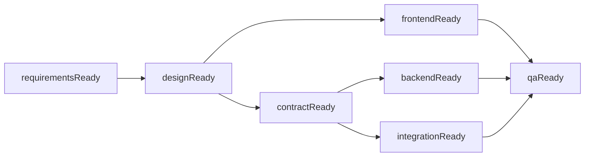
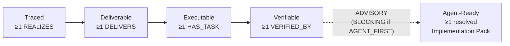
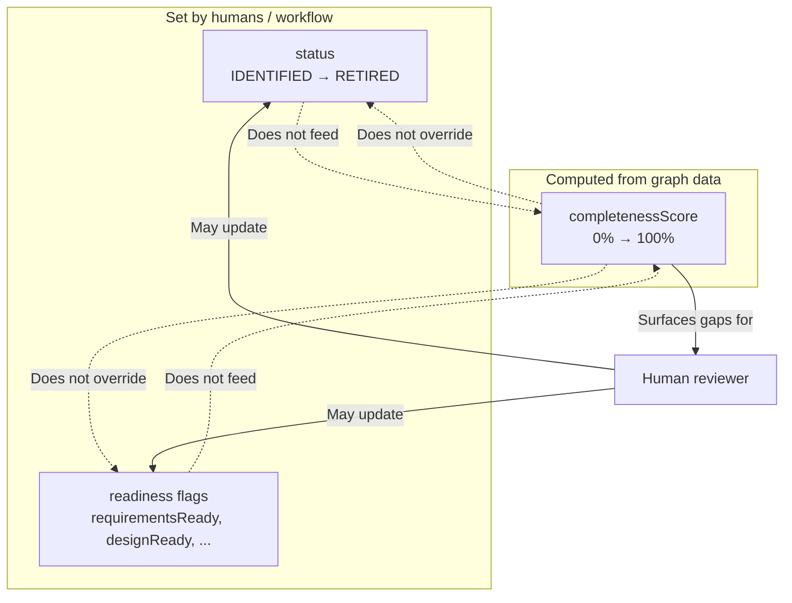

# Implementation-Ready Delivery Graph Model

**Status:** Draft
**Purpose:** Clarify the artifact model for Design Hub so it can serve as an implementation-ready source of truth for humans and coding agents.
**Primary sources:** External canonical references maintained in the EMSIST workspace:

- `../../Emsist-app/docs/superpowers/specs/2026-03-13-screen-flow-playground-remediation.md`
- `../../Emsist-app/Documentation/.Requirements/CONSOLIDATED-STORY-INVENTORY.md`

**Related documents:**

- `README.md`
- `modeling-taxonomy.md` (tier classification, current-to-target mapping)
- `graph-object-catalog.md` (full 75-node specification, relationship registry — 106 edge types / 71 benchmarkable)
- `vision-benchmark.md` (8-dimension scoring, queryability tests, gap prioritization)
- `product-vision.md`
- `feature-capability-map.md`
- `architecture-blueprint.md`
- `azure-jira-benchmark.md`

---

## 1. Positioning

Design Hub should be modeled as an implementation-readiness graph, not just a screen catalog. Its role is to connect product, BA, UX, design, and engineering artifacts into a single navigable structure so implementation can proceed with minimal ambiguity.

The graph must support traversal in both directions. A user or agent should be able to start from a persona, journey, screen, story, API, bug, or finding and immediately inspect:

- the selected object's own attributes
- its direct relationships
- its impacted downstream objects
- its upstream source and rationale

---

## 2. First-Class Artifact Types

See `modeling-taxonomy.md` for the full 3-tier classification (58 T1 + 13 T2 + 4 T3 = 75 model elements, 71 benchmarkable) and `graph-object-catalog.md` for per-object specifications.

### 2.1 Strategic & Governance objects

- `BusinessObjective`
- `Assessment`
- `Decision`
- `Assumption`
- `Constraint`
- `SourceReference`
- `Finding`
- `Risk`

### 2.2 Business & Experience objects

- `Persona`
- `BusinessRole`
- `ValidationRole`
- `Journey`
- `JourneyStep`
- `Topic`
- `Touchpoint`

### 2.3 Delivery & Execution objects

- `RequirementPortfolio`
- `Epic`
- `Feature`
- `UserStory`
- `Milestone`
- `Task`
- `ProjectInstance`
- `Bug`
- `ExternalArtifact`

### 2.4 Requirement & Design objects

- `UserStory`
- `AcceptanceCriterion`
- `Rule`
- `ValidationRule`
- `EdgeCase`
- `ExceptionCase`
- `Screen`
- `ScreenState`
- `Interaction`

### 2.5 Engineering objects

- `ApiContract`
- `RequestSchema`
- `ResponseSchema`
- `ErrorContract`
- `DataEntity`
- `DataField`
- `Integration`
- `TestCase`
- `CodeAsset`

### 2.6 Architecture & EA objects

- `BusinessCapability`
- `BusinessProcess`
- `ProcessActivity` (renamed from ProcessStep)
- `ProcessGateway`
- `ProcessEvent`
- `Application`
- `ApplicationComponent`
- `BusinessObject`
- `InformationFlow`
- `Deployment`
- `InfrastructureNode`

### 2.7 Cross-cutting objects

- `Transition`
- `Message`
- `Gap`
- `OpenQuestion`
- `AgentPolicy`
- `EvidenceRecord`

### 2.8 Current implementation baseline

The current code baseline is materially ahead of the original seed model:

- **65 `@Node` entities**
- **97 SDN `@Relationship` declarations**
- **1 Cypher-only polymorphic edge** (`ASSESSES`)
- **353 passing tests**

That implemented subset now includes the D4 engineering entity completion, the D5a BPMN-aligned process spine, D5b1 strategic & governance plus architecture & EA stubs, and D6a failure-path/traceability/screen-flow closure, not just the earlier agent-ready, safety, capability/project, and registry increments.

This document defines the readiness model for the full approved taxonomy (`75 nodes / 106 edge types / 71 benchmarkable`), not just the currently implemented subset.

---

## 3. Mandatory Relationship Spine

The minimum relational path should support:

- `BusinessObjective -> Feature -> UserStory`
- `Persona -> Journey -> JourneyStep`
- `JourneyStep -> Touchpoint -> Channel`
- `JourneyStep -> Screen`
- `JourneyStep -> UserStory`
- `Screen -> Interaction -> Transition -> Screen` (via HAS_INTERACTION)
- `UserStory -> Screen` (via DELIVERS)
- `Interaction -> Permission`
- `Interaction -> ConfirmationDialog`
- `Interaction -> ApiContract`
- `UserStory -> ApiContract`
- `UserStory -> DataEntity`
- `Screen -> Message`
- `Screen -> ErrorCode`
- `Screen -> Finding`
- `Bug -> Screen`
- `Bug -> UserStory`
- `SourceReference -> any object`

This means `Journey`, `JourneyStep`, `Channel`, `Permission`, `ErrorCode`, and `ConfirmationDialog` are required objects and cannot remain implicit or string-encoded.

---

## 4. Status Versus Readiness

`status` and `readiness` are different concepts and must not be merged.

### 4.1 Status

`status` is a universal lifecycle attribute for **all objects**. It tells us where the object currently stands in its own governance lifecycle.

Canonical values:

- `IDENTIFIED`
- `IN_DEFINITION`
- `DEFINED`
- `IN_REVIEW`
- `APPROVED`
- `IN_IMPLEMENTATION`
- `IMPLEMENTED`
- `VERIFIED`
- `DEPRECATED`
- `RETIRED`

Status answers:

- Does this object exist?
- Has it been reviewed?
- Has it been approved?
- Has it been implemented or verified?

### 4.2 Readiness

`readiness` is **not** a universal score and **not** a replacement for status.

`readiness` applies only to implementation-driving artifacts such as:

- `Journey`
- `JourneyStep`
- `UserStory`
- `Screen`
- `Interaction`
- `ApiContract`
- `DataEntity`

Readiness should be modeled as a **set of SDLC flags**, not as a single enum.

Readiness answers:

- Is this object clear enough for the next SDLC activity?
- Which implementation gates are satisfied?
- What is still missing before engineering can proceed safely?

### 4.3 completenessScore

`completenessScore` is a **severity-weighted diagnostic metric**. It measures how structurally complete an artifact is — how many of its required attributes are populated and how many of its required relationships exist as graph edges.

**Critical distinction:** `completenessScore` does NOT replace or contribute to `status` or `readiness` flags.

- `status` is a governance lifecycle position (set by humans or workflow)
- `readiness` is an SDLC gate assessment (set by humans or rules)
- `completenessScore` is a computed structural diagnostic (calculated from graph data)

An artifact can be `status: APPROVED` and `readiness.designReady: true` but still have a `completenessScore` of 45% because it is missing BLOCKING relationships. The score surfaces structural gaps; it does not override governance decisions.

---

## 5. Canonical Readiness Flags

Use a sparse flag object. If a flag does not apply to an artifact type, omit it rather than setting it to `false`.

Recommended readiness flags:

- `requirementsReady`
- `designReady`
- `contractReady`
- `frontendReady`
- `backendReady`
- `integrationReady`
- `qaReady`

### 5.1 Flag meaning

- `requirementsReady`: business intent, scope, rules, edge cases, and acceptance criteria are sufficiently defined
- `designReady`: journey, step, screen, interaction, state, and message behavior are sufficiently defined
- `contractReady`: API, schema, validation, event, and data contracts are sufficiently defined
- `frontendReady`: UI behavior is sufficiently specified to implement frontend work
- `backendReady`: services, data, validation, and integration contracts are sufficiently specified to implement backend work
- `integrationReady`: cross-component dependencies are mapped and aligned
- `qaReady`: verifiable acceptance and test conditions exist

### 5.2 Flag dependency chain

Readiness flags have implicit dependencies. A flag should not be set to `true` if its prerequisite flags are still `false`.



| Flag | Prerequisites | Rationale |
|------|--------------|-----------|
| `requirementsReady` | None | Foundation flag — business intent must be defined first |
| `designReady` | `requirementsReady` | Cannot design screens and interactions without requirements |
| `contractReady` | `designReady` | Cannot define API contracts without interaction and screen design |
| `frontendReady` | `designReady` | Cannot implement frontend without design specification |
| `backendReady` | `contractReady` | Cannot implement backend without API contracts |
| `integrationReady` | `contractReady` | Cannot map integrations without knowing contracts |
| `qaReady` | `frontendReady`, `backendReady`, `integrationReady` | Cannot test what is not yet specified for implementation |

**Enforcement:** The dependency chain is advisory, not mechanically enforced. A human reviewer can override it (e.g., marking `backendReady` before `contractReady` if the API shape is informally agreed). The chain documents the expected flow, not a hard gate.

---

## 6. Readiness Applicability Matrix

| Artifact Type | Relevant Readiness Flags |
|---|---|
| `Journey` | `requirementsReady`, `designReady`, `qaReady` |
| `JourneyStep` | `requirementsReady`, `designReady`, `qaReady` |
| `UserStory` | `requirementsReady`, `designReady`, `contractReady`, `frontendReady`, `backendReady`, `integrationReady`, `qaReady` |
| `Screen` | `requirementsReady`, `designReady`, `frontendReady`, `integrationReady`, `qaReady` |
| `Interaction` | `requirementsReady`, `designReady`, `contractReady`, `frontendReady`, `backendReady`, `integrationReady`, `qaReady` |
| `ApiContract` | `requirementsReady`, `contractReady`, `backendReady`, `integrationReady`, `qaReady` |
| `DataEntity` | `requirementsReady`, `contractReady`, `backendReady`, `integrationReady`, `qaReady` |

This matrix is intentionally selective. Readiness does **not** apply to every object in the graph.

**Agent-ready extension objects and readiness:**

| Object | `status` | `readiness` | `completenessScore` | Rationale |
|--------|----------|-------------|---------------------|-----------|
| `CodeAsset` | Yes | No | Yes | Structural node — not independently deliverable |
| `ImportSnapshot` | No (append-only) | No | No | Audit record — no lifecycle or completeness scoring |
| `QualityConstraint` | Yes | No | Yes | Bound to artifacts via HAS_QUALITY_CONSTRAINT — scored via parent |
| `CodingConvention` | No (registry) | No | No | T2 registry with docRef — activeStatus only |
| `ProcessGateway` | Yes | No | Yes | Structural BPMN node — not independently deliverable |
| `ProcessEvent` | Yes | No | Yes | Structural BPMN node — not independently deliverable |

---

## 7. Minimum Completeness Rules (MCR)

Each rule has a unique ID, specifies the artifact type, the required condition, the severity, and whether the condition requires a graph edge (not a string reference).

**Severity levels:**

- `BLOCKING` — Failure blocks the artifact from reaching `completenessScore >= 80%`. Weight: 3x in score formula.
- `OPTIONAL` — Enriches the artifact but does not block completeness. Weight: 1x in score formula.

**Edge requirement:**

- `[EDGE]` — The condition is only satisfied by a Neo4j `@Relationship` edge, NOT by a string reference field.
- `[ATTR]` — The condition is satisfied by a populated attribute on the entity.

### 7.1 Journey

| Rule ID | Condition | Severity | Type |
|---------|-----------|----------|------|
| MCR-JRN-001 | Has >= 1 Persona via `PERFORMED_BY_PERSONA` edge | BLOCKING | `[EDGE]` |
| MCR-JRN-002 | Has >= 1 JourneyStep via `HAS_STEP` edge | BLOCKING | `[EDGE]` |
| MCR-JRN-003 | Has `goalStatement` populated | BLOCKING | `[ATTR]` |
| MCR-JRN-004 | Has `title` populated | BLOCKING | `[ATTR]` |
| MCR-JRN-005 | Has `status` set to a valid enum value | BLOCKING | `[ATTR]` |
| MCR-JRN-006 | Has linked role or role context | OPTIONAL | `[ATTR]` |
| MCR-JRN-007 | Has alternate or exception paths documented | OPTIONAL | `[ATTR]` |

### 7.2 JourneyStep

| Rule ID | Condition | Severity | Type |
|---------|-----------|----------|------|
| MCR-STP-001 | Has owning Journey via `HAS_STEP` reverse edge | BLOCKING | `[EDGE]` |
| MCR-STP-002 | Has `orderIndex` populated | BLOCKING | `[ATTR]` |
| MCR-STP-003 | Has Screen via `USES_SCREEN` edge | BLOCKING | `[EDGE]` |
| MCR-STP-004 | Has `label` populated | BLOCKING | `[ATTR]` |
| MCR-STP-005 | Has `status` set to a valid enum value | BLOCKING | `[ATTR]` |
| MCR-STP-006 | Has linked story or stories | OPTIONAL | `[EDGE]` |
| MCR-STP-007 | Has trigger or event description | OPTIONAL | `[ATTR]` |
| MCR-STP-008 | Has expected outcome | OPTIONAL | `[ATTR]` |
| MCR-STP-009 | Has Touchpoint via `STARTS_AT_TOUCHPOINT` edge | OPTIONAL | `[EDGE]` |

### 7.3 UserStory

| Rule ID | Condition | Severity | Type |
|---------|-----------|----------|------|
| MCR-UST-001 | Has `label` populated | BLOCKING | `[ATTR]` |
| MCR-UST-002 | Has `status` set to a valid enum value | BLOCKING | `[ATTR]` |
| MCR-UST-003 | Has >= 1 Screen via `DELIVERS` edge (UserStory→Screen) | BLOCKING | `[EDGE]` |
| MCR-UST-004 | Has >= 1 AcceptanceCriterion via `HAS_CRITERION` edge | BLOCKING | `[EDGE]` |
| MCR-UST-005 | Has linked Feature via `HAS_STORY` reverse edge | OPTIONAL | `[EDGE]` |
| MCR-UST-006 | Has linked persona or role context | OPTIONAL | `[ATTR]` |
| MCR-UST-007 | Has linked rules and validations | OPTIONAL | `[EDGE]` |
| MCR-UST-008 | Has linked ApiContract where relevant | OPTIONAL | `[EDGE]` |

### 7.4 Screen

| Rule ID | Condition | Severity | Type |
|---------|-----------|----------|------|
| MCR-SCR-001 | Has >= 1 UserStory via reverse `DELIVERS` edge (UserStory→Screen, not `storyRefs` string) | BLOCKING | `[EDGE]` |
| MCR-SCR-002 | Has >= 1 Interaction via `HAS_INTERACTION` edge (Screen→Interaction) | BLOCKING | `[EDGE]` |
| MCR-SCR-003 | Has `surfaceId` populated | BLOCKING | `[ATTR]` |
| MCR-SCR-004 | Has `label` populated | BLOCKING | `[ATTR]` |
| MCR-SCR-005 | Has `status` set to a valid enum value | BLOCKING | `[ATTR]` |
| MCR-SCR-006 | Has `routePath` or invocation context | BLOCKING | `[ATTR]` |
| MCR-SCR-007 | Has >= 1 BusinessRole via `ACCESSIBLE_BY_ROLE` edge | OPTIONAL | `[EDGE]` |
| MCR-SCR-008 | Has linked messages via `HAS_MESSAGE` edge | OPTIONAL | `[EDGE]` |
| MCR-SCR-009 | Has linked ScreenState via `BELONGS_TO_SCREEN` reverse edge | OPTIONAL | `[EDGE]` |
| MCR-SCR-010 | Has linked transitions via `TRANSITIONS_TO` edge | OPTIONAL | `[EDGE]` |
| MCR-SCR-011 | Has linked findings or unresolved gaps | OPTIONAL | `[EDGE]` |

### 7.5 Interaction

| Rule ID | Condition | Severity | Type |
|---------|-----------|----------|------|
| MCR-INT-001 | Has Screen via reverse `HAS_INTERACTION` edge (Screen→Interaction) | BLOCKING | `[EDGE]` |
| MCR-INT-002 | Has `interactionId` populated | BLOCKING | `[ATTR]` |
| MCR-INT-003 | Has `element` populated | BLOCKING | `[ATTR]` |
| MCR-INT-004 | Has `trigger` populated | BLOCKING | `[ATTR]` |
| MCR-INT-005 | Has `status` set to a valid enum value | BLOCKING | `[ATTR]` |
| MCR-INT-006 | Has Permission via `REQUIRES_PERMISSION` edge (not `permission` string) | OPTIONAL | `[EDGE]` |
| MCR-INT-007 | Has ApiContract via `CALLS_API` edge (not `apiCalls` string) | OPTIONAL | `[EDGE]` |
| MCR-INT-008 | Has ConfirmationDialog via `TRIGGERS_CONFIRMATION` edge | OPTIONAL | `[EDGE]` |
| MCR-INT-009 | Has >= 1 Effect via `HAS_EFFECT` edge | OPTIONAL | `[EDGE]` |

### 7.6 ApiContract

| Rule ID | Condition | Severity | Type |
|---------|-----------|----------|------|
| MCR-API-001 | Has `contractId` populated | BLOCKING | `[ATTR]` |
| MCR-API-002 | Has `method` and `path` populated | BLOCKING | `[ATTR]` |
| MCR-API-003 | Has `status` set to a valid enum value | BLOCKING | `[ATTR]` |
| MCR-API-004 | Has RequestSchema via `BELONGS_TO_API` reverse edge | BLOCKING | `[EDGE]` |
| MCR-API-005 | Has ResponseSchema via `BELONGS_TO_API` reverse edge | BLOCKING | `[EDGE]` |
| MCR-API-006 | Has ErrorContract via `BELONGS_TO_API` reverse edge | BLOCKING | `[EDGE]` |
| MCR-API-007 | Has linked UserStory via reverse edge | OPTIONAL | `[EDGE]` |
| MCR-API-008 | Has linked DataEntity via `USES_DATA_ENTITY` edge | OPTIONAL | `[EDGE]` |
| MCR-API-009 | Has auth and permission model documented | OPTIONAL | `[ATTR]` |

### 7.7 DataEntity

| Rule ID | Condition | Severity | Type |
|---------|-----------|----------|------|
| MCR-DAT-001 | Has `entityId` populated | BLOCKING | `[ATTR]` |
| MCR-DAT-002 | Has `name` populated | BLOCKING | `[ATTR]` |
| MCR-DAT-003 | Has `status` set to a valid enum value | BLOCKING | `[ATTR]` |
| MCR-DAT-004 | Has >= 1 DataField via `HAS_FIELD` edge | BLOCKING | `[EDGE]` |
| MCR-DAT-005 | Has linked ApiContract via reverse `USES_DATA_ENTITY` edge | OPTIONAL | `[EDGE]` |

### 7.8 Touchpoint

| Rule ID | Condition | Severity | Type |
|---------|-----------|----------|------|
| MCR-TP-001 | Has >= 1 Channel via `DELIVERED_VIA_CHANNEL` edge (not `channelId` string) | BLOCKING | `[EDGE]` |
| MCR-TP-002 | Has Screen via `TARGETS` edge | BLOCKING | `[EDGE]` |
| MCR-TP-003 | Has `touchpointId` populated | BLOCKING | `[ATTR]` |
| MCR-TP-004 | Has `label` populated | BLOCKING | `[ATTR]` |
| MCR-TP-005 | Has `status` set to a valid enum value | BLOCKING | `[ATTR]` |
| MCR-TP-006 | Has >= 1 EntryMode via `HAS_ENTRY_MODE` edge | OPTIONAL | `[EDGE]` |

### 7.9 MCR Summary

| Artifact | BLOCKING Rules | OPTIONAL Rules | Total | BLOCKING Edges | BLOCKING Attrs |
|----------|---------------|---------------|-------|---------------|---------------|
| Journey | 5 | 2 | 7 | 2 | 3 |
| JourneyStep | 5 | 4 | 9 | 2 | 3 |
| UserStory | 4 | 4 | 8 | 2 | 2 |
| Screen | 6 | 5 | 11 | 2 | 4 |
| Interaction | 5 | 4 | 9 | 1 | 4 |
| ApiContract | 6 | 3 | 9 | 3 | 3 |
| DataEntity | 4 | 1 | 5 | 1 | 3 |
| Touchpoint | 5 | 1 | 6 | 2 | 3 |
| **Total** | **40** | **24** | **64** | **15** | **25** |

### 7.10 Additional MCRs (Meta-Model Revision)

| Rule ID | Artifact | Condition | Severity | Type |
|---------|----------|-----------|----------|------|
| MCR-STORY-DELIVERS-001 | UserStory | Has >= 1 Screen via `DELIVERS` edge (UserStory→Screen) | BLOCKING | `[EDGE]` |
| MCR-STORY-VERIFIED-001 | UserStory | Has >= 1 `VERIFIED_BY` edge before `status` = VERIFIED | BLOCKING | `[EDGE]` |
| MCR-PROCESS-FLOW-001 | BusinessProcess | Has >= 1 `HAS_FLOW_NODE` edge to ProcessActivity, ProcessGateway, or ProcessEvent | BLOCKING | `[EDGE]` |
| MCR-STORY-AGENT-READY-001 | UserStory | At least one DELIVERS target resolves (via SUPPORTS_SCREEN, EXPOSES, OWNS_DATA_ENTITY, ENFORCES_RULE, or transitively via HAS_MESSAGE→Screen→SUPPORTS_SCREEN) to an ApplicationComponent with `frameworkFamily`, `modulePath`, and effective `testCommand` (component override or Application default) populated | **ADVISORY** (default) / **BLOCKING** when `executionMode = AGENT_FIRST` | `[PLANNED]` |

### 7.11 Five-Concern Story Gate

Every UserStory must satisfy five concerns before it can progress through its lifecycle. The first four are mandatory gates; the fifth (Agent-Ready) is advisory by default and becomes blocking when `executionMode = AGENT_FIRST`. Each concern is gated by a specific edge and unlocks a specific status transition.

| Concern | Required Edge | Minimum Count | Unlocks Status | Gate Type |
|---------|--------------|---------------|----------------|-----------|
| **Traced** | `REALIZES` (UserStory→BusinessCapability, BusinessProcess, Journey, ProcessActivity, or JourneyStep) | >= 1 | `IN_DEFINITION` | Traceability |
| **Deliverable** | `DELIVERS` (UserStory→Screen) | >= 1 | `APPROVED` | Delivery |
| **Executable** | `HAS_TASK` (UserStory→Task) | >= 1 | `IN_IMPLEMENTATION` | Execution |
| **Verifiable** | `VERIFIED_BY` (UserStory→TestCase or similar) | >= 1 | `VERIFIED` | Verification |
| **Agent-Ready** | `DELIVERS → deliverable → ApplicationComponent` (via SUPPORTS_SCREEN/EXPOSES/OWNS_DATA_ENTITY/ENFORCES_RULE) with execution metadata | >= 1 resolvable component | Advisory (BLOCKING when `executionMode = AGENT_FIRST`) | Execution Context |



**Enforcement:** A UserStory MUST NOT transition to the unlocked status unless the corresponding edge exists. For example, a story cannot reach `APPROVED` without at least one `DELIVERS` edge to a Screen.

**Note on total edge inventory:** The approved target model contains **106 edge types**:

- 90 from the agent-ready baseline
- +3 operational near-zero-drift edge types (`GOVERNED_BY_POLICY`, `BASELINED_BY`, `DEPENDS_ON_ASSET`)
- +13 capability/project meta-model edge types (`ASSESSES`, `IDENTIFIES_GAP`, `ADDRESSES_GAP`, `TARGETS_CAPABILITY`, `HAS_PORTFOLIO`, `HAS_EPIC`, `HAS_MILESTONE`, Milestone→`HAS_TASK`, `CREATES_APPLICATION`, `ENHANCES_APPLICATION`, `INTEGRATES_WITH`, `CREATES_COMPONENT`, `ENHANCES_COMPONENT`)

The completenessScore formula denominators should reference this inventory for global-level scoring. See `graph-object-catalog.md` section 6.3 for the full registry.

### 7.12 Implementation Pack Resolution

Every UserStory should resolve to a complete Implementation Pack — a computed traversal (NOT a stored node) that gives a coding agent everything needed to change code safely.

**Resolution chain:** `UserStory -[DELIVERS]-> deliverable → owning ApplicationComponent → execution metadata`

**Direct resolution edges:** SUPPORTS_SCREEN, EXPOSES, OWNS_DATA_ENTITY, ENFORCES_RULE
**Transitive resolution:** Message <-[HAS_MESSAGE]- Screen <-[SUPPORTS_SCREEN]- ApplicationComponent
**Command precedence:** `COALESCE(comp.testCommand, app.defaultTestCommand)` — component-level overrides Application-level defaults

See `docs/superpowers/specs/2026-03-14-technical-execution-context-design.md` section 7.1 for the full canonical Cypher query.

### 7.13 Tightened MCR for AGENT_FIRST Stories

When `UserStory.executionMode = AGENT_FIRST`, the Agent-Ready concern (MCR-STORY-AGENT-READY-001) adds 5 BLOCKING checks and 1 ADVISORY check beyond the base Implementation Pack resolution:

| Check | Condition | Severity |
|-------|-----------|----------|
| Repo path resolvable | `Application.repoPath IS NOT NULL` | BLOCKING |
| Build command available | `COALESCE(comp.buildCommand, app.defaultBuildCommand) IS NOT NULL` | BLOCKING |
| Manifest path available | `comp.manifestPath IS NOT NULL` | BLOCKING |
| Code-asset presence | ≥1 `HAS_CODE_ASSET` edge on at least one DELIVERS target's owning ApplicationComponent | BLOCKING |
| Verification test-file resolution | ≥1 `LOCATED_IN` edge on at least one TestCase linked via `VERIFIED_BY` | BLOCKING |
| Entrypoint path | `comp.entrypointPath IS NOT NULL` | ADVISORY (non-blocking) |

**Tightened Cypher query:**

```cypher
MATCH (s:UserStory {storyId: $storyId, executionMode: 'AGENT_FIRST'})
// Branch 1: Direct DELIVERS targets (Screen, ApiContract, DataEntity, Rule)
OPTIONAL MATCH (s)-[:DELIVERS]->(target) WHERE NOT target:Message
OPTIONAL MATCH (target)<-[:SUPPORTS_SCREEN|EXPOSES|OWNS_DATA_ENTITY|ENFORCES_RULE]-(comp1:ApplicationComponent)
OPTIONAL MATCH (comp1)<-[:HAS_COMPONENT]-(app1:Application)
OPTIONAL MATCH (comp1)-[:HAS_CODE_ASSET]->(ca1:CodeAsset)
WITH s,
     collect(DISTINCT comp1) AS directComps,
     collect(DISTINCT app1) AS directApps,
     collect(DISTINCT ca1) AS directAssets
// Branch 2: Message targets (transitive via Screen → owning component)
OPTIONAL MATCH (s)-[:DELIVERS]->(m:Message)<-[:HAS_MESSAGE]-(scr:Screen)<-[:SUPPORTS_SCREEN]-(comp2:ApplicationComponent)
OPTIONAL MATCH (comp2)<-[:HAS_COMPONENT]-(app2:Application)
OPTIONAL MATCH (comp2)-[:HAS_CODE_ASSET]->(ca2:CodeAsset)
WITH s,
     directComps + collect(DISTINCT comp2) AS allComps,
     directApps + collect(DISTINCT app2) AS allApps,
     directAssets + collect(DISTINCT ca2) AS allAssets
// Verification test-file resolution
OPTIONAL MATCH (s)-[:VERIFIED_BY]->(tc:TestCase)-[:LOCATED_IN]->(tca:CodeAsset)
WITH s, allComps, allApps, allAssets,
     count(DISTINCT tca) AS testFileCount
RETURN s.storyId,
  any(a IN allApps WHERE a.repoPath IS NOT NULL) AS hasRepoPath,
  any(c IN allComps WHERE
       COALESCE(c.buildCommand,
            [a IN allApps WHERE a.defaultBuildCommand IS NOT NULL][0].defaultBuildCommand
       ) IS NOT NULL) AS hasBuildCommand,
  any(c IN allComps WHERE c.manifestPath IS NOT NULL) AS hasManifestPath,
  size(allAssets) >= 1 AS hasCodeAsset,
  testFileCount >= 1 AS hasTestFile,
  any(c IN allComps WHERE c.entrypointPath IS NOT NULL) AS hasEntryPoint
```

**Semantics:** Uses `collect(DISTINCT)` + `any()` aggregation to check whether ANY resolved component satisfies each check. This avoids the false-negative trap of `LIMIT 1` which would only check an arbitrary single component. See `docs/superpowers/specs/2026-03-14-agent-ready-information-model.md` section 8.2 for the canonical pattern.

---

## 8. Severity-Weighted completenessScore

### 8.1 Formula

```
completenessScore = (
    sum(satisfied_blocking_edges * 3) +
    sum(satisfied_optional_edges * 1) +
    sum(populated_blocking_attrs * 2) +
    sum(populated_optional_attrs * 1)
) / (
    sum(total_blocking_edges * 3) +
    sum(total_optional_edges * 1) +
    sum(total_blocking_attrs * 2) +
    sum(total_optional_attrs * 1)
) * 100
```

### 8.2 Weight rationale

| Component | Weight | Rationale |
|-----------|--------|-----------|
| BLOCKING edge satisfied | 3x | A missing BLOCKING edge (e.g., Screen → UserStory) breaks traversal and blocks queryability |
| BLOCKING attribute populated | 2x | A missing required attribute (e.g., `status`) blocks governance but not traversal |
| OPTIONAL edge satisfied | 1x | Enriches the graph but does not block core traversal |
| OPTIONAL attribute populated | 1x | Enriches the artifact but does not block readiness assessment |

### 8.3 Satisfaction rules

- An edge rule is "satisfied" only when the relationship exists as a Neo4j `@Relationship` edge (`[EDGE]`). A `[STRING_REF]` counts as **0** — it does not satisfy the rule.
- An attribute rule is "satisfied" when the field is populated with a non-null, non-empty value of the correct type.

### 8.4 Score thresholds

| Range | Level | Meaning |
|-------|-------|---------|
| < 40% | RED | Critical structural gaps — artifact is not queryable or traversable |
| 40% – 79% | AMBER | Partial coverage — some edges and attributes exist but key traversals are broken |
| >= 80% | GREEN | Structurally complete — all BLOCKING rules satisfied, most OPTIONAL rules satisfied |

### 8.5 Diagnostic positioning

`completenessScore` is a severity-weighted diagnostic. It does NOT replace or contribute to `status` or `readiness` flags.

**Agent-ready extension:** The completenessScore formula now includes code-asset edges in the BLOCKING category. For AGENT_FIRST stories, HAS_CODE_ASSET and LOCATED_IN (via VERIFIED_BY chain) are BLOCKING edges and contribute to the weighted numerator accordingly (BLOCKING edge weight = 3x per the formula in section 8.1).



### 8.6 Example: Screen completenessScore

Given MCR rules for Screen (section 7.4):

| Rule | Severity | Type | Weight | Satisfied? | Score |
|------|----------|------|--------|-----------|-------|
| MCR-SCR-001 (story edge via DELIVERS) | BLOCKING | EDGE | 3 | No — `storyRefs` is `[STRING_REF]` | 0 |
| MCR-SCR-002 (interaction edge) | BLOCKING | EDGE | 3 | Yes — `HAS_INTERACTION` is `[EDGE]` | 3 |
| MCR-SCR-003 (surfaceId) | BLOCKING | ATTR | 2 | Yes | 2 |
| MCR-SCR-004 (label) | BLOCKING | ATTR | 2 | Yes | 2 |
| MCR-SCR-005 (status) | BLOCKING | ATTR | 2 | No — uses 3-field model, not universal enum | 0 |
| MCR-SCR-006 (routePath) | BLOCKING | ATTR | 2 | Yes | 2 |
| MCR-SCR-007 (role edge) | OPTIONAL | EDGE | 1 | No — `roleKeys` is `[STRING_REF]` | 0 |
| MCR-SCR-008 (message edge) | OPTIONAL | EDGE | 1 | No — Message entity `[PLANNED]` | 0 |
| MCR-SCR-009 (state edge) | OPTIONAL | EDGE | 1 | No — ScreenState entity `[PLANNED]` | 0 |
| MCR-SCR-010 (transition edge) | OPTIONAL | EDGE | 1 | Yes — `TRANSITIONS_TO` is `[EDGE]` | 1 |
| MCR-SCR-011 (finding/gap edge) | OPTIONAL | EDGE | 1 | Yes — `HAS_GAP` is `[EDGE]` | 1 |

**Score:** (0+3+2+2+0+2+0+0+0+1+1) / (3+3+2+2+2+2+1+1+1+1+1) = 11 / 19 = **57.9% (AMBER)**

---

## 9. Example Modeling Pattern

### 9.1 Universal status

```json
{
  "storyId": "US-EX-001",
  "status": "APPROVED"
}
```

### 9.2 Selective readiness

```json
{
  "storyId": "US-EX-001",
  "status": "APPROVED",
  "readiness": {
    "requirementsReady": true,
    "designReady": true,
    "contractReady": true,
    "frontendReady": true,
    "backendReady": false,
    "integrationReady": false,
    "qaReady": true
  }
}
```

### 9.3 Non-applicable readiness

```json
{
  "personaId": "PER-001",
  "status": "DEFINED"
}
```

`Persona` has `status`, but no `readiness` block because readiness is not meaningful for that object type.

### 9.4 completenessScore as diagnostic

```json
{
  "surfaceId": "SURF-R04-001",
  "status": "APPROVED",
  "readiness": {
    "requirementsReady": true,
    "designReady": true,
    "frontendReady": false
  },
  "completenessScore": 57.9,
  "completenessLevel": "AMBER",
  "missingBlockingRules": ["MCR-SCR-001", "MCR-SCR-005"]
}
```

The `completenessScore` is 57.9% (AMBER) even though `status` is APPROVED and some readiness flags are true. The score reveals that `DELIVERS` edge (UserStory→Screen) and universal `status` enum are missing — structural gaps that governance flags do not capture.

---

## 10. Sample Cypher Queries

### 10.1 Traversal: Persona to Channel

```cypher
MATCH (p:Persona)<-[:PERFORMED_BY_PERSONA]-(j:Journey)-[:HAS_STEP]->(s:JourneyStep)
      -[:STARTS_AT_TOUCHPOINT]->(tp:Touchpoint)-[:DELIVERED_VIA_CHANNEL]->(ch:Channel)
WHERE p.personaId = $personaId
RETURN ch.name, count(DISTINCT j) AS journeyCount
```

### 10.2 Traversal: Screen to Permissions

```cypher
MATCH (scr:Screen)-[:HAS_INTERACTION]->(i:Interaction)-[:REQUIRES_PERMISSION]->(perm:Permission)
WHERE scr.surfaceId = $surfaceId
RETURN scr.surfaceId, collect(DISTINCT perm.permissionKey) AS requiredPermissions
```

### 10.3 Traversal: Bug impact analysis

```cypher
MATCH (b:Bug)-[:AFFECTS]->(scr:Screen)-[:HAS_INTERACTION]->(i:Interaction)
      -[:CALLS_API]->(api:ApiContract)
WHERE b.bugId = $bugId
RETURN scr.surfaceId, scr.label, collect(DISTINCT api.contractId) AS affectedApis
```

### 10.4 completenessScore for a Screen

```cypher
MATCH (scr:Screen) WHERE scr.surfaceId = $surfaceId
OPTIONAL MATCH (us:UserStory)-[:DELIVERS]->(scr)
OPTIONAL MATCH (scr)-[:HAS_INTERACTION]->(i:Interaction)
OPTIONAL MATCH (scr)-[:TRANSITIONS_TO]->(t:Screen)
OPTIONAL MATCH (scr)-[:HAS_GAP]->(g:Gap)
OPTIONAL MATCH (scr)-[:ACCESSIBLE_BY_ROLE]->(r:BusinessRole)
OPTIONAL MATCH (scr)-[:HAS_MESSAGE]->(m:Message)
OPTIONAL MATCH (ss:ScreenState)-[:BELONGS_TO_SCREEN]->(scr)
WITH scr,
     // BLOCKING edges (weight 3 each)
     CASE WHEN count(DISTINCT us) > 0 THEN 3 ELSE 0 END AS storyEdge,
     CASE WHEN count(DISTINCT i) > 0 THEN 3 ELSE 0 END AS interactionEdge,
     // BLOCKING attrs (weight 2 each)
     CASE WHEN scr.surfaceId IS NOT NULL THEN 2 ELSE 0 END AS surfaceIdAttr,
     CASE WHEN scr.label IS NOT NULL THEN 2 ELSE 0 END AS labelAttr,
     CASE WHEN scr.status IS NOT NULL THEN 2 ELSE 0 END AS statusAttr,
     CASE WHEN scr.routePath IS NOT NULL THEN 2 ELSE 0 END AS routeAttr,
     // OPTIONAL edges (weight 1 each)
     CASE WHEN count(DISTINCT r) > 0 THEN 1 ELSE 0 END AS roleEdge,
     CASE WHEN count(DISTINCT m) > 0 THEN 1 ELSE 0 END AS messageEdge,
     CASE WHEN count(DISTINCT ss) > 0 THEN 1 ELSE 0 END AS stateEdge,
     CASE WHEN count(DISTINCT t) > 0 THEN 1 ELSE 0 END AS transitionEdge,
     CASE WHEN count(DISTINCT g) > 0 THEN 1 ELSE 0 END AS gapEdge
RETURN scr.surfaceId,
       (storyEdge + interactionEdge +
        surfaceIdAttr + labelAttr + statusAttr + routeAttr +
        roleEdge + messageEdge + stateEdge + transitionEdge + gapEdge) * 100.0
       / (3 + 3 + 2 + 2 + 2 + 2 + 1 + 1 + 1 + 1 + 1) AS completenessScore
```

This query covers all 11 MCR-SCR rules: 2 BLOCKING edges (3x each, DELIVERS reverse + HAS_INTERACTION), 4 BLOCKING attrs (2x each), 5 OPTIONAL edges (1x each). Denominator = 6 + 8 + 5 = 19.

### 10.5 Aggregate BLOCKING-only score across all Screens

This query computes a **BLOCKING-rules-only** subset of completenessScore for rapid triage. It covers MCR-SCR-001 through MCR-SCR-006 (2 BLOCKING edges + 4 BLOCKING attributes) but excludes OPTIONAL rules. For the full completenessScore per screen, use query 10.4.

```cypher
MATCH (scr:Screen)
OPTIONAL MATCH (us:UserStory)-[:DELIVERS]->(scr)
OPTIONAL MATCH (scr)-[:HAS_INTERACTION]->(i:Interaction)
WITH scr,
     CASE WHEN count(DISTINCT us) > 0 THEN 3 ELSE 0 END AS storyEdge,
     CASE WHEN count(DISTINCT i) > 0 THEN 3 ELSE 0 END AS interactionEdge,
     CASE WHEN scr.surfaceId IS NOT NULL THEN 2 ELSE 0 END AS surfaceIdAttr,
     CASE WHEN scr.label IS NOT NULL THEN 2 ELSE 0 END AS labelAttr,
     CASE WHEN scr.status IS NOT NULL THEN 2 ELSE 0 END AS statusAttr,
     CASE WHEN scr.routePath IS NOT NULL THEN 2 ELSE 0 END AS routeAttr
WITH scr,
     (storyEdge + interactionEdge + surfaceIdAttr + labelAttr + statusAttr + routeAttr) AS numerator,
     (3 + 3 + 2 + 2 + 2 + 2) AS denominator
RETURN avg(numerator * 100.0 / denominator) AS avgBlockingScore,
       count(CASE WHEN numerator * 100.0 / denominator >= 80 THEN 1 END) AS greenCount,
       count(CASE WHEN numerator * 100.0 / denominator >= 40 AND numerator * 100.0 / denominator < 80 THEN 1 END) AS amberCount,
       count(CASE WHEN numerator * 100.0 / denominator < 40 THEN 1 END) AS redCount
```

### 10.6 Missing BLOCKING rules for an artifact

```cypher
// Find Screens missing DELIVERS edge (MCR-SCR-001)
MATCH (scr:Screen)
WHERE NOT EXISTS { MATCH (:UserStory)-[:DELIVERS]->(scr) }
RETURN scr.surfaceId, scr.label, 'MCR-SCR-001' AS violatedRule, 'Missing DELIVERS edge (UserStory→Screen)' AS description

UNION

// Find Screens with no Interactions (MCR-SCR-002)
MATCH (scr:Screen)
WHERE NOT EXISTS { MATCH (scr)-[:HAS_INTERACTION]->(:Interaction) }
RETURN scr.surfaceId, scr.label, 'MCR-SCR-002' AS violatedRule, 'No Interaction linked via HAS_INTERACTION' AS description
```

---

## 11. UI Implication

When selecting an object on the graph canvas, the side panel should show:

- universal properties, including `status`
- readiness flags only when the selected object type supports readiness
- `completenessScore` with level indicator (RED / AMBER / GREEN) and list of violated MCR rules
- direct relationships
- missing required artifacts (derived from violated BLOCKING MCR rules)
- linked findings, bugs, and source references

This prevents misleading UI where every object appears to have the same implementation semantics.

---

## 12. Immediate Modeling Rule

For the Design Hub work, treat these as first-class implementation-driving objects from the start:

- `Journey`
- `JourneyStep`
- `UserStory`
- `Screen`
- `Interaction`
- `Touchpoint`
- `ApiContract`
- `DataEntity`

Each of these should support:

- `status` (universal 10-value enum)
- applicable `readiness` flags (per section 6 matrix)
- `completenessScore` (computed per section 8 formula)
- traceable source references
- explicit relationships to upstream and downstream artifacts as graph edges, not string references
