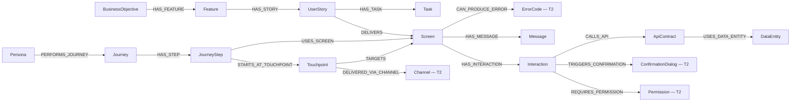
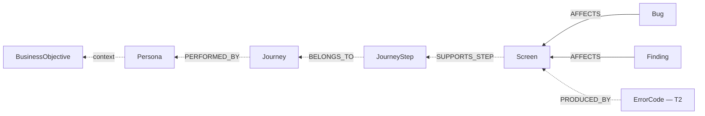
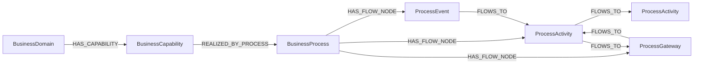
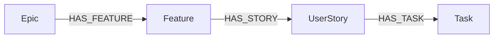
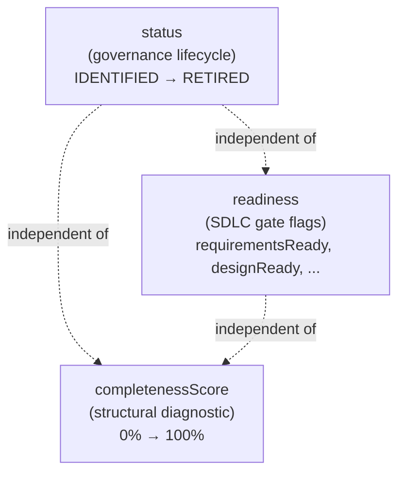

# Product Vision

**Status:** Draft

**Related documents:**

- `modeling-taxonomy.md` (3-tier classification: 58 T1 + 13 T2 + 4 T3 = 75 model elements, 71 benchmarkable)
- `graph-object-catalog.md` (full per-object specifications with attributes and relationships)
- `vision-benchmark.md` (8-dimension scoring with queryability test suite)
- `implementation-readiness-graph-model.md` (status, readiness, completenessScore governance)
- `feature-capability-map.md` (capability model, delivery surfaces, view registry — 12 canonical views)
- `alfabet-alignment-matrix.md` (enterprise architecture alignment, 3 object families)
- `architecture-blueprint.md` (system architecture and integration model)

---

## 1. Vision

Design Hub is a **graph-based product, architecture, and delivery intelligence system** that gives humans and coding agents a complete, traversable view of product intent, UX structure, enterprise architecture context, delivery logic, and engineering contracts.

The graph spans three connected object families:

- **Product / UX**: personas, journeys, screens, interactions, rules, messages
- **Architecture / EA**: business capabilities, applications, components, data objects, information flows, deployments
- **Delivery & Execution**: objectives, epics, features, stories, tasks, external artifacts

It connects:

- **why** the work exists (objectives, epics, features, decisions)
- **who** the user is (personas, roles, permissions)
- **what capability** it serves (business capabilities, BPMN processes with activities/gateways/events, value streams)
- **what journey** they follow (journeys, steps, touchpoints, channels)
- **which surface** implements that step (screens, states, interactions, transitions)
- **what rules govern** that surface (validations, messages, error codes, confirmation dialogs)
- **which contracts** back it (APIs, schemas, data entities, integrations)
- **which applications and components** deliver it (applications, components, deployments)
- **what data flows** support it (business objects, information flows, data entities)
- **what is still missing** (findings, bugs, gaps, open questions, risks)
- **where it is tracked** (external artifacts in Azure DevOps, Jira)

The approved graph model spans 75 elements across 3 tiers (58 first-class nodes, 13 registries, 4 value objects) with 71 benchmarkable objects and 106 edge types. The current implementation baseline is 65 `@Node` entities, 90 SDN `@Relationship` declarations, 1 Cypher-only polymorphic edge, and 340 passing tests. See `modeling-taxonomy.md` for classification rules and `graph-object-catalog.md` for the full inventory.

---

## 2. Problem

Current delivery artifacts are fragmented across requirements documents, design specs, prototype screens, story inventories, issue trackers, and engineering contracts. Standard delivery tools such as Azure DevOps and Jira are strong at tracking work items, hierarchy, status, and dependencies, but they do not natively model personas, journeys, journey steps, screens, interaction outcomes, message registries, channels, permissions, or implementation-grade cross-linking between UX and engineering artifacts.

---

## 3. Product Thesis

Design Hub should not be another backlog viewer. It should be the system that connects business intent to implementation readiness through a single navigable graph where every traversal answers a real delivery question.

---

## 4. Primary Users

| User | Role in Design Hub |
|------|-------------------|
| Product and BA | Define objectives, features, stories, rules, and traceability |
| UX and design | Define personas, journeys, screens, states, and interaction behavior |
| Engineering | Consume APIs, data entities, validations, dependencies, and delivery constraints |
| QA | Consume acceptance criteria, edge cases, messages, and test conditions |
| Coding agents | Consume a structured graph with enough context to generate implementation with lower ambiguity |

---

## 5. Core Outcomes

- Make requirements implementation-ready instead of document-complete
- Preserve traceability from objective to code-facing contract
- Surface missing artifacts before development begins
- Allow bidirectional traversal across all key artifact types
- Separate governance status from SDLC readiness from structural completeness
- Support sync and benchmarking with external delivery systems without collapsing the domain model into backlog-tool limitations
- Provide multiple named views, each anchored on a different traversal entry point, so users can explore the graph from the axis most relevant to their role

---

## 6. Product Principles

- `Domain first`: personas, journeys, screens, messages, channels, permissions, and validations are first-class artifacts
- `Traceability by default`: every implementation-driving artifact should link upstream and downstream
- `Bidirectional navigation`: any node can be an entry point into the graph
- `Benchmark, do not imitate`: Azure DevOps and Jira inform the model, but do not bound it
- `Implementation over documentation theater`: the graph should expose what is missing for safe delivery
- `Agent usability`: object boundaries, attributes, and relationships must be explicit enough for automation
- `View-driven exploration`: the product surfaces multiple named views, each with a primary axis, so traversal is not limited to free-form graph browsing

---

## 7. Non-Goals

- Replacing Azure DevOps or Jira as a sprint-management tool
- Acting as a design tool or Figma replacement
- Acting as a source-code host or CI system
- Hiding incompleteness behind generic progress labels
- Being "another backlog viewer" — the Delivery View is graph-backed intelligence, not a work-item list

---

## 8. Traversal Spine

The graph model supports two traversal directions across all tiers.

### 8.1 Primary (forward) traversal



### 8.2 Reverse traversal



### 8.3 Process spine (BPMN process modeling)



**Note:** ProcessActivity was previously named ProcessStep. The rename aligns with BPMN semantics where activities, gateways, and events are all flow nodes connected by `FLOWS_TO` sequence flows.

### 8.4 Delivery spine



### 8.5 Four-verb edge model

The graph uses four canonical verbs to connect requirements to verification:

| Verb | Edge | Direction | Meaning |
|------|------|-----------|---------|
| **REALIZES** | `UserStory -[REALIZES]-> BusinessCapability, BusinessProcess, Journey, ProcessActivity, JourneyStep` | Story → upstream | The story traces to a business capability, process activity, or journey step |
| **DELIVERS** | `UserStory -[DELIVERS]-> Screen` | Story → surface | The story delivers a concrete screen or surface |
| **IMPLEMENTS** | `UserStory -[HAS_TASK]-> Task` | Story → work | The story has executable implementation tasks |
| **VERIFIED_BY** | `UserStory -[VERIFIED_BY]-> TestCase` | Story → evidence | The story is verified by test evidence |

These four verbs form the story gate model (see `implementation-readiness-graph-model.md` section 7.11).

### 8.6 Registry and value object integration

Tier 2 registries (Channel, Permission, ErrorCode, ConfirmationDialog, Enum, Event, Locale, TranslationKey) serve as filter facets and query dimensions — they participate in traversal as targets of edges from Tier 1 nodes, but they do not initiate traversals or carry lifecycle status.

Tier 3 value objects (InteractionOutcome, Effect, EntryMode, ContentElement) are embedded in their parents. Their attributes are scored as part of the parent's attribute depth. See `modeling-taxonomy.md` section 4 for benchmark treatment.

### 8.7 Implementation Pack resolution

Every UserStory must be resolvable to a complete **Implementation Pack** — a traversable subgraph that gives a human or coding agent everything needed to change code safely. The resolution chain is:

```
Story → deliverables → owning ApplicationComponent → execution context
```

The pack includes: story intent, business context, deliverables, owning component(s) with framework/module/build/test metadata, work decomposition (tasks), acceptance criteria, governing rules, and verification targets (test cases).

A story that cannot resolve to at least one ApplicationComponent with populated execution metadata (`frameworkFamily`, `modulePath`, and effective `testCommand` — component override or Application default) is scored as **not agent-ready** by the benchmark (MCR-STORY-AGENT-READY-001).

The Implementation Pack is a **computed traversal**, not a stored node. The graph is the source of truth.

---

## 9. North-Star Queries

The product must be able to answer these traversal queries via graph edge walks, not string parsing. These queries are scored in `vision-benchmark.md` section 5.

| # | Query | Required Traversal Path |
|---|-------|------------------------|
| 1 | Which journeys can persona P perform? | `Persona <-[PERFORMED_BY_PERSONA]- Journey` |
| 2 | Which channels serve journey J? | `Journey -[HAS_STEP]-> JourneyStep -[STARTS_AT_TOUCHPOINT]-> Touchpoint -[DELIVERED_VIA_CHANNEL]-> Channel` |
| 3 | Which screens can channel C reach? | `Channel <-[DELIVERED_VIA_CHANNEL]- Touchpoint -[TARGETS]-> Screen` |
| 4 | Which permissions does screen S require? | `Screen -[HAS_INTERACTION]-> Interaction -[REQUIRES_PERMISSION]-> Permission` |
| 5 | What happens if interaction I fails? | `Interaction.outcomes[error].errorCodeRef -> ErrorCode` |
| 6 | Which stories deliver screen S? | `UserStory -[DELIVERS]-> Screen` |
| 7 | Which bugs affect screen S? | `Bug -[AFFECTS]-> Screen` |
| 8 | Where did artifact A come from? | `A -[HAS_SOURCE]-> SourceReference` |
| 9 | Which Jira tickets track story S? | `ExternalArtifact -[REPRESENTS]-> UserStory` |
| 10 | Which confirmation dialogs can interaction I trigger? | `Interaction -[TRIGGERS_CONFIRMATION]-> ConfirmationDialog` |
| 11 | Can story S resolve to a complete Implementation Pack? | `UserStory -[DELIVERS]-> deliverable <-[SUPPORTS_SCREEN\|EXPOSES\|OWNS_DATA_ENTITY\|ENFORCES_RULE]- ApplicationComponent` (plus transitive via HAS_MESSAGE for Message) |
| 12 | Which code files need to change for story S? | `UserStory → DELIVERS → artifact → owning ApplicationComponent → HAS_CODE_ASSET → CodeAsset` |
| 13 | Which coding conventions apply to component C? | `ApplicationComponent ← GOVERNED_BY_CONVENTION ← CodingConvention` with scope resolution |

**Current state (from `vision-benchmark.md`):** 9/17 GREEN, 3/17 AMBER, 5/17 RED (D6a closed failure-path, traceability, and screen-flow queries). Target for 1.0: >= 5 queries at GREEN or AMBER.

---

## 10. Canonical Views

The product supports multiple named views, each anchored on a different traversal entry point from the graph model. Each view is a first-class product requirement, not an incidental consequence of graph structure.

### 10.1 P0 — Core views (required for 1.0)

| View | Primary Axis | Entry Node | Key Traversal |
|------|-------------|------------|---------------|
| Screen Flow View | Screen transitions, interactions, states | Screen | Screen → TRANSITIONS_TO → Screen, Screen → HAS_INTERACTION → Interaction |
| Persona View | Persona context, journeys, role reach | Persona | Persona ← PERFORMED_BY_PERSONA ← Journey → HAS_STEP → JourneyStep |
| Journey View | Journey steps, linked screens, touchpoints | Journey | Journey → HAS_STEP → JourneyStep → USES_SCREEN → Screen |
| Channel View | Channel reach, touchpoints, screens | Channel (T2) | Channel ← DELIVERED_VIA_CHANNEL ← Touchpoint → TARGETS → Screen |
| Delivery View | Stories by status, linked screens, APIs, readiness | UserStory | UserStory → DELIVERS → Screen, UserStory ← HAS_STORY ← Feature |

### 10.2 P1 — Intelligence views (required for 1.x)

| View | Primary Axis | Entry Node | Key Traversal |
|------|-------------|------------|---------------|
| Traceability View | Full spine from objective to API | BusinessObjective | Objective → Epic → Feature → Story → Screen → Interaction → ApiContract |
| Benchmark View | Attribute and relationship parity scores | Computed | completenessScore aggregation across artifact types |
| Verification View | Test evidence, visual baselines, compliance | Computed | Playwright results, token compliance, i18n status |

### 10.3 P1 — Architecture views (required for 1.x)

Design Hub supports both **product/delivery views** and **architecture views**. Architecture views provide enterprise context lenses over the same graph, backed by the Architecture/EA object family (see `alfabet-alignment-matrix.md`).

| View | Primary Axis | Entry Node | Key Traversal |
|------|-------------|------------|---------------|
| Business Architecture View | Capabilities, processes, org ownership | BusinessCapability | BusinessCapability → BusinessProcess → Organization → Application |
| Application Architecture View | Applications, components, APIs, screens | Application | Application → ApplicationComponent → ApiContract / Screen |
| Data Architecture View | Business objects, flows, entities | BusinessObject | BusinessObject → InformationFlow → DataEntity → ApiContract |
| Infrastructure Architecture View | Deployments, servers, components | Deployment | Deployment → DeploymentElement → InfrastructureNode |

Architecture views share nodes with product/delivery views. The same `Screen`, `ApiContract`, or `DataEntity` can appear in both families. This is by design — one graph, multiple lenses.

### 10.4 Naming decision

"Delivery View" is used instead of "Backlog View" because Design Hub is not a backlog manager (section 7). The Delivery View is graph-backed delivery intelligence — it shows stories in context of their linked screens, APIs, readiness gates, and gaps, not as a flat work-item list.

### 10.5 View specification

Each view is fully specified in the View Registry section of `feature-capability-map.md`, including purpose, default entry query, grouping and filter options, selection behavior, detail panel behavior, required projections, and anti-drift test coverage expectations. Total canonical views: **12** (5 P0 + 3 P1 Intelligence + 4 P1 Architecture).

---

## 11. Three-Layer Governance

Design Hub separates three distinct concepts for every implementation-driving artifact:



| Concept | Set by | Measures | See |
|---------|--------|----------|-----|
| `status` | Humans or workflow | Governance lifecycle position | `implementation-readiness-graph-model.md` section 4.1 |
| `readiness` | Humans or rules | SDLC gate assessment | `implementation-readiness-graph-model.md` sections 5-6 |
| `completenessScore` | Computed from graph | Structural completeness (severity-weighted) | `implementation-readiness-graph-model.md` section 8 |

An artifact can be `APPROVED` (status), `designReady: true` (readiness), and 45% complete (score) — the score surfaces structural gaps that governance flags do not capture.

---

## 12. Design System and Bilingual Support

### 12.1 Design system alignment

Design Hub adopts EMSIST's ThinkPLUS design tokens (`--tp-*`) as the canonical imported source. All UI elements must resolve colors, typography, spacing, and accents from tokenized theme values — no hardcoded hex in component files.

### 12.2 Bilingual support

All user-facing text must be externalized to JSON translation files (`en.json`, `ar.json`) via `@ngx-translate`. Arabic locale triggers `dir="rtl"` with CSS logical properties. The graph model includes `Locale` (T2) and `TranslationKey` (T2) registries for i18n tracking.

---

## 13. Verification and CI

Design Hub treats Playwright as part of the anti-drift architecture, not just QA tooling:

- **Design testing**: 6 test layers covering smoke, semantic interaction, visual baselines, token compliance, localization/RTL, and graph-UI drift (see `design-testing-strategy.md`)
- **CI enforcement**: PR validation lane + merge protection lane + release lane with build, drift, regression, token, i18n, and contract checks (see `ci-quality-gates.md`)
- **View-level testing**: At least one Playwright semantic test per P0 canonical view

---

## 14. Benchmark Summary

Current state from `vision-benchmark.md`:

| Dimension | Score |
|-----------|-------|
| Documentation completeness | **GREEN** |
| Implementation completeness | **GREEN** (87.3% benchmarkable coverage; 65 `@Node` entities overall) |
| Attribute depth | **AMBER** (~53%) |
| Relationship coverage | **AMBER** (90 SDN + 1 Cypher relationship types implemented) |
| Queryability | **AMBER** (9/17 GREEN, 3/17 AMBER) |
| Source traceability | **AMBER** |
| Delivery-tool interoperability | **AMBER** |
| UX implementation support | **AMBER** |

The documentation model is fully specified (71 benchmarkable objects across 58 T1 + 13 T2, with 106 edge types). Implementation now includes the D4 engineering entities, D5a BPMN-aligned process spine, and Playwright Layers 1-2. The main remaining gaps are the open string migrations (`storyRefs`, `interactionRef`), missing traceability/governance entities, and broader adoption of the universal status enum.
